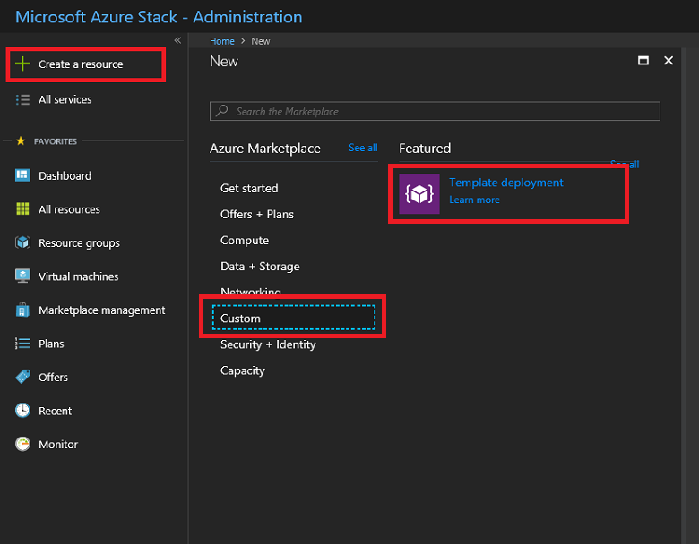
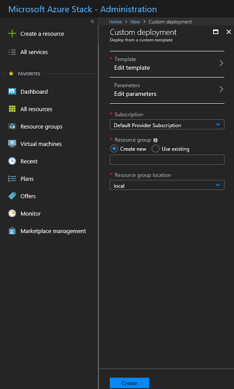
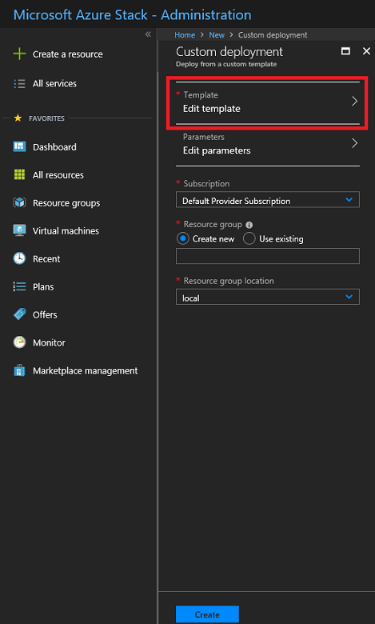
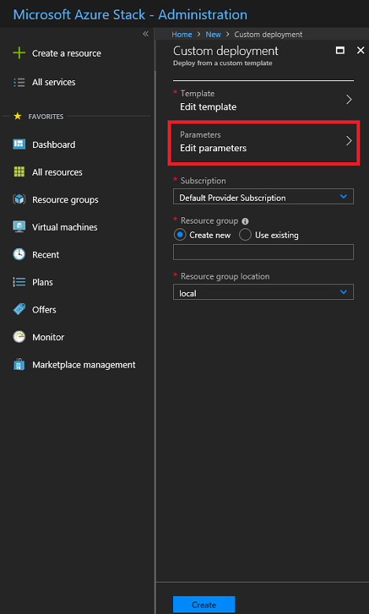
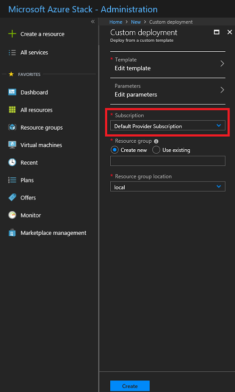
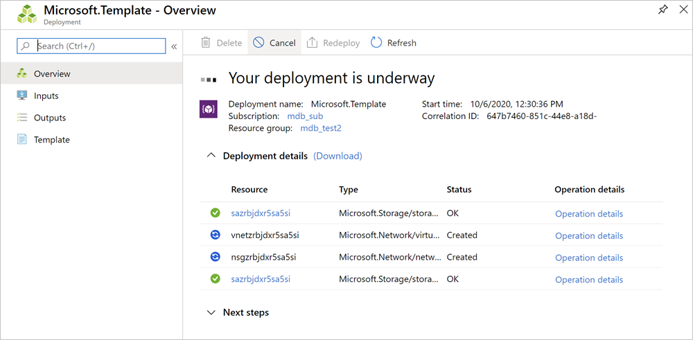
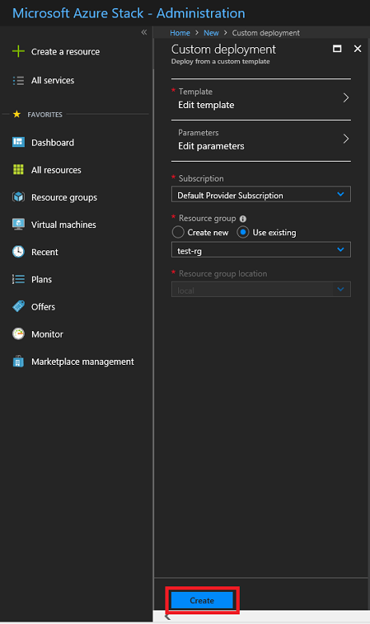

# Deploy a template using the portal in Azure Stack Hub

You can use the portal to deploy Azure Resource Manager templates to Azure Stack Hub.

## To deploy a template

1. Sign in to the portal, select **+ Create a resource**, and then select **Custom**.

   

1. Select **Template deployment**.

   

1. Select **Edit template**, and then paste your JSON template code into the code window. Select **Save**.

   

1. Select **Edit parameters**, provide values for the parameters that are shown, and then select **OK**.

   

1. Select **Subscription**. Choose the subscription you want to use, and then select **OK**.

   

1. Select **Resource group**. Choose an existing resource group or create a new one, and then select **OK**.

   

1. Select **Create**. A new tile on the dashboard tracks the progress of your template deployment.

   

## Next steps

To learn more about deploying templates, see the following article:

- [Deploy templates with PowerShell](azure-stack-deploy-template-powershell.md)
