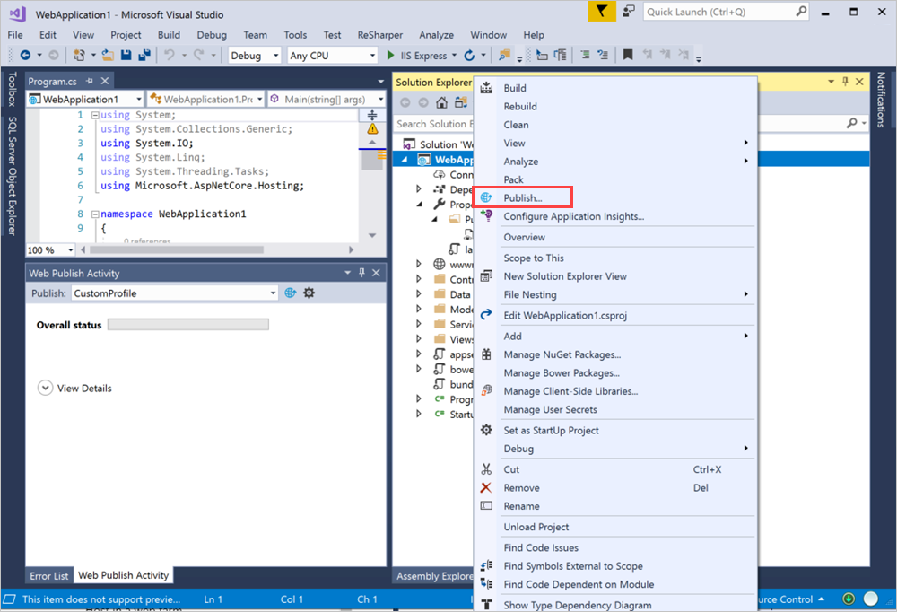
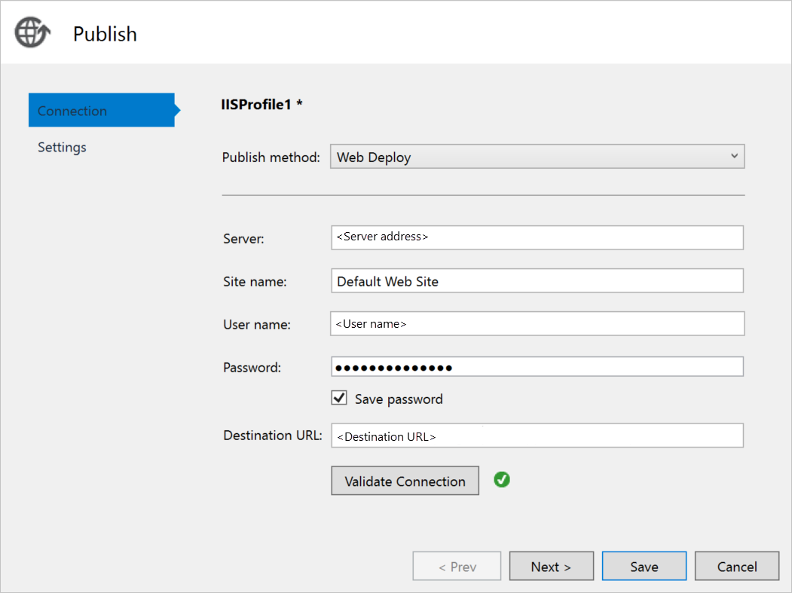

# Deploy a C# ASP.NET web app to a VM in Azure Stack

You can create a virtual machine (VM) to host your C# ASP.NET web app in Azure Stack. This article discusses the instructions to follow when you set up your server, configure it to host your C# ASP.NET web app, and then deploy the app right from Visual Studio.

This article uses a C# 6.0 app that uses ASP.NET Core 2.2 running on a Windows 2016 server.

## Create a VM

1. Create a [Windows Server VM](azure-stack-quick-windows-portal.md).

1. To install the IIS (with Management Console) and ASP.NET 4.6 components on your VM, run the following script:

    ```PowerShell  
    # Install IIS (with Management Console)
    Install-WindowsFeature -name Web-Server -IncludeManagementTools
    
    # Install ASP.NET 4.6
    Install-WindowsFeature Web-Asp-Net45
    
    # Install Web Management Service
    Install-WindowsFeature -Name Web-Mgmt-Service
    ```

1. Download [Web Deploy v3.6](https://www.microsoft.com/download/details.aspx?id=43717). Install it from the MSI file, and then enable all of the features.

1. Install the .NET Core 2.2 Hosting Bundle on your server. For instructions, see [.NET Core Installer](https://dotnet.microsoft.com/download/dotnet-core/2.2). Make sure you're using the same version of .NET Core on both your development machine and your target server.

1. In the Azure Stack portal, open the ports that are listed in the network settings for your VM.

    a. Open the Azure Stack portal for your tenant.

    b. Search for your VM. You might have pinned the VM to your dashboard, or you can search for it in the **Search resources** box.

    c. Select **Networking**.

    d. Select **Add inbound port rule** under VM.

    e. Add an inbound security rule for the following ports:

    | Port | Protocol | Description |
    | --- | --- | --- |
    | 80 | HTTP | Hypertext Transfer Protocol (HTTP) is the protocol used to deliver web pages from servers. Clients connect via HTTP with a DNS name or IP address. |
    | 443 | HTTPS | Hypertext Transfer Protocol Secure (HTTPS) is a secure version of HTTP that requires a security certificate and allows for the encrypted transmission of information.  |
    | 22 | SSH | Secure Shell (SSH) is an encrypted network protocol for secure communications. You will use this connection with an SSH client to configure the VM and deploy the app. |
    | 3389 | RDP | Optional. The Remote Desktop Protocol allows for a remote desktop connection to use a graphic user interface your machine.   |
    | 8172 | Custom | The port used by WebDeploy. |

    For each port:

    a. For **Source**, select **Any**.

    b. For **Source port range**, type an asterisk (**\***).

    c. For **Destination**, select **Any**.

    d. For **Destination port range**, add the port you want to open.

    e. For **Protocol**, select **Any**.

    f. For **Action**, select **Allow**.

    g. For **Priority**, leave the default selection.

    h. Enter a **Name** and **Description** to help you remember why the port is open.

    i. Select **Add**.

1.  In the **Networking** settings for your VM in Azure Stack, create a DNS name for your server. Users can connect to your website by using the URL.

    a. Open the Azure Stack portal for your tenant.

    b. Search for your VM. You might have pinned the VM to your dashboard, or you can search for it in the **Search resources** box.

    c. Select **Overview**.

    d. Under **VM**, select **Configure**.

    e. For **Assignment**, select **Dynamic**.

    f. Enter the DNS name label, such as **mywebapp**, so that your full URL becomes *mywebapp.local.cloudapp.azurestack.external*.

## Create an app 

You can use either your own web app or the example at [Publish an ASP.NET Core app to Azure with Visual Studio](https://docs.microsoft.com/aspnet/core/tutorials/razor-pages/razor-pages-start?view=aspnetcore-2.2&tabs=visual-studio
). The article describes how to create and publish an ASP.NET web app to an Azure virtual machine by using the Azure Virtual Machines publishing feature in Visual Studio 2017. After you've installed and made sure that your app is running locally, you'll update your publishing target to the Windows VM in your Azure Stack instance.

## Deploy and run the app

Create a publish target to your VM in Azure Stack.

1. In **Solution Explorer**, right-click your project, and then select **Publish**.

    

1. In the **Publish** window, select **New Profile**.
1. Select **IIS**, **FTP**, and so on.
1. Select **Publish**.
1. For **Publish method**, select **Web Deploy**.
1. For **Server** enter the DNS name that you defined earlier, such as *w21902.local.cloudapp.azurestack.external*.
1. For **Site name**, enter **Default Web Site**.
1. For **User name**, enter the user name for the machine.
1. For **Password**, enter the password for the machine.
1. For **Destination URL**, enter the URL for the site, such as *mywebapp.local.cloudapp.azurestack.external*.

    

1. To validate your web-deploy configuration, select **Validate connection**, and then select **Next**.
1. Set **Configuration** as **Release**.
1. Set **Target Framework** as **netcoreapp2.2**.
1. Set **Target Runtime** as **Portable**.
1. Select **Save**.
1. Select **Publish**.
1. Go to your new server. You should see your running web application.

    ```http  
        mywebapp.local.cloudapp.azurestack.external
    ```

## Next steps

- Learn how to [Set up a development environment in Azure Stack](azure-stack-dev-start.md).
- Learn about [common deployments for Azure Stack as IaaS](azure-stack-dev-start-deploy-app.md).
- To learn the C# programming language and find additional resources for C#, see the [C# Guide](https://docs.microsoft.com/dotnet/csharp/)
