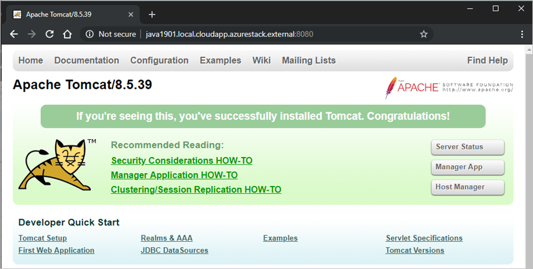
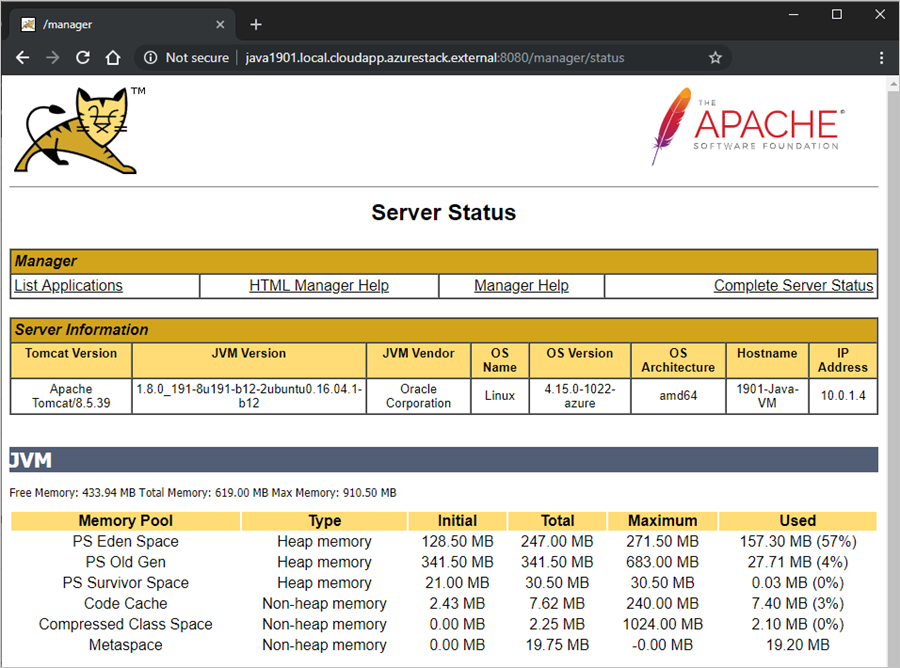

# Deploy a Java web app to a VM in Azure Stack Hub

You can create a virtual machine (VM) to host your Python web app in Azure Stack Hub. In this article, you install and configure an Apache Tomcat server on a Linux VM in Azure Stack Hub. You then load a Java Web Application Resource (WAR) file into the server. A WAR file is used to distribute a collection of Java archive (JAR) files, compressed files that contain Java resources such as classes, text, images, XML, and HTML, and other resources that are used to deliver a web application.

## Create a VM

1. Set up your VM in Azure Stack Hub by following the instructions in [Deploy a Linux VM to host a web app in Azure Stack Hub](azure-stack-dev-start-howto-deploy-linux.md).

2. In the VM network pane, make sure that the following ports are accessible:

    | Port | Protocol | Description |
    | --- | --- | --- |
    | 80 | HTTP | Hypertext Transfer Protocol (HTTP) is the protocol that's used to deliver webpages from servers. Clients connect via HTTP with a DNS name or IP address. |
    | 443 | HTTPS | Hypertext Transfer Protocol Secure (HTTPS) is a secure version of HTTP that requires a security certificate and allows for the encrypted transmission of information. |
    | 22 | SSH | Secure Shell (SSH) is an encrypted network protocol for secure communications. You use this connection with an SSH client to configure the VM and deploy the app. |
    | 3389 | RDP | Optional. The Remote Desktop Protocol (RDP) allows a remote desktop connection to use a graphic user interface on your machine.   |
    | 8080 | Custom | The default port for the Apache Tomcat service. For a production server, you route your traffic through 80 and 443. |

## Install Java

1. Connect to your VM by using your SSH client. For instructions, see [Connect via SSH with PuTTY](azure-stack-dev-start-howto-ssh-public-key.md#connect-with-ssh-by-using-putty).

2. At the bash prompt on your VM, run the following command:

    ```bash  
        sudo apt-get install default-jdk
    ```

3. Validate your installation. Still connected to your VM in your SSH session, run the following command:

    ```bash  
        java -version
    ```

## Install and configure Tomcat

1. Connect to your VM by using your SSH client. For instructions, see [Connect via SSH with PuTTY](azure-stack-dev-start-howto-ssh-public-key.md#connect-with-ssh-by-using-putty).

1. Create a Tomcat user by doing the following:

    a. Create a new Tomcat group by running the following command:

    ```bash  
        sudo groupadd tomcat
    ```
     
    b. Create a new Tomcat user. Add this user to the Tomcat group with a home directory of */opt/tomcat*. You deploy Tomcat to this directory:

    ```bash  
        sudo useradd -s /bin/false -g tomcat -d /opt/tomcat tomcat
    ```

1. Install Tomcat by doing the following:

    a. Get the URL for the tar for the latest version of Tomcat 8 from the [Tomcat 8 download page](http://tomcat.apache.org/download-80.cgi).

    b. Use cURL to download the latest version by using the link. Run the following commands:

    ```bash  
        cd /tmp 
        curl -O <URL for the tar for the latest version of Tomcat 8>
    ```

    c. Install Tomcat to the */opt/tomcat* directory. Create the folder, and then open the archive:

    ```bash  
        sudo mkdir /opt/tomcat
        sudo tar xzvf apache-tomcat-8*tar.gz -C /opt/tomcat --strip-components=1
        sudo chown -R tomcat webapps/ work/ temp/ logs/
    ```

1. Update the permissions for Tomcat by running the following commands:

    ```bash  
        sudo chgrp -R tomcat /opt/tomcat
        sudo chmod -R g+r conf
        sudo chmod g+x conf
    ```

1. Create a *systemd* service file, so that you can run Tomcat as a service.

   a. Tomcat needs to know where you installed Java. This path is commonly referred to as *JAVA_HOME*. Find the location by running:

    ```bash  
        sudo update-java-alternatives -l
    ```

    This produces something like the following:

    ```Text  
        Output
        java-1.8.0-openjdk-amd64       1081       /usr/lib/jvm/java-1.8.0-openjdk-amd64
    ```

    You can construct the *JAVA_HOME* variable value by taking the path from the output and adding */jre*. For example, using the preceding example, */usr/lib/jvm/java-1.8.0-openjdk-amd64/jre*.

    b. Use the value from your server to create the systemd service file:

    ```bash  
        sudo nano /etc/systemd/system/tomcat.service
    ```

    c. Paste the following contents into your service file. Modify the value of *JAVA_HOME*, if necessary, to match the value you found on your system. You might also want to modify the memory allocation settings that are specified in CATALINA_OPTS:

    ```Text  
        [Unit]
        Description=Apache Tomcat Web Application Container
        After=network.target
        
        [Service]
        Type=forking
        
        Environment=JAVA_HOME=/usr/lib/jvm/java-1.8.0-openjdk-amd64/jre
        Environment=CATALINA_PID=/opt/tomcat/temp/tomcat.pid
        Environment=CATALINA_HOME=/opt/tomcat
        Environment=CATALINA_BASE=/opt/tomcat
        Environment='CATALINA_OPTS=-Xms512M -Xmx1024M -server -XX:+UseParallelGC'
        Environment='JAVA_OPTS=-Djava.awt.headless=true -Djava.security.egd=file:/dev/./urandom'
        
        ExecStart=/opt/tomcat/bin/startup.sh
        ExecStop=/opt/tomcat/bin/shutdown.sh
    
        User=tomcat
        Group=tomcat
        UMask=0007
        RestartSec=10
        Restart=always
        
        [Install]
        WantedBy=multi-user.target
    ```

    d. Save and close the file.

    e. Reload the systemd daemon so that it knows about your service file:

    ```bash  
        sudo systemctl daemon-reload
    ```

    f. Start the Tomcat service: 

    ```bash  
        sudo systemctl start tomcat
    ```

    g. Verify that it started without errors by entering:

    ```bash  
        sudo systemctl status tomcat
    ```

1. Verify the Tomcat server. Tomcat uses port 8080 to accept conventional requests. Allow traffic to that port by running the following command:

    ```bash  
        sudo ufw allow 8080
    ```

    If you haven't added the *Inbound port rules* for your Azure Stack Hub VM, add them now. For more information, see [Create a VM](#create-a-vm).

1. Open a browser in the same network as your Azure Stack Hub, and then open your server, *yourmachine.local.cloudapp.azurestack.external:8080*.

    

    The Apache Tomcat page on your server loads. Next, you configure the server to allow you to access the Server Status, Manager App, and Host Manager.

1. Enable the service file so that Tomcat automatically starts when you reboot your server:

    ```bash  
        sudo systemctl enable tomcat
    ```

1. To allow yourself access to the web management interface, configure the Tomcat server. 

   a. Edit the *tomcat-users.xml* file, and define a role and user so that you can sign in. Define the user to access the `manager-gui` and `admin-gui`.

    ```bash  
        sudo nano /opt/tomcat/conf/tomcat-users.xml
    ```

   b. Add the following elements to the `<tomcat-users>` section:

    ```XML  
        <role rolename="tomcat"/>
        <user username="<username>" password="<password>" roles="tomcat,manager-gui,admin-gui"/>
    ```

    For example, your final file might look something like:

    ```XML  
        <tomcat-users xmlns="http://tomcat.apache.org/xml"
              xmlns:xsi="http://www.w3.org/2001/XMLSchema-instance"
              xsi:schemaLocation="http://tomcat.apache.org/xml tomcat-users.xsd"
              version="1.0">
        <role rolename="tomcat"/>
        <user username="tomcatuser" password="changemepassword" roles="tomcat,manager-gui,admin-gui"/>
        </tomcat-users>
    ```

    c. Save and close the file.

1. Tomcat restricts access to the *Manager* and *Host Manager* apps to connections coming from the server. Because you're installing Tomcat on a VM in Azure Stack Hub, you'll want to remove this restriction. Change the IP address restrictions on these apps by editing the appropriate *context.xml* files.

    a. Update *context.xml* in the Manager app:

    ```bash  
        sudo nano /opt/tomcat/webapps/manager/META-INF/context.xml
    ```

    b. Comment out the IP address restriction to allow connections from anywhere, or add the IP address of the machine you're using to connect to Tomcat.

    ```XML  
    <Context antiResourceLocking="false" privileged="true" >
        <!--<Valve className="org.apache.catalina.valves.RemoteAddrValve"
                allow="127\.\d+\.\d+\.\d+|::1|0:0:0:0:0:0:0:1" />-->
    </Context>
    ```

    c. Save and close the file.

    d. Update  *context.xml* the Host Manager app with a similar update:

    ```bash  
        sudo nano /opt/tomcat/webapps/host-manager/META-INF/context.xml
    ```

    e. Save and close the file.

1. To update the server with the changes, restart the Tomcat service:

    ```bash  
        sudo systemctl restart tomcat
    ```

1. Open a browser in the same network as your Azure Stack Hub, and then open your server: *yourmachine.local.cloudapp.azurestack.external:8080*.

    a. To review the status of the Tomcat server and verify that you have access, select **Server Status**.

    b. Sign in with your Tomcat credentials.

    

## Create an app

You'll need to create a WAR to deploy to Tomcat. If you want only to check your environment, you can find an example WAR at the [Apache Tomcat site](https://tomcat.apache.org/tomcat-6.0-doc/appdev/sample/).

For guidance about developing Java apps in Azure, see [Build and deploy Java apps on Azure](https://azure.microsoft.com/develop/java/).

## Deploy and run the app

1. Connect to your VM by using your SSH client. For instructions, see [Connect via SSH with PuTTY](azure-stack-dev-start-howto-ssh-public-key.md#connect-with-ssh-by-using-putty).

1. To update the server with your app package, stop the Tomcat service:

    ```bash  
        sudo systemctl stop tomcat
    ```

1. To be able to write to the webapps folder, add your FTP user to the Tomcat group. Your FTP user is the user you define when you create your VM in Azure Stack Hub.

    ```bash  
        sudo usermod -a -G tomcat <VM-user>
    ```

1. To clear the webapps folder and then load your new or updated WAR, connect to your VM with FileZilla. For instructions, see [Connect with SFTP with FileZilla](azure-stack-dev-start-howto-ssh-public-key.md#connect-with-sftp-with-filezilla).

    a. Clear *TOMCAT_HOME/webapps*.

    b. Add your WAR to *TOMCAT_HOME/webapps* (for example, */opt/tomcat/webapps/*).

1.  Tomcat automatically expands and deploys the application. You can view it by using the DNS name you created earlier. For example:

    ```HTTP  
       http://yourmachine.local.cloudapp.azurestack.external:8080/sample
    ```
    
## Next steps

- Learn more about how to [develop for Azure Stack Hub](azure-stack-dev-start.md).
- Learn about [common deployments for Azure Stack Hub as IaaS](azure-stack-dev-start-deploy-app.md).
- To learn the Java programming language and find additional resources for Java, see [Java.com](https://www.java.com).
