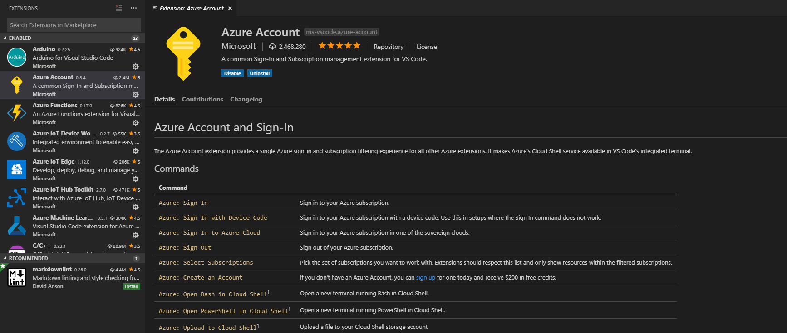

# Connect to Azure Stack using Azure Account Extension in Visual Studio Code

In this article, we will walk you through how to connect to Azure Stack using the Azure Account extension. You will need to update your Visual Studio Code (VS Code) settings.

VS Code is a light-weight editor for building and debug web and cloud applications. ASP.NET Core, Python, NodeJS, Go, and other developers use VS Code. With the Azure Account extension, you can use a single Azure sign-in with subscription filtering for additional Azure extensions. The extension makes the Azure Cloud Shell available in the VS Code-integrated terminal. Using the extension, you can connect to your Azure Stack subscription using both Azure AD (Azure AD) and Active Directory Federated Services (AD FS) for your identity manager. You can sign in to Azure Stack, select your subscription, and open a new command line in a cloud shell. 

> [!Note]  
> You can use the steps in this article for an Active Directory Federated Services (AD FS) environment. Use your AD FS credentials and endpoints.

## Pre-requisites for the Azure Account Extension

1. Azure Stack environment 1904 build or later
2. [Visual Studio Code](https://code.visualstudio.com/)
3. [Azure Account Extension](https://github.com/Microsoft/vscode-azure-account)
4. [An Azure Stack subscription](https://azure.microsoft.com/overview/azure-stack/)

## Steps to connect to Azure Stack

1. Run the **Identity** script from Azure Stack Tools in GitHub.

    - Before you run the script, you will need to have PowerShell installed and configured for your environment. For instructions see [Install PowerShell for Azure Stack](../operator/azure-stack-powershell-install.md).

    - For the **Identity** script instructions and script, see [AzureStack-Tools/Identity](https://github.com/Azure/AzureStack-Tools/tree/master/Identity).

    - In the same session, run:

    ```powershell  
    Update-AzsHomeDirectoryTenant -AdminResourceManagerEndpoint $adminResourceManagerEndpoint `
    -DirectoryTenantName $homeDirectoryTenantName -Verbose
    Register-AzsWithMyDirectoryTenant -TenantResourceManagerEndpoint $tenantARMEndpoint `
    -DirectoryTenantName $guestDirectoryTenantName
    ```

2. Open VS Code.

3. Select **Extensions** on the left-side corner.

4. In the search box, enter `Azure Account`.

5. Select **Azure Account** and select **Install**.

      

6. Restart VS Code to load the extension.

7. Retrieve the metadata to connect to the Azure Resource Manager in your Azure Stack. 
    
    The Microsoft Azure Resource Manager is a management framework that allows you to deploy, manage, and monitor Azure resources.
    - The Resource Manager URL for the Azure Stack Development Kit (ASDK) is: `https://management.local.azurestack.external/` 
    - The Resource Manager URL for an integrated system is: `https://management.<location>.ext-<machine-name>.masd.stbtest.microsoft.com/`
    - Add the following text to your URL to access the metadata: `<ResourceManagerUrl>/metadata/endpoints?api-version=1.0`

    For example, the URL to retrieve the metadata for your Azure Resource Manager endpoint may look something like: `https://management.local.azurestack.external/metadata/endpoints?api-version=1.0`

    Make a note of the return JSON. You will need the values for the `loginEndpoint` and `audiences` property.

8. Press **Ctrl+Shift+P,** and select **Preferences: Open User Settings (JSON)**.

9. In the code editor, update the following JSON snippet with the values for your environment, and then paste snippet into the settings block.

    - Values:

        | Parameter | Description |
        | --- | --- |
        | `tenant-ID` | The value of your Azure Stack [tenant ID](../operator/azure-stack-identity-overview.md). |
        | `activeDirectoryEndpointUrl` | This is the URL from loginEndpoint property. |
        | `activeDirectoryResourceId` | This is the URL from the audiences property.
        | `resourceManagerEndpointUrl` | This is the root URL for the Azure Resource Manager for Azure Stack. | 

    - JSON snippet:

      ```JSON  
      "azure.tenant": "tenant-ID",
      "azure.ppe": {
          "activeDirectoryEndpointUrl": "Login endpoint",
          "activeDirectoryResourceId": "This is the URL from the audiences property.",
          "resourceManagerEndpointUrl": "Aure Resource Management Endpoint",
      },
      "azure.cloud": "AzurePPE"
      ```

10. Save the User Settings and use **Ctrl+Shift+P** once again. Select **Azure: Sign in to Azure Cloud**. The new option, **AzurePPE**, appears in the list of targets.

11. Select **AzurePPE**. The authentication page loads in your browser. Sign in to your endpoint.

12. To test that you have successfully logged into your Azure Stack subscription, use **Ctrl+Shift+ P** and select **Azure: Select Subscription** and see if the subscription you have is available.

## Commands

| Azure: Sign In | Sign in to your Azure subscription |
| --- | --- |
| Azure: Sign In with Device Code | Sign in to your Azure subscription with a device code. Use a device code in setups where the Sign In command doesn't work. |
| Azure: Sign In to Azure Cloud | Sign in to your Azure subscription in one of the sovereign clouds. |
| Azure: Sign Out | Sign out of your Azure subscription. |
| Azure: Select Subscriptions | Pick the set of subscriptions you want to work with. The extension only shows resources within the filtered subscriptions. |
| Azure: Create an Account | If you don't have an Azure Account, you can [sign up](https://azure.microsoft.com/free/?utm_source=campaign&utm_campaign=vscode-azure-account&mktingSource=vscode-azure-account) for one today and receive \$200 in free credits. |
| Azure: Open Bash in Cloud Shell | Open a new terminal running Bash in Cloud Shell. |
| Azure: Open PowerShell in Cloud Shell | Open a new terminal running PowerShell in Cloud Shell. |
| Azure: Upload to Cloud Shell | Upload a file to your Cloud Shell storage account. |

## Next steps

[Set up a development environment in Azure Stack ](azure-stack-dev-start.md)
