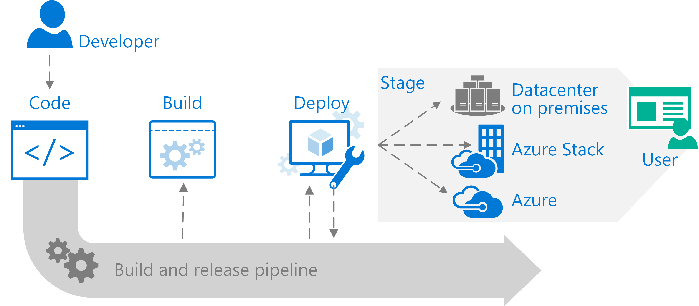

# DevOps pattern

Code from a single location and deploy to multiple targets in development, test, and production environments that may be in your local datacenter, private clouds, or the public cloud.

## Context and problem

Application deployment continuity, security, and reliability are essential to organizations and critical to development teams.

Apps often require refactored code to run in each target environment. This means that an app is not completely portable. It must be updated, tested, and validated as it moves through each environment. For example, code written in a development environment must then be rewritten to work in a test environment, and rewritten when it finally lands in a production environment. Furthermore, this code is specifically tied to the host. This increases the cost and complexity of maintaining your app. Each version of the app is tied to each environment. The increased complexity and duplication increase the risk of security and code quality. In addition, the code cannot be readily redeployed when you remove restore failed hosts or deploy additional hosts to handle increases in demand.

## Solution

The DevOps Pattern enables you to build, test, and deploy an app that runs on multiple clouds. This pattern unites the practice of continuous integration and continuous delivery. With continuous integration, code is built and tested every time a team member commits a change to version control. Continuous delivery automates each step from a build to a production environment. Together, these processes create a release process that supports deployment across diverse environments. With this pattern, you can draft your code and then deploy the same code to a premise environment, different private clouds, and the public clouds. Differences in environment require a change to a configuration file rather than changes to the code.

With a consistent set of development tools across on-premises, private cloud, and public cloud environments, you can implement a practice of continuous integration and continuous delivery. Apps and services deployed using the DevOps Pattern are interchangeable and can run in any of these locations, taking advantage of on-premises and public cloud features and capabilities.

Using a DevOps release pipeline helps you:

-   Initiate a new build based on code commits to a single repository.

-   Automatically deploy your newly built code to the public cloud for user acceptance testing.

-   Automatically deploy to a private cloud once your code has passed testing.

## Issues and considerations

The DevOps Pattern is intended to ensure consistency across deployments regardless of the target environment. However, capabilities vary across cloud and on-premises environments. Consider the following:

-   Are the functions, endpoints, services, and other resources in your deployment available in the target deployment locations?

-   Are configuration artifacts stored in locations that are accessible across clouds?

-   Will deployment parameters work in all the target environments?

-   Are resource-specific properties available in all target clouds?

For more information, see [Develop Azure Resource Manager templates for cloud consistency](https://docs.microsoft.com/azure/azure-resource-manager/templates-cloud-consistency).

In addition, consider the following points when deciding how to implement this pattern:

### Scalability considerations

Deployment automation systems are the key control point in the DevOps Patterns. Implementations can vary. The selection of the correct server size depends on the size of the expected workload. VMs cost more to scale than containers. To use containers for scaling, however, your build process must run with containers.

### Availability considerations

Availability in the context of the DevPattern means being able to recover any state information associated with your workflow, such as test results, code dependencies, or other artifacts. To assess your availability requirements, consider two common metrics:

-   Recovery Time Objective (RTO) specifies how long you can go without a system.

-   Recovery Point Objective (RPO) indicates how much data you can afford to lose if a disruption in service affects the system.

In practice, RTO, and RPO imply redundancy and backup. On the global Azure cloud, availability is not a question of hardware recovery—that is part of Azure—but rather ensuring you maintain the state of your DevOps systems. On Azure Stack, hardware recovery may be a consideration.

Another major consideration when designing the system used for deployment automation is access control and the proper management of the rights needed to deploy services to cloud environments. What rights are needed to create, delete, or modify deployments? For example, one set of rights is typically required to create a resource group in Azure and another to deploy services in the resource group.

### Manageability considerations

The design of any system based on the DevOps pattern must consider automation, logging, and alerting for each service across the portfolio. Use shared services, an application team, or both, and track security policies and governance as well.

Deploy production environments and development/test environments in separate resource groups on Azure or Azure Stack. Then you can monitor each environment’s resources and roll up billing costs by resource group. You can also delete resources as a set, which is useful for test deployments.

## When to use this pattern

Use this pattern:

-   You can develop code in one environment that meets the needs of your developers and deploy to an environment specific to your solution where it may be difficult to develop new code.

-   You can use the code and tools your developers would like to us as long as they are able to follow the continuous integration and continuous delivery process in the DevOps Pattern.

This pattern isn't recommended:

-   If you cannot automate infrastructure, provisioning resources, configuration, identity, and security tasks.

-   If teams do not have access to hybrid cloud resources to implement a Continuous Integration/Continuous Development (CI/CD) approach.

## Example

Learn how to deploy an application to Azure and Azure Stack using a hybrid continuous integration/continuous delivery (CI/CD) pipeline.

[Deploy apps to Azure and Azure Stack](https://docs.microsoft.com/azure/azure-stack/user/azure-stack-solution-pipeline)

## Next steps

Learn about [Hybrid cloud design patterns for Azure Stack](azure-stack-edge-pattern-overview.md)
