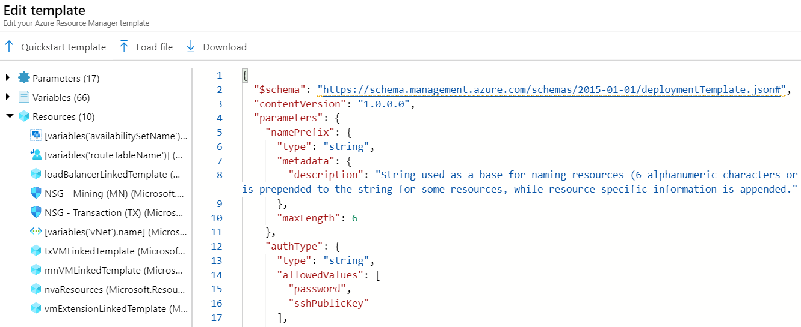
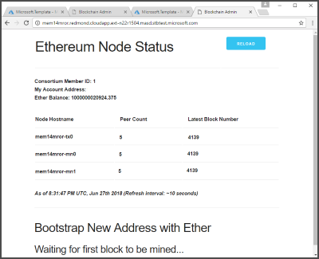

# Deploy an Ethereum blockchain network on Azure Stack Hub

The Ethereum solution template is designed to make it easier and quicker to deploy and configure a multi-member consortium Ethereum blockchain network with minimal Azure and Ethereum knowledge.

With a handful of user inputs and a single-click deployment through the Azure Stack Hub tenant portal, each member can provision their network footprint. Each member's network footprint consists of three things:

1. A set of load-balanced transaction nodes with which an app or user can interact to submit transactions.
2. A set of mining nodes to record transactions.
3. A Network Virtual Appliance (NVA).

A later connection step connects the NVAs to create a fully configured multi-member blockchain network.

To set up:

- Choose a deployment architecture.
- Deploy a standalone, consortium leader, or consortium member network.

## Prerequisites

Download the latest items [from the Marketplace](../operator/azure-stack-download-azure-marketplace-item.md):

- Ubuntu Server 16.04 LTS
- Windows Server 2016
- Custom Script for Linux 2.0
- Custom Script Extension for Windows

## Deployment architecture

This solution template can deploy a single or multi-member Ethereum consortium network. The virtual network is connected in a chain topology using Network Virtual Appliance and connection resources.

The template can deploy Ethereum consortium for leader and member in a variety of ways. Here are the ones we've tested:

- On a multi-node Azure Stack Hub, with Microsoft Entra ID or AD FS, deploy lead and member using the same subscription or with different subscriptions.
- On a single-node Azure Stack Hub (with Microsoft Entra ID), deploy lead and member using the same subscription.

## Standalone and consortium leader deployment

The consortium leader template configures the first member's footprint in the network. 

1. Download the [leader template from GitHub](https://aka.ms/aa6zdyt).
1. In the Azure Stack Hub tenant portal, select **+ Create a resource > Template deployment** to deploy from a custom template.
1. Select **Build your own template in the editor** to edit the new custom template.
1. In the editing pane on the right, copy and paste the leader template JSON you previously downloaded.
    
    

1. Select **Save**.
1. On the **Basics** tab, complete the following settings.

    Parameter name | Description | Sample value
    ---------------|-------------|-------------
    Subscription | The subscription to which to deploy the consortium network. | Consumption Subscription
    Resource group | The resource group to which to deploy the consortium network. | EthereumResources
    Region | The Azure region for resources. | local
    Name prefix | String used as a base for naming the deployed resources. Use a maximum of six alphanumeric characters. | eth
    Auth type | The method to authenticate to the VM. Allowed values are password or SSH public key. | Password
    Admin username | Admin username of each deployed VM. Use from one to 64 characters. | gethadmin
    Admin password (Authentication type = Password)| The password for the admin account for each of the VMs deployed. The password must contain 3 of the following requirements: 1 upper case character, 1 lower case character, 1 number, and 1 special character.  While all VMs initially have the same password, you can change the password after provisioning. Use from 12 to 72 characters. |
    Admin SSH key (Authentication type = sshPublicKey) | The secure shell RSA public key string used for remote login. |
    Genesis block | JSON string representing custom genesis block.  Specifying a value for this parameter is optional. |
    Ethereum account password | The admin password used to secure the Ethereum account. |
    Ethereum account passphrase | The passphrase used to generate private key associated with the Ethereum account. Consider a password with sufficient randomness to ensure a strong private key. |
    Ethereum network ID | The network ID of the consortium. Use any value between 5 and 999,999,999. | 72
    Consortium member ID | The ID associated with each member of the consortium network. This ID should be unique in the network. | 0
    Number mining nodes | Number of mining nodes for each consortium member. Use a value between 2 and 15. | 2
    Mining node VM size | VM size of the mining nodes. | Standard_A1
    Mining storage account type | Storage performance of the mining nodes. | Standard_LRS
    Number TX nodes | Number of load balanced transaction nodes. Use a value between 1 and 5. | 1
    TX node VM size | VM size of the transaction nodes. | Standard_A1
    TX storage account type | Storage performance of the transaction nodes. | Standard_LRS
    Base URL | Base URL where to get the deployment templates. Use the default value unless you want to customize the deployment templates. |

1. Select **Review + create**. After successful validation, select **Create**.

Deployment can take 20 minutes or longer to complete.

After deployment completes, review the deployment summary for **Microsoft.Template** in the deployment section of the resource group. The summary contains output values used to join consortium members.

To verify leader's deployment, go to the leader's admin site. The admin site address is found in the output section of the **Microsoft.Template** deployment.  

## Joining consortium member deployment

1. Download the [consortium member template from GitHub](https://aka.ms/aa6zdyt).
1. In the Azure Stack Hub tenant portal, select **+ Create a resource > Template deployment** to deploy from a custom template.
1. Select **Build your own template in the editor** to edit the new custom template.
1. In the editing pane on the right, copy and paste the consortium member template JSON you previously downloaded.
1. Select **Save**.
1. On the **Basics** tab, complete the following settings.

    Parameter name | Description | Sample value
    ---------------|-------------|-------------
    Subscription | The subscription to which to deploy the consortium network. | Consumption Subscription
    Resource group | The resource group to which to deploy the consortium network. | EthereumResources
    Region | The Azure region for resources. | local
    Name prefix | String used as a base for naming the deployed resources. Use a maximum of six alphanumeric characters. | eth
    Auth type | The method to authenticate to the VM. Allowed values are Password or SSH public key. | Password
    Admin username | Admin username of each deployed VM. Use from one to 64 characters. | gethadmin
    Admin password (Authentication type = Password)| The password for the admin account for each of the VMs deployed. The password must contain 3 of the following requirements: 1 upper case character, 1 lower case character, 1 number, and 1 special character.  While all VMs initially have the same password, you can change the password after provisioning. Use from 12 to 72 characters. |
    Admin SSH key (Authentication type = sshPublicKey) | The secure shell RSA public key string used for remote login. |
    Genesis block | JSON string representing custom genesis block. Specifying a value for this parameter is optional. |
    Ethereum account password | The admin password used to secure the Ethereum account. |
    Ethereum account passphrase | The passphrase used to generate private key associated with the Ethereum account. Consider a password with sufficient randomness to ensure a strong private key. |
    Consortium member ID | The ID associated with each member of the consortium network. This ID should be unique in the network. | 0
    Number mining nodes | Number of mining nodes for each consortium member. Use a value between 2 and 15. | 2
    Mining node VM size | VM size of the mining nodes. | Standard_A1
    Mining storage account type | Storage performance of the mining nodes. | Standard_LRS
    Number TX nodes | Number of load balanced transaction nodes. Use a value between 1 and 5. | 1
    TX node VM size | VM size of the transaction nodes. | Standard_A1
    TX storage account type | Storage performance of the transaction nodes. | Standard_LRS
    Consortium data | The URL pointing to the relevant consortium configuration data provided by another member's deployment. This value can be found on leader's deployment output. |
    Remote member VNET address space | The VNET address space of the leader. This value can be found on leader's deployment output. |
    Remote member NVA public IP | The NVA IP address of the leader. This value can be found on leader's deployment output. |
    Connection shared key | A pre-established secret between the members of the consortium network that are establishing a gateway connection. |
    Base URL | Base URL where to get the deployment templates. Use the default value unless you want to customize the deployment templates. |
1. Select **Review + create**. After successful validation, select **Create**.

Deployment can take 20 minutes or longer to complete.

After deployment completes, review the deployment summary for **Microsoft.Template** in the deployment section of the resource group. The summary contains output values used to connect consortium members.

To verify member's deployment, browse member's admin site. You can find the admin site address in the output section of the **Microsoft.Template** deployment.

As shown in the picture, member's nodes status is **Not running**. This status is because the connection between member and leader isn't established. The connection between member and leader is a two-way connection. When you deploy member, template automatically creates the connection from member to the leader. To create the connection from leader to member, go to the next step.

## Connect member and leader

This template creates a connection from the leader to a remote member. 

1. Download the [connect member and leader template from GitHub](https://aka.ms/aa6zdyt).
1. In the Azure Stack Hub tenant portal, select **+ Create a resource > Template deployment** to deploy from a custom template.
1. Select **Build your own template in the editor** to edit the new custom template.
1. In the editing pane on the right, copy and paste the consortium member template JSON you previously downloaded.
1. Select **Save**.
1. Complete the following settings.

    Parameter name | Description | Sample value
    ---------------|-------------|-------------
    Subscription | The subscription to which to deploy the consortium network. | Consumption Subscription
    Resource group | The resource group to which to deploy the consortium network. | EthereumResources
    Region | The Azure region for resources. | local
    Member name prefix | String used as a base for naming the deployed resources. Use a maximum of six alphanumeric characters. | eth
    Member route table name | Name of the leader's route table. This value can be found on leader's deployment output. |
    Remote member VNET address space | Address space of the member. This value can be found on member's deployment output. |
    Remote member NVA public IP | The NVA IP address to connect to. This value can be found on member's deployment output. |
    Connection shared key | A pre-established secret between the members of the consortium network that are establishing a connection.  |
    Member NVA private IP | The NVA IP address of the member. This value can be found on member's deployment output. |
    Base URL | Base URL where to get the deployment templates. Use the default value unless you want to customize the deployment templates. |
1. Select **Review + create**. After successful validation, select **Create**.

After deployment is complete, it takes few minutes for leader and member to start communication. To verify the deployment, refresh member's admin site. Status of the member's nodes should be running.

## Next steps

To learn more about Ethereum and Azure, see [Blockchain Technology and Applications](https://azure.microsoft.com/solutions/blockchain/).
