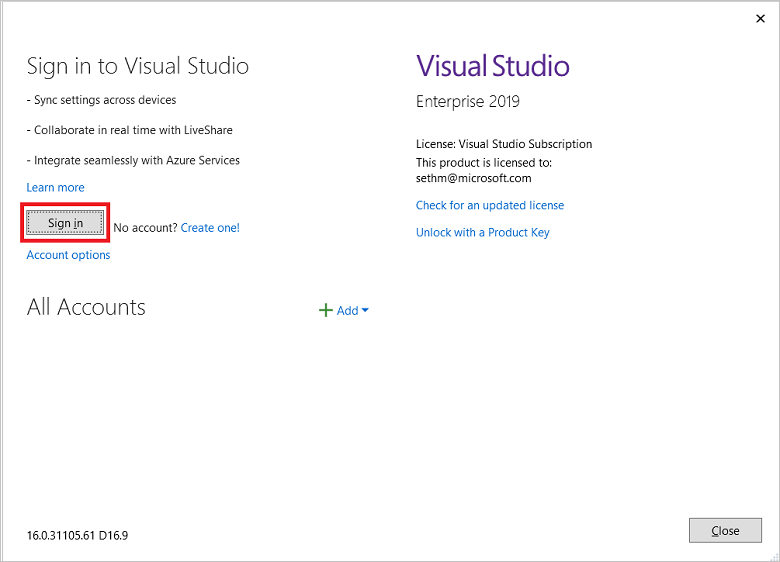
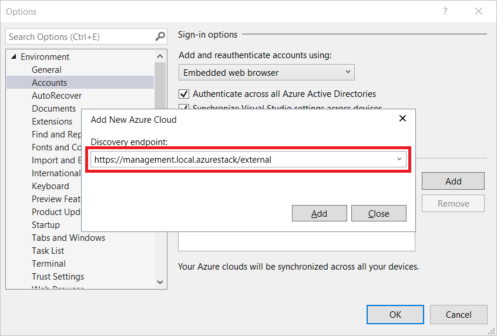

# Install Visual Studio and connect to Azure Stack Hub

You can use Visual Studio to write and deploy Azure Resource Manager [templates](azure-stack-arm-templates.md) to Azure Stack Hub. The steps in this article describe how to install Visual Studio on [Azure Stack Hub](../asdk/asdk-connect.md#connect-to-azure-stack-using-rdp) or on an external computer if you plan to use Azure Stack Hub through [VPN](../asdk/asdk-connect.md#connect-to-azure-stack-using-vpn).

## Install Visual Studio

1. [Install Visual Studio Community 2019](https://visualstudio.microsoft.com/), or one of the trial versions.  

2. Uninstall the **Microsoft Azure PowerShell** that's installed as part of the Azure SDK.

    

3. [Install PowerShell for Azure Stack Hub](../operator/powershell-install-az-module.md).

4. Restart the computer after the installation completes.

## Connect to Azure Stack Hub with Microsoft Entra ID

> [!NOTE]
> While Azure Stack Hub supports both Visual Studio 2019 and 2022, Cloud Explorer has been deprecated from Visual Studio 2022. Therefore, although both Visual Studio 2019 and 2022 work if you're using Microsoft Entra ID, if you are using AD FS with Azure Stack Hub (as described in the next section), you must use Visual Studio 2019 or earlier.

1. Launch Visual Studio.

2. From the **View** menu, select **Cloud Explorer**.

3. Select **Manage Accounts**, then in the new pane, sign in with your Microsoft Entra credentials.  

    

Once logged in, you can [deploy templates](azure-stack-deploy-template-visual-studio.md) or browse available resource types and resource groups to create your own templates.  

## Connect to Azure Stack Hub with AD FS

1. Launch Visual Studio.

2. From **Tools**, select **Options**.

3. Expand **Environment** in the navigation pane and select **Accounts**.

4. Select **Add**, and enter the user Azure Resource Manger endpoint. For the Azure Stack Development Kit (ASDK), the URL is: `https://management.local.azurestack/external`. For Azure Stack Hub integrated systems, the URL is: `https://management.[Region}.[External FQDN]`.

    

5. Select **Add**. Visual Studio calls Azure Resource Manger and discovers the endpoints, including the authentication endpoint, for Azure Directory Federated Services (AD FS). Azure Stack Hub now appears in the list of registered clouds.

6. Select **Cloud Explorer** from the **View** menu.

7. Select **Manage Accounts** and sign in with your AD FS credentials.  

    

    Cloud Explorer queries the available subscriptions. You can select an available subscription to manage.

    

8. Browse your existing resources, resource groups, or deploy templates.

## Next steps

- Read more about Visual Studio [side by side](/visualstudio/install/install-visual-studio-versions-side-by-side) with other Visual Studio versions.
- [Develop templates for Azure Stack Hub](azure-stack-develop-templates.md).
