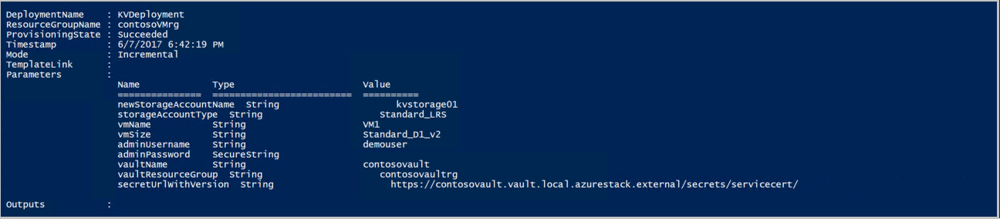

# Deploy a VM with a securely stored certificate on Azure Stack Hub 

This article describes how to deploy an Azure Stack Hub virtual machine (VM) with a Key Vault certificate installed.

## Overview

Certificates are used in many scenarios, such as authenticating to Active Directory, or encrypting web traffic. You can securely store certificates as secrets in an Azure Stack Hub key vault. The benefits of using Azure Stack Hub Key Vault are:

* Certificates are not exposed in a script, command-line history, or template.
* The certificate management process is streamlined.
* You have control of the keys that access certificates.

## Process description

The following steps describe the process required to push a certificate to the VM:

1. Create a key vault secret.
2. Update the **azuredeploy.parameters.json** file.
3. Deploy the template.

> [!NOTE]
> You can use these steps from the Azure Stack Development Kit (ASDK), or from an external client if you're connected through VPN.

## Prerequisites

* You must subscribe to an offer that includes the Key Vault service.
* [Install PowerShell for Azure Stack Hub](../operator/azure-stack-powershell-install.md).
* [Configure the Azure Stack Hub user's PowerShell environment](azure-stack-powershell-configure-user.md).

## Create a key vault secret

The following script creates a certificate in the .pfx format, creates a key vault, and stores the certificate in the key vault as a secret.

> [!IMPORTANT]
> You must use the `-EnabledForDeployment` parameter when creating the key vault. This parameter ensures that the key vault can be referenced from Azure Resource Manager templates.

```powershell
# Create a certificate in the .pfx format
New-SelfSignedCertificate `
  -certstorelocation cert:\LocalMachine\My `
  -dnsname contoso.microsoft.com

$pwd = ConvertTo-SecureString `
  -String "<Password used to export the certificate>" `
  -Force `
  -AsPlainText

Export-PfxCertificate `
  -cert "cert:\localMachine\my\<certificate thumbprint that was created in the previous step>" `
  -FilePath "<Fully qualified path to where the exported certificate can be stored>" `
  -Password $pwd

# Create a key vault and upload the certificate into the key vault as a secret
$vaultName = "contosovault"
$resourceGroup = "contosovaultrg"
$location = "local"
$secretName = "servicecert"
$fileName = "<Fully qualified path to where the exported certificate can be stored>"
$certPassword = "<Password used to export the certificate>"

$fileContentBytes = get-content $fileName `
  -Encoding Byte

$fileContentEncoded = [System.Convert]::ToBase64String($fileContentBytes)
$jsonObject = @"
{
"data": "$filecontentencoded",
"dataType" :"pfx",
"password": "$certPassword"
}
"@
$jsonObjectBytes = [System.Text.Encoding]::UTF8.GetBytes($jsonObject)
$jsonEncoded = [System.Convert]::ToBase64String($jsonObjectBytes)

New-AzureRmResourceGroup `
  -Name $resourceGroup `
  -Location $location

New-AzureRmKeyVault `
  -VaultName $vaultName `
  -ResourceGroupName $resourceGroup `
  -Location $location `
  -sku standard `
  -EnabledForDeployment

$secret = ConvertTo-SecureString `
  -String $jsonEncoded `
  -AsPlainText -Force

Set-AzureKeyVaultSecret `
  -VaultName $vaultName `
  -Name $secretName `
   -SecretValue $secret
```

When you run this script, the output includes the secret URI. Make a note of this URI, as you must reference it in the [Push certificate to Windows Resource Manager template](https://github.com/Azure/AzureStack-QuickStart-Templates/tree/master/201-vm-windows-pushcertificate). Download the [vm-push-certificate-windows](https://github.com/Azure/AzureStack-QuickStart-Templates/tree/master/201-vm-windows-pushcertificate) template folder to your development computer. This folder contains the **azuredeploy.json** and **azuredeploy.parameters.json** files, which you need in the following steps.

Modify the **azuredeploy.parameters.json** file according to your environment values. The important parameters are the vault name, the vault resource group, and the secret URI (as generated by the previous script). The following section shows an example of a parameter file.

## Update the azuredeploy.parameters.json file

Update the **azuredeploy.parameters.json** file with the `vaultName`, secret URI, `VmName`, and other parameters as per your environment. The following JSON file shows an example of the template parameters file:

```json
{
  "$schema": "https://schema.management.azure.com/schemas/2015-01-01/deploymentParameters.json#",
  "contentVersion": "1.0.0.0",
  "parameters": {
    "newStorageAccountName": {
      "value": "kvstorage01"
    },
    "vmName": {
      "value": "VM1"
    },
    "vmSize": {
      "value": "Standard_D1_v2"
    },
    "adminUserName": {
      "value": "demouser"
    },
    "adminPassword": {
      "value": "demouser@123"
    },
    "vaultName": {
      "value": "contosovault"
    },
    "vaultResourceGroup": {
      "value": "contosovaultrg"
    },
    "secretUrlWithVersion": {
      "value": "https://testkv001.vault.local.azurestack.external/secrets/testcert002/82afeeb84f4442329ce06593502e7840"
    }
  }
}
```

## Deploy the template

Deploy the template by using the following PowerShell script:

```powershell
# Deploy a Resource Manager template to create a VM and push the secret to it
New-AzureRmResourceGroupDeployment `
  -Name KVDeployment `
  -ResourceGroupName $resourceGroup `
  -TemplateFile "<Fully qualified path to the azuredeploy.json file>" `
  -TemplateParameterFile "<Fully qualified path to the azuredeploy.parameters.json file>"
```

When the template is deployed successfully, it displays the following output:



Azure Stack Hub pushes the certificate to the VM during deployment. The certificate location depends on the operating system of the VM:

* In Windows, the certificate is added to the **LocalMachine** certificate location, with the certificate store that the user provided.
* In Linux, the certificate is placed under the **/var/lib/waagent** directory, with the file name **UppercaseThumbprint.crt** for the X509 certificate file and **UppercaseThumbprint.prv** for the private key.

## Retire certificates

Retiring certificates is part of the certificate management process. You can't delete the older version of a certificate, but you can disable it by using the `Set-AzureKeyVaultSecretAttribute` cmdlet.

The following example shows how to disable a certificate. Use your own values for the `VaultName`, `Name`, and `Version` parameters.

```powershell
Set-AzureKeyVaultSecretAttribute -VaultName contosovault -Name servicecert -Version e3391a126b65414f93f6f9806743a1f7 -Enable 0
```

## Next steps

* [Deploy a VM with a Key Vault password](azure-stack-key-vault-deploy-vm-with-secret.md)
* [Allow an application to access Key Vault](azure-stack-key-vault-sample-app.md)
