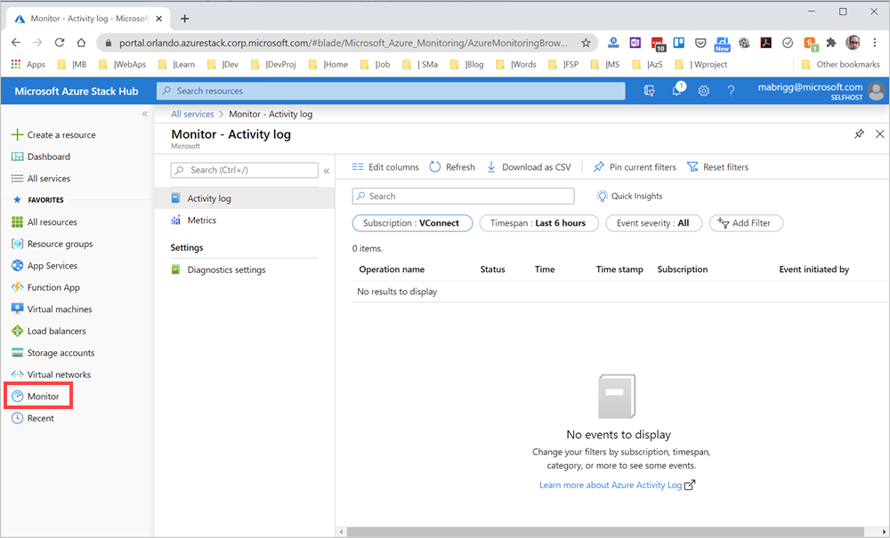

# Use Azure Monitor on Azure Stack Hub

*Applies to: Azure Stack Hub integrated systems*

This article provides an overview of the Azure Monitor service in Azure Stack Hub. It discusses the operation of Azure Monitor and additional information on how to use Azure Monitor on Azure Stack Hub. 

For an overview of Azure Monitor, see the global Azure article [Get started with Azure Monitor on Azure Stack Hub](https://docs.microsoft.com/azure/monitoring-and-diagnostics/monitoring-get-started).

Azure Monitor is a platform service that provides a single source for monitoring Azure resources. Azure Monitor lets you visualize, query, route, archive, and take other actions on metrics and logs coming from resources in Azure. You can work with this data by using the Azure Stack Hub administrator portal, Monitor PowerShell Cmdlets, Cross-Platform CLI, or Azure Monitor REST APIs. For the specific connectivity supported by Azure Stack Hub, see [How to consume monitoring data from Azure Stack Hub](azure-stack-metrics-monitor.md).

> [!Note]
> Metrics and diagnostic logs aren't available for the Azure Stack Development Kit.

## Prerequisites for Azure Monitor on Azure Stack Hub

Register the **Microsoft.insights** resource provider on your subscription's offer resource providers settings. You can verify that the resource provider is available in your offer associated with your subscription:

1. Open the Azure Stack Hub user portal .
2. Select **Subscriptions**.
3. Select the subscription you want to register.
4. Select **Resource providers** under **Settings.** 
5. Find **Microsoft.Insights** in the list and verify that the status is **Registered**.

## Overview of Azure Monitor on Azure Stack Hub

Like Azure Monitor on Azure, Azure Monitor on Azure Stack Hub provides base-level infrastructure metrics and logs for most services.

## Azure Monitor sources: compute subset

The **Microsoft.Compute** resource provider in Azure Stack Hub includes:
 - Virtual machines 
 - Virtual machine scale sets

### Application - diagnostics logs, app logs, and metrics

Apps can run in the OS of a VM running with the **Microsoft.Compute** resource provider. These apps and VMs emit their own set of logs and metrics. Azure Monitor relies on the Azure diagnostics extension (Windows or Linux) to collect most app-level metrics and logs.

The types of measures include:
 - Performance counters
 - App logs
 - Windows event logs
 - .NET event source
 - IIS logs
 - Manifest-based ETW
 - Crash dumps
 - Customer error logs

> [!Note]  
> Linux Diagnostics Extension on Azure Stack Hub is not supported.

### Host and Guest VM metrics

The previously listed compute resources have a dedicated host VM and guest OS. The host VM and guest OS are the equivalent of root VM and guest VM in Hyper-V hypervisor. You can collect metrics for both the host VM and the guest OS. You can also collect diagnostics logs for the guest OS. A list of collectible metrics for host and guest VM metrics on Azure Stack Hub is available at [Supported metrics with Azure Monitor on Azure Stack Hub](azure-stack-metrics-supported.md). 

### Activity log

You can search the activity logs for information about your compute resources as seen by the Azure Stack Hub infrastructure. The log contains information such as times when resources are created or destroyed. The activity logs on Azure Stack Hub are consistent with Azure. For more information, see the description of [Activity log overview on Azure](https://docs.microsoft.com/azure/monitoring-and-diagnostics/monitoring-overview-activity-logs). 

## Azure monitor sources: everything else

### Resources - metrics and diagnostics logs

Collectible metrics and diagnostics logs vary based on the resource type. A list of collectible metrics for each resource on Azure Stack Hub is available at supported metrics. For more information, see [Supported metrics with Azure Monitor on Azure Stack Hub](azure-stack-metrics-supported.md).

### Activity log

The activity log is the same for compute resources. 

### Uses for monitoring data

**Store and Archive**  

Some monitoring data is already stored and available in Azure Monitor for a set amount of time. 
 - Metrics are stored for 90 days. 
 - Activity log entries are stored for 90 days. 
 - Diagnostics logs aren't stored.
 - Archive the data to a storage account for longer retention.

**Query**  

You can use the Azure Monitor REST API, cross-platform Command-Line Interface (CLI) commands, PowerShell cmdlets, or the .NET SDK to access the data in the system or Azure storage. 

**Visualization**

Visualizing your monitoring data in graphics and charts helps you find trends quicker than looking through the data itself. 

A few visualization methods include:
 - Use the Azure Stack Hub user and administrator portal.
 - Route data to Microsoft Power BI.
 - Route the data to a third-party visualization tool using either live streaming or by having the tool read from an archive in Azure storage.

## Methods of accessing Azure monitor on Azure Stack Hub

You can work with data tracking, routing, and retrieval using one of the following methods. Not all methods are available for all actions or data types. 

 - [Azure Stack Hub user portal ](azure-stack-use-portal.md)
 - [PowerShell](https://docs.microsoft.com/azure/monitoring-and-diagnostics/insights-powershell-samples)
 - [Cross-platform Command Line Interface(CLI)](https://docs.microsoft.com/azure/monitoring-and-diagnostics/insights-cli-samples)
 - [REST API](https://docs.microsoft.com/rest/api/monitor)
 - [.NET SDK](https://www.nuget.org/packages/Microsoft.Azure.Management.Monitor)

> [!Important]  
> If you encounter a **resource not found** error when viewing the performance graph of a VM, make sure you've registered Microsoft.insights on the subscription associated with the VM.

## Next steps

Learn more about monitoring data consumption on Azure Stack Hub in the article [Consume monitoring data from Azure Stack Hub](azure-stack-metrics-monitor.md).
