# Back up your VM on Azure Stack Hub with Commvault

## Overview of backing up a VM with Commvault

This article walks through the configuration of Commvault Live Sync to update a recovery VM located on a separate Azure Stack Hub scale unit. This article details how to configure a common partner solution to protect and recover the data and system state of Virtual Machines deployed on Azure Stack Hub.

The following diagram shows you the overall solution when using Commvault to back up your VMs.

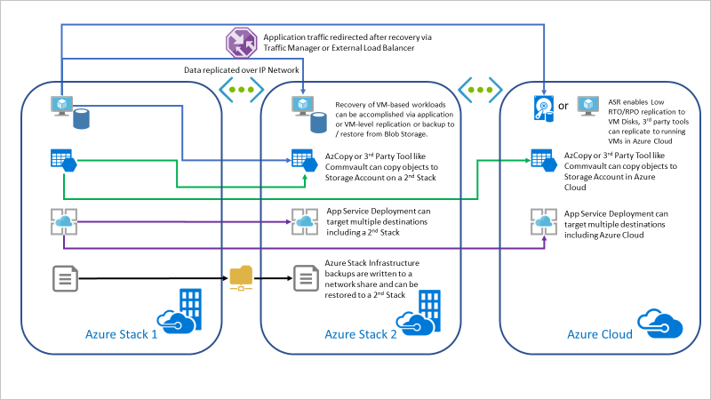

In this article you will:

1. Create a VM running the Commvault software on your source Azure Stack Hub Instance.

2. Create a storage account in a secondary location. The article assumes you will create a Blob container in a storage account in an Azure Stack Hub instance separate (the target), and that the target Azure Stack Hub is reachable from the source Azure Stack Hub.

3. Configure Commvault on your source Azure Stack Hub Instance and add VMs in the source Azure Stack Hub to the VM group.

4. Configure Commvault's LifeSync.

You can also download and offer compatible partner VM images to protect your Azure Stack Hub VMs to an Azure Cloud or another Azure Stack Hub. This article will illustrate VM protection with Commvault Live Sync.

The topology of this approach will look like the following diagram:

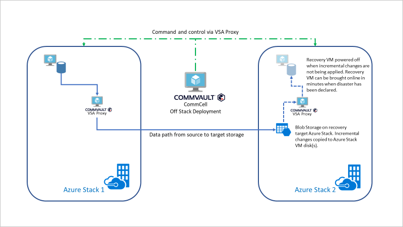

## Create the Commvault VM form the Commvault Marketplace Item

1. Open the Azure Stack Hub user portal.

2. Select **Create a resource** > **Compute** > **Commvault**.

    > [!Note]  
    > If Commvault is not available to you, contact your cloud operator.

    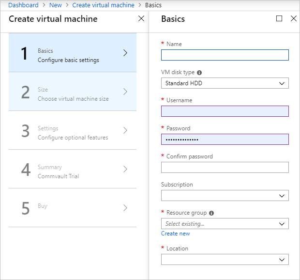

3. Configure the basic settings in **Create virtual machine, 1 Basics**:

    a. Enter a **Name**.

    b. Select **Standard HHD**.
    
    c. Enter a **Username**.
    
    d. Enter a **Password**.
    
    e. Confirm your password.
    
    f. Select a **Subscription** for the backup.
    
    g. Select a **Resource group**.
    
    h. Select the **Location** of the Azure Stack Hub. If you are using an ASDK, select **local**.
    
    i. Select **OK**.

    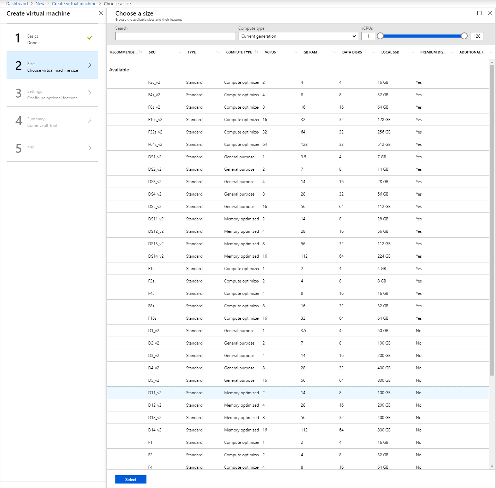

4. Choose the size of the Commvault VM. The VM size for backup should be at least 10 GB of RAM and 100 GB of storage.

    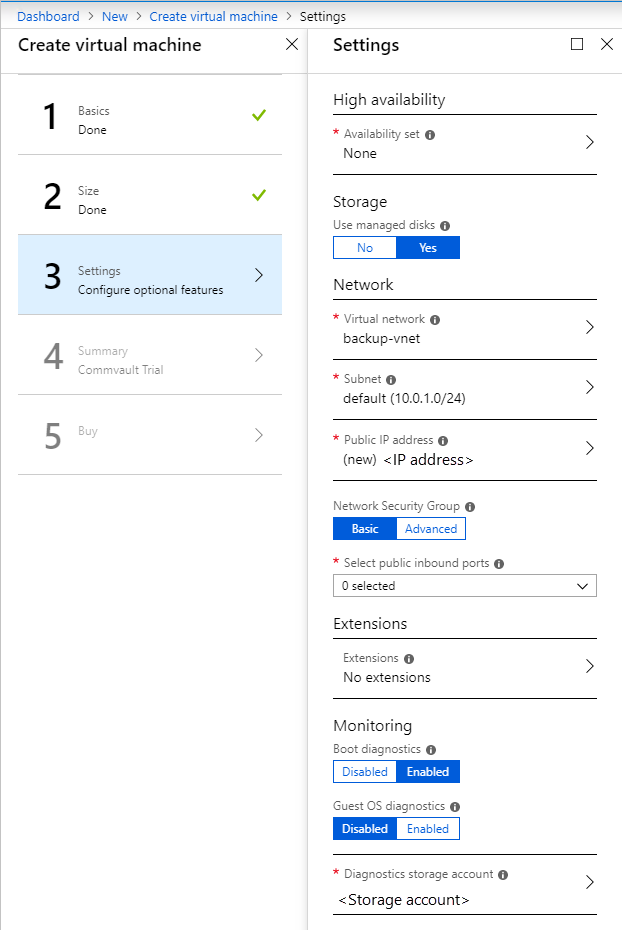.

5. Choose the settings for the Commvault VM.

    a. Set the availability to **None**.
    
    b. Select **Yes** for use managed disks.
    
    c. Select the default VNet for the **Virtual network**.
    
    d. Select the default **Subnet**.
    
    e. Select the default **Public IP address**.
    
    f. Leave the VM in the **Basic** Network Security Group.
    
    g. Open the HTTP (80), HTTPS (443), SSH (22), and RDP (3389) ports.
    
    h. Select **No extensions**.
    
    i. Select **Enabled** for the **Boot diagnostics**.
    
    j. Leave the **Guest OS diagnostics** set to **Disabled**.
    
    k. Leave the default **Diagnostics storage account**.
    
    l. Select **OK**.

6. Review the summary of your Commvault VM after it has passed validation. Select **OK**.

## Get your service principal

You will need to know if your identity manager is Azure AD or AD DFS. The following table contains the information you will need to set up the Commvault in your Azure Stack Hub.

| Element | Description | Source |
|--------------------------|--------------------------------------------------------------------------------------------------------------------|---------------------------------------------------------------------------------------------------------------------------------------------|
| Azure Resource Manager URL | The Azure Stack Hub Resource Manager endpoint. | https://docs.microsoft.com/azure-stack/user/azure-stack-version-profiles-ruby?view=azs-1908#the-azure-stack-hub-resource-manager-endpoint |
| Application name |  |  |
| Application ID | The service principal app ID saved when the service principal was created in the previous section of this article. | https://docs.microsoft.com/azure-stack/operator/azure-stack-create-service-principals?view=azs-1908 |
| Subscription ID | You use the subscription ID to access offers in Azure Stack Hub. | https://docs.microsoft.com/azure-stack/operator/service-plan-offer-subscription-overview?view=azs-1908#subscriptions |
| Tenant ID (Directory ID) | Your Azure Stack Hub tenant ID. | https://docs.microsoft.com/azure-stack/operator/azure-stack-identity-overview?view=azs-1908 |
| Application password | The service principal app secret saved when the service principal was created. | https://docs.microsoft.com/azure-stack/operator/azure-stack-create-service-principals?view=azs-1908 |

## Configure backup using the Commvault Console

1. Open your RDP client and connect to the Commavult VM in your Azure Stack Hub. Enter your credentials.

2. Install Azure Stack Hub PowerShell and Azure Stack Hub Tools on the Commvault VM.

    a. For instructions on installing Azure Stack Hub PowerShell, see [Install PowerShell for Azure Stack Hub](https://docs.microsoft.com/azure-stack/operator/azure-stack-powershell-install?toc=https%3A%2F%2Fdocs.microsoft.com%2Fen-us%2Fazure-stack%2Fuser%2FTOC.json&bc=https%3A%2F%2Fdocs.microsoft.com%2Fen-us%2Fazure-stack%2Fbreadcrumb%2Ftoc.json).  
    b. For instructions on installing Azure Stack Hub Tools, see [Download Azure Stack Hub tools from GitHub](https://docs.microsoft.com/azure-stack/operator/azure-stack-powershell-download?toc=https%3A%2F%2Fdocs.microsoft.com%2Fen-us%2Fazure-stack%2Fuser%2FTOC.json%3Fview%3Dazs-1908&bc=https%3A%2F%2Fdocs.microsoft.com%2Fen-us%2Fazure-stack%2Fbreadcrumb%2Ftoc.json%3Fview%3Dazs-1908&view=azs-1908).

3. After Commvault installs on in your Commvault VM, open the Commcell Console. From Start, select **Commvault** > **Commvault Commcell Console**.

    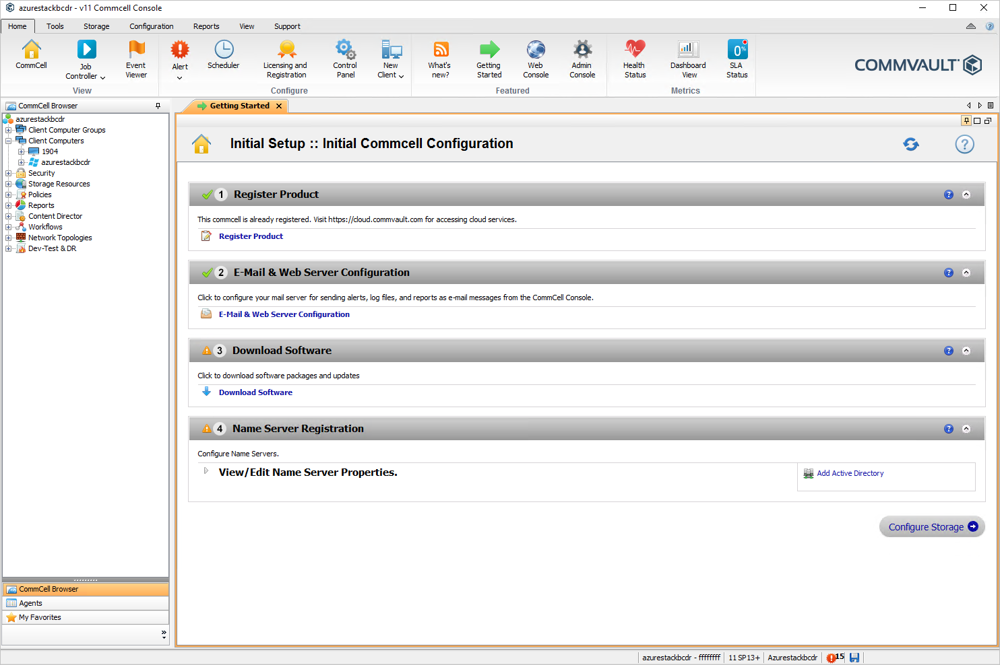

4. Configure your backup repositories to use storage external to the Azure Stack Hub in the Commvault Commcell Console. In the CommCell Browser, select Storage Resources > Storage Pools. Right-click and select **Add Storage Pool.** Select **Cloud**.

5. Add the name of the Storage Pool. Select **Next**.

6. Select **Create** > **Cloud Storage**.

    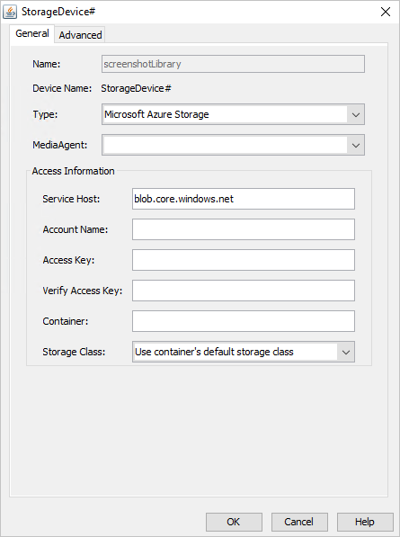

7. Select your cloud service provider. In this procedure, we will use a second Azure Stack Hub in a different location. Select Microsoft Azure Storage.

8. Select your Commvault VM as your MediaAgent.

9. Enter your access information for your storage account. You can find instruction on setting up an Azure Storage account here. Access information:

    -  **Service host**: Get the name of the URL from the Blob container properties in your resource. For example, my URL was https:\//backuptest.blob.westus.stackpoc.com/mybackups and I used, blob.westus.stackpoc.com in Service host.
    
    -   **Account Name**: Use the Storage account name. You can find this in the Access Keys blade in the storage resource.
    
    -   **Access Key**: Get the access key from the Access Keys blade in the storage resource.
    
    -   **Container**: The name of the container. In this case, mybackups.
    
    -   **Storage Class**: Leave as User container's default storage class.

10. Create a Microsoft Azure Stack Hub Client by following the instructions at [Creating a Microsoft Azure Stack Hub Client](https://documentation.commvault.com/commvault/v11_sp13/article?p=86495.htm)

    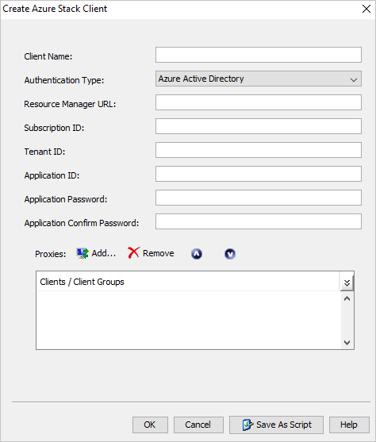

11. Select the VMs or Resource Groups to protect and attach a backup policy.

12. Configure your backup schedule to match your RPO requirements for Recovery.

13. Perform the first full backup.

## Configure Commvault Live Sync 

Two options are available. You can choose to replicate changes from the primary copy of backups or replicate changes from a secondary copy to the recovery VM. Replicating from a Backup Set eliminates the Read IO impact on the source machine.

1. During the configuration of Live Sync, you will need to provide the source Azure Stack Hub (Virtual Server Agent) and the target Azure Stack Hub details.

2. For the steps to configure Commvault Live Sync, see [Live Sync Replication for Microsoft Azure Stack Hub](https://documentation.commvault.com/commvault/v11_sp13/article?p=94386.htm).

    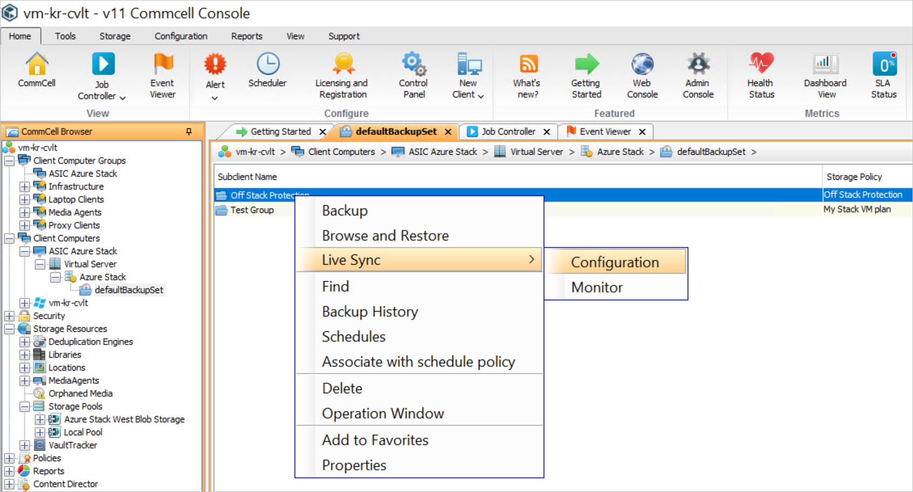
 
3. During the configuration of Live Sync, you will need to provide the target Azure Stack Hub and Virtual Server Agent details.

    

4. Continue the configuration and add the target storage account where the replica disks will be hosted, the resource group(s) where the replica VMs will be placed, and the name you would like attached to the replica VMs.

    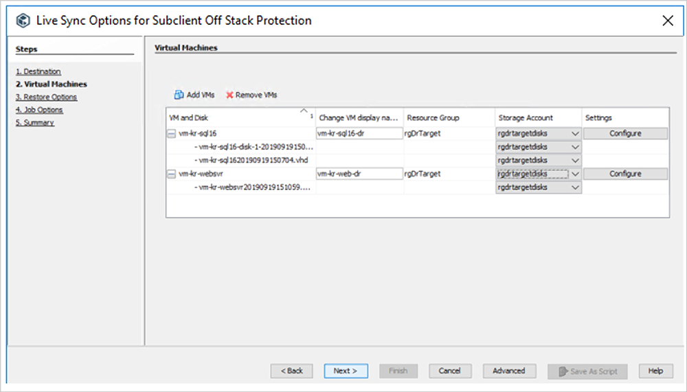

5. You can also change the VM size and configure network settings by selecting  **Configure** next to each VM.

6. Set the frequency of replication to the target Azure Stack Hub

    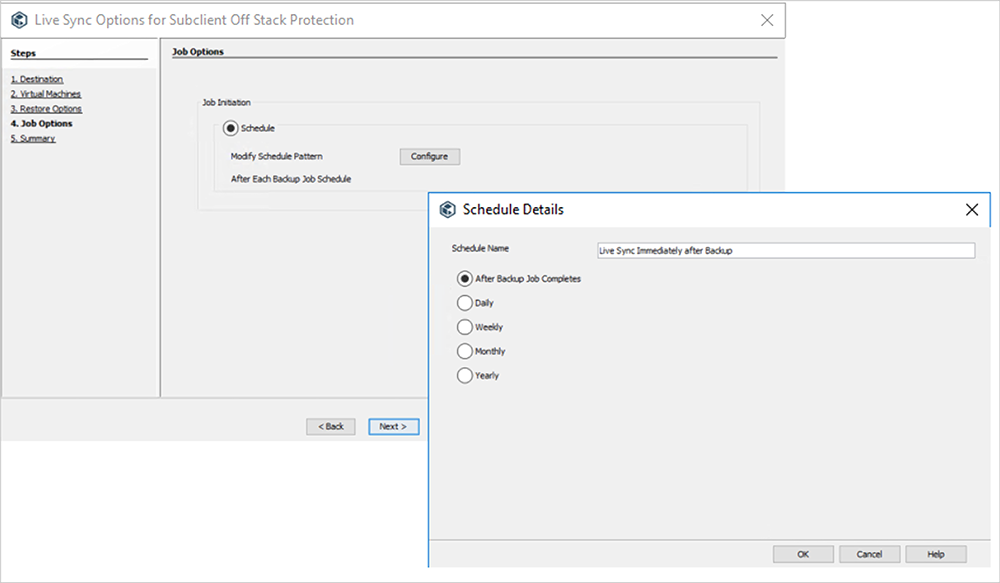

7. Review your settings to save the configuration. The recovery environment will then be created and replication will begin at the chosen interval.

## Set up failover behavior using Live Sync

Commvault Live Sync allows you to failover machines from one Azure Stack Hub to another and failback to resume operations on the original Azure Stack Hub. The workflow is automated and logged.

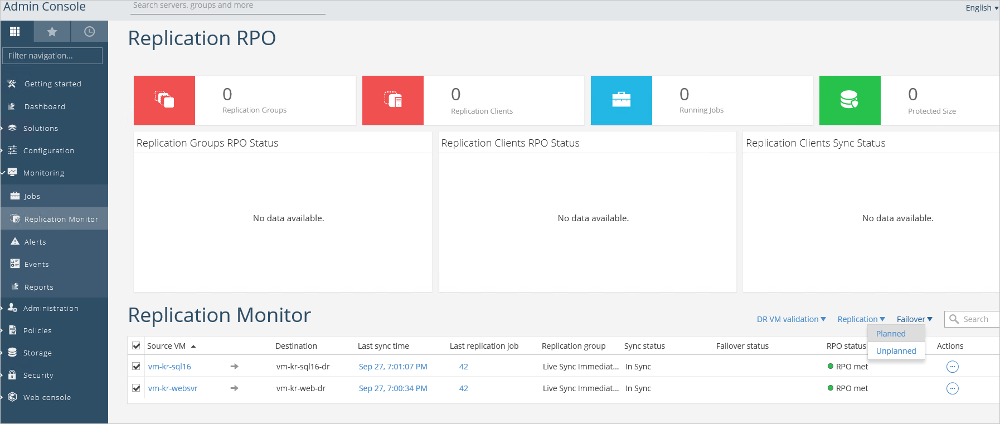

Select the VMs you wish to failover to your Recovery Azure Stack Hub and choose a planned or unplanned failover. A planned failover is appropriate when there is time to gracefully shut down the production environment before resuming operations in the recovery site. Planned failover shuts down the production VMs, replicates final changes to the recovery site, and brings the recovery VMs online with the latest data and applies the VM size and network configuration specified during the Live Sync configuration. An unplanned failover will attempt to shut down the production VMs, but will proceed if the production environment is unavailable and simply bring the recovery VMs online with the last received replication data set applied to the VM and the size and network configuration previously chosen. The images below illustrate an unplanned failover where the recovery VMs have been brought online by Commvault Live Sync.

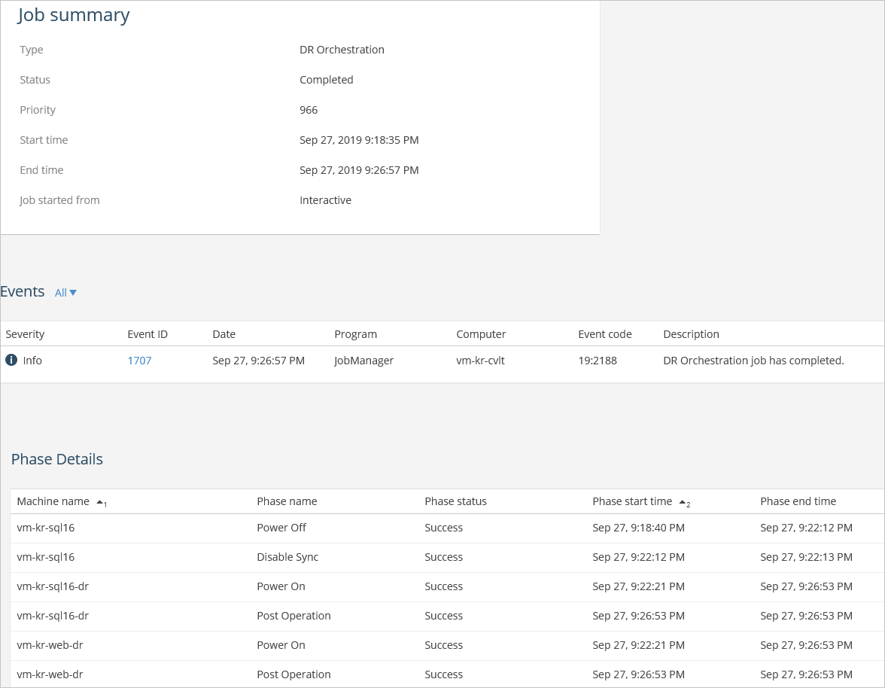

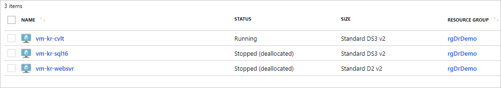

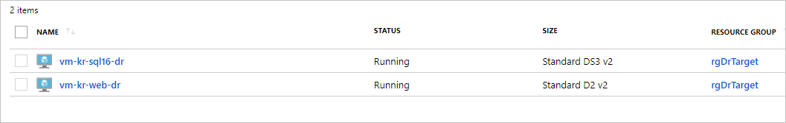

## Next steps

[Differences and considerations for Azure Stack Hub networking](azure-stack-network-differences.md)  