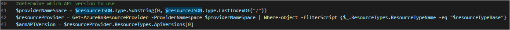
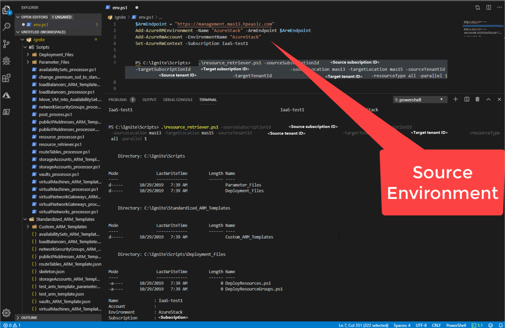
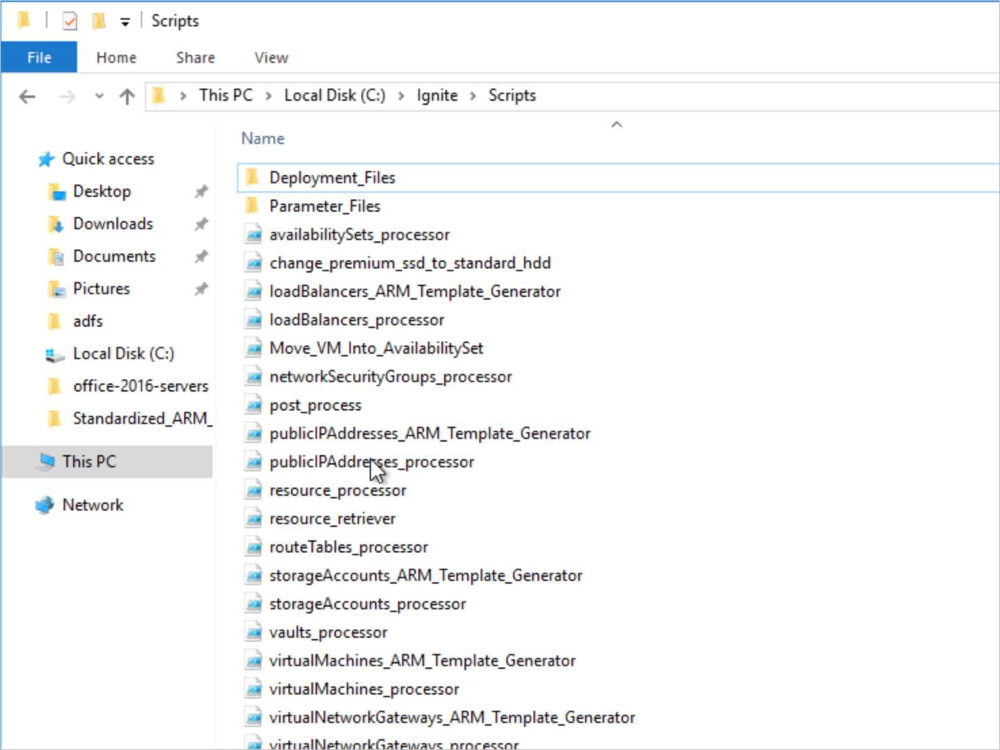
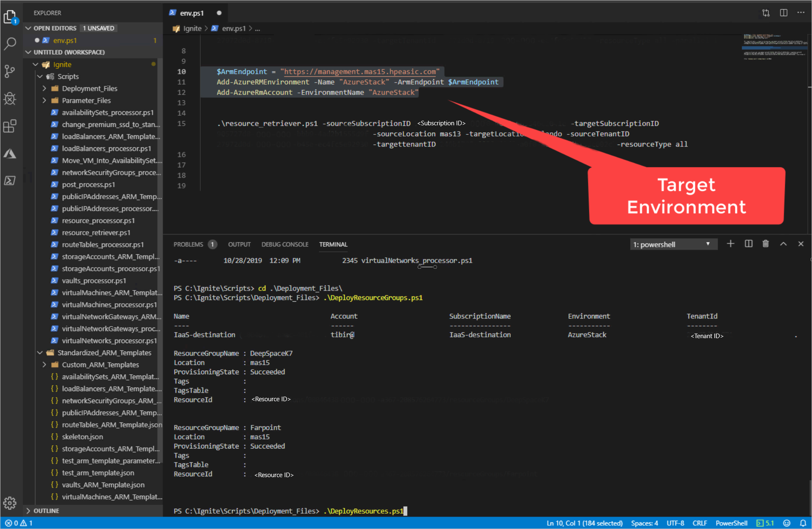

# Replicate resources using the Azure Stack Hub subscription replicator

You can use the Azure Stack Hub subscription replicator PowerShell script to copy the resources between Azure Stack Hub subscriptions, across Azure Stack Hub stamps, or between Azure Stack Hub and Azure. The replicator script reads and rebuilds the Azure Resource Manager resources from different Azure and Azure Stack Hub subscriptions. This article looks at how the script works, how you can use the script, and provides a reference for script operations.

You can find the scripts used in this article in the [Azure Intelligent Edge Patterns](https://github.com/Azure-Samples/azure-intelligent-edge-patterns) GitHub repository. The scripts are in the [subscription replicator](https://github.com/Azure-Samples/azure-intelligent-edge-patterns/tree/master/subscription%20replicator) folder.

## Subscription replicator overview

The Azure subscription replicator was designed to be modular. This tool uses a core processor that orchestrates the resource replication. In addition, the tool supports customizable processors that act as templates for copying different types of resources. 

The core processor is made up of the following three scripts:

- **resource_retriever.ps1**

    - Generates folders to store output files.

    - Sets context to the source subscription.

    - Retrieves the resources and passes them along to **resource_processor.ps1**.

- **resource_processor.ps1**

    - Processes the resource passed in by **resource_retriever.ps1**.

    - Determines which customized processor to use and passes the resources.

- **post_process.ps1**

    - Post processes the output generated by the customized processor to prepare it to be deployed in the target subscription.

    - Generates deployment code to deploy the resources in the target subscription.

The three scripts control the flow of information in a standard way to allow for greater flexibility. Adding support for additional resources, for example, doesn't require you to change any code in the core processor.

Customized processors, that were mentioned above, are `ps1` files that dictate how a certain type of resource should be processed. The name of a customized processor is always named using the type data in a resource. For example, assuming `$vm` holds a virtual machine object, running `$vm`.Type would yield `Microsoft.Compute/virtualMachines`. That means, a processor for a virtual machine would be named `virtualMachines_processor.ps1`, the name must be exactly as it appears in the resource metadata as that is how the core processor determines which customized processor to use.

A customized processor dictates how a resource should be replicated by determining what information is important and dictating how that information should be pulled out of the resource metadata. The customized processor then takes all of the extracted data and uses it to generate a parameters file that will be used in conjunction with an Azure Resource Manager template to deploy the resource in the target subscription. This parameters file is stored in the **Parameter_Files** after it is post processed by post_process.ps1.

There is a folder in the Replicator file structure named **Standardized_ARM_Templates**. Depending on the source environment, the deployments will use one of these standardized Azure Resource Manager templates, or a customized Azure Resource Manager template will have to be generated. In this case, a customized processor must call an Azure Resource Manager template generator. In the example started earlier, the name of an Azure Resource Manager template generator for virtual machines would be named **virtualMachines_ARM_Template_Generator.ps1**. The Azure Resource Manager template generator is responsible for creating a customized Azure Resource Manager template based on what information is in the metadata of a resource. For example, if the virtual machine resource has metadata specifying that it is a member of an availability set, the Azure Resource Manager template generator will create an Azure Resource Manager template with code specifying the ID of the availability set that the virtual machine is a part of. That way when the virtual machine is deployed to the new subscription it automatically gets added to the availability set upon deployment. These customized Azure Resource Manager templates are stored in the **Custom_ARM_Templates** folder located inside the **Standardized_ARM_Templates** folder. The post_processor.ps1 is responsible for determining whether a deployment is supposed to use a standardized Azure Resource Manager template or a customized one and generating the corresponding deployment code.

The script **post-process.ps1** is responsible for cleaning up the parameters files and creating the scripts that the user will use to deploy the new resources. During the cleaning phase, the script replaces all references to the source subscription ID, tenant ID, and location with the corresponding target values. It then outputs the parameters file to the **Parameter_Files** folder. It then determines whether the resource being processed uses a customized Azure Resource Manager template or not and generates the corresponding deployment code, which utilizes the **New-AzureRmResourceGroupDeployment** cmdlet. The deployment code is then added to file named **DeployResources.ps1** stored in the **Deployment_Files** folder. Lastly the script determines the resource group to which the resource belongs and checks the **DeployResourceGroups.ps1** script to see if the deployment code to deploy that resource group already exists. If it does not, then it will add code to that script to deploy the resource group, if it does then it does nothing.

### Dynamic API retrieval

The tool has dynamic API retrieval built in so that the newest resource provider API version available in the source subscription is used to deploy the resources in the target subscription:

Figure API retrieval in **resource_processor.ps1**.

However, there is the chance that the target subscription’s resource provider API version is older than the source subscription’s and does not support the version being provided from the source subscription. In this case, an error will be thrown when the deployment is run. To resolve this, update the resource providers in the target subscription to match those in the source subscription.

### Parallel deployments

The tool requires a parameter named **parallel**. This parameter takes a boolean value specifying whether or not the retrieved resources should be deployed in parallel or not. If the value is set to **true,** then each call to **New-AzureRmResourceGroupDeployment** will have the **-asJob** flag and blocks of code to wait for parallel jobs to finish will be added in between sets of resource deployments based on the resource types. It ensures that all resources of one type have all been deployed prior to deploying the next type of resource. If the **parallel** parameter value is set to **false**, the resources will all be deployed in serial.

## Add additional resource types

Adding new resource types is simple. The developer must create a customized processor and either an Azure Resource Manager template or an Azure Resource Manager template generator. After that is complete the developer must add the resource type to the ValidateSet for the **$resourceType** parameter and the **$resourceTypes** array in resource_retriever.ps1. When adding the resource type to the **$resourceTypes **array, it must be added in the correct order. The order of the array determines the order that resources will be deployed, so keep dependencies in mind. Lastly, if the customized processor utilizes an Azure Resource Manager template generator, they must add the resource type name to the **$customTypes** array in **post_process.ps1**.

## Run Azure subscription replicator

To run the Azure subscription replicator (v3) tool you’ll need to kick off resource_retriever.ps1, supplying all of the parameters. The **resourceType** parameter, there is an option to choose **All** rather than one resource type. If **All** is selected, resource_retriever.ps1 will process all the resources in an order so that when the deployment is run, dependent resources are deployed first. For example, VNets are deployed prior to virtual machines as virtual machines require a VNet to be in place for them to be deployed properly.

When the script is finished executing, there will be three new folders, **Deployment_Files**, **Parameter_Files**, and **Custom_ARM_Templates**.

 > [!Note]  
 > Before you run any of the generated scripts, you must set the right environment and login to the target subscription (in the new Azure Stack Hub for ex) and set the working directory to the **Deployment_Files** folder.

Deployment_Files will hold two files **DeployResourceGroups.ps1** and **DeployResources.ps1**. Executing DeployResourceGroups.ps1 will deploy the resource groups. Executing DeployResources.ps1 will deploy all of the resources that were processed. In the case that the tool was executed with **All** or **Microsoft.Compute/virtualMachines** as the resource type, DeployResources.ps1 will prompt the user to input a virtual machine admin password that will be used to create all of the virtual machines.

### Example

1.  Run the script.

    

    > [!Note]  
    > Don't forget to configure the source evironment and the subscription context for the PS instance. 

2.  Review the newly created folders:

    

3.  Set the context to the target subscription, change the folder to **Deployment_Files**, deploy the resource groups and then start the resource deployment.

    

4.  Run `Get-Job` to check the status. Get-Job | Receive-Job will return the results.

## Clean up

Inside the replicatorV3 folder, there is a file named **cleanup_generated_items.ps1** - it will remove the **Deployment_Files**, **Parameter_Files**, and **Custom_ARM_Templates** folders and all of their contents.

## Subscription replicator operations

The Azure subscription replicator (v3) can currently replicate the following resource types:

- Microsoft.Compute/availabilitySets

- Microsoft.Compute/virtualMachines

- Microsoft.Network/loadBalancers

- Microsoft.Network/networkSecurityGroups

- Microsoft.Network/publicIPAddresses

- Microsoft.Network/routeTables

- Microsoft.Network/virtualNetworks

- Microsoft.Network/virtualNetworkGateways

- Microsoft.Storage/storageAccounts

When running the tool with **All** as the resource type, the following order will be followed when replicating and deploying (in the below, all resources have their configuration replicated, i.e. sku, offer, etc.):

- Microsoft.Network/virtualNetworks

    - Replicates:
            - All address spaces
            - All subnets

- Microsoft.Network/virtualNetworkGateways

    - Replicates:
            - Public IP configuration
            - Subnet configuration
            - VPN type
            - Gateway type

- Microsoft.Network/routeTables

- Microsoft.Network/networkSecurityGroups

    - Replicates:
            - All security rules inbound and outbound

- Microsoft.Network/publicIPAddresses

- Microsoft.Network/loadBalancers

    - Replicates:
            - Private IP addresses
            - Public IP address configuration
            - Subnet configuration
    
- Microsoft.Compute/availabilitySets

    - Replicates:
            - Number of fault domains
            - Number of update domains

- Microsoft.Storage/storageAccounts

- Microsoft.Compute/virtualMachines
    - Replicates:  
            - Data disks (without data)  
            - Virtual machine size  
            - Operating system  
            - Diagnostic storage account configuration  
            - Public IP configuration  
            - Network Interface  
            - Network Interface private IP address  
            - Network Security Group configuration  
            - Availability set configuration  

> [!Note]  
> Only creates managed disks for OS disk and data disks. Currently, there isn't support for using storage accounts 

### Limitations

The tool can replicate resources from one subscription to another as long as the target subscription’s resource providers support all of the resources and options that are being replicated from the source subscription.

To ensure successful replication, mare sure that the target subscription’s resource provider versions match those of the source subscription.

When replicating from commercial Azure to commercial Azure or from one subscription within Azure Stack Hub to another subscription within the same Azure Stack Hub, there will be issues when replicating storage accounts. This is due to the storage account naming requirement that all storage account names be unique across all of commercial Azure or across all subscriptions on an Azure Stack Hub region/instance. Replicating storage accounts across different Azure Stack Hub instances will succeed as the Stacks are separate regions/instances.

## Next steps

[Differences and considerations for Azure Stack Hub networking](azure-stack-network-differences.md)  
