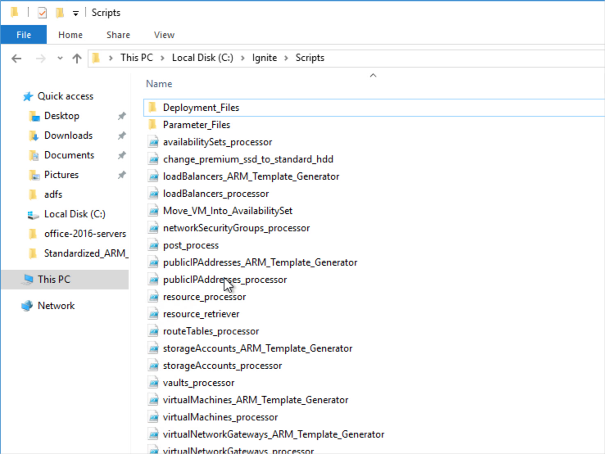

# Replicate resources using the Azure Stack Hub subscription replicator

You can use the Azure Stack Hub subscription replicator PowerShell script to copy resources between Azure Stack Hub subscriptions, across Azure Stack Hub stamps, or between Azure Stack Hub and Azure. The replicator script reads and rebuilds the Azure Resource Manager resources from different Azure and Azure Stack Hub subscriptions. This article explains how the script works, how you can use the script, and provides a reference for script operations.

You can find the scripts used in this article in the [Azure Intelligent Edge Patterns](https://github.com/Azure-Samples/azure-intelligent-edge-patterns) GitHub repository. The scripts are in the [subscription replicator](https://github.com/Azure-Samples/azure-intelligent-edge-patterns/tree/master/subscription%20replicator) folder.

## Subscription replicator overview

The Azure subscription replicator is modular. This tool uses a core processor that orchestrates the resource replication. In addition, the tool supports customizable processors that act as templates for copying different types of resources. 

The core processor consists of the following three scripts:

- **resource_retriever.ps1**

    - Generates folders to store output files.

    - Sets context to the source subscription.

    - Retrieves the resources and passes them along to **resource_processor.ps1**.

- **resource_processor.ps1**

    - Processes the resource passed in by **resource_retriever.ps1**.

    - Determines which customized processor to use and passes the resources.

- **post_process.ps1**

    - Post processes the output generated by the customized processor to prepare it to be deployed in the target subscription.

    - Generates deployment code to deploy the resources in the target subscription.

The three scripts control the flow of information in a standard way to allow for greater flexibility. Adding support for additional resources, for example, doesn't require changing any code in the core processor.

Customized processors, mentioned earlier, are `ps1` files that dictate how a certain type of resource should be processed. The name of a customized processor always uses the type data in a resource. For example, assuming `$vm` holds a virtual machine object, running `$vm`.Type yields `Microsoft.Compute/virtualMachines`. That means, a processor for a virtual machine is named `virtualMachines_processor.ps1`. The name must be exactly as it appears in the resource metadata as the core processor uses it to determine which customized processor to use.

A customized processor dictates how a resource should be replicated by determining what information is important and dictating how that information should be pulled out of the resource metadata. The customized processor then takes all of the extracted data and uses it to generate a parameters file that works with an Azure Resource Manager template to deploy the resource in the target subscription. The **post_process.ps1** script stores this parameters file in the **Parameter_Files** folder after it is post processed.

There's a folder in the Replicator file structure named **Standardized_ARM_Templates**. Depending on the source environment, the deployments use one of these standardized Resource Manager template, or you might need to generate a customized Resource Manager template. In this case, a customized processor must call a Resource Manager template template generator. In the example started earlier, the name of a Resource Manager template generator for virtual machines is **virtualMachines_ARM_Template_Generator.ps1**. The Resource Manager template generator is responsible for creating a customized Resource Manager template based on what information is in the metadata of a resource. For example, if the virtual machine resource has metadata specifying that it is a member of an availability set, the Resource Manager template generator creates a Resource Manager template with code specifying the ID of the availability set that the virtual machine is a part of. That way when the virtual machine is deployed to the new subscription it automatically gets added to the availability set upon deployment. These customized Resource Manager templates are stored in the **Custom_ARM_Templates** folder located inside the **Standardized_ARM_Templates** folder. The **post_processor.ps1** script is responsible for determining whether a deployment is supposed to use a standardized Resource Manager template or a customized one and generating the corresponding deployment code.

The script **post-process.ps1** is responsible for cleaning up the parameters files and creating the scripts that the user uses to deploy the new resources. During the cleaning phase, the script replaces all references to the source subscription ID, tenant ID, and location with the corresponding target values. It then outputs the parameters file to the **Parameter_Files** folder. It then determines whether the resource being processed uses a customized Resource Manager template or not and generates the corresponding deployment code, which uses the **New-AzResourceGroupDeployment** cmdlet. The deployment code is then added to file named **DeployResources.ps1** stored in the **Deployment_Files** folder. Lastly the script determines the resource group to which the resource belongs and checks the **DeployResourceGroups.ps1** script to see if the deployment code to deploy that resource group already exists. If it doesn't, the script adds code to that script to deploy the resource group. If it does, the script does nothing.

### Dynamic API retrieval

The tool includes dynamic API retrieval, so it uses the newest resource provider API version available in the source subscription to deploy the resources in the target subscription:

:::image type="content" source="./media/azure-stack-network-howto-backup-replicator/image1.png" alt-text="Screenshot showing API retrieval." lightbox="./media/azure-stack-network-howto-backup-replicator/image1.png":::

However, the target subscription might have an older resource provider API version that doesn't support the version the source subscription provides. In this case, an error occurs when you run the deployment. To resolve this error, update the resource providers in the target subscription to match those in the source subscription.

### Parallel deployments

The tool requires a parameter named **parallel**. This parameter takes a boolean value that specifies whether to deploy the retrieved resources in parallel. If you set the value to **true**, each call to **New-AzResourceGroupDeployment** includes the **-asJob** flag. The process adds blocks of code that wait for parallel jobs to finish between sets of resource deployments based on the resource types. It ensures that all resources of one type are deployed before deploying the next type of resource. If you set the **parallel** parameter value to **false**, the resources are deployed in serial.

## Add additional resource types

Adding new resource types is simple. Create a customized processor and either a Resource Manager template or a Resource Manager template generator. After you complete those steps, add the resource type to the ValidateSet for the **$resourceType** parameter and the **$resourceTypes** array in resource_retriever.ps1. When you add the resource type to the **$resourceTypes** array, add it in the correct order. The order of the array determines the order that resources are deployed, so keep dependencies in mind. Lastly, if the customized processor uses a Resource Manager template generator, add the resource type name to the **$customTypes** array in **post_process.ps1**.

## Run Azure subscription replicator

To run the Azure subscription replicator (v3) tool, start resource_retriever.ps1 and supply all of the parameters. For the **resourceType** parameter, you can choose **All** rather than one resource type. If you select **All**, resource_retriever.ps1 processes all the resources in an order so that when the deployment runs, dependent resources are deployed first. For example, VNets are deployed before virtual machines as virtual machines require a VNet to be in place for them to be deployed properly.

When the script finishes executing, there are three new folders: **Deployment_Files**, **Parameter_Files**, and **Custom_ARM_Templates**.

 > [!NOTE]  
 > Before you run any of the generated scripts, set the right environment and sign in to the target subscription (in the new Azure Stack Hub, for example). Set the working directory to the **Deployment_Files** folder.

**Deployment_Files** holds two files: **DeployResourceGroups.ps1** and **DeployResources.ps1**. When you run **DeployResourceGroups.ps1**, it deploys the resource groups. When you run **DeployResources.ps1**, it deploys all of the resources that were processed. If you run the tool with **All** or **Microsoft.Compute/virtualMachines** as the resource type, **DeployResources.ps1** prompts you to enter a virtual machine admin password that it uses to create all of the virtual machines.

### Example

1.  Run the script.

    :::image type="content" source="./media/azure-stack-network-howto-backup-replicator/image2.png" alt-text="Screenshot show the result of running the script." lightbox="./media/azure-stack-network-howto-backup-replicator/image2.png":::

    > [!NOTE]  
    > Don't forget to configure the source environment and the subscription context for the PS instance. 

1.  Review the newly created folders:

    

1.  Set the context to the target subscription, change the folder to **Deployment_Files**, deploy the resource groups (run the `DeployResourceGroups.ps1` script), and then start the resource deployment (run the `DeployResources.ps1` script).

    :::image type="content" source="./media/azure-stack-network-howto-backup-replicator/image6.png" alt-text="Screenshot shows the result of starting the deployment." lightbox="./media/azure-stack-network-howto-backup-replicator/image6.png":::
    
1.  Run `Get-Job` to check the status. Get-Job | Receive-Job will return the results.

## Clean up

Inside the `replicatorV3` folder, the **cleanup_generated_items.ps1** file removes the **Deployment_Files**, **Parameter_Files**, and **Custom_ARM_Templates** folders and all of their contents.

## Subscription replicator operations

The Azure subscription replicator (v3) can currently replicate the following resource types:

- Microsoft.Compute/availabilitySets

- Microsoft.Compute/virtualMachines

- Microsoft.Network/loadBalancers

- Microsoft.Network/networkSecurityGroups

- Microsoft.Network/publicIPAddresses

- Microsoft.Network/routeTables

- Microsoft.Network/virtualNetworks

- Microsoft.Network/virtualNetworkGateways

- Microsoft.Storage/storageAccounts

When you run the tool with **All** as the resource type, it follows the order in the following list when replicating and deploying. In the following list, all resources have their configuration replicated, such as sku, offer, and other settings:

- Microsoft.Network/virtualNetworks

    - Replicates:
            - All address spaces
            - All subnets

- Microsoft.Network/virtualNetworkGateways

    - Replicates:
            - Public IP configuration
            - Subnet configuration
            - VPN type
            - Gateway type

- Microsoft.Network/routeTables

- Microsoft.Network/networkSecurityGroups

    - Replicates:
            - All security rules inbound and outbound

- Microsoft.Network/publicIPAddresses

- Microsoft.Network/loadBalancers

    - Replicates:
            - Private IP addresses
            - Public IP address configuration
            - Subnet configuration
    
- Microsoft.Compute/availabilitySets

    - Replicates:
            - Number of fault domains
            - Number of update domains

- Microsoft.Storage/storageAccounts

- Microsoft.Compute/virtualMachines
    - Replicates:  
            - Data disks (without data)  
            - Virtual machine size  
            - Operating system  
            - Diagnostic storage account configuration  
            - Public IP configuration  
            - Network Interface  
            - Network Interface private IP address  
            - Network Security Group configuration  
            - Availability set configuration  

> [!NOTE]  
> This process only creates managed disks for the OS disk and data disks. Currently, it doesn't support using storage accounts.

### Limitations

The tool can replicate resources from one subscription to another as long as the target subscription supports all of the resource types and options that you're replicating from the source subscription. To ensure successful replication, make sure that the target subscription's resource provider versions match those of the source subscription.

To ensure successful replication, make sure that the target subscription’s resource provider versions match those of the source subscription.

When you replicate resources from commercial Azure to commercial Azure, or from one subscription within Azure Stack Hub to another subscription within the same Azure Stack Hub, you encounter problems when replicating storage accounts. This problem occurs because storage account names must be unique across all of commercial Azure or across all subscriptions on an Azure Stack Hub region or instance. You can successfully replicate storage accounts across different Azure Stack Hub instances because the Stacks are separate regions or instances.

## Next steps

[Differences and considerations for Azure Stack Hub networking](azure-stack-network-differences.md)  
