# How to extend the data center on  Azure Stack Hub

*Applies to: Azure Stack Hub integrated systems and Azure Stack Hub Development Kit*

This article provides Azure Stack Hub storage infrastructure information to help you decide how to integrate Azure Stack into your existing networking environment. After providing a general discussion of extending your data center, the article presents two different scenarios. You can connect to a Windows file storage server. You can also connect to a Windows iSCSI server.

## Overview of extending storage to Azure Stack Hub

There are scenarios where having your data located in the public cloud isn’t enough. Perhaps you have a compute-intensive virtualized database workload, sensitive to latencies, and the round-trip time to the public cloud could affect performance of the database workload. Perhaps there is data on premises, held on a file server, NAS, or iSCSI storage array, which needs to be accessed by on-premises workloads, and needs to reside on-premises to meet regulatory or compliance goals.  These are just two of the scenarios where having data reside on-premises, remains important for many organizations.

So, why not just host that data in storage accounts on Azure Stack, or inside virtualized file servers, running on the Azure Stack system? Well, unlike in Azure, Azure Stack storage is finite. The capacity you have available for your usage depends entirely on the per-node capacity you chose to purchase, in addition to the number of nodes you have. And because Azure Stack is a Hyper-Converged solution, should you wish to grow your storage capacity to meet usage demands, you also need to grow your compute footprint through the addition of nodes.  This can be potentially cost prohibitive, especially if the need to extra capacity is for cold, archival storage that could be added for low cost outside of the Azure Stack system.

Which brings you to the scenario that you will cover below. How can you connect Azure Stack systems, virtualized workloads running on the Azure Stack, simply and efficiently, to storage systems outside of the Azure Stack, accessible via the network.

## Design for extending storage

The diagram depicts a scenario, where a single virtual machine, running a workload, connects to, and utilizes external (to the VM, and the Azure Stack itself) storage, for purposes of data reading/writing etc. For this article, you'll focus on simple retrieval of files, but you can expand this example for more complex scenarios, such as the remote storage of database files.

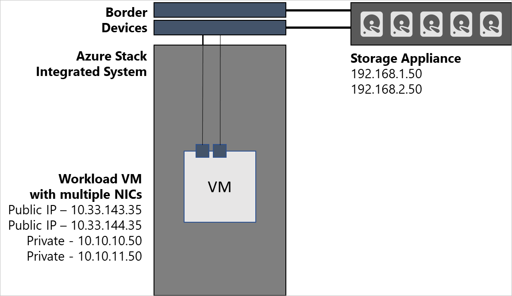

In the diagram, you'll see that the VM on the Azure Stack system has been deployed with multiple NICs. From both a redundancy, but also as a storage best practice, it's important to have multiple paths between target and destination. Where things become more complex, are where VMs in Azure Stack have both public and private IPs, just like in Azure. If the external storage needed to reach the VM, it can only do so via the public IP, as the Private IPs are primarily used within the Azure Stack systems, within vNets and the subnets. The external storage would not be able to communicate with the private IP space of the VM, unless it passes through a site-to-site VPN, to connect to the vNet itself. So, for this example, you'll focus on communication via the public IP space. One thing to notice with the public IP space in the graphic, is that there are two different public IP pool subnets. By default, Azure Stack requires just one pool for public IP address purposes, but something to consider, for redundant routing, may be to add a second. However it is not possible to select an IP address from a specific pool, so you may end up with VMs with public IPs from the same pool across multiple virtual network cards.

In this example, you can assume that the routing between the border devices and the external storage is taken care of, and traffic can traverse the network appropriately. For this example, it doesn't matter if the backbone is 1 GbE, 10 GbE, 25 GbE or even faster, however this would be important to consider as you plan for your integration, to address the performance needs of any applications accessing this external storage.

## Connect to a Windows Server file server storage

In this scenario, deploy and configure a Windows Server 2019 virtual machine on Azure Stack and prepare it to connect to an external file server, which can also run Windows Server 2019. Where appropriate, set key features such as SMB Multichannel, to optimize performance and connectivity between the VM and external storage.

### Deploy the Windows Server 2019 VM on Azure Stack

1.  From your **Azure Stack administrator portal**, assuming this system has been correctly registered and is connected to the marketplace, select **Marketplace Management,** then, assuming you don't already have a Windows Server 2019 image, select **Add from Azure** and then search for **Windows Server 2019**, adding the **Windows Server 2019 Datacenter** image.

    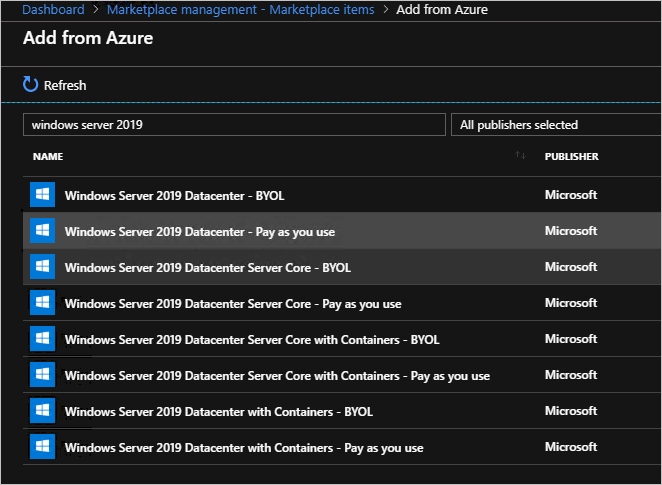

    Downloading a Windows Server 2019 image may take some time.

2.  Once you have a Windows Server 2019 image in your Azure Stack environment, sign in to the Azure Stack user portal**.

3.  Once logged into the Azure Stack user portal, ensure you have a [subscription to an offer](https://docs.microsoft.com/azure-stack/operator/azure-stack-subscribe-plan-provision-vm?view=azs-1908), that lets you provision IaaS resources (Compute, Storage, and Network).

4.  Once you have a subscription available, back on the **dashboard** in the Azure Stack user portal, select **Create a resource**, select **Compute** and then select the **Windows Server 2019 Datacenter gallery item**.

5.  On the **Basics** blade:

    a.  **Name**: VM001

    b.  **Username**: localadmin

    c.  **Password** and **Confirm password**: \<password of your choice>

    d.  **Subscription**: \<subscription of your choice, with compute/storage/network resources>

    e. **Resource group**: Create new: storagetesting

    f.  Then select **OK**

6.  On the **Choose a size** blade, select a **Standard_F8s_v2**.

7.  On the **Settings** blade, select the **Virtual network** and in the **Create virtual network** blade, adjust the address space to be **10.10.10.0/23** and update the Subnet address range to be **10.10.10.0/24** then select **OK**.

8.  Select the **Public IP address**, and in the **Create public IP address** blade, select the **Static**.

9.  From **Select public inbound ports**, select **RDP (3389)**.

10. Leave the other defaults and select **OK**.
    
    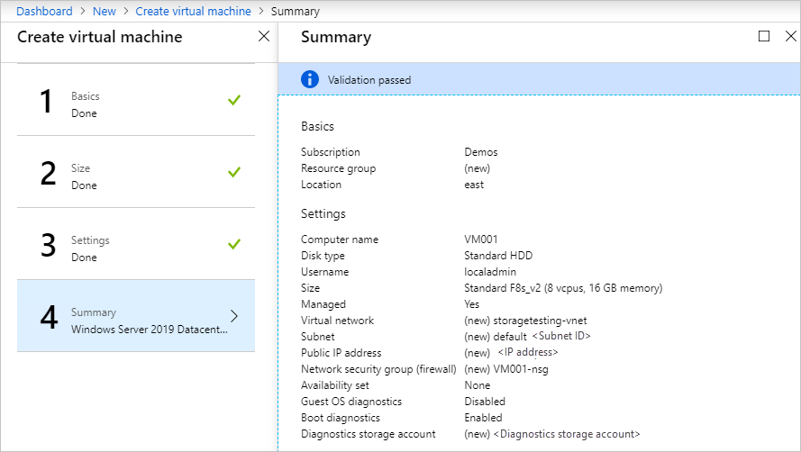

11. Read the summary, wait for validation, then select **OK** to begin the deployment. The deployment should complete in around 10 minutes.

12. Once the deployment has completed, under **Resource** Select the virtual machine name, **VM001** to go to the *Overview* blade.
    
    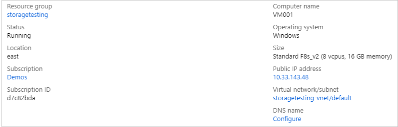

13. Under DNS name, select **Configure** and provide a DNS name label, **vm001, and select **Save**, then select **VM001** in the breadcrumb to return to the *Overview* blade.

14. On the right-hand side of the overview blade, select **storagetesting-vnet/default** under the Virtual network/subnet text.

15. Within the storagetesting-vnet blade, select **Subnets** then **+Subnet**, then in the new Add Subnet blade, enter the following information: 

    a.  **Name**: subnet2

    b.  **Address range (CIDR block)**: 10.10.11.0/24

    c. **Network Security Group**: None

    d.  **Route table**: None

    e. Select **OK**:

16. Once saved, select **VM001** in the breadcrumb to return to the overview blade.

17. Select **Networking**.

18. Select **Attach network interface** and then select **Create network interface**.

19. On the **Create network interface** blade:

    a.  **Name**: vm001nic2

    b.  **Subnet**: Ensure subnet is 10.10.11.0/24

    c. **Network security group**: VM001-nsg

    d.  **Resource group**: storagetesting

20. Once successfully created, select **VM001** in the breadcrumb and select **Stop** to shut down the VM.

21. Once the VM stops (deallocated), select **Networking**, select **Attach network interface** and then select **vm001nic2**, then select **OK**. You will add additional NIC to the VM in a few moments.

22. While on the **Networking** blade, select the **vm001nic2** tab, then select **Network Interface:vm001nic2**.

23. On the vm001nic interface blade, select **IP configurations**, and in the center of the blade, select **ipconfig1**.

24. On the ipconfig1 settings blade, select **Enabled** for Public IP address and select **Configure required settings**, **Create new,** and enter vm001nic2pip for the name, select **Static** and select **OK** then **Save**.

25. Once successfully saved, return to the VM001 overview blade, and select **Start** to start your configured Windows Server 2019 VM.

### Configure the Windows Server 2019 file server storage

For this first example, you're validating a configuration where the Windows Server 2019 file server is a virtual machine running on Hyper-V. This virtual machine will be configured with eight virtual processors, a single VHDX file, and most importantly, two virtual network adapters. In an ideal scenario, these network adapters will have different routable subnets, but in this test, they will have network adapters on the same subnet.

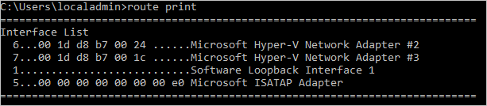

For your file server, it could be Windows Server 2016 or 2019, physical or virtual, running on Hyper-V, VMware, or an alternative platform of your choice. The key focus here, is connectivity into and out of the Azure Stack system, however having multiple paths between the source and destination is preferably, as it provides additional redundancy, and allows the use of more advanced capabilities to drive increased performance, such as SMB Multichannel.

Update your file server with the latest cumulative updates and fixes, rebooting before proceeding with the configuration of file shares.

Once updated and rebooted, you can now configure this server as a file server.

1) On your file server machine, run **ipconfig /all** from **CMD** and make a note of the **DNS Server** your file server is using.

2)  Open **Server Manager** and select **Manage**, then **Add Roles and Features**.

3)  Select **Next**, select **Role-based or feature-based installation**, and advance through the selections until you reach the **Select server roles** page.

4)  Expand **File and Storage Services**, expand **File & iSCSI Services** and select **File Server**. Once completed, close **Server Manager**.

5)  Reopen **Server Manager** and select **File and Storage Services**.

6)  Select **Shares**.

7)  In the **Shares box**, select **To create a file share, start the New Share Wizard** link.

8)  In the **New Share Wizard** box, select **SMB Share – Quick**, then select **Next**, and advance through the wizard, selecting the **C:\\\\ Volume**.

9)  Give the share a name, **TestStorage** then select **Next**.

10) Back in the **New Share Wizard**, select **Next** and then **Create**, then **Close**.

You have now created your file share on your file server.

### Testing file storage performance and connectivity

To check communication and run some rudimentary tests, sign in to the Azure Stack user portal on your **Azure Stack** system and navigate to the **overview** blade for **VM001**.

1)  Select **Connect** to establish an RDP connection into VM001.

2)  In order to communicate via Hostname, you're going to edit the **Hosts** file; however, in a production environment, DNS would be optimally configured such that names would automatically resolve. You could also use IP addresses. For our example, though, you'll edit the **Hosts** file.

3)  Open **Notepad**, making sure you **Run as Administrator**.

4)  Once you have Notepad open, select **File**, **Open** and browse to c:\\Windows\System32\Drivers\etc\, and select **All Files** in the bottom-right corner of the open dialog box. Select the **hosts** file and select **Open**.

5)  Edit your hosts file, by adding an IP address and DNS name for your file server.

    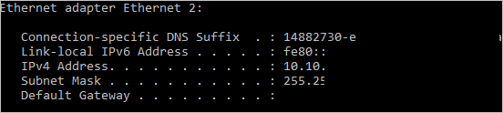

6)  Save the file, and close Notepad.

7)  Open **CMD** and ping the name of the file server that you entered in the hosts file. This should return the IP address of one of the network adapters on the file server, so manually test the communication to the other adapter, by pinging the IP address.

## Connect to a Windows Server iSCSI Target Server

In this scenario, you will deploy and configure a Windows Server 2019 virtual machine on Azure Stack and prepare it to connect to an external iSCSI Target Server, which will also be running Windows Server 2019.

> [!Note]  
> If you have already completed scenario one, skip ahead to customize your machines.

### Deploy the Windows Server 2019 VM on Azure Stack

If you haven't already deployed the Windows Server 2019 VM on Azure Stack, follow the steps at [Deploy the Windows Server 2019 VM on Azure Stack](#deploy-the-windows-server-2019-vm-on-azure-stack). Then you can configure the Windows Server 2019 iSCSI target.

### Configure the Windows Server 2019 iSCSI target

For the purpose of this second scenario, validate a configuration where the Windows Server 2019 iSCSI Target is a virtual machine running on Hyper-V. This virtual machine will be configured with eight virtual processors, a single VHDX file, and most importantly, two virtual network adapters. In an ideal scenario, these network adapters will have different routable subnets, but in this test, you'll have network adapters on the same subnet.

For your iSCSI Target, it could be Windows Server 2016 or 2019, physical or virtual, running on Hyper-V, VMware, or an alternative platform of your choice. The key focus here, is connectivity into and out of the Azure Stack system, however having multiple paths between the source and destination is preferably, as it provides additional redundancy and throughput.

Update your file server with the latest cumulative updates and fixes, rebooting before proceeding with the configuration of the iSCSI Target Server.

Once updated and rebooted, you can now configure this server as an iSCSI Target Server.

1. Open **Server Manager** > **Manage** > **Add Roles and Features**.

2. Once opened, select **Next**, select **Role-based or feature-based installation**, and advance through the selections until you reach the **Select server roles** page.

3. Expand **File and Storage Services**, expand **File & iSCSI Services** and select the **iSCSI Target Server**, accept prompts to add new features, then advance through to completion.

    
    
    Once completed, close the **Server Manager.**

4. Open **File Explorer,** navigate to `C:\\` and **create a new folder**, called `iSCSI`.

5. Reopen **Server Manager** > **File and Storage Services** from the left-hand menu.

6. Select **iSCSI** and select the "**To create an iSCSI virtual disk, start the New iSCSI Virtual Disk Wizard**.

7. On the **Select iSCSI virtual disk location** page, select **Type a custom path** and browse to your `C:\\iSCSI`. Select **Next**.

8. Give the iSCSI virtual disk a name of `iSCSIdisk1` and optionally, a description, then select **Next**.

9. Set the size of the virtual disk to `10GB` and select **Fixed size** and select **Next**.

    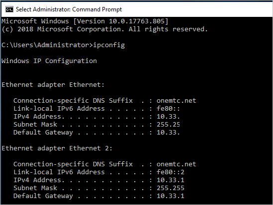

10. Since this is a new target, select **New iSCSI target** and select **Next**.

11. On the **Specify target name** page, enter **TARGET1** and select **Next**.

12. On the **Specify access servers** page, select **Add**. This opens a dialog to enter specific **initiators** that will be authorized to connect to the iSCSI Target.

13. Select **Enter a value for the selected type** in **Add initiator ID window** and under **Type** ensure IQN is selected in the drop-down menu. Enter `iqn.1991-05.com.microsoft:<computername>` where `<computername>` is the **computer name** of **VM001**. Select **Next**.

    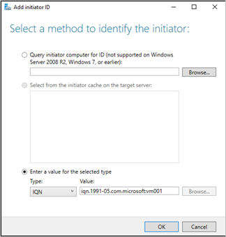

14. On the **Enable Authentication** page, leave the boxes blank, then select **Next**.

15. Confirm your selections and select **Create**, then close.

    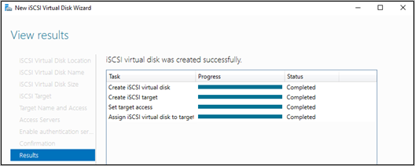

You should see your iSCSI virtual disk created in Server Manager.

### Configure the Windows Server 2019 iSCSI Initiator and MPIO

To set up the iSCSI Initiator, sign in to the **user portal** on your **Azure Stack** system and navigate to the **overview** blade for **VM001.**.

1.  Establish an RDP connection to VM001. Once connected, open **Server Manager**.

2.  Select **Add roles and features**, and accept the defaults until you reach the **Features** page.

3.  On the **Features** page, add **Multipath I/O** and select **Next**.

    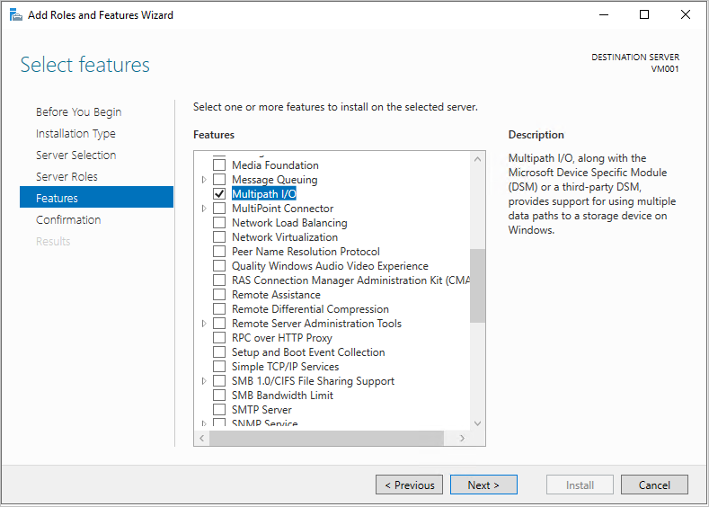

4.  Tick the **Restart the destination server automatically if necessary** box and select **Install**, then select **Close.** A reboot will most likely be required, so once completed, reconnect to VM001.

5.  Back in **Server Manager**, wait for the **MPIO install to complete**, select **close**, then select **Tools** and select **MPIO**.

6.  Select the **Discover Multi-Paths** tab, and select the box to **Add support for iSCSI devices** > **Add**, then select **Yes** to **reboot** VM001. Select **OK,** then manually reboot.

    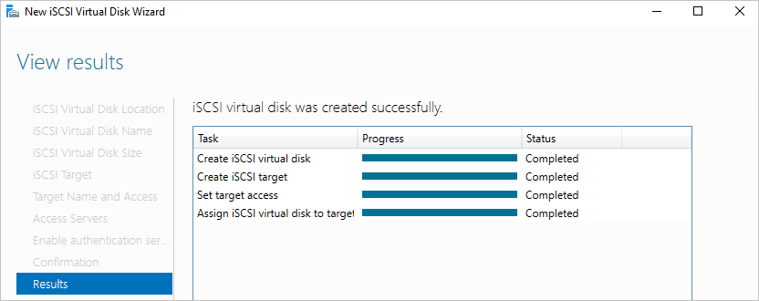

1.  Once rebooted, establish a **new RDP connection to VM001**.

2.  Once connected, open **Server Manager**, select **Tools** > **iSCSI Initiator**.

3.  Select **Yes** when the Microsoft iSCSI opens to allow the iSCSI service to run by default.

    

4.  Select the **Discovery** tab.

5.  Select the **Discover Portal** button. You will now add two targets.

6.  Enter the first IP address of your iSCSI Target server, and select **Advanced**.

    

7. Select the following for **Advanced Settings**:

    - Local adapter: Microsoft iSCSI Initiator

    - Initiator IP: 10.10.10.4

    - When set, select **OK**.

8.  Select **OK** in **Discover Target Portal**.

9.  Repeat the process with the following:

    - IP address: Your second iSCSI Target IP address

    - Local adapter: Microsoft iSCSI Initiator

    - Initiator IP: 10.10.11.4

10. Your target portals should look like this, with your own iSCSI Target IPs under the **Address** column.

    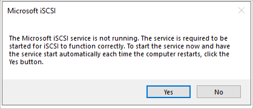

11. Select the **Targets** tab and then select your iSCSI Target. Select **Connect**.

12. Select **Enable multi-path** in **Connect to target**, and select **Advanced**.

    

13. For **Connect to Target**, enter the following information:

    - Local adapter: Microsoft iSCSI Initiator

    - Initiator IP: 10.10.10.4

    - Target portal IP: \<your first iSCSI Target IP / 3260>

    - Select **OK**.

    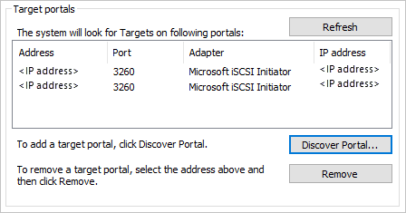

1.  Repeat the process for the second initiator/target combination.

    - Local adapter: Microsoft iSCSI Initiator

    - Initiator IP: 10.10.11.4

    - Target portal IP: \<your second iSCSI Target IP / 3260>

    

1.  Select the **Volumes and Devices** tab, and then select **Auto Configure** – you should see an MPIO volume presented:

    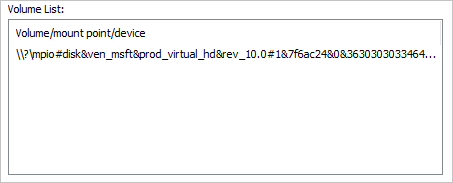

2.  Back on the **Targets** tab, select **Devices** and you should see two connections to the single iSCSI VHD you created earlier.

    

3.  Select the **MPIO button** to see more information about the load-balancing policy and paths.

    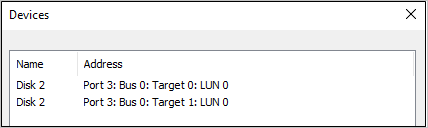

4.  Select **OK** three times to exit the windows and the iSCSI Initiator.

5.  Open Disk Management (diskmgmt.msc) and you should be prompted with an **Initialize Disk** pop-up.

    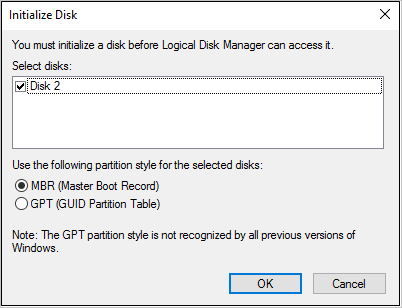

6.  Select **OK** to accept the defaults, then scroll down to the new disk, right-click, and select **New Simple Volume**.

7.  Walk through the wizard, accepting the defaults. Change the Volume label to **iSCSIdisk1** and then select **Finish**.

    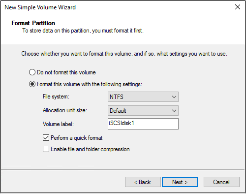

8.  The drive should then be formatted and presented with a drive letter.

9.  Open **File Explorer** > **This PC** to see your new drive attached to VM001.

### Test External Storage Connectivity

To validate communication and run a rudimentary file copy test, sign in to the **user portal** on your **Azure Stack** system and navigate to the **overview** blade for **VM001**.

1. Select **Connect** to establish an RDP connection into **VM001**.

2. Open **Task Manager** and then select the **Performance** tab. Snap the window to the right-hand side of the RDP session.

3. Open **Windows PowerShell ISE** as administrator and snap it to the left-hand side of the RDP session. On the right-hand side of the ISE, close the **Commands** pane, and select the **Script** button, to expand the white script pane at the top of the ISE window.

4. In this VM, there are no native PowerShell modules to create a VHD, which you will use as a large file to test the file transfer to the iSCSI Target. In this case, you will run DiskPart to create a VHD file. In the ISE, run the following:

    1. `Start-Process Diskpart`

    2. A new CMD prompt opens. Enter the following cmd: `Create vdisk file="c:\\test.vhd" type=fixed maximum=5120`

    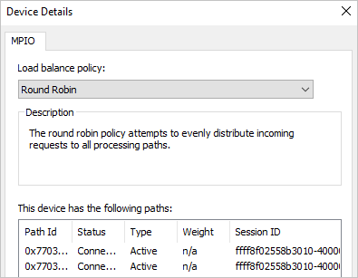

    This will take a few moments to create. Once created, to validate the creation, open **File Explorer** and navigate to C:\\ - you should see the new test.vhd present, and a size of 5 GB.

    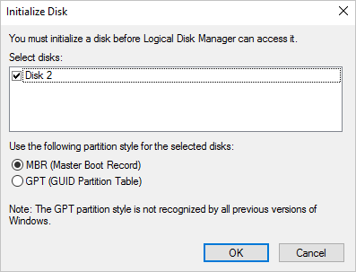

    Close the CMD prompt. Return to the ISE, Enter the following command in the ISE. Replace F:\\ with the iSCSI Target drive letter that was applied earlier.

    1. `Copy-Item "C:\\test.vhd" -Destination "F:\\"`

    2. Select the line in the ISE. Press **F8** on your keyboard.

    3. While the command runs, watch the two network adapters and see the transfer of data taking place across both network adapters in VM001. You should also notice that each network adapter should share the load evenly.

        

This scenario was designed to highlight the connectivity between a workload running on Azure Stack, and an external storage array, in this case, a Windows Server-based iSCSI Target. This wasn’t designed to be a performance test, nor be reflective of the steps you’d need to perform if you were using an alternative iSCSI-based appliance, however it does highlight some of the core considerations you’d make when deploying workloads on Azure Stack, and connecting them to storage systems outside of the Azure Stack environment.

## Next Steps

[Differences and considerations for Azure Stack networking](azure-stack-network-differences.md)  