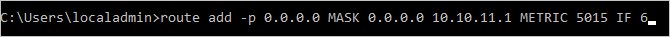
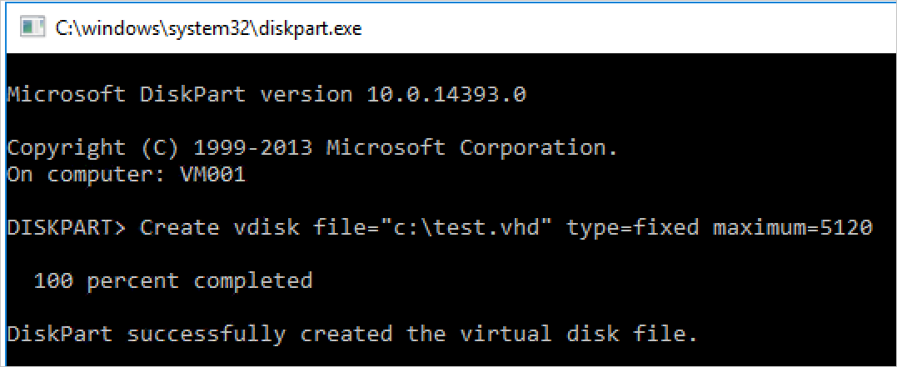
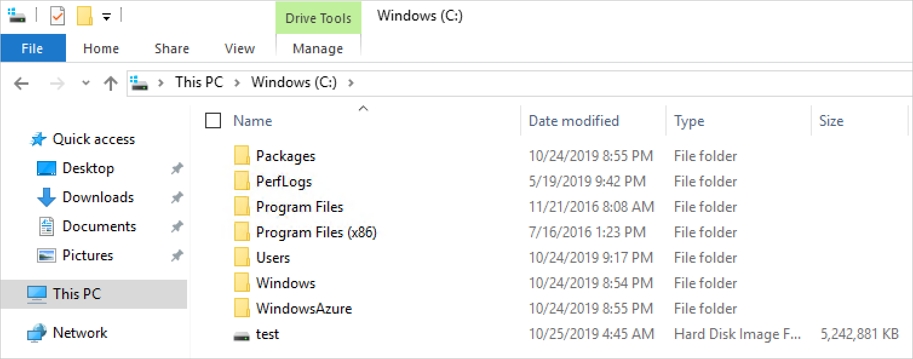

# Extending storage to Azure Stack Hub

This article provides Azure Stack Hub storage infrastructure information to help you decide how to integrate Azure Stack Hub into your existing networking environment. After providing a general discussion of extending your datacenter, the article presents two different scenarios. You can connect to a Windows file storage server. You can also connect to a Windows iSCSI server.

## Overview of extending storage to Azure Stack Hub

There are scenarios where having your data located in the public cloud isn’t enough. Perhaps you have a compute-intensive virtualized database workload, sensitive to latencies, and the round-trip time to the public cloud could affect performance of the database workload. Perhaps there is data on premises, held on a file server, NAS, or iSCSI storage array, which needs to be accessed by on-premises workloads, and needs to reside on-premises to meet regulatory or compliance goals. These are just two of the scenarios where having data reside on-premises, remains important for many organizations.

So, why not just host that data in storage accounts on Azure Stack Hub, or inside virtualized file servers, running on the Azure Stack Hub system? Well, unlike in Azure, Azure Stack Hub storage is finite. The capacity you have available for your usage depends entirely on the per-node capacity you chose to purchase, in addition to the number of nodes you have. And because Azure Stack Hub is a Hyper-Converged solution, should you wish to grow your storage capacity to meet usage demands, you also need to grow your compute footprint through the addition of nodes. This can be potentially cost prohibitive, especially if the need to extra capacity is for cold, archival storage that could be added for low cost outside of the Azure Stack Hub system.

Which brings you to the scenario that you will cover below. How can you connect Azure Stack Hub systems, virtualized workloads running on the Azure Stack Hub, simply and efficiently, to storage systems outside of the Azure Stack Hub, accessible via the network.

### Design for extending storage

The diagram depicts a scenario, where a single virtual machine, running a workload, connects to, and utilizes external (to the VM, and the Azure Stack Hub itself) storage, for purposes of data reading/writing etc. For this article, you'll focus on simple retrieval of files, but you can expand this example for more complex scenarios, such as the remote storage of database files.


In the diagram, you’ll see that the VM on the Azure Stack Hub system has been deployed with multiple NICs. From both a redundancy, but also a storage best practice, it’s important to have multiple paths between target and destination. Where things become more complex, are where VMs in Azure Stack Hub have both public and private IPs, just like in Azure. If the external storage needed to reach the VM, it can only do so via the public IP, as the Private IPs are primarily used within the Azure Stack Hub systems, within vNets and the subnets. The external storage would not be able to communicate with the private IP space of the VM, unless it passes through a Site to Site VPN, to punch into the vNet itself. So, for this example, we’ll focus on communication via the public IP space. One thing to notice with the public IP space in the diagram, is that there are 2 different public IP pool subnets. By default, Azure Stack Hub requires just one pool for public IP address purposes, but something to consider, for redundant routing, may be to add a second. However, at this time, it is not possible to select an IP address from a specific pool, so you may indeed end up with VMs with public IPs from the same pool across multiple virtual network cards.

For the purposes of this discussion, we will assume that the routing between the border devices and the external storage is taken care of, and traffic can traverse the network appropriately. For this example, it doesn’t matter if the backbone is 1GbE, 10GbE, 25 GbE or even faster, however this would be important to consider as you plan for your integration, to address the performance needs of any applications accessing this external storage.

## Connect to a Windows Server iSCSI Target

In this scenario, we will deploy and configure a Windows Server 2019 virtual machine on Azure Stack Hub and prepare it to connect to an external iSCSI Target, which will also be running Windows Server 2019. Where appropriate we will enable key features such as MPIO, to optimize performance and connectivity between the VM and external storage.

### Deploy the Windows Server 2019 VM on Azure Stack Hub

1.  From your **Azure Stack Hub administration portal**, assuming this system has been correctly registered and is connected to the marketplace, select **Marketplace Management,** then, assuming you don’t already have a Windows Server 2019 image, select **Add from Azure** and then search for **Windows Server 2019**, adding the **Windows Server 2019 Datacenter** image.

    

    Downloading a Windows Server 2019 image may take some time.

2.  Once you have a Windows Server 2019 image in your Azure Stack Hub environment, **sign into the Azure Stack Hub user portal**.

3.  Once logged into the Azure Stack Hub user portal, ensure you have a [subscription to an offer](https://docs.microsoft.com/azure-stack/operator/azure-stack-subscribe-plan-provision-vm?view=azs-1908), that allows you to provision IaaS resources (Compute, Storage and Network).

4.  Once you have a subscription available, back on the **dashboard** in the Azure Stack Hub user portal, select **Create a resource**, select **Compute** and then select the **Windows Server 2019 Datacenter gallery item**.

5.  On the **Basics** blade, complete the information as follows:

    a.  **Name**: VM001

    b.  **Username**: localadmin

    c.  **Password** and **Confirm password**: \<password of your choice>

    d.  **Subscription**: \<subscription of your choice, with compute/storage/network resources>.

    e.  **Resource group**: storagetesting (create new)

    f.  Select **OK**

6.  On the **Choose a size** blade, select a **Standard_F8s_v2** and select **Select**.

7.  On the **Settings** blade, select the **Virtual network** and in the **Create virtual network** blade, adjust the address space to be **10.10.10.0/23** and update the Subnet address range to be **10.10.10.0/24** then select **OK**.

8.  Select the **Public IP address**, and in the **Create public IP address** blade, select the **Static** radio button.

9.  On the **Select public inbound ports** dropdown, select **RDP (3389)**.

10. Leave the other defaults and select **OK**.

    

11. Read the summary, wait for validation, then select **OK** to begin the deployment. The deployment should complete in around 10 minutes.

12. Once the deployment has completed, under **Resource** select the virtual machine name, **VM001** to open **Overview**.

    

13. Under DNS name, select **Configure** and provide a DNS name label, **vm001** and select **Save**, then select **VM001**.

14. On the right-hand side of the overview blade, select **storagetesting-vnet/default** under the Virtual network/subnet text.

15. Within the storagetesting-vnet blade, select **Subnets** then **+Subnet**, then in the new Add Subnet blade, enter the following information, then select **OK**:

    a.  **Name**: subnet2

    b.  **Address range (CIDR block)**: 10.10.11.0/24

    c.  **Network Security Group**: None

    d.  **Route table**: None

16. Once saved, select **VM001**.

17. From the left-hand side of the overview blade, select **Networking**.

18. Select **Attach network interface** and then select **Create network interface**.

19. On the **Create network interface** blade, enter the following information.

    a.  **Name**: vm001nic2

    b.  **Subnet**: Ensure subnet is 10.10.11.0/24

    c.  **Network security group**: VM001-nsg

    d. **Resource group**: storagetesting

20. Once successfully attached, select **VM001**  and select **Stop** to shut down the VM.

21. Once the VM is stopped (deallocated), on the left-hand side of the overview blade, select **Networking**, select **Attach network interface** and then select **vm001nic2**, then select **OK**. The additional NIC will be added to the VM in a few moments.

22. Still on the **Networking** blade, select the **vm001nic2** tab, then select **Network Interface:vm001nic2**.

23. On the vm001nic interface blade, select **IP configurations**, and in the center of the blade, select **ipconfig1**.

24. On the ipconfig1 settings blade, select **Enabled** for Public IP address and select **Configure required settings**, **Create new,** and enter vm001nic2pip for the name, select **Static** and select **OK** then **Save**.

25. Once successfully saved, return to the VM001 overview blade, and select **Start** to start your configured Windows Server 2019 VM.

26. Once started, **establish an RDP session** into the VM001.

27. Once connected inside the VM, open **CMD** (as administrator) and enter **hostname** to retrieve the computer name of the OS. **It should match VM001**. Make a note of this for later.

### Configure second network adapter on Windows Server 2019 VM on Azure Stack Hub

By default, Azure Stack Hub assigns a default gateway to the first (primary) network interface attached to the virtual machine. Azure Stack Hub does not assign a default gateway to additional (secondary) network interfaces attached to a virtual machine. Therefore, you are unable to communicate with resources outside the subnet that a secondary network interface is in, by default. Secondary network interfaces can, however, communicate with resources outside their subnet, though the steps to enable communication are different for different operating systems.

1.  If you do not already have a connection open, establish an RDP connection into **VM001**.

2.  Open **CMD** as administrator and run **route print** which should return the two interfaces (Hyper-V Network Adapters) inside this VM.

    

3.  Now run **ipconfig** to see which IP address is assigned to the secondary network interface. In this example, 10.10.11.4 is assigned to interface 6. No default gateway address is returned for the secondary network interface.

    

4.  To route all traffic destined for addresses outside the subnet of the secondary network interface to the gateway for the subnet, run the following command from the **CMD:**.

    ```CMD  
    route add -p 0.0.0.0 MASK 0.0.0.0 <ipaddress> METRIC 5015 IF <interface>
    ```

    The `<ipaddress>` is the .1 address of the current subnet, and `<interface>` is the interface number.

    

5.  To confirm the added route is in the route table, enter the **route print** command.

    

6.  You can also validate outbound communication by running a ping command:  
    `ping 8.8.8.8 -S 10.10.11.4`  
    The `-S` flag allows you to specify a source address, in this case, 10.10.11.4 is the IP address of the NIC that now has a default gateway.

7.  Close **CMD**.

### Configure the Windows Server 2019 iSCSI Target

For the purpose of this scenario, you’ll be validating a configuration where the Windows Server 2019 iSCSI Target is a virtual machine running on Hyper-V, outside of the Azure Stack Hub environment. This virtual machine will be configured with 8 virtual processors, a single VHDX file, and most importantly, 2 virtual network adapters. In an ideal scenario, these network adapters will have different routable subnets, but in this validation, they will have network adapters on the same subnet.


For your iSCSI Target server, it could be Windows Server 2016 or 2019, physical or virtual, running on Hyper-V, VMware, or an alternative appliance of your choice, such as a dedicated physical iSCSI SAN. The key focus here, is connectivity into and out of the Azure Stack Hub system, however having multiple paths between the source and destination is preferably, as it provides additional redundancy, and allows the use of more advanced capabilities to drive increased performance, such as MPIO.

I’d encourage you to update your Windows Server 2019 iSCSI Target with the latest cumulative updates and fixes, rebooting if necessary, before proceeding with the configuration of file shares.

Once updated and rebooted, you can now configure this server as an iSCSI Target.

1.  Open **Server Manager** and select **Manage**, then **Add Roles and Features**.

2.  Once opened, select **Next**, select **Role-based or feature-based installation**, and proceed through the selections until you reach the **Select server roles** page.

3.  Expand **File and Storage Services**, expand **File & iSCSI Services** and tick the **iSCSI Target Server** box, accepting any popup prompts to add new features, then proceed through to completion.

    

    Once completed, close **Server Manager.**

4.  Open **File Explorer,** navigate to C:\\ and **create a new folder**, called **iSCSI**.

5.  Reopen **Server Manager** and select **File and Storage Services** from the left-hand menu.

6.  Select **iSCSI** and select the "**To create an iSCSI virtual disk, start the New iSCSI Virtual Disk Wizard**" link on the right pane. select it. A wizard pops-up.

7.  On the **Select iSCSI virtual disk location** page, select the radio button for **Type a custom path** and browse to your **C:\\iSCSI** and select **Next**.

8.  Give the iSCSI virtual disk a name of **iSCSIdisk1** and optionally, a description, then select **Next**.

9.  Set the size of the virtual disk to **10GB** and select **Fixed size** and select **Next**.

    

10) Since this is a new target, select **New iSCSI target** and select **Next**.

11) On the **Specify target name** page, enter **TARGET1** and select **Next**.

12) On the **Specify access servers** page, select **Add**. This opens a dialog to enter specific **initiators** that will be authorized to connect to the iSCSI Target.

13) In the **Add initiator ID window**, select **Enter a value for the selected type** and under **Type** ensure IQN is selected in the drop-down menu. Enter **iqn.1991-05.com.microsoft:\<computername>** where \<computername> is the **computer name** of **VM001** then select **Next**.

    

14) On the **Enable Authentication** page, leave the boxes blank, then select **Next**.

15) Confirm your selections and select **Create**, then close. You should see your iSCSI virtual disk created in Server Manager.

    

### Configure the Windows Server 2019 iSCSI Initiator and MPIO

To set up the iSCSI Initiator, firstly, log back into the **Azure Stack Hub user portal** on your **Azure Stack Hub** system and navigate to the **overview** blade for **VM001.**

1.  Establish an RDP connection to VM001. Once connected, open **Server Manager**.

2.  Select **Add roles and features**, and accept the defaults until you reach the **Features** page.

3.  On the **Features** page, add **Multipath I/O** and select **Next**.

    

4.  Tick the **Restart the destination server automatically if required** box and select **Install**, then select **Close.** A reboot will most likely be required, so once completed, reconnect to VM001.

5.  Back in **Server Manager**, wait for the **MPIO install to complete**, select **close**, then select **Tools** and select **MPIO**.

6.  Select the **Discover Multi-Paths** tab, and tick the box to **Add support for iSCSI devices** and select **Add**, then select **Yes** to **reboot** VM001. If you don’t receive a window, select **OK,** then reboot manually.

    

7.  Once rebooted, establish a **new RDP connection to VM001**.

8.  Once connected, open **Server Manager**, select **Tools** and select **iSCSI Initiator**.

9.  When a Microsoft iSCSI window pops up, select **Yes** to allow the iSCSI service to run by default.

    

10. In the iSCSI Initiator properties window, select the **Discovery** tab.

11. You will now add 2 Targets, so first select the **Discover Portal** button.

12. Enter the first IP address of your iSCSI Target server, and select **Advanced**.

    

13. In the **Advanced Settings** window, select the following, then select **OK**.

    a.  **Local adapter**: Microsoft iSCSI Initiator.

    b.  **Initiator IP**: 10.10.10.4.

14. Back in the **Discover Target Portal** window, select **OK**.

15. Repeat the process with the following:

    a. ** IP address**: Your second iSCSI Target IP address.

    b.  **Local adapter**: Microsoft iSCSI Initiator.

    c.  **Initiator IP**: 10.10.11.4.

16. Your target portals should look like this, with your own iSCSI Target IPs under the **Address** column.

    

17. Back on the **Targets** tab, select your iSCSI Target from the middle of the window, and select **Connect**.

18. In the **Connect to target** window, select the **Enable multi-path** tick box, and select **Advanced**.

    

19. Enter the following information and select **OK**, then in the **Connect to Target** window, select **OK**.

    a.  **Local adapter**: Microsoft iSCSI Initiator.

    b.  **Initiator IP**: 10.10.10.4.

    c.  **Target portal IP**: \<your first iSCSI Target IP / 3260>.


1.  Repeat the process for the second initiator/target combination.

    a. ** Local adapter**: Microsoft iSCSI Initiator.

    b.  **Initiator IP**: 10.10.11.4.

    c.  **Target portal IP**: \<your second iSCSI Target IP / 3260>.

        

2.  Select the **Volumes and Devices** tab, and then select **Auto Configure** – you should see an MPIO volume presented:

    

3.  Back on the **Targets** tab, select **Devices** and you should see 2 connections to the single iSCSI VHD you created earlier.

    

4.  Select the **MPIO button** to see more information about the load-balancing policy and paths.

    

5.  Select **OK** three times to exit the windows and the iSCSI Initiator.

6.  Open Disk Management (diskmgmt.msc) and you should be prompted with an **Initialize Disk** window.

    

7.  Select **OK** to accept the defaults, then scroll down to the new disk, right-click, and select **New Simple Volume**

8.  Walk through the wizard, accepting the defaults. Change the Volume label to **iSCSIdisk1** and then select **Finish**.

    

9.  The drive should then be formatted and presented with a drive letter.

10. Open **File Explorer** and select **This PC** to see your new drive attached to VM001.

### Testing external storage connectivity

To validate communication and run a rudimentary file copy test, firstly, log back into the **Azure Stack Hub user portal** on your **Azure Stack Hub** system and navigate to the **overview** blade for **VM001**

1.  Select **Connect** to establish an RDP connection into **VM001**

2.  Open **Task Manager** select the **Performance** tab, and then snap the window to the right-hand side of the RDP session.

3.  Open **Windows PowerShell ISE** as administrator and snap it to the left-hand side of the RDP session. On the right-hand side of the ISE, close the **Commands** pane, and select the **Script** button, to expand the white script pane at the top of the ISE window.

4.  In this VM, there are no native PowerShell modules to create a VHD, which we will use as a large file to test the file transfer to the iSCSI Target. In this case, we will run DiskPart to create a VHD file. In the ISE, run the following:

    1. `Start-Process Diskpart`

    2. A new CMD window will open, and then enter:  
        `**Create vdisk file="c:\\test.vhd" type=fixed maximum=5120**`
    
    
    
    3.  This will take a few moments to create. Once created, to validate the creation, open **File Explorer** and navigate to C:\\ - you should see the new test.vhd present, and a size of 5GB.

    

    4. Close the CMD window, and return to the ISE, then enter the following command in the script Window. Replace F:\\ with the iSCSI Target drive letter that was applied earlier.

    5. `Copy-Item "C:\\test.vhd" -Destination "F:\\"`

    6. Select the line in the script window, and press F8 to run.

    7. While the command is running, observe the two network adapters and see the transfer of data taking place across both network adapters in VM001. You should also notice that each network adapter should share the load evenly.

    

This scenario was designed to highlight the connectivity between a workload running on Azure Stack Hub, and an external storage array, in this case, a Windows Server-based iSCSI Target. This wasn’t designed to be a performance test, nor be reflective of the steps you’d need to perform if you were using an alternative iSCSI-based appliance, however it does highlight some of the core considerations you’d make when deploying workloads on Azure Stack Hub, and connecting them to storage systems outside of the Azure Stack Hub environment.

## Next steps

[Differences and considerations for Azure Stack Hub networking](azure-stack-network-differences.md)
