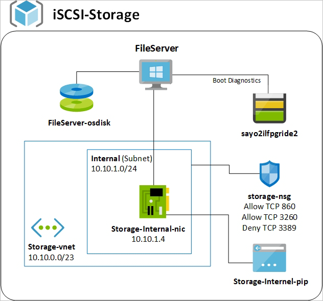
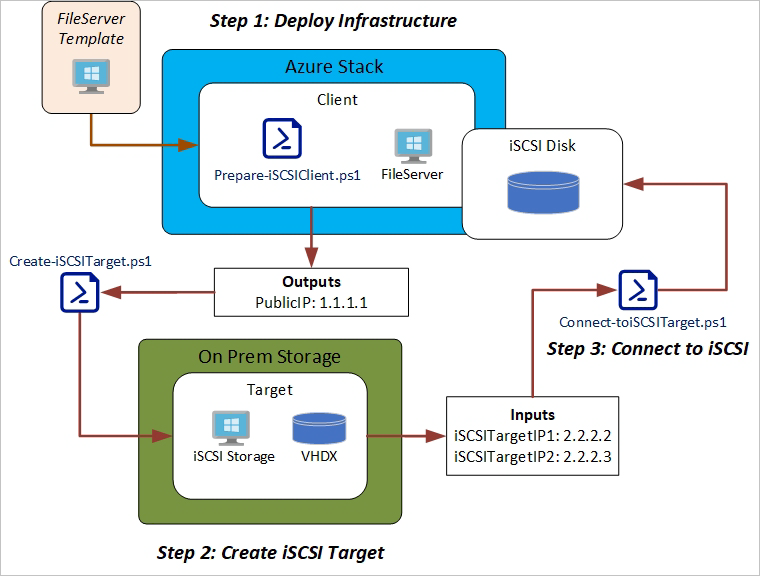
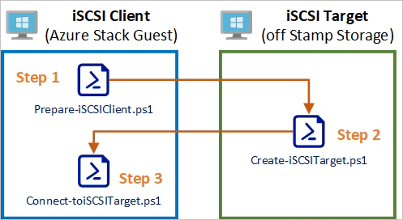

# How to connect to iSCSI storage with Azure Stack Hub

You can use the template in this article to connect an Azure Stack Hub virtual machine (VM) to an on-premises iSCSI target set up the VM to use storage hosted outside of our Azure Stack Hub and elsewhere in your datacenter. This article looks at using a Windows machine as the iSCSI target.

You can find the template in the **lucidqdreams** fork of [Azure Intelligent Edge Patterns](https://github.com/lucidqdreams/azure-intelligent-edge-patterns) GitHub repository. The template is in the **storage-iSCSI** folder. The template has been designed to set up up the infrastructure necessary on the Azure Stack Hub side to connect to an iSCSI target. This includes a virtual machine that will act as the iSCSI Initiator along with its accompanying VNet, NSG, PIP, and storage. After the template has been deployed, two PowerShell scripts need to be,  run to complete the configuration. One script will be run on the on-premises VM (target) and one will be run on the Azure Stack Hub VM (Initiator). Once these are completed, you will have on-premises storage added to your Azure Stack Hub VM. 

## Overview

The diagram shows a VM hosted on Azure Stack Hub with an iSCSI mounted disk from a Windows machine on premises (physical or virtual) allowing storage external to Azure Stack Hub to mount inside your Azure Stack Hub hosted VM over the iSCSI protocol.

### Requirements

- An on-premises machine (physical or virtual) running Windows Server 2016 Datacenter or Windows Server 2019 Datacenter.
- Required Azure Stack Hub Marketplace items:
    -  Windows Server 2016 Datacenter or Windows Server 2019 Datacenter (latest build recommended).
    -  PowerShell DSC extension.
    -  Custom Script Extension.
    -  An existing virtual or physical machine. Ideally this machine will have two network adapters. This could also be another iSCSI target such as a SAN for instance.

### Things to consider

- A Network Security Group is applied to the template Subnet. Review this and make additional allowances as needed.
- An RDP Deny rule is applied to the Tunnel NSG and will need to be set to allow if you intend to access the VMs via the Public IP address.
- This solution does not take into account DNS resolution.
- You should change your Chapusername and Chappassword. The Chappassword must be 12 to 16 characters in length.
- This template is using a static IP address for the VM as the iSCSI connection uses the local address in the configuration.
- This template is using BYOL Windows License.
- You can also connect Linux-based systems to the iSCSI targets. You can find instructions in the [iSCSI Initiator](https://help.ubuntu.com/lts/serverguide/iscsi-initiator.html) article in the ubuntu documentation.

### Options

- You can use your own Blob storage account and SAS token using the **_artifactsLocation** and **_artifactsLocationSasToken** parameters the ability to use your own storage blob with SAS token.
- This template provides default values for VNet naming and IP addressing.
- This configuration only has one iSCSI nic coming from the iSCSI client. We had tested a number of configurations to utilize separate subnets and NICs however ran into issues with multiple gateways and trying to create a separate storage subnet to isolate traffic and actually be truly redundant. 
- Be careful to keep these values within legal subnet and address ranges as deployment may fail. 
- The PowerShell DSC packages primary purpose is to check for pending reboots. This DSC can be customized further, if needed. For more information see [omputerManagementDsc](https://github.com/PowerShell/ComputerManagementDsc/).

### Resource group template (iSCSI client)

The diagram shows the resources deployed from the template to create the iSCSI client you can use to connect to the iSCSI target. This template will deploy the VM and other resources, In addition, it will run the prepare-iSCSIClient.ps1 and reboot the VM.

### The Deployment process

The resource group template generates output, which is meant to be the input for the next step. It is mainly focused on the server name and the Azure Stack Hub public IP address where the iSCSI traffic originates. For this example:

1. Deploy the infrastructure template.
2. Deploy an Azure Stack Hub VM to a VM hosted elsewhere in your datacenter. 
3. Run `Create-iSCSITarget.ps1` using the IP address and server name outputs from the template as in-out parameters for the script on the iSCSI target, which can be a virtual machine or physical server.
4. Use the external IP address or addresses of the iSCSI Target server as inputs to run the `Connect-toiSCSITarget.ps1` script. 

### Inputs for azuredeploy.json

|**Parameters**|**default**|**description**|
|------------------|---------------|------------------------------|
|WindowsImageSKU         |2019-Datacenter   |Please select the base Windows VM image
|VMSize                  |Standard_D2_v2    |Please enter the VM size
|VMName                  |FileServer        |VM name
|adminUsername           |storageadmin      |The name of the Administrator of the new VM
|adminPassword           |                  |The password for the Administrator account of the new VMs. Default value is subscription ID
|VNetName                |Storage           |The name of VNet. This will be used to label the resources
|VNetAddressSpace        |10.10.0.0/23      |Address Space for VNet
|VNetInternalSubnetName  |Internal          |VNet Internal Subnet Name
|VNetInternalSubnetRange |10.10.1.0/24      |Address Range for VNet Internal Subnet
|InternalVNetIP          |10.10.1.4         |Static Address for the internal IP of the File Server.
|_artifactsLocation      ||
|_artifactsLocationSasToken||

### Deployment steps

1. Deploy iSCSI client Infrastructure using `azuredeploy.json`
2. Run `Create-iSCSITarget.ps1` on the on-premises server iSCSI target. Once the template completes, you will need to run the Create-iSCSITarget.ps1 on the on-premises server iSCSI target with the outputs from the first step
3. Run `Connect-toiSCSITarget.ps1` on the on iSCSI client. un the Connect-toiSCSITarget.ps1 on the on iSCSI client with the details of the iSCSI target

## Adding iSCSI storage to existing VMs

You can also run the scripts on an existing Virtual Machine to connect from the iSCSI client to a iSCSI target. This flow is if you are creating the iSCSI target yourself. This diagram shows the execution flow of the PowerShell scripts. These scripts can be found in the Script directory:

### Prepare-iSCSIClient.ps1

The `Prepare-iSCSIClient.ps1` script installs the prerequisites on the iSCSI client, this includes;
- installation of Multipath-IO services
- setting the iSCSI initiator service start up to automatic
- enabling support for multipath MPIO to iSCSI
- Enable automatic claiming of all iSCSI volumes
- Set the disk timeout to 60 seconds

It is important to reboot the system after installation of these prerequisites. The MPIO load-balancing policy requires a reboot so that it can be set.

### Create-iSCSITarget.ps1

The `Create-iSCSITarget.ps1 `script is to be run on the system, which is serving the storage. You can create multiple disks and targets restricted by initiators. You can run this script multiple times to create many virtual disks you can attach to different targets. You can connect multi-disks to one target. 

|**Input**|**default**|**description**|
|------------------|---------------|------------------------------|
|RemoteServer         |FileServer               |The name of the server connecting to the iSCSI Target
|RemoteServerIPs      |1.1.1.1                  |The IP Address the iSCSI traffic will be coming from
|DiskFolder           |C:\iSCSIVirtualDisks     |The folder and drive where the virtual disks will be stored
|DiskName             |DiskName                 |The name of the disk VHDX file
|DiskSize             |5GB                      |The VHDX disk size
|TargetName           |RemoteTarget01           |The target name used to define the target configuration for the iSCSI client. 
|ChapUsername         |username                 |The username name for Chap authentication
|ChapPassword         |userP@ssw0rd!            |The password name for Chap authentication. It must be 12 to 16 characters

### Connect-toiSCSITarget.ps1

The `Connect-toiSCSITarget.ps1` is the final script, which is run on the iSCSI client and mounts the disk presented by the iSCSI target to the iSCSI client.

|**Input**|**default**|**description**|
|------------------|---------------|------------------------------|
|TargetiSCSIAddresses   |"2.2.2.2","2.2.2.3"    |The IP addresses of the iSCSI target
|LocalIPAddresses       |"10.10.1.4"            |This is internal IP Address the iSCSI traffic will be coming from
|LoadBalancePolicy      |C:\iSCSIVirtualDisks   |The IP Address the iSCSI traffic will be coming from
|ChapUsername           |username               |The username name for Chap authentication
|ChapPassword           |userP@ssw0rd!          |The password name for Chap authentication. It must be 12 to 16 characters

## Next steps

[Differences and considerations for Azure Stack Hub networking](azure-stack-network-differences.md)  