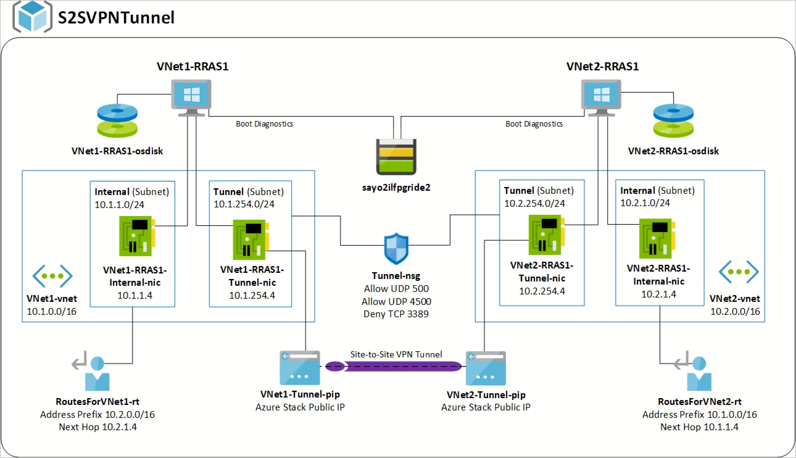

# VNET Peering in Azure Stack Hub with VMs

You can connect two Azure Stack Hub VNets to one another within the same Azure Stack Hub environment. It is not currently possible to connect Azure Stack Hub VNets using the built-in [Virtual Network Gateway](https://docs.microsoft.com/azure-stack/user/azure-stack-network-differences). You must use NVA appliances to create a VPN tunnel between two Azure Stack Hub VNets. In the template references in this article, two Windows Server 2016 VMs are deployed with RRAS installed. The two RRAS servers are configured to implement a S2SVPN IKEv2 tunnel between two VNETs. The appropriate NSG and UDR rules are created to allow routing between the subnets on each VNET designated as **internal**. 

This deployment pattern is the foundation that will allow VPN Tunnels to be created not only within an Azure Stack Hub instance but also between Azure Stack Hub Instances and to other resources such as on-premises networks with the use of the Windows RRAS S2S VPN Tunnels. 

You can find the templates in the [Azure Intelligent Edge Patterns GitHub](https://github.com/Azure-Samples/azure-intelligent-edge-patterns
) repository. The template is in the **S2SVPNTunnel** folder.

## Requirements

- A deployment with latest updates applied. 
- Required Azure Stack Hub Marketplace items:
    -  Windows Server 2016 Datacenter (latest build recommended)
	-  Custom Script Extension

## Things to consider

- A Network Security Group is applied to the template Tunnel Subnet. It is recommended to secure the internal subnet in each VNet with an additional NSG.
- An RDP Deny rule is applied to the Tunnel NSG and will need to be set to allow if you intend to access the VMs via the Public IP address
- This solution does not take into account DNS resolution
- The combination of VNet name and vmName must be fewer than 15 characters
- This template is designed to have the VNet names customized for VNet1 and VNet2
- This template is using BYOL windows
- When deleting the resource group, currently on (1907) you have to manually detach the NSGs from the tunnel subnet to ensure the delete resource group completes
- This template is using a DS3v2 vm. The RRAS service installs and run Windows internal SQL Server. This can cause memory issues if your VM size is too small. Validate performance before reducing the VM size.
- This is not a highly available solution. If you require a more HA style solution you can add a second VM, you would have to manually Change the route in the route table to the internal IP of the secondary interface. You would also need to configure the multiple Tunnels to cross connect.

## Options

- You can use your own Blob storage account and SAS token using the _artifactsLocation and _artifactsLocationSasToken parameters
- There are two outputs on this template INTERNALSUBNETREFVNET1 and INTERNALSUBNETREFVNET2, which is the Resource IDs for the internal subnets, if you want to use this in a pipeline style deployment pattern.

The template provides default values for VNet naming and IP addressing. It requires a password for the administrator (rrasadmin) and also offers the ability to use your own storage blob with SAS token. Be careful to keep these values within legal ranges as deployment may fail. The PowerShell DSC package is executed on each RRAS VM and installing routing and all required dependent services and features. This DSC can be customized further if needed. The custom script extension run the following script and `Add-Site2Site.ps1` configures the VPNS2S tunnel between the two RRAS servers with a shared key. You can view the detailed output from the custom script extension to see the results of the VPN tunnel configuration

## Next steps

[Differences and considerations for Azure Stack Hub networking](azure-stack-network-differences.md)  