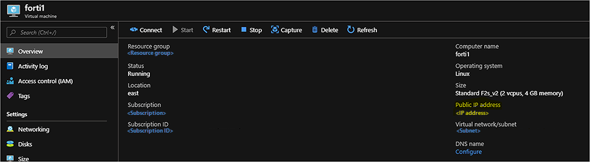
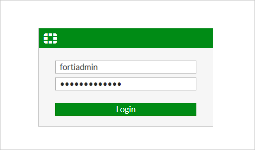
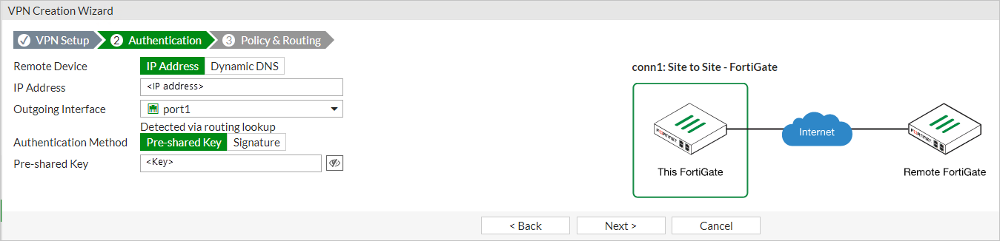
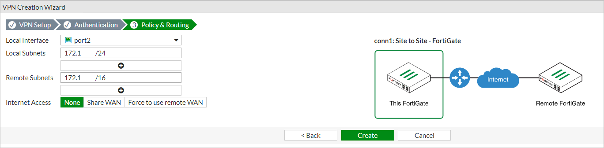
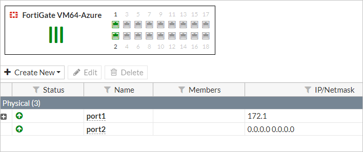
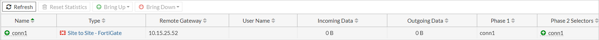

# Set up VPN gateway for Azure Stack Hub using FortiGate NVA

This article describes how to create a VPN connection to your Azure Stack Hub. A VPN gateway is a type of virtual network gateway that sends encrypted traffic between your virtual network in Azure Stack Hub and a remote VPN gateway. The procedure below deploys one VNET with a FortiGate NVA, a network virtual appliance, within a resource group. It also provides steps to set up an IPSec VPN on the FortiGate NVA.

## Prerequisites

-  Access to an Azure Stack Hub integrated systems with available capacity to deploy the required compute, network, and resource requirements needed for this solution. 

    > [!NOTE]  
    > These instructions will **not** work with an Azure Stack Development Kit (ASDK) because of the network limitions in the ASDK. For more information, see [ASDK requirements and considerations](../asdk/asdk-deploy-considerations.md).

-  Access to a VPN device in the on-premises network that hosts the Azure Stack Hub integrated system. The device needs to create an IPSec tunnel, which meets the parameters described in the [Deployment parameters](#deployment-parameters).

-  A network virtual appliance (NVA) solution available in your Azure Stack Hub Marketplace. An NVA controls the flow of network traffic from a perimeter network to other networks or subnets. This procedure uses the [Fortinet FortiGate Next-Generation Firewall Single VM Solution](https://azuremarketplace.microsoft.com/marketplace/apps/fortinet.fortinet-FortiGate-singlevm).

    > [!NOTE]  
    > If you do not have the **Fortinet FortiGate-VM For Azure BYOL** and **FortiGate NGFW - Single VM Deployment (BYOL)** available in your Azure Stack Hub Marketplace, contact your cloud operator.

-  To activate the FortiGate NVA, you will need at least one available FortiGate license file. Information on how to acquire these licenses, see the Fortinet Document Library article [Registering and downloading your license](https://docs2.fortinet.com/vm/azure/FortiGate/6.2/azure-cookbook/6.2.0/19071/registering-and-downloading-your-license).

    This procedure uses the [Single FortiGate-VM deployment](https://docs2.fortinet.com/vm/azure/FortiGate/6.2/azure-cookbook/6.2.0/632940/single-FortiGate-vm-deployment). You can find steps on how to connect the FortiGate NVA to the Azure Stack Hub VNET to in your on-premises network.

    For more information on how to deploy the FortiGate solution in an active-passive (HA) set up, see the details in the Fortinet Document Library article [HA for FortiGate-VM on Azure](https://docs2.fortinet.com/vm/azure/FortiGate/6.2/azure-cookbook/6.2.0/983245/ha-for-FortiGate-vm-on-azure).

## Deployment parameters

The following table summarizes the parameters that are used in these deployments for reference.

| Parameter | Value |
|-----------------------------------|---------------------------|
| FortiGate Instance Name | forti1 |
| BYOL License/Version | 6.0.3 |
| FortiGate administrative username | fortiadmin |
| Resource Group name | forti1-rg1 |
| Virtual network name | forti1vnet1 |
| VNET Address Space | 172.16.0.0/16* |
| Public VNET subnet name | forti1-PublicFacingSubnet |
| Public VNET address prefix | 172.16.0.0/24* |
| Inside VNET subnet name | forti1-InsideSubnet |
| Inside VNET subnet prefix | 172.16.1.0/24* |
| VM Size of FortiGate NVA | Standard F2s_v2 |
| Public IP address name | forti1-publicip1 |
| Public IP address type | Static |

> [!NOTE]
> \* Choose a different address space and subnet prefixes if `172.16.0.0/16` overlaps with the on-premises network or the Azure Stack Hub VIP pool.

## Deploy the FortiGate NGFW Marketplace items

1. Open the Azure Stack Hub user portal.

1. Select **Create a resource** and search for `FortiGate`.

    

1. Select the **FortiGate NGFW** and select **Create**.

1. Complete **Basics** using the parameters from the [Deployment parameters](#deployment-parameters) table.

    

1. Select **OK**.

1. Provide the Virtual network, Subnets, and VM Size details using the [Deployment parameters](#deployment-parameters) table.

    > [!Warning] 
    > If the on-premises network overlaps with the IP range `172.16.0.0/16`, you must select and set up a different network range and subnets. If you wish to use different names and ranges than the ones in the [Deployment parameters](#deployment-parameters) table, use parameters that will **not** conflict with the on-premises network. Take care when setting the VNET IP range and subnet ranges within the VNET. You do not want the range to overlap with the IP ranges that exist in your on-premises network.

1. Select **OK**.

1. Configure the Public IP for the FortiGate NVA:

    

1. Select **OK**. And then select **OK**.

1. Select **Create**.

    The deployment will take about 10 minutes.

## Configure routes (UDR) for the VNET

1. Open the Azure Stack Hub user portal.

2. Select Resource groups. Type `forti1-rg1` in the filter and double-click the forti1-rg1 resource group.

    

2. Select the 'forti1-forti1-InsideSubnet-routes-xxxx' resource.

3. Select **Routes** under **Settings**.

    

4. Delete the **to-Internet** Route.

    

5. Select *Yes*.

6. Select **Add** to add a new route.

7. Name the route `to-onprem`.

8. Enter the IP network range that defines the network range of the on-premises network to which the VPN will connect.

9. Select **Virtual appliance** for **Next hop type** and `172.16.1.4`. Use your IP range if you're using a different IP range.

    

10. Select **Save**.

## Activate the FortiGate NVA

Activate the FortiGate NVA and set up an IPSec VPN connection on each NVA.

To activate each FortiGate NVA will require a valid license file from Fortinet. The NVAs will **not** function until you have activated each NVA. For more information how to get a license file and steps to activate the NVA, see the Fortinet Document Library article [Registering and downloading your license](https://docs2.fortinet.com/vm/azure/FortiGate/6.2/azure-cookbook/6.2.0/19071/registering-and-downloading-your-license).

Once you've activated the NVAs, create an IPSec VPN tunnel on the NVA.

1. Open the Azure Stack Hub user portal.

2. Select Resource groups. Enter `forti1` in the filter and double-click the forti1 resource group.

3. Double-click the **forti1** virtual machine in the list of resource types in the resource group blade.

    

4. Copy the assigned IP address, open a browser, and paste the IP address into the address bar. The site may trigger a warning that the security certificate is not trusted. Continue anyway.

5. Enter the FortiGate administrative user name and password you provided during the deployment.

    

6. Select **System** > **Firmware**.

7. Select the box showing the latest firmware, for example, `FortiOS v6.2.0 build0866`.

    

8. Select **Backup config and upgrade** > **Continue**.

9. The NVA updates its firmware to the latest build and reboots. The process takes about five minutes. Log back into the FortiGate web console.

10. Click **VPN** > **IPSec Wizard**.

11. Enter a name for the VPN, for example, `conn1` in the **VPN Creation Wizard**.

12. Select **This site is behind NAT**.

    

13. Select **Next**.

14. Enter the remote IP address of the on-premises VPN device to which you're going to connect.

15. Select **port1** as the **Outgoing Interface**.

16. Select **Pre-shared Key** and enter (and record) a pre-shared key. 

    > [!NOTE]  
    > You will need this key to set up the connection on the on-premises VPN device, that is, they must match *exactly*.

    

17. Select **Next**.

18. Select **port2** for the **Local Interface**.

19. Enter the local subnet range:
    - forti1: 172.16.0.0/16
    - forti2: 172.17.0.0/16

    Use your IP range if you are using a different IP range.

20. Enter the appropriate Remote Subnet(s) that represent the on-premises network, which you will connect to through the on-premises VPN device.

    

21. Select **Create**

22. Select **Network** > **Interfaces**.

    

23. Double-click **port2**.

24. Choose **LAN** in the **Role** list and **DHCP** for the Addressing mode.

25. Select **OK**.

## Configure the on-premises VPN

The on-premises VPN device must be configured to create the IPSec VPN tunnel. The following table provides the parameters you will need to set up the on-premises VPN device. For information on how to configure the on-premises VPN device, refer tp the documentation for your device.

| Parameter | Value |
| --- | --- |
| Remote Gateway IP | Public IP address assigned to forti1 – see [Activate the FortiGate NVA](#activate-the-fortigate-nva). |
| Remote IP Network | 172.16.0.0/16 (if using the IP range in these instructions for the VNET). |
| Auth. Method = Preshared key (PSK) | From Step 16.
| IKE Version | 1 |
| IKE Mode | Main (ID protection) |
| Phase 1 Proposal Algorithms | AES128-SHA256, AES256-SHA256, AES128-SHA1, AES256-SHA1 |
| Diffie-Hellman Groups | 14, 5 |

## Create the VPN tunnel

Once the on-premises VPN device is appropriately configured, the VPN tunnel can now be established.

From the FortiGate NVA:

1. On the forti1 FortiGate web console, go to **Monitor** > **IPsec Monitor**.

    

2. Highlight **conn1** and select the **Bring Up** > **All Phase 2 Selectors**.

    

## Test and validate connectivity

You can route between the VNET network and the on-premises network via the on-premises VPN device.

To validate the connection:

1. Create a VM in the Azure Stack Hub VNETs and a system on the on-premises network. You can follow the instructions for creating a VM at [Quickstart: Create a Windows server VM with the Azure Stack Hub portal](./azure-stack-quick-windows-portal.md).

2. When creating the Azure Stack Hub VM and preparing the on-premises system, check:

-  The Azure Stack Hub VM is placed on the **InsideSubnet** of the VNET.

-  The on-premises system is placed on the on-premises network within the defined IP range as defined in the IPSec configuration. Also ensure that the on-premises VPN device's local interface IP address is provided to the on-premises system as a route that can reach the Azure Stack Hub VNET network, for example, `172.16.0.0/16`.

-  Do **not** apply any NSGs to the Azure Stack Hub VM on creation. You may need to remove the NSG that gets added by default if creating the VM from the portal.

-  Ensure that the on-premises system OS and Azure Stack Hub VM OS do not have OS firewall rules that would prohibit communication you are going to use to test connectivity. For testing purposes, it is recommended to disable the firewall completely within the operating system of both systems.

## Next steps

[Differences and considerations for Azure Stack Hub networking](azure-stack-network-differences.md)  
[Offer a network solution in Azure Stack Hub with Fortinet FortiGate](../operator/azure-stack-network-solutions-enable.md)  
