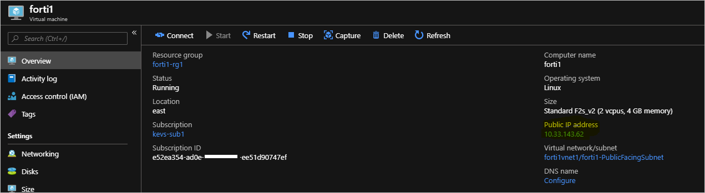

# How to establish a VNET to VNET connection with Fortinet Fortigate NVA

In this article, you'll connect a VNET in one Azure Stack to a VNET in another Azure Stack using Fortinet Fortigate NVA, a network virtual appliance.

This article addresses the current Azure Stack limitation, which lets tenants to only set up one VPN connection across two environments. Users will learn how to set up a custom gateway on a Linux virtual machine that will allow multiple VPN connections across different Azure Stack. The procedure in this article deploys two VNETs with a Fortigate NVA in each VNET: one deployment per Azure Stack environment. It also details the changes required to set up an IPSec VPN between the two VNETs. The steps in this article should be repeated for each VNET in each Azure Stack. 

## Prerequisites

-  Access to an Azure Stack integrated systems with available capacity to deploy the required compute, network, and resource requirements needed for this solution. 

    > [!Note]  
    > These instructions will **not** work with an Azure Stack Development Kit (ASDK) because of the network limitations in the ASDK. For more information, see [ASDK requirements and considerations](https://docs.microsoft.com/azure-stack/asdk/asdk-deploy-considerations).

-  A network virtual appliance (NVA) solution downloaded and published to the Azure Stack Marketplace. An NVA controls the flow of network traffic from a perimeter network to other networks or subnets. This procedure uses the [Fortinet Fortigate Next-Generation Firewall Single VM Solution](https://azuremarketplace.microsoft.com/en-us/marketplace/apps/fortinet.fortinet-fortigate-singlevm).

-  At least two available Fortigate license files to activate the Fortigate NVA. Information on how to get these licenses, see the Forinet Document Library article [Registering and downloading your license](https://docs2.fortinet.com/vm/azure/fortigate/6.2/azure-cookbook/6.2.0/19071/registering-and-downloading-your-license).

    This procedure uses the [Single FortiGate-VM deployment](ttps://docs2.fortinet.com/vm/azure/fortigate/6.2/azure-cookbook/6.2.0/632940/single-fortigate-vm-deployment). You can find steps on how to connect the FortiGate NVA to the Azure Stack VNET to in your on-premises network.

    For more information on how to deploy the FortiGate solution in an active-passive (HA) set up, see the Forinet Document Library article [HA for FortiGate-VM on Azure](https://docs2.fortinet.com/vm/azure/fortigate/6.2/azure-cookbook/6.2.0/983245/ha-for-fortigate-vm-on-azure).

## Deployment parameters

The following table summarizes the parameters that are used in these deployments for reference:

### Deployment one: Forti1

| FortiGate Instance Name | Forti1 |
|-----------------------------------|---------------------------|
| BYOL License/Version | 6.0.3 |
| FortiGate administrative username | fortiadmin |
| Resource Group name | forti1-rg1 |
| Virtual network name | forti1vnet1 |
| VNET Address Space | 172.16.0.0/16* |
| Public VNET subnet name | forti1-PublicFacingSubnet |
| Public VNET address prefix | 172.16.0.0/24* |
| Inside VNET subnet name | forti1-InsideSubnet |
| Inside VNET subnet prefix | 172.16.1.0/24* |
| VM Size of Fortigate NVA | Standard F2s_v2 |
| Public IP address name | forti1-publicip1 |
| Public IP address type | Static |

### Deployment two: Forti2

| FortiGate Instance Name | Forti2 |
|-----------------------------------|---------------------------|
| BYOL License/Version | 6.0.3 |
| FortiGate administrative username | fortiadmin |
| Resource Group name | forti2-rg1 |
| Virtual network name | forti2vnet1 |
| VNET Address Space | 172.17.0.0/16* |
| Public VNET subnet name | forti2-PublicFacingSubnet |
| Public VNET address prefix | 172.17.0.0/24* |
| Inside VNET subnet name | Forti2-InsideSubnet |
| Inside VNET subnet prefix | 172.17.1.0/24* |
| VM Size of Fortigate NVA | Standard F2s_v2 |
| Public IP address name | Forti2-publicip1 |
| Public IP address type | Static |

> [!Note]
> \* Choose a different set of address spaces and subnet prefixes if the above overlap in any way with the on-premises network environment including the VIP Pool of either Azure Stack. Also ensure that the address ranges do not overlap with one another.**

## Deploy the FortiGate NGFW Marketplace Items

Repeat these steps for both Azure Stack environments. 

1. Open the Azure Stack user portal. Be sure to use credentials that have at least Contributor rights to a subscription.

    

1. Select **Create a resource** and search for `fortigate`.

    

2. Select the **FortiGate NGFW** and select the **Create**.

3. Complete **Basics** using the parameters from the [Deployment parameters](#deployment-parameters) table.

    Your form should contain the following information:

    

4. Select **OK**.

5. Provide the virtual network, subnets, and VM size details from the [Deployment parameters](#deployment-parameters).

    If you wish to use different names and ranges, take care not to  use parameters that will conflict with the other VNET and Fortigate resources in the other Azure Stack environment. This is especially true when setting the VNET IP range and subnet ranges within the VNET. Check that they don't overlap with the IP ranges for the other VNET you create.

6. Select *OK*.

7. Configure the public IP that will be used for the Fortigate NVA:

    

8. Select *OK* and then Select *OK*.

9. Select **Create**.

The deployment will take about 10 minutes. You can now repeat the steps to create the other Fortigate NVA and VNET deployment in the other Azure Stack environment.

## Configure routes (UDRs) for each VNET

Perform these steps for both deployments, forti1-rg1 and forti2-rg1.

1. Navigate to the forti1-rg1 Resource Group in the Azure Stack portal.

    

2. Select on the 'forti1-forti1-InsideSubnet-routes-xxxx' resource.

3. Select **Routes** under **Settings**.

    

4. Delete the **to-Internet** Route.

    

5. Select **Yes**.

6. Select **Add**.

7. Name the **Route** `to-forti1` or `to-forti2`. Use your IP range if you are using a different IP range.

8. Enter:
    - forti1: `172.17.0.0/16`  
    - forti2: `172.16.0.0/16`  

    Use your IP range if you are using a different IP range.

9. Select **Virtual appliance** for the **Next hop type**.
    - forti1: `172.16.1.4`  
    - forti2: `172.17.0.4`  

    Use your IP range if you are using a different IP range.

    

10. Select **Save**.

Repeat the steps for each **InsideSubnet** route for each resource group.

## Activate the Fortigate NVAs and Configure an IPSec VPN connection on each NVA

 You will require a valid license file from Fortinet to activate each Fortigate NVA. The NVAs will **not** function until you have activated each NVA. For more information how to get a license file and steps to activate the NVA, see the Forinet Document Library article [Registering and downloading your license](https://docs2.fortinet.com/vm/azure/fortigate/6.2/azure-cookbook/6.2.0/19071/registering-and-downloading-your-license).

Two license files will need to be acquired – one for each NVA.

## Create an IPSec VPN between the two NVAs

Once the NVAs have been activated, follow these steps to create an IPSec VPN between the two NVAs.

Following the below steps for both the forti1 NVA and forti2 NVA:

1.  Get the assigned Public IP address by navigating to the fortiX VM Overview page:

    

2.  Copy the assigned IP address, open a browser, and paste the address into the address bar. Your browser may warn you that the security certificate is not trusted. Continue anyway.

4.  Enter the fortigate administrative user name and password you provided during the deployment.

    

5.  Select **System** > **Firmware**.

6.  Select the box showing the latest firmware, for example, `FortiOS v6.2.0 build0866`.

    

7.  Select **Backup config and upgrade** and Continue when prompted.

8.  The NVA updates its firmware to the latest build and reboots. The process takes about five minutes. Log back into the Fortigate web console.

10.  Click **VPN** > **IPSec Wizard**.

11. Enter a name for the VPN, for example, `conn1` in the **VPN Creation Wizard**.

12. Select **This site is behind NAT**.

    

13. Select **Next**.

14. Enter the remote IP address of the on-premises VPN device to which you are going to connect.

15. Select **port1** as the **Outgoing Interface**.

16. Select **Pre-shared Key** and enter (and record) a pre-shared key. 

    > [!Note]  
    > You will need this key to set up the connection on the on-premises VPN device, that is, they must match *exactly*.

    

17. Select **Next**.

18. Select **port2** for the **Local Interface**.

19. Enter the local subnet range:
    - forti1: 172.16.0.0/16
    - forti2: 172.17.0.0/16

    Use your IP range if you are using a different IP range.

20. Enter the appropriate Remote Subnet(s) that represent the on-premises network, which you will connect to through the on-premises VPN device.
    - forti1: 172.16.0.0/16
    - forti2: 172.17.0.0/16

    Use your IP range if you are using a different IP range.

    

21. Select **Create**

22. Select **Network** > **Interfaces**.

    

23. Double-click **port2**.

24. Choose **LAN** in the **Role** list and **DHCP** for the Addressing mode.

25. Select **OK**.

Repeat the steps for the other NVA.

## Bring Up All Phase 2 Selectors 

Once the above has been completed for **both** NVAs:

1.  On the forti2 Fortigate web console, select to **Monitor** > **IPsec Monitor**. 

    

2.  Highlight `conn1` and select the **Bring Up** > **All Phase 2 Selectors**.

    

## Test and validate connectivity

You should now be able to route in between each VNET via the Fortigate NVAs. To validate the connection, create an Azure Stack VM in each VNET's InsideSubnet. Creating an Azure Stack VM can be done via the portal, CLI, or PowerShell. When creating the VMs:

-   The Azure Stack VMs are placed on the **InsideSubnet** of each VNET.

-   You do **not** apply any NSGs to the VM upon creation (That is, remove the NSG that gets added by default if creating the VM from the portal.

-   Ensure that the VM firewall rules allow the communication you are going to use to test connectivity. For testing purposes, it is recommended to disable the firewall completely within the OS if at all possible.

## Next steps

[Differences and considerations for Azure Stack networking](azure-stack-network-differences.md)  
[Offer a network solution in Azure Stack with Fortinet Fortigate](../operator/azure-stack-network-solutions-enable.md)  