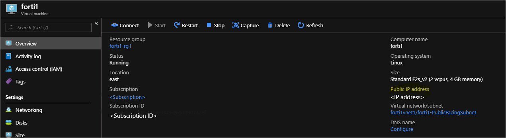
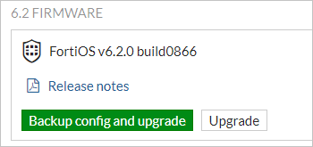
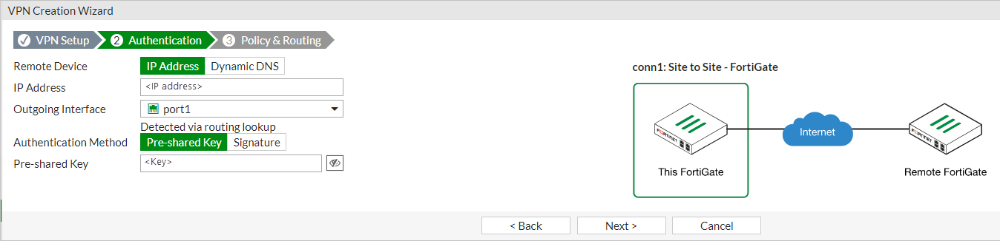

# VNet to VNet connectivity between Azure Stack Hub instances with Fortinet FortiGate NVA

This article describes how to connect a VNET in one Azure Stack Hub to a VNET in another Azure Stack Hub using Fortinet FortiGate NVA, a network virtual appliance.

This article addresses the current Azure Stack Hub limitation, which lets tenants set up only one VPN connection across two environments. The article describes how to set up a custom gateway on a Linux virtual machine that allows multiple VPN connections across different Azure Stack Hub. The procedure in this article deploys two VNETs with a FortiGate NVA in each VNET: one deployment per Azure Stack Hub environment. It also details the changes required to set up an IPSec VPN between the two VNETs. The steps in this article should be repeated for each VNET in each Azure Stack Hub.

## Prerequisites

- Access to an Azure Stack Hub integrated system with available capacity to deploy the required compute, network, and resource requirements needed for this solution.
- A network virtual appliance (NVA) solution downloaded and published to the Azure Stack Hub Marketplace. An NVA controls the flow of network traffic from a perimeter network to other networks or subnets. This procedure uses the Fortinet FortiGate Next-Generation Firewall Single VM Solution.
- At least two available FortiGate license files to activate the FortiGate NVA. For information about how to get these licenses, see the Fortinet Document Library article [Registering and downloading your license](https://docs.fortinet.com/document/fortigate-public-cloud/6.2.0/azure-administration-guide/19071/registering-and-downloading-your-license).

  This procedure uses the [Single FortiGate-VM deployment](https://docs.fortinet.com/document/fortigate-public-cloud/6.2.0/azure-administration-guide/632940/single-fortigate-vm-deployment). The procedure describes the steps to connect the FortiGate NVA to the Azure Stack Hub VNET in your on-premises network.

  For more information about how to deploy the FortiGate solution in an active-passive (HA) set up, see [HA for FortiGate-VM on Azure](https://docs.fortinet.com/document/fortigate-public-cloud/6.2.0/azure-administration-guide/983245/ha-for-fortigate-vm-on-azure) in the Fortinet document library.

## Deployment parameters

The following table summarizes the parameters that are used in these deployments for reference:

### Deployment one: Forti1

| FortiGate Instance Name | Forti1 |
|-----------------------------------|---------------------------|
| BYOL License/Version | 6.0.3 |
| FortiGate administrative username | fortiadmin |
| Resource Group name | forti1-rg1 |
| Virtual network name | forti1vnet1 |
| VNET Address Space | 172.16.0.0/16* |
| Public VNET subnet name | forti1-PublicFacingSubnet |
| Public VNET address prefix | 172.16.0.0/24* |
| Inside VNET subnet name | forti1-InsideSubnet |
| Inside VNET subnet prefix | 172.16.1.0/24* |
| VM Size of FortiGate NVA | Standard F2s_v2 |
| Public IP address name | forti1-publicip1 |
| Public IP address type | Static |

### Deployment two: Forti2

| FortiGate Instance Name | Forti2 |
|-----------------------------------|---------------------------|
| BYOL License/Version | 6.0.3 |
| FortiGate administrative username | fortiadmin |
| Resource Group name | forti2-rg1 |
| Virtual network name | forti2vnet1 |
| VNET Address Space | 172.17.0.0/16* |
| Public VNET subnet name | forti2-PublicFacingSubnet |
| Public VNET address prefix | 172.17.0.0/24* |
| Inside VNET subnet name | Forti2-InsideSubnet |
| Inside VNET subnet prefix | 172.17.1.0/24* |
| VM Size of FortiGate NVA | Standard F2s_v2 |
| Public IP address name | Forti2-publicip1 |
| Public IP address type | Static |

> [!NOTE]
> If the previous names overlap in any way with the on-premises network environment, including the VIP pool of Azure Stack Hub, choose a different set of address spaces and subnet prefixes. Also ensure that the address ranges don't overlap with each other.

## Deploy the FortiGate NGFW Marketplace Items

Repeat these steps for both Azure Stack Hub environments.

1. Open the Azure Stack Hub user portal. Be sure to use credentials that have at least Contributor rights to a subscription.
1. Select **Create a resource** and search for `FortiGate`.

   

1. Select the **FortiGate NGFW** and select the **Create**.
1. Complete **Basics** using the parameters from the [Deployment parameters](#deployment-parameters) table.

   Your form should contain the following information:

   

1. Select **OK**.
1. Provide the virtual network, subnets, and VM size details from the [Deployment parameters](#deployment-parameters).

   If you want to use different names and ranges, take care not to use parameters that conflict with the other VNET and FortiGate resources in the other Azure Stack Hub environment. This limitation is especially true when setting the VNET IP range and subnet ranges within the VNET. Check that they don't overlap with the IP ranges for the other VNET you create.

1. Select **OK**.
1. Configure the public IP to be used for the FortiGate NVA:

   

1. Select **OK** and then Select **OK**.
1. Select **Create**.

The deployment takes about 10 minutes. You can now repeat the steps to create the other FortiGate NVA and VNET deployment in the other Azure Stack Hub environment.

## Configure routes (UDRs) for each VNET

Perform these steps for both deployments, forti1-rg1 and forti2-rg1.

1. Navigate to the forti1-rg1 Resource Group in the Azure Stack Hub portal.

   

1. Select on the 'forti1-forti1-InsideSubnet-routes-xxxx' resource.
1. Select **Routes** under **Settings**.

   

1. Delete the **to-Internet** Route.

   

1. Select **Yes**.
1. Select **Add**.
1. Name the **Route** `to-forti1` or `to-forti2`. Use your IP range if you're using a different IP range.
1. Enter:

   - forti1: `172.17.0.0/16`  
   - forti2: `172.16.0.0/16`  

   If you use a different IP range, enter your IP range.

1. Select **Virtual appliance** for the **Next hop type**.

   - forti1: `172.16.1.4`  
   - forti2: `172.17.0.4`  

   If you use a different IP range, enter your IP range.

   

1. Select **Save**.

Repeat these steps for each **InsideSubnet** route in each resource group.

## Activate the FortiGate NVAs and Configure an IPSec VPN connection on each NVA

You need a valid license file from Fortinet to activate each FortiGate NVA. The NVAs can't function until you activate each NVA. For more information about how to get a license file and the steps to activate the NVA, see the Fortinet Document Library article [Registering and downloading your license](https://docs.fortinet.com/document/fortigate-public-cloud/6.2.0/azure-administration-guide/19071/registering-and-downloading-your-license).

You must acquire two license files: one for each NVA.

## Create an IPSec VPN between the two NVAs

Once the NVAs are activated, follow these steps to create an IPSec VPN between the two NVAs. Follow the steps for both the **forti1** NVA and **forti2** NVA:

1. Get the assigned Public IP address by navigating to the fortiX VM Overview page:

   

1. Copy the assigned IP address, open a browser, and paste the address into the address bar. Your browser might warn you that the security certificate is not trusted. Continue anyway.
1. Enter the FortiGate administrative user name and password you provided during the deployment.

   

1. Select **System** > **Firmware**.
1. Select the box showing the latest firmware; for example, `FortiOS v6.2.0 build0866`.

   

1. Select **Backup config and upgrade** and **Continue** when prompted.
1. The NVA updates its firmware to the latest build, then reboots. The process takes about five minutes. Log back into the FortiGate web console.
1. Select **VPN** > **IPSec Wizard**.
1. Enter a name for the VPN, for example, `conn1` in the **VPN Creation Wizard**.
1. Select **This site is behind NAT**.

   

1. Select **Next**.
1. Enter the remote IP address of the on-premises VPN device to which you're going to connect.
1. Select **port1** as the **Outgoing Interface**.
1. Select **Pre-shared Key** and enter (and record) a pre-shared key.

   > [!NOTE]  
   > You need this key to set up the connection on the on-premises VPN device; that is, they must match exactly.

   

1. Select **Next**.
1. Select **port2** for the **Local Interface**.
1. Enter the local subnet range:

   - forti1: 172.16.0.0/16
   - forti2: 172.17.0.0/16

   If you use a different IP range, enter your IP range.

1. Enter the appropriate remote subnets that represent the on-premises network to which you connect through the on-premises VPN device:

   - forti1: 172.16.0.0/16
   - forti2: 172.17.0.0/16

   If you use a different IP range, enter your IP range.

   

1. Select **Create**
1. Select **Network** > **Interfaces**.  

   

1. Double-click **port2**.
1. Choose **LAN** in the **Role** list and **DHCP** for the Addressing mode.
1. Select **OK**.

Repeat the steps for the other NVA.

## Bring up all phase 2 selectors

Once this procedure is complete for both NVAs:

1. On the **forti2** FortiGate web console, select **Monitor** > **IPsec Monitor**.

   

1. Highlight `conn1` and select **Bring Up** > **All Phase 2 Selectors**.

   

## Test and validate connectivity

You should now be able to route in between each VNET via the FortiGate NVAs. To validate the connection, create an Azure Stack Hub VM in each VNET's InsideSubnet. You can create an Azure Stack Hub VM via the portal, Azure CLI, or PowerShell. When creating the VMs:

- The Azure Stack Hub VMs are placed on the **InsideSubnet** of each VNET.
- You don't apply any NSGs to the VM upon creation; that is, remove the NSG that gets added by default if creating the VM from the portal.
- Ensure that the VM firewall rules allow the communication you're going to use to test connectivity. For testing purposes, it's recommended that you disable the firewall completely within the OS, if at all possible.

## Next steps

[Differences and considerations for Azure Stack Hub networking](azure-stack-network-differences.md)  
[Offer a network solution in Azure Stack Hub with Fortinet FortiGate](../operator/azure-stack-network-solutions-enable.md)  
