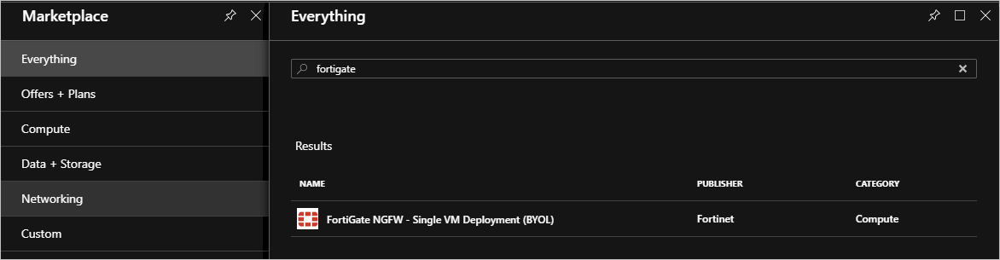
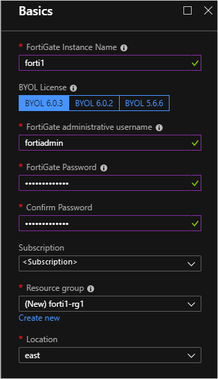
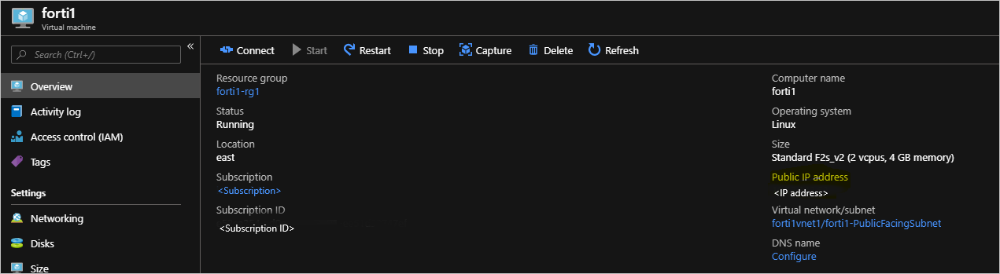
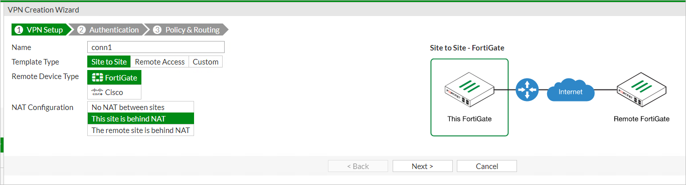
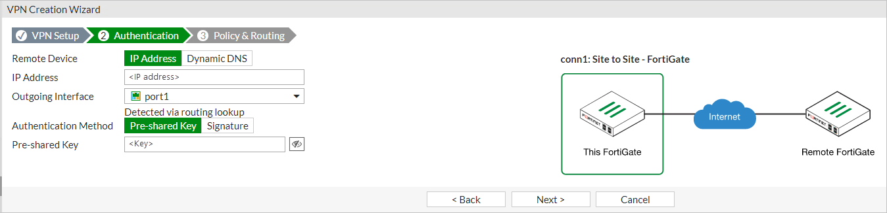
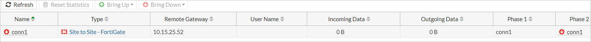

---

title: Connect two virtual networks in the same Azure Stack environment
description: Learn how to connect two virtual networks within the same Azure Stack Hub environment by using Fortinet FortiGate.
author: mattbriggs

ms.topic: how-to
ms.date: 12/2/2020
ms.author: mabrigg
ms.reviewer: sijuman
ms.lastreviewed: 12/2/2020

# Intent: Notdone: As a < type of user >, I want < what? > so that < why? >
# Keyword: Notdone: keyword noun phrase

---

# VNet to VNet connectivity with Fortigate

This article describes how to create a connection between two virtual networks in the same environment. When you set up the connections, you learn how VPN gateways in Azure Stack Hub work. Connect two VNETs within the same Azure Stack Hub environment using Fortinet FortiGate. This procedure deploys two VNETs with a FortiGate NVA, a network virtual appliance, in each VNET each within a separate resource group. It also details the changes required to set up an IPSec VPN between the two VNETs. Repeat the steps in this article for each VNET deployment.

## Prerequisites

-   Access to a system with available capacity to deploy the required compute, network, and resource requirements needed for this solution.

-  A network virtual appliance (NVA) solution downloaded and published to the Azure Stack Hub Marketplace. An NVA controls the flow of network traffic from a perimeter network to other networks or subnets. This procedure uses the [Fortinet FortiGate Next-Generation Firewall Single VM Solution](https://azuremarketplace.microsoft.com/marketplace/apps/fortinet.fortinet-FortiGate-singlevm).

-  At least two available FortiGate license files to activate the FortiGate NVA. Information on how to get these licenses, see the Fortinet Document Library article [Registering and downloading your license](https://docs2.fortinet.com/vm/azure/FortiGate/6.2/azure-cookbook/6.2.0/19071/registering-and-downloading-your-license).

    This procedure uses the [Single FortiGate-VM deployment](https://docs2.fortinet.com/vm/azure/FortiGate/6.2/azure-cookbook/6.2.0/632940/single-FortiGate-vm-deployment). You can find steps on how to connect the FortiGate NVA to the Azure Stack Hub VNET to in your on-premises network.

    For more information on how to deploy the FortiGate solution in an active-passive (HA) set up, see the details in the Fortinet Document Library article [HA for FortiGate-VM on Azure](https://docs2.fortinet.com/vm/azure/FortiGate/6.2/azure-cookbook/6.2.0/983245/ha-for-FortiGate-vm-on-azure).

## Deployment parameters

The following table summarizes the parameters that are used in these deployments for reference:

### Deployment one: Forti1

| FortiGate Instance Name | Forti1 |
|-----------------------------------|---------------------------|
| BYOL License/Version | 6.0.3 |
| FortiGate administrative username | fortiadmin |
| Resource Group name | forti1-rg1 |
| Virtual network name | forti1vnet1 |
| VNET Address Space | 172.16.0.0/16* |
| Public VNET subnet name | forti1-PublicFacingSubnet |
| Public VNET address prefix | 172.16.0.0/24* |
| Inside VNET subnet name | forti1-InsideSubnet |
| Inside VNET subnet prefix | 172.16.1.0/24* |
| VM Size of FortiGate NVA | Standard F2s_v2 |
| Public IP address name | forti1-publicip1 |
| Public IP address type | Static |

### Deployment two: Forti2

| FortiGate Instance Name | Forti2 |
|-----------------------------------|---------------------------|
| BYOL License/Version | 6.0.3 |
| FortiGate administrative username | fortiadmin |
| Resource Group name | forti2-rg1 |
| Virtual network name | forti2vnet1 |
| VNET Address Space | 172.17.0.0/16* |
| Public VNET subnet name | forti2-PublicFacingSubnet |
| Public VNET address prefix | 172.17.0.0/24* |
| Inside VNET subnet name | Forti2-InsideSubnet |
| Inside VNET subnet prefix | 172.17.1.0/24* |
| VM Size of FortiGate NVA | Standard F2s_v2 |
| Public IP address name | Forti2-publicip1 |
| Public IP address type | Static |

> [!NOTE]
> \* Choose a different set of address spaces and subnet prefixes if the above overlap in any way with the on-premises network environment including the VIP Pool of either Azure Stack Hub. Also ensure that the address ranges do not overlap with one another.

## Deploy the FortiGate NGFW

1.  Open the Azure Stack Hub user portal.

2.  Select **Create a resource** and search for `FortiGate`.

    

3.  Select the **FortiGate NGFW** and select **Create**.

4.  Complete the **Basics** using the parameters from the [Deployment parameters](#deployment-parameters) table.

    

5.  Select **OK**.

6.  Provide the Virtual network, Subnets, and VM Size details using the [Deployment parameters](#deployment-parameters) table.

    > [!Warning] 
    > If the on-premises network overlaps with the IP range `172.16.0.0/16`, you must select and set up a different network range and subnets. If you wish to use different names and ranges than the ones in the [Deployment parameters](#deployment-parameters) table, use parameters that will **not** conflict with the on-premises network. Take care when setting the VNET IP range and subnet ranges within the VNET. You do not want the range to overlap with the IP ranges that exist in your on-premises network.

7.  Select **OK**.

8.  Configure the Public IP for the Fortigate NVA:

    

9.  Select **OK**. And then select **OK**.

10.  Select **Create**.

The deployment will take about 10 minutes.

## Configure routes (UDRs) for each VNET

Perform these steps for both deployments, forti1-rg1 and forti2-rg1.

1. Open the Azure Stack Hub user portal.

1. Select Resource groups. Type `forti1-rg1` in the filter and double-click the forti1-rg1 resource group.

    

1. Select the **forti1-forti1-InsideSubnet-routes-xxxx** resource.

1. Select **Routes** under **Settings**.

    

1. Delete the **to-Internet** Route.

    

1. Select *Yes*.

1. Select **Add** to add a new route.

1. Name the route `to-onprem`.

1. Enter the IP network range that defines the network range of the on-premises network to which the VPN will connect.

1. Select **Virtual appliance** for **Next hop type** and `172.16.1.4`. Use your IP range if you are using a different IP range.

    

1. Select **Save**.

You will need a valid license file from Fortinet to activate each FortiGate NVA. The NVAs will **not** function until you have activated each NVA. For more information how to get a license file and steps to activate the NVA, see the Fortinet Document Library article [Registering and downloading your license](https://docs2.fortinet.com/vm/azure/FortiGate/6.2/azure-cookbook/6.2.0/19071/registering-and-downloading-your-license).

Two license files will need to be acquired – one for each NVA.

## Create an IPSec VPN between the two NVAs

Once the NVAs have been activated, follow these steps to create an IPSec VPN between the two NVAs.

Following the below steps for both the forti1 NVA and forti2 NVA:

1. Get the assigned Public IP address by navigating to the fortiX VM overview page:

    

1. Copy the assigned IP address, open a browser, and paste the address into the address bar. Your browser may warn you that the security certificate is not trusted. Continue anyway.

1. Enter the FortiGate administrative user name and password you provided during the deployment.

    

1. Select **System** > **Firmware**.

1. Select the box showing the latest firmware, for example, `FortiOS v6.2.0 build0866`.

    

1. Select **Backup config and upgrade** > **Continue**.

1. The NVA updates its firmware to the latest build and reboots. The process takes about five minutes. Log back into the FortiGate web console.

1. Click **VPN** > **IPSec Wizard**.

1. Enter a name for the VPN, for example, `conn1` in the **VPN Creation Wizard**.

1. Select **This site is behind NAT**.

    

1. Select **Next**.

1. Enter the remote IP address of the on-premises VPN device to which you are going to connect.

1. Select **port1** as the **Outgoing Interface**.

1. Select **Pre-shared Key** and enter (and record) a pre-shared key. 

    > [!NOTE]  
    > You will need this key to set up the connection on the on-premises VPN device, that is, they must match *exactly*.

    

1. Select **Next**.

1. Select **port2** for the **Local Interface**.

1. Enter the local subnet range:
    - forti1: 172.16.0.0/16
    - forti2: 172.17.0.0/16

    Use your IP range if you are using a different IP range.

1. Enter the appropriate Remote Subnet(s) that represent the on-premises network, which you will connect to through the on-premises VPN device.
    - forti1: 172.16.0.0/16
    - forti2: 172.17.0.0/16

    Use your IP range if you are using a different IP range.

    

1. Select **Create**

1. Select **Network** > **Interfaces**.

    

1. Double-click **port2**.

1. Choose **LAN** in the **Role** list and **DHCP** for the Addressing mode.

1. Select **OK**.

Repeat the steps for the other NVA.

## Bring Up All Phase 2 Selectors 

Once the above has been completed for *both* NVAs:

1.  On the forti2 FortiGate web console, select to **Monitor** > **IPsec Monitor**. 

    

2.  Highlight `conn1` and select the **Bring Up** > **All Phase 2 Selectors**.

    

## Test and validate connectivity

You should now be able to route in between each VNET via the FortiGate NVAs. To validate the connection, create an Azure Stack Hub VM in each VNET's InsideSubnet. Creating an Azure Stack Hub VM can be done via the portal, CLI, or PowerShell. When creating the VMs:

-   The Azure Stack Hub VMs are placed on the **InsideSubnet** of each VNET.

-   You **don't** apply any NSGs to the VM upon creation (That is, remove the NSG that gets added by default if you create the VM from the portal.

-   Ensure that the VMS firewall rules allow the communication you are going to use to test connectivity. For testing purposes, it is recommended to disable the firewall completely within the OS if at all possible.

## Next steps

[Differences and considerations for Azure Stack Hub networking](azure-stack-network-differences.md)  
[Offer a network solution in Azure Stack Hub with Fortinet FortiGate](../operator/azure-stack-network-solutions-enable.md)  
