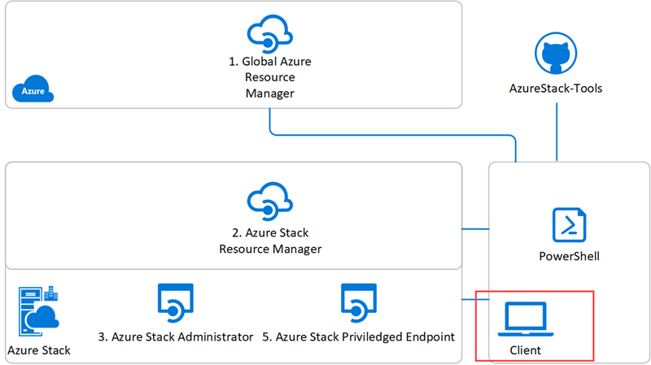

# Get started with PowerShell on Azure Stack

PowerShell is designed for managing and administering resources from the command line. You can use PowerShell when you want to build automated tools that use the Azure Resource Manager model. A PowerShell module can be defined as a set of PowerShell functions that are grouped to manage all the aspects of a particular area. To work with Azure Stack, you will need to juggle different sets of PowerShell cmdlets.

This article helps you get orient yourself to these different PowerShell modules used on Azure Stack. There are four sets of APIs that you can interact with when you use PowerShell on Azure Stack.

| API | PowerShell reference | REST reference |
| --- | --- | --- |
| 1. Global Azure Resource Manager | [Azure PowerShell Modules](https://github.com/Azure/azure-powershell/blob/master/documentation/azure-powershell-modules.md) | [REST API Browser](https://docs.microsoft.com/rest/api/) |
| 2. Azure Stack Resource Manager | [Manage API version profiles in Azure Stack](azure-stack-version-profiles.md) | [Manage API version profiles in Azure Stack](azure-stack-version-profiles.md) |
| 3. Azure Stack Administrator endpoints | [Azure Stack Admin Module](https://docs.microsoft.com/powershell/azure/azure-stack/overview) | [REST API Browser - Azure Stack](https://docs.microsoft.com/rest/api/?term=Azure%20Azure%20Stack%20Admin) |
| 4.  Azure Stack Privileged Endpoint | [Using the privileged endpoint in Azure Stack](../operator/azure-stack-privileged-endpoint.md) | |

Each interface contacts resource providers in global Azure or Azure Stack. Resource providers enable Azure capabilities. For example, The Azure Compute resource provider gives you programmatic access to the creation and management of virtual machines and their supporting resources.

Resource Providers provide functionality, but also provide controls for managing and configuring the resource. You can programmatically access the resource providers using the Azure Resource Manager, and in turn, the interface provides a surface for PowerShell, Azure CLI, and your own REST clients.

## Where to find Azure Stack PowerShell

The following block diagram shows the relationship of each set of PowerShell modules. From your machine, you can load the PowerShell modules and manage both global Azure and Azure Stack.

### Global Azure

Azure PowerShell contains a set of cmdlets that use the current version of the Azure Resource Manager for working with your Azure resources. Azure PowerShell uses the .NET Standard. This means you can use versions of PowerShell with Windows, macOS, and Linux. Azure PowerShell is also available on Azure Cloud Shell. For more information, see [Get started with Azure PowerShell](https://docs.microsoft.com/powershell/azure/get-started-azureps).

### Azure Stack Resource Manager

Azure Stack PowerShell provides a set of cmdlets that use previous versions of the Azure Resource Manager. These cmdlets are compatible with the resource providers in Azure Stack. Each resource provider in Azure Stack uses an older version of the provider found in global Azure. To help you coordinate the version of each provider supported by Azure Stack, you can use API Profiles. Azure Stack PowerShell uses PowerShell 5.1 and is only available on Windows. For more information, see [Manage API version profiles in Azure Stack](azure-stack-version-profiles.md).

### Azure Stack Administrator

Azure Stack exposes a set of resource providers to the cloud operator in order to install and maintain Azure Stack. In global Azure this interaction is abstracted from the user and handled behind the scenes as part of Azure. Azure Stack, however, provides enterprises the ability to support a private cloud. In order to perform these tasks, the operator interacts with the Azure Stack Admin APIs. For more information, see [Install PowerShell for Azure Stack](../operator/azure-stack-powershell-install.md).

### Azure Stack Privileged Endpoint

For operator activities on Azure Stack, such as testing the installation and accessing logs, operators can interact with the privileged endpoint (PEP). The PEP is a pre-configured remote PowerShell console that provides operators with just enough access to help perform specific tasks. The endpoint uses PowerShell JEA (Just Enough Administration) to expose a restricted set of cmdlets. For more information, see [Using the privileged endpoint in Azure Stack](../operator/azure-stack-privileged-endpoint.md).

### AzureStack-Tools

In addition, Azure Stack provides scripts and additional cmdlets available in a GitHub repository, Azure Stack Tools. AzureStack-Tools hosts PowerShell modules for managing and deploying resources to Azure Stack. If you are planning to establish VPN connectivity, you can download these PowerShell modules to the Azure Stack Development Kit, or to a Windows-based external client. For more information, see [AzureStack-Tools](https://github.com/Azure/AzureStack-Tools).

## Working with PowerShell on Azure Stack

PowerShell provides a programmatic way to interact with the Azure Resource Manager. You can either work with an interactive command prompt or write scripts if you are automating tasks.

If you spend much time working with Azure Stack PowerShell, you'll find yourself installing and reinstalling the modules. This can be challenging if you're working with global Azure at the same time since you'll need to uninstall and reinstall your modules depending on your target. You can use Docker containers to isolate each version of PowerShell on your local machine. [Use Docker to run PowerShell](azure-stack-powershell-user-docker.md) looks at using Docker containers so that you can switch from PowerShell module set to PowerShell module set.

## Next steps

- Read about [API Profiles for PowerShell](azure-stack-version-profiles.md) on Azure Stack.
- [Install Azure Stack Powershell](../operator/azure-stack-powershell-install.md)
- Read about creating [Azure Resource Manager templates](azure-stack-develop-templates.md) for cloud consistency.