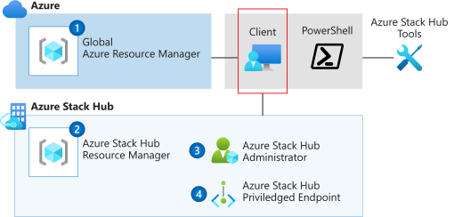

# Get started with PowerShell in Azure Stack Hub

PowerShell is designed for managing and administering resources from the command line. You can use PowerShell when you want to build automated tools that use the Azure Resource Manager model. A PowerShell module can be defined as a set of PowerShell functions that are grouped to manage all aspects of a particular area. To work with Azure Stack Hub, you need to juggle various sets of PowerShell cmdlets.

This article helps you understand the variety of PowerShell modules that are used in Azure Stack Hub. When you use PowerShell in Azure Stack Hub, you can interact with any of four sets of APIs, as shown in the following table:

| API | PowerShell reference | REST reference |
| --- | --- | --- |
| Global Azure Resource Manager | [Azure PowerShell modules](https://github.com/Azure/azure-powershell/blob/master/documentation/azure-powershell-modules.md) | [REST API browser](/rest/api/) |
| Azure Stack Hub Resource Manager | [Manage API version profiles in Azure Stack Hub](azure-stack-version-profiles.md) | [Manage API version profiles in Azure Stack Hub](azure-stack-version-profiles.md) |
| Azure Stack Hub administrator endpoints | [Azure Stack Hub admin module](/powershell/azurestackhub/overview) | [REST API browser - Azure Stack Hub](/rest/api/?term=Azure Azure Stack Admin) |
| Azure Stack Hub privileged endpoint | [Use the privileged endpoint in Azure Stack Hub](../operator/azure-stack-privileged-endpoint.md) | |

Each interface contacts resource providers in global Azure or Azure Stack Hub. Resource providers enable Azure capabilities. For example, the Azure Compute resource provider gives you programmatic access to the creation and management of virtual machines and their supporting resources.

Resource providers provide both functionality and controls for managing and configuring the resource. You can programmatically access the resource providers by using Azure Resource Manager. In turn, the interface provides a surface for PowerShell, the Azure CLI, and your own REST clients.

## Where to find Azure Stack Hub PowerShell

The following block diagram shows the relationships between the sets of PowerShell modules. From your machine, you can load the PowerShell modules and manage both global Azure and Azure Stack Hub.

### Global Azure

Azure PowerShell contains a set of cmdlets that use the current version of Azure Resource Manager for working with your Azure resources. Azure PowerShell uses the .NET Standard version, which means that you can use versions of PowerShell with Windows, macOS, and Linux. Azure PowerShell is also available on Azure Cloud Shell. For more information, see [Get started with Azure PowerShell](/powershell/azure/get-started-azureps).

### Azure Stack Hub Resource Manager

Azure Stack Hub PowerShell provides a set of cmdlets that use previous versions of Azure Resource Manager. These cmdlets are compatible with the resource providers in Azure Stack Hub. Each resource provider in Azure Stack Hub uses an older version of the provider found in global Azure. To help you coordinate the version of each provider that's supported by Azure Stack Hub, you can use API profiles. For more information, see [Manage API version profiles in Azure Stack Hub](azure-stack-version-profiles.md).

### Azure Stack Hub administrator

Azure Stack Hub exposes a set of resource providers to the cloud operator so that the operator can install and maintain Azure Stack Hub. In global Azure, this interaction is abstracted from the user and handled behind the scenes as part of Azure. With Azure Stack Hub; however, enterprises can support a private cloud. To do these tasks, the operator interacts with the Azure Stack Hub Admin APIs. For more information, see [Install PowerShell for Azure Stack Hub](../operator/powershell-install-az-module.md).

### Azure Stack Hub privileged endpoint

For operator activities in Azure Stack Hub, such as testing the installation and accessing logs, operators can interact with the privileged endpoint (PEP). The PEP is a pre-configured remote PowerShell console that gives operators enough access to do specific tasks. The endpoint uses PowerShell Just Enough Administration (JEA) to expose a restricted set of cmdlets. For more information, see [Use the privileged endpoint in Azure Stack Hub](../operator/azure-stack-privileged-endpoint.md).

### Azure Stack Hub Tools

Azure Stack Hub makes scripts and additional cmdlets available in a GitHub repository, *AzureStack-Tools*. AzureStack-Tools hosts PowerShell modules for managing and deploying resources to Azure Stack Hub. If you're planning to establish VPN connectivity, you can download these PowerShell modules to the Azure Stack Development Kit, or to a Windows-based external client. For more information, go to the [AzureStack-Tools](https://github.com/Azure/AzureStack-Tools) page.

## Work with PowerShell in Azure Stack Hub

PowerShell provides a programmatic way to interact with Azure Resource Manager. You can work with an interactive command prompt or, if you're automating tasks, you can write scripts.

If you spend much time working with Azure Stack Hub PowerShell, you'll find yourself installing and reinstalling the modules. If you're working with global Azure at the same time, this routine can be challenging, because you'll need to uninstall and reinstall your modules depending on your target.

You can use Docker containers to isolate each version of PowerShell on your local machine. To use Docker containers so that you can switch from PowerShell module set to PowerShell module set, see [Use Docker to run PowerShell](azure-stack-powershell-user-docker.md).

## Next steps

- Read about [API profiles for PowerShell](azure-stack-version-profiles.md) in Azure Stack Hub.
- Install [Azure Stack Hub PowerShell](../operator/powershell-install-az-module.md).
- Read about creating [Azure Resource Manager templates](azure-stack-develop-templates.md) for cloud consistency.
