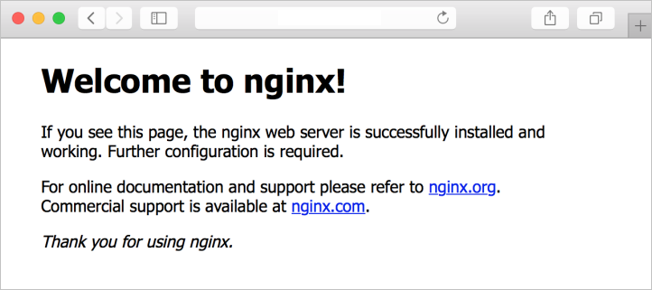

# Quickstart: Create a Linux server VM by using the Azure CLI in Azure Stack Hub

You can create an Ubuntu Server 16.04 LTS virtual machine (VM) by using the Azure CLI. In this article, you create and use a virtual machine. This article also shows you how to:

* Connect to the virtual machine with a remote client.
* Install an NGINX web server and view the default home page.
* Clean up unused resources.

## Prerequisites

* A Linux image in the Azure Stack Hub Marketplace

   The Azure Stack Hub Marketplace doesn't contain a Linux image by default. Have the Azure Stack Hub operator provide the Ubuntu Server 16.04 LTS image you need. The operator can use the instructions in [Download Marketplace items from Azure to Azure Stack Hub](../operator/azure-stack-download-azure-marketplace-item.md).

* Azure Stack Hub requires a specific version of the Azure CLI to create and manage its resources. If you don't have the Azure CLI configured for Azure Stack Hub, sign in to the [Azure Stack Development Kit](../asdk/asdk-connect.md#connect-to-azure-stack-using-rdp) (or a Windows-based external client if you're [connected through VPN](../asdk/asdk-connect.md#connect-to-azure-stack-using-vpn)), and follow the instructions for [installing and configuring the Azure CLI](azure-stack-version-profiles-azurecli2.md).

* A public Secure Shell (SSH) key with the name *id_rsa.pub* saved in the *.ssh* directory of your Windows user profile. For detailed information about creating SSH keys, see [Use an SSH public key](azure-stack-dev-start-howto-ssh-public-key.md).

## Create a resource group

A resource group is a logical container where you can deploy and manage Azure Stack Hub resources. From your development kit or the Azure Stack Hub integrated system, run the [az group create](/cli/azure/group#az-group-create) command to create a resource group.

> [!NOTE]
> We've assigned values for all variables in the following code examples. However, you can assign your own values.

The following example creates a resource group named myResourceGroup in the local location: 

```cli
az group create --name myResourceGroup --location local
```

## Create a virtual machine

Create a virtual machine by using the [az vm create](/cli/azure/vm#az-vm-create) command. The following example creates a VM named myVM. The example uses *Demouser* as the admin username and *Demouser@123* as the admin password. Change these values to something that's appropriate for your environment.

```cli
az vm create \
  --resource-group "myResourceGroup" \
  --name "myVM" \
  --image "UbuntuLTS" \
  --admin-username "Demouser" \
  --admin-password "Demouser@123" \
  --location local
```

The public IP address is returned in the **PublicIpAddress** parameter. Note the address for later use with the virtual machine.

## Open port 80 for web traffic

Because this virtual machine is going to run the IIS web server, you need to open port 80 to internet traffic. To open the port, use the [az vm open-port](/cli/azure/vm) command: 

```cli
az vm open-port --port 80 --resource-group myResourceGroup --name myVM
```

## Use SSH to connect to the virtual machine

From a client computer with SSH installed, connect to the virtual machine. If you're working on a Windows client, use [PuTTY](https://www.putty.org/) to create the connection. To connect to the virtual machine, use the following command:

```bash
ssh <publicIpAddress>
```

## Install the NGINX web server

To update package resources and install the latest NGINX package, run the following script:

```bash
#!/bin/bash

# update package source
apt-get -y update

# install NGINX
apt-get -y install nginx
```

## View the NGINX welcome page

With the NGINX web server installed, and port 80 open on your virtual machine, you can access the web server by using the virtual machine's public IP address. To do so, open a browser, and go to ```http://<public IP address>```.



## Clean up resources

Clean up the resources that you don't need any longer. You can use the [az group delete](/cli/azure/group#az-group-delete) command to remove them. Run the following command:

```cli
az group delete --name myResourceGroup
```

## Next steps

In this quickstart, you deployed a basic Linux server virtual machine with a web server. To learn more about Azure Stack Hub virtual machines, see [Considerations for virtual machines in Azure Stack Hub](azure-stack-vm-considerations.md).
