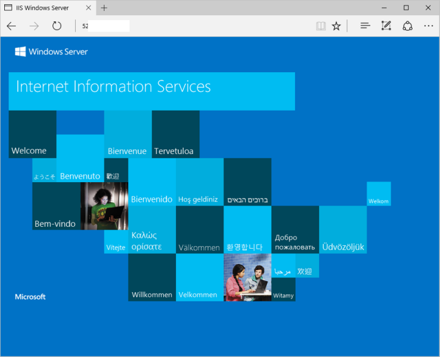

# Quickstart: Create a Windows Server VM by using PowerShell in Azure Stack Hub

You can create a Windows Server 2016 virtual machine (VM) by using Azure Stack Hub PowerShell. Follow the steps in this article to create and use a VM. This article also gives you the steps to:

* Connect to the VM with a remote client.
* Install the IIS web server and view the default home page.
* Clean up your resources.

> [!NOTE]
>  You can run the steps described in this article from the Azure Stack Development Kit, or from a Windows-based external client if you are connected over a VPN.

## Prerequisites for Windows Server VM

* Make sure that your Azure Stack Hub operator has added the **Windows Server 2016** image to the Azure Stack Hub Marketplace.

* Azure Stack Hub requires a specific version of Azure PowerShell to create and manage the resources. If you don't have PowerShell configured for Azure Stack Hub, follow the steps to [install](../operator/azure-stack-powershell-install.md) PowerShell.

* With the Azure Stack Hub PowerShell set up, you'll need to connect to your Azure Stack Hub environment. For instruction, see [Connect to Azure Stack Hub with PowerShell as a user](azure-stack-powershell-configure-user.md).

## Create a resource group

A resource group is a logical container into which Azure Stack Hub resources are deployed and managed. From your development kit or the Azure Stack Hub integrated system, run the following code block to create a resource group. 

> [!NOTE]
> Values are assigned for all variables in the code examples. However, you can assign new values if you want to.

```powershell
# Create variables to store the location and resource group names.
$location = "local"
$ResourceGroupName = "myResourceGroup"

New-AzureRmResourceGroup `
  -Name $ResourceGroupName `
  -Location $location
```

## Create storage resources

Create a storage account to store the output of boot diagnostics.

```powershell
# Create variables to store the storage account name and the storage account SKU information
$StorageAccountName = "mystorageaccount"
$SkuName = "Standard_LRS"

# Create a new storage account
$StorageAccount = New-AzureRMStorageAccount `
  -Location $location `
  -ResourceGroupName $ResourceGroupName `
  -Type $SkuName `
  -Name $StorageAccountName

Set-AzureRmCurrentStorageAccount `
  -StorageAccountName $storageAccountName `
  -ResourceGroupName $resourceGroupName

```

## Create networking resources

Create a virtual network, subnet, and a public IP address. These resources are used to provide network connectivity to the VM.

```powershell
# Create a subnet configuration
$subnetConfig = New-AzureRmVirtualNetworkSubnetConfig `
  -Name mySubnet `
  -AddressPrefix 192.168.1.0/24

# Create a virtual network
$vnet = New-AzureRmVirtualNetwork `
  -ResourceGroupName $ResourceGroupName `
  -Location $location `
  -Name MyVnet `
  -AddressPrefix 192.168.0.0/16 `
  -Subnet $subnetConfig

# Create a public IP address and specify a DNS name
$pip = New-AzureRmPublicIpAddress `
  -ResourceGroupName $ResourceGroupName `
  -Location $location `
  -AllocationMethod Static `
  -IdleTimeoutInMinutes 4 `
  -Name "mypublicdns$(Get-Random)"
```

### Create a network security group and a network security group rule

The network security group secures the VM by using inbound and outbound rules. Let's create an inbound rule for port 3389 to allow incoming Remote Desktop connections and an inbound rule for port 80 to allow incoming web traffic.

```powershell
# Create an inbound network security group rule for port 3389
$nsgRuleRDP = New-AzureRmNetworkSecurityRuleConfig `
  -Name myNetworkSecurityGroupRuleRDP `
  -Protocol Tcp `
  -Direction Inbound `
  -Priority 1000 `
  -SourceAddressPrefix * `
  -SourcePortRange * `
  -DestinationAddressPrefix * `
  -DestinationPortRange 3389 `
  -Access Allow

# Create an inbound network security group rule for port 80
$nsgRuleWeb = New-AzureRmNetworkSecurityRuleConfig `
  -Name myNetworkSecurityGroupRuleWWW `
  -Protocol Tcp `
  -Direction Inbound `
  -Priority 1001 `
  -SourceAddressPrefix * `
  -SourcePortRange * `
  -DestinationAddressPrefix * `
  -DestinationPortRange 80 `
  -Access Allow

# Create a network security group
$nsg = New-AzureRmNetworkSecurityGroup `
  -ResourceGroupName $ResourceGroupName `
  -Location $location `
  -Name myNetworkSecurityGroup `
  -SecurityRules $nsgRuleRDP,$nsgRuleWeb
```

### Create a network card for the VM

The network card connects the VM to a subnet, network security group, and public IP address.

```powershell
# Create a virtual network card and associate it with public IP address and NSG
$nic = New-AzureRmNetworkInterface `
  -Name myNic `
  -ResourceGroupName $ResourceGroupName `
  -Location $location `
  -SubnetId $vnet.Subnets[0].Id `
  -PublicIpAddressId $pip.Id `
  -NetworkSecurityGroupId $nsg.Id
```

## Create a VM

Create a VM configuration. This configuration includes the settings used when deploying the VM. For example: credentials, size,  and the VM image.

```powershell
# Define a credential object to store the username and password for the VM
$UserName='demouser'
$Password='Password@123'| ConvertTo-SecureString -Force -AsPlainText
$Credential=New-Object PSCredential($UserName,$Password)

# Create the VM configuration object
$VmName = "VirtualMachinelatest"
$VmSize = "Standard_A1"
$VirtualMachine = New-AzureRmVMConfig `
  -VMName $VmName `
  -VMSize $VmSize

$VirtualMachine = Set-AzureRmVMOperatingSystem `
  -VM $VirtualMachine `
  -Windows `
  -ComputerName "MainComputer" `
  -Credential $Credential -ProvisionVMAgent

$VirtualMachine = Set-AzureRmVMSourceImage `
  -VM $VirtualMachine `
  -PublisherName "MicrosoftWindowsServer" `
  -Offer "WindowsServer" `
  -Skus "2016-Datacenter" `
  -Version "latest"

# Sets the operating system disk properties on a VM.
$VirtualMachine = Set-AzureRmVMOSDisk `
  -VM $VirtualMachine `
  -CreateOption FromImage | `
  Set-AzureRmVMBootDiagnostics -ResourceGroupName $ResourceGroupName `
  -StorageAccountName $StorageAccountName -Enable |`
  Add-AzureRmVMNetworkInterface -Id $nic.Id


# Create the VM.
New-AzureRmVM `
  -ResourceGroupName $ResourceGroupName `
  -Location $location `
  -VM $VirtualMachine
```

## Connect to the VM

To remote into the VM that you created in the previous step, you need its public IP address. Run the following command to get the public IP address of the VM:

```powershell
Get-AzureRmPublicIpAddress `
  -ResourceGroupName $ResourceGroupName | Select IpAddress
```

Use the following command to create a Remote Desktop session with the VM. Replace the IP address with the *publicIPAddress* of your VM. When prompted, enter the username and password used when creating the VM.

```powershell
mstsc /v <publicIpAddress>
```

## Install IIS via PowerShell

Now that you have signed in to the Azure VM, you can use a single line of PowerShell to install IIS and enable the local firewall rule to allow web traffic. Open a PowerShell prompt and run the following command:

```powershell
Install-WindowsFeature -name Web-Server -IncludeManagementTools
```

## View the IIS welcome page

With IIS installed, and with port 80 open on your VM, you can use any browser to view the default IIS welcome page. Use the *publicIpAddress* you documented in the previous section to visit the default page.



## Delete the VM

When no longer needed, use the following command to remove the resource group that contains the VM and its related resources:

```powershell
Remove-AzureRmResourceGroup `
  -Name $ResourceGroupName
```

## Next steps

In this quickstart, you've deployed a simple Windows VM. To learn more about Azure Stack Hub VMs, continue to [Azure Stack Hub VM features](azure-stack-vm-considerations.md).
