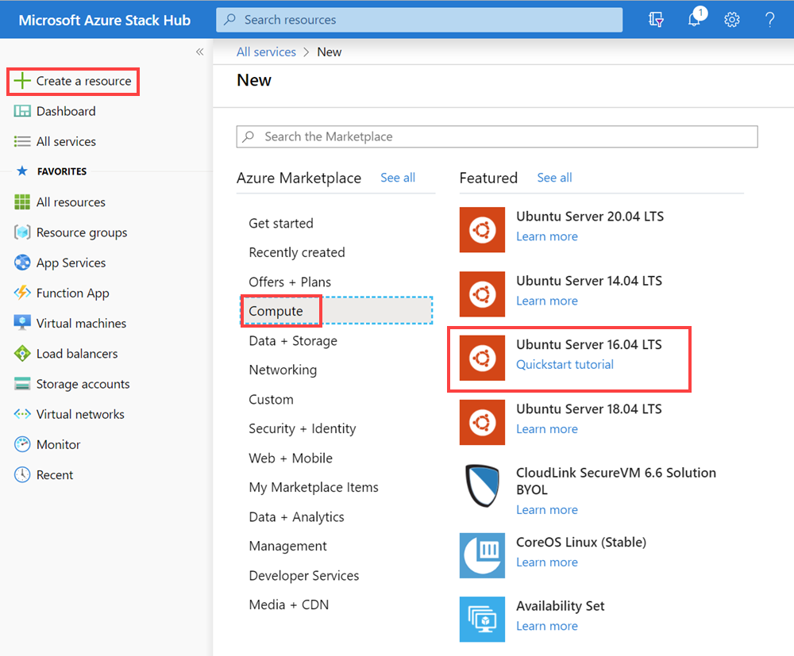
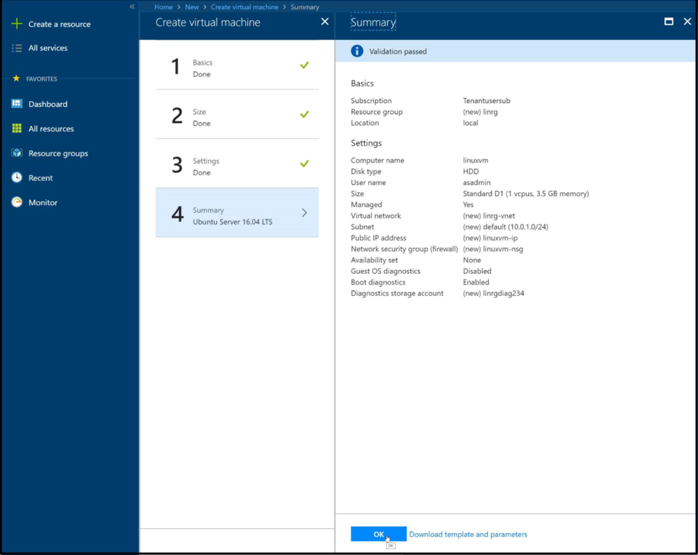

# Quickstart: Create a Linux server VM by using the Azure Stack portal

*Applies to: Azure Stack integrated systems and the Azure Stack Development Kit*

You can create an Ubuntu Server 16.04 LTS virtual machine (VM) by using the Azure Stack portal. In this article, you create and use a virtual machine. This article also shows you how to:

* Connect to the virtual machine with a remote client.
* Install an NGINX web server.
* Clean up your resources.

> [!NOTE]  
> The images in this article are updated to match changes introduced with Azure Stack version 1808. Version 1808 adds support for using *managed disks* in addition to support for unmanaged disks. If you're using an earlier version of Azure Stack, some images for tasks such as disk selection will be different from what is displayed in this article.  


## Prerequisites

* A Linux image in the Azure Stack Marketplace. The Azure Stack Marketplace doesn't have a Linux image by default. Have the Azure Stack operator provide the Ubuntu Server 16.04 LTS image you need. The operator can use the instructions in [Download Marketplace items from Azure to Azure Stack](../operator/azure-stack-download-azure-marketplace-item.md).

* Access to a Secure Shell (SSH) client
  * If you're using the Azure Stack Development Kit (ASDK), you might not have access to an SSH client. If you need a client, there are several packages that include an SSH client. For example, PuTTY includes an SSH client and SSH Key Generator (puttygen.exe). 
  * For more information about available packages, see [How to use an SSH public key](azure-stack-dev-start-howto-ssh-public-key.md).

* This quickstart uses PuTTY to generate the SSH keys and to connect to the Linux server virtual machine. To download and install PuTTY, go to [https://www.putty.org/](https://www.putty.org).

## Create an SSH key pair

You need an SSH key pair to finish all the steps in this article. If you have an existing SSH key pair, you can skip this step.

To create an SSH key pair:

1. Go to the PuTTY installation folder (the default location is *C:\Program Files\PuTTY*) and run:

    `puttygen.exe`

1. In the **PuTTY Key Generator** window, ensure that the **Type of key to generate** is set to **RSA**, and the **Number of bits in a generated key** is set to **2048**.

   

1. Select **Generate**.

1. To generate a key, in the **Key** box, move the pointer randomly.

4. When the key generation has finished, select **Save public key**, and then select **Save private key** to save your keys to files.

   

## Sign in to the Azure Stack portal

Sign in to the Azure Stack portal. The address of the Azure Stack portal depends on which Azure Stack product you're connecting to:

* For the ASDK go to https://portal.local.azurestack.external.
* For an Azure Stack integrated system, go to the URL that your Azure Stack operator provided.

## Create the virtual machine

1. In the upper-left corner of the Azure Stack portal, select **Create a resource**.

1. Select **Compute**, and then select **Ubuntu Server 16.04 LTS**.
   
   

1. Select **Create**.

1. Type the virtual machine information. Under **Authentication type**, select **SSH public key**, paste the SSH public key that you saved, and then select **OK**.

   > [!NOTE]
   > Make sure you remove any leading or trailing white space for the key.

   

1. Select **D1** for the virtual machine.

   

1. On the **Settings** page, make changes to the defaults.
   
   > [!NOTE]
   > As of Azure Stack version 1808, under **Storage**, you can choose to use *managed disks*. Prior to version 1808, only *unmanaged disks* could be used.    

     
    
     When your configurations are ready, select **OK** to continue.

1. On the **Summary** page, select **OK** to start the virtual machine deployment.  

   

## Connect to the virtual machine

1. Select **Connect** on the virtual machine page. You can find the SSH connection string that you need to connect to the virtual machine. 

1. Open PuTTY.

1. On the **PuTTY Configuration** page, in the **Category** pane, scroll down to and expand **SSH**, and then select **Auth**. 

   

1. Select **Browse**, and then select the private key file that you saved.

1. In the **Category** window, scroll up to and select **Session**.

1. In the **Host Name (or IP address)** box, paste the connection string shown in the Azure Stack portal. In this example, the string is *asadmin@192.168.102.34*.

   

1. Select **Open** to open a session for the virtual machine.

   

## Install the NGINX web server

To update package sources and install the latest NGINX package on the virtual machine, enter the following bash commands:

```bash
#!/bin/bash

# update package source
sudo apt-get -y update

# install NGINX
sudo apt-get -y install nginx
```

When you finish installing the NGINX server, close the SSH session and open the virtual machine **Overview** page in the Azure Stack portal.

## Open port 80 for web traffic

A network security group (NSG) secures inbound and outbound traffic. When a virtual machine is created in the Azure Stack portal, an inbound rule is created on port 22 for SSH connections. Because this virtual machine hosts a web server, an NSG rule needs to be created to allow web traffic on port 80.

1. On the virtual machine **Overview** page, select the name of the **Resource group**.

1. Select the **network security group** for the virtual machine. You can identify the NSG by using the **Type** column.

1. In the left pane, under **Settings**, select **Inbound security rules**.

1. Select **Add**.

1. In the **Name** box, type **http**. 

1. Make sure that **Port range** is set to 80 and **Action** is set to **Allow**.

1. Select **OK**

## View the Welcome to nginx page

With NGINX installed and port 80 open on your VM, you can access the web server by using the VM's public IP address. (The public IP address is shown on the virtual machine's **Overview** page.)

Open a web browser, and browse to *http://\<public IP address>*, where \<public IP address> is the address of your VM.


## Clean up resources

Clean up the resources that you don't need any longer. To delete the virtual machine and its resources, select the resource group on the virtual machine page, and then select **Delete**.

## Next steps

In this quickstart, you deployed a basic Linux server virtual machine with a web server. To learn more about Azure Stack virtual machines, continue to [Considerations for virtual machines in Azure Stack](azure-stack-vm-considerations.md).
