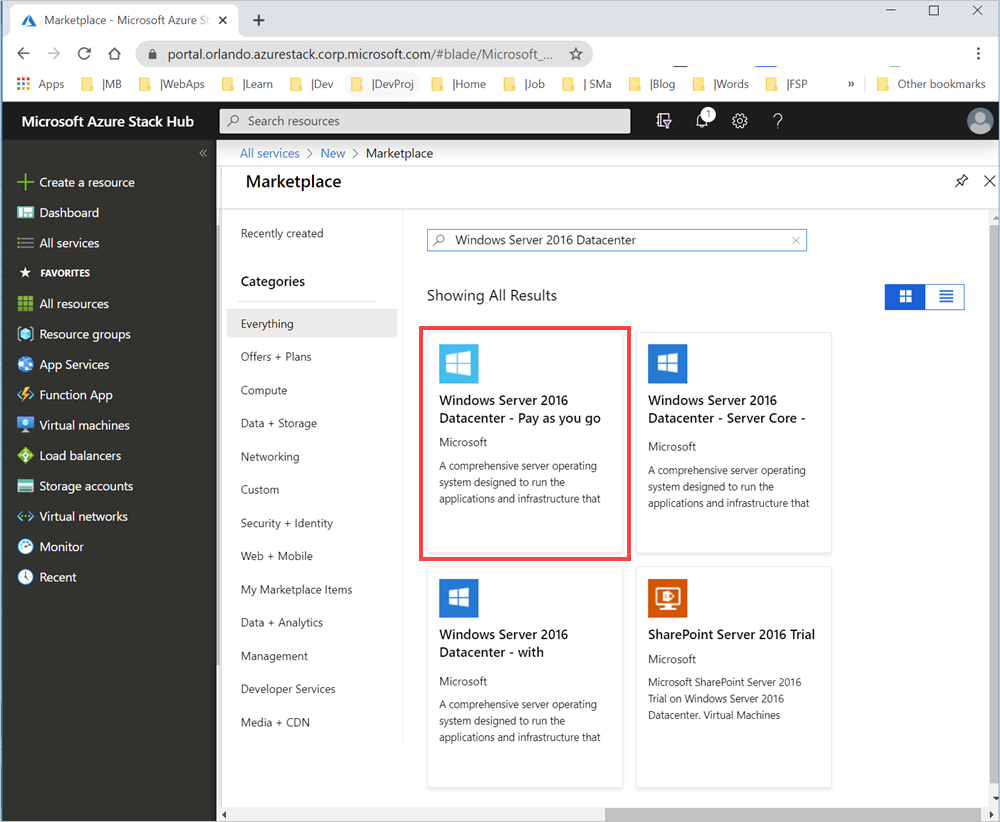
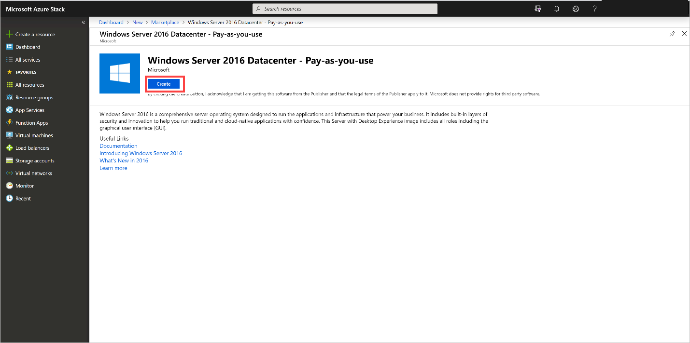
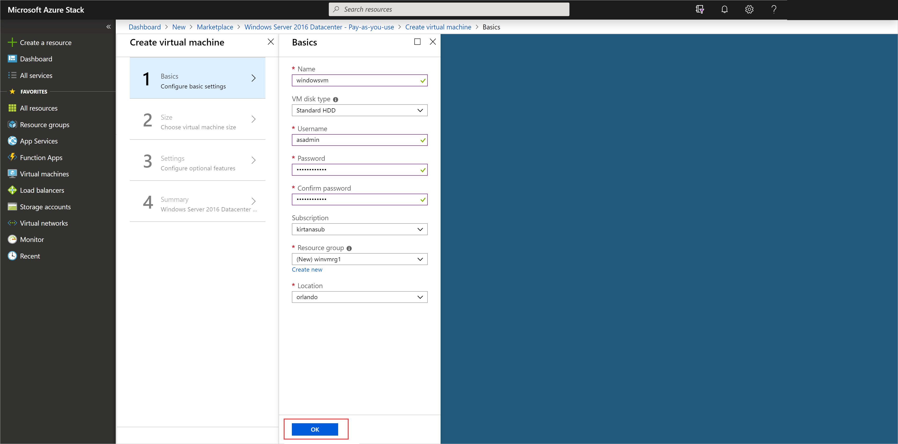
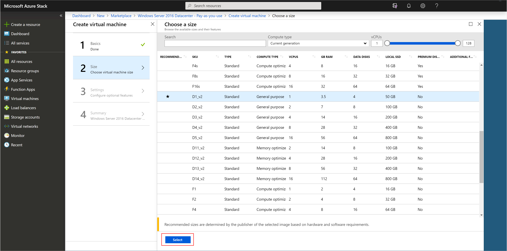
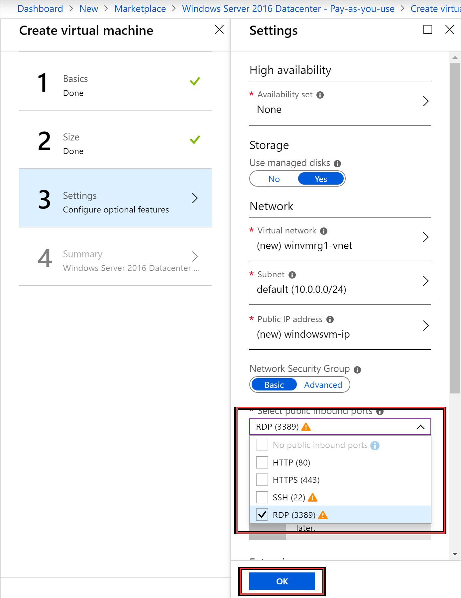
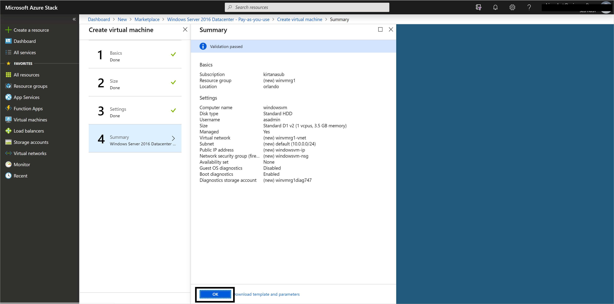
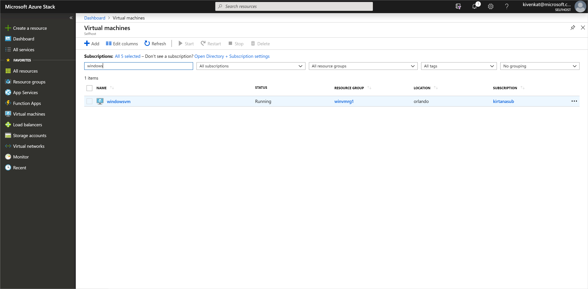

# Quickstart: Create a Windows server VM with the Azure Stack Hub portal

Learn how to create a Windows Server 2016 virtual machine (VM) by using the Azure Stack Hub portal.

> [!NOTE]  
> The screenshots in this article are updated to match the user interface that is introduced with Azure Stack Hub version 1808. 1808 adds support for using *managed disks* in addition to unmanaged disks. If you use an earlier version, some images, like disk selection, will be different than what is displayed in this article.  

## Sign in to the Azure Stack Hub portal

Sign in to the Azure Stack Hub portal. The address of the Azure Stack Hub portal depends on which Azure Stack Hub product you're connecting to:

* For the Azure Stack Development Kit (ASDK), go to: https://portal.local.azurestack.external.
* For an Azure Stack Hub integrated system, go to the URL that your Azure Stack Hub operator provided.

## Create a VM

1. Select **Create a resource** > **Compute** > Search for` Windows Server 2016 Datacenter – Pay as you use`.
    If you don't see the **Windows Server 2016 Datacenter - Pay-as-you-use** entry, contact your Azure Stack Hub cloud operator and ask for the image to be added to the Azure Stack Hub Marketplace. For instructions, your cloud operator can refer to [Create and publish a custom Azure Stack Hub Marketplace item](../operator/azure-stack-create-and-publish-marketplace-item.md).

    

1. Select **Create**.

    

1. Enter a **Name**, **Disk Type**, **User name**, and **Password** under **Basics**. Choose a **Subscription**. Create a** Resource group**, or select an existing one, select a **Location**, and then select **OK**.

    

1. Select** D1_v2** under **Size**,  and then choose on **Select**.

    

1. Make any desired changes to the defaults on the **Settings** blade. Use managed disks. If you need to allow RDP access, select **RDP (3389)** to open the port. When your configurations are ready, select **OK**.

    

1. Select **OK** under **Summary** to create the VM.

    

1. Select **Virtual Machines** to review your new VM. Search for the VM name, and then select the VM in the search results.

## Clean up resources

When you're finished using the VM, delete the VM and its resources. To do so, select the resource group on the VM page and select **Delete**.

## Next steps

In this quickstart, you deployed a basic Windows Server VM. To learn more about Azure Stack Hub VMs, continue to [Considerations for VMs in Azure Stack Hub](azure-stack-vm-considerations.md).
