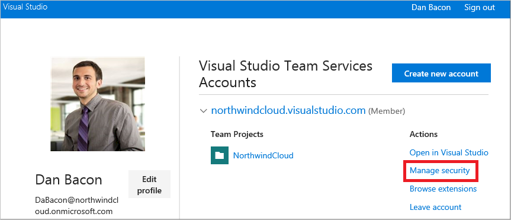

# Tutorial: Deploy apps to Azure and Azure Stack

*Applies to: Azure Stack integrated systems and Azure Stack Development Kit*

In this tutorial, you learn how to deploy apps to Azure and Azure Stack by using Azure Pipelines hybrid continuous integration and continuous delivery (CI/CD).

The tutorial walks you through creating a sample Azure Stack environment and Azure Pipeline that:

> [!div class="checklist"]
> - Initiates a new build based on code commits to your Azure Repos repository
> - Automatically deploys your app to Azure AD for user acceptance testing
> - Automatically deploys the app to Azure Stack when it passes testing

To learn more about CI/CD, see the following articles:

* [What is Continuous Integration?](https://www.visualstudio.com/learn/what-is-continuous-integration/)
* [What is Continuous Delivery?](https://www.visualstudio.com/learn/what-is-continuous-delivery/)

## Azure Stack and hybrid CI/CD pipelines overview

  
Microsoft Azure Stack is an extension of Azure that brings the agility and innovation of cloud computing to your on-premises environment. It's the only hybrid cloud that lets you build and deploy hybrid apps in both on-premises and public cloud environments. 

App deployment continuity, security, and reliability are critical elements for your organization and development team. The Azure Pipelines hybrid CI/CD delivery model lets you consolidate your build pipelines across your on-premises environment and the public cloud, and change deployment locations without changing your app. Other benefits of using the hybrid approach are:

- You can maintain a consistent set of development tools across your on-premises Azure Stack environment and the Azure public cloud.  A common tool set makes it easier to implement CI/CD patterns and practices.
- Apps and services deployed in Azure or Azure Stack are interchangeable, and the same code can run in either location. You can take advantage of on-premises and public cloud features and capabilities.

The white paper [Design considerations for hybrid applications](https://aka.ms/hybrid-cloud-applications-pillars) reviews designing, deploying, and operating hybrid apps for placement, scalability, availability, resiliency, manageability, and security. These design considerations assist in optimizing hybrid app design to minimize challenges in production environments.

## Prerequisites

- Basic knowledge of Azure and Azure Stack. To learn more before starting the tutorial, read the following articles:
  
  - [Introduction to Azure](https://azure.microsoft.com/overview/what-is-azure/)
  - [Azure Stack overview](../operator/azure-stack-overview.md)
  
- An Azure subscription. If you don't have one, [create a free account](https://azure.microsoft.com/free/?WT.mc_id=A261C142F) before you begin.
  
- Visual Studio 2019 [installed](/visualstudio/install/install-visual-studio).
   
- An Azure Stack integrated system, or the Azure Stack Development Kit (ASDK) deployed and configured according to the following instructions. 

### Install and deploy the ASDK

The Azure Stack Development Kit (ASDK) is a single-node deployment of Azure Stack that you can download and use for free. The ASDK lets you evaluate Azure Stack and use Azure APIs and tooling in a non-production environment.

Any user with Azure AD or Active Directory Federation Services (AD FS) admin credentials can deploy the ASDK. An Azure OEM/hardware partner can deploy a production Azure Stack. 

You must be an Azure Stack operator to do the following Azure Stack deployment tasks: 

- Deploy Azure App Service
- Create plans and offers
- Create a tenant subscription
- Apply a Windows Server 2016 image

> [!Note]
> The ASDK installation takes approximately seven hours, so plan accordingly.
  
If you already have any of the following components, make sure they meet all the requirements before starting this tutorial.

To deploy the ASDK:
  
  1. Follow the detailed deployment instructions in [Tutorial: Deploy the ASDK using the installer](../asdk/asdk-install.md).
     
  1. Use the [ConfigASDK.ps1](https://github.com/mattmcspirit/azurestack/blob/master/deployment/ConfigASDK.ps1) PowerShell script to automate ASDK post-deployment steps.
     
  1. Deploy [Azure App Service](../operator/azure-stack-app-service-deploy.md) PaaS services to Azure Stack.
     
  1. Create a [plan and offer](../operator/azure-stack-plan-offer-quota-overview.md) in Azure Stack.
     
  1. Create a [tenant subscription](../operator/azure-stack-subscribe-plan-provision-vm.md) to the offer in Azure Stack. 
     
  1. Deploy a Windows Server 2016 VM with .NET 3.5 in the tenant subscription, to use as your build server and to run Azure Pipelines.
  
  > [!Note]
  > Your Azure Stack environment needs the correct images to run Windows Server and SQL Server. It must also have Azure App Service deployed.

1. [Sign in to Azure DevOps](https://www.visualstudio.com/docs/setup-admin/team-services/connect-to-visual-studio-team-services), and create a new project.
   
## Create the Service Principal and assign a role in Azure AD 

Azure Pipelines authenticates against Azure Resource Manager using a Service Principal. For Azure Pipelines to provision resources for your app, the app must have the **Contributor** role in the Azure Stack subscription. To configure authentication for your app:

1. Create a Service Principal and access key. Or, use an existing Service Principal.
1. Use Role-Based Access Control (RBAC) to validate the Azure Stack subscription and give the Service Principal Name (SPN) the **Contributor** role.

### Create a Service Principal and access key

Use the instructions in [create an Azure AD application and service principal](/azure/active-directory/develop/howto-create-service-principal-portal) to create a service principal. Under **Redirect URI**, select **Web** for the type of application you want to create, and enter the URI for your web app. 

Save the Principal ID to use when creating endpoints. 

Or, [use the PowerShell script](https://github.com/Microsoft/vsts-rm-extensions/blob/master/TaskModules/powershell/Azure/SPNCreation.ps1#L5) as explained in the article [Create an Azure Resource Manager service connection with an existing service principal](/vsts/pipelines/library/connect-to-azure?view=vsts#create-an-azure-resource-manager-service-connection-with-an-existing-service-principal).

 > [!Note]  
 > If you use the PowerShell script to create an Azure Stack Azure Resource Manager endpoint, you need to pass the **-azureStackManagementURL** parameter and **-environmentName** parameter. For example:  
 > `-azureStackManagementURL https://management.local.azurestack.external -environmentName AzureStack`

A Service Principal requires a key for authentication. Use the following steps to generate a key:

1. In the Azure portal, select **Azure Active Directory**.
   
   
   
1. Select **App registrations** in the left navigation, and then select your app.
   
   
   
1. Copy and save the **Application ID** to use when creating endpoints. 
   
   
   
1. To generate an authentication key, select **Settings**, and then select **Keys**.
   
   
   
   
   
1. Provide a description and set the duration of the key, and then select **Save**.
   
   
   
   After you save the key, copy and save the key **VALUE**. You can't get this value later. You need the **key value** with the **application ID** to sign in as the app. Store the key value where your app can retrieve it.
   
   
   
### Grant the service principal rights to deploy resources

Azure Role-Based Access Control (RBAC) provides fine-grained access management for Azure. By using RBAC, you can control the level of access that users need to do their jobs. For more information about RBAC, see [Manage access to Azure subscription resources](/azure/role-based-access-control/role-assignments-portal?toc=%252fazure%252factive-directory%252ftoc.json).

To access resources in your subscription, you must assign your app to a role. Decide which role represents the best permissions for the app. To learn about the available roles, see [RBAC: Built-in roles](/azure/role-based-access-control/built-in-roles).

You can set the role scope at the subscription, resource group, or resource level. Permissions are inherited to lower levels of scope. For example, adding an app to the **Reader** role for a resource group means the app can read the resource group and any of its resources.

1. Navigate to the scope you want to assign the app to. For example, to assign a role at the subscription scope, select **Subscriptions**.
   
   
   
1. In **Subscription**, select Visual Studio Enterprise.
   
   
   
1. In Visual Studio Enterprise, select **Access Control (IAM)**.
   
1. Select **Add role assignment**.
   
   
   
1. In **Add permissions**, select the role you that you want to assign to the app. In this example, it's the **Owner** role.
   
   
   
1. Azure Active Directory apps aren't shown in the available options by default. Search for your app in the **Select** field, and then select the app.
   
   
   
1. Select **Save** to finish assigning the role. You can see your app in the list of users assigned to the role for that scope.

## Create Azure Stack endpoints in Azure Pipelines

By creating endpoints, an Azure Pipelines build can deploy Azure AD apps to Azure Stack. Azure Pipelines connects to the build agent, which connects to Azure Stack.

After setting endpoint creation permissions, you can create endpoints in either Azure AD or AD FS. 

- If you used Azure AD as the identity provider for Azure Stack, you can use the service principal to create an Azure Resource Manager service connection for Azure deployments. 
  
- You can also create a service connection using a service principal with a certificate for authentication. You need this connection to deploy Azure Stack with Active Directory Federation Services (AD FS) as the identity provider. 

### Set endpoint creation permissions

1. Sign in to VSTO and navigate to the app settings page.
2. In **Settings**, select **Security**.
3. In **Azure DevOps Services Groups**, select **Endpoint Creators**.

    

4. On the **Members** tab, select **Add**.

    

5. On the **Add users and groups** page, enter a user name and select that user from the list of users.
6. Select **Save changes**.
7. In the **Azure DevOps Services Groups** list, select **Endpoint Administrators**.

    

8. On the **Members** tab, select **Add**.
9. On the **Add users and groups** page, enter a user name and select that user from the list of users.
10. Select **Save changes**.

Now that the endpoint information exists, the Azure Pipelines to Azure Stack connection is ready to use. The build agent in Azure Stack gets instructions from Azure Pipelines, and then the agent conveys endpoint information for communication with Azure Stack.

### Create an endpoint for Azure AD deployments

Follow the instructions in [Create an Azure Resource Manager service connection with an existing service principal](/devops/pipelines/library/connect-to-azure#create-an-azure-resource-manager-service-connection-with-an-existing-service-principal) to create a service connection using the existing service principal. Use the following mapping:

| Name | Example | Description |
| --- | --- | --- |
| Connection name | Azure Stack Azure AD | The name of the connection. |
| Environment | AzureStack | The name of your environment. |
| Environment URL | `https://management.local.azurestack.external` | Your management endpoint. |
| Scope level | Subscription | The scope of the connection. |
| Subscription ID | 65710926-XXXX-4F2A-8FB2-64C63CD2FAE9 | User subscription ID from Azure Stack |
| Subscription name | name@contoso.com | User subscription name from Azure Stack. |
| Service Principal client ID | FF74AACF-XXXX-4776-93FC-C63E6E021D59 | The principal ID from [this](azure-stack-solution-pipeline.md#create-a-service-principal) section in this article. |
| Service Principal key | THESCRETGOESHERE= | The key from the same article (or the password if you used the script). |
| Tenant ID | D073C21E-XXXX-4AD0-B77E-8364FCA78A94 | The tenant ID you retrieve following the instruction at [Get the tenant ID](azure-stack-solution-pipeline.md#get-the-tenant-id).  |
| Connection: | Not verified | Validate your connection settings to the service principal. |

> [!Note]
> If your Azure Resource Manager endpoint isn't exposed to the internet, the connection validation will fail. This is expected, and you can validate your connection by creating a release pipeline with a simple task. 

### Create an endpoint for AD FS

You can also create a service connection using a service principal with a certificate for authentication. You need this connection if you deployed Azure Stack with AD FS as the identity provider. 

Create the service connection using the following mapping:

| Name | Example | Description |
| --- | --- | --- |
| Connection name | Azure Stack ADFS | The name of the connection. |
| Environment | AzureStack | The name of your environment. |
| Environment URL | `https://management.local.azurestack.external` | Your management endpoint. |
| Scope level | Subscription | The scope of the connection. |
| Subscription ID | 65710926-XXXX-4F2A-8FB2-64C63CD2FAE9 | User subscription ID from Azure Stack |
| Subscription name | name@contoso.com | User subscription name from Azure Stack. |
| Service Principal client ID | FF74AACF-XXXX-4776-93FC-C63E6E021D59 | The client ID from the Service Principal you created for AD FS. |
| Certificate | `<certificate>` |  Convert the certificate file from PFX to PEM. Paste certificate PEM file content into this field.   Converting PFX to PEM: `openssl pkcs12 -in file.pfx -out file.pem -nodes -password pass:<password_here>` |
| Tenant ID | D073C21E-XXXX-4AD0-B77E-8364FCA78A94 | The tenant ID you retrieve following the instruction at [Get the tenant ID](azure-stack-solution-pipeline.md#get-the-tenant-id). |
| Connection: | Not verified | Validate your connection settings to the service principal. |

## Install the Azure Pipelines build agent on the Azure Stack build server

First, create a personal access token (PAT) to use for Azure Stack. Then, deploy the build agent to the Azure Stack host computer using the PAT, and configure the agent. 
   
1. Sign in to Azure DevOps and select **My profile** in the upper right corner. 
   
1. On your profile page, expand the dropdown next to your Azure Stack organization name, and select **Manage Security**. 
   
   
   
1. On the **Personal Access Tokens** page, select **New Token**.
   
   
   
1. On the **Create a new personal access token** page, fill out the token information and select **Create**. 
   
   
   
1. Copy and save the token. It won't be shown again after you leave the web page.
   
   
   
1. Connect to the build server VM you deployed on the Azure Stack host.
   
1. Download and deploy the build agent as a service using your personal access token (PAT), and run it as the VM admin.
   
   
   
1. Navigate to the folder for the extracted build agent. Run the *config.cmd* file from an elevated command prompt.
   
   
   
   
   
1. When the *config.cmd* finishes, the build agent folder is updated with additional files. The folder with the extracted contents should look like the following example:
   
   
   
   You can see the agent in Azure DevOps Services folder.

Now that the endpoint is created and the Azure Pipelines build agent is installed on the build server, the Azure Pipelines to Azure Stack connection is ready to use. The build agent in Azure Stack gets instructions from Azure Pipelines, and then the agent conveys endpoint information for communication with Azure Stack.

‎‎Instead of managing each agent separately, you can organize agents into agent pools. An agent pool defines the sharing boundary for all agents in that pool. Aagent pools are scoped to the Azure DevOps organization, which means that you can share an agent pool across projects. To learn more about agent pools, see [Create agent pools and queues](/azure/devops/pipelines/agents/pools-queues).

## Develop and release your app 

Using a hosted build agent in Azure Pipelines is a convenient option for building and deploying web apps. Azure automatically performs agent maintenance and upgrades, which enables a continuous and uninterrupted development cycle.

Azure Pipelines provides a highly configurable and manageable pipeline for releases to multiple environments such as development, staging, quality assurance (QA), and production. The release process can include requiring approvals at specific stages of the application life cycle.

In this part of the tutorial, you:

- Add code to your Azure DevOps project
- Create a self-contained web app deployment
- Configure the CI/CD process

Hybrid CI/CD can apply to both app code and infrastructure code. Use [Azure Resource Manager templates](https://azure.microsoft.com/resources/templates/) like web app code from Azure DevOps Services to deploy to both clouds.

### Add code to an Azure DevOps project

1. In Visual Studio **Team Explorer**, select the **Connect** icon and sign in to your Azure DevOps organization. 
   
   
   
1. Select **Manage Connections** > **Connect to a project**. 
   
   

1. In the **Connect to a Project** dialog, select your web app project, set a local path, and then select **Clone** to clone the repository.
   
   

### Create self-contained web app deployment for App Services in both clouds

1. Edit the **WebApplication.csproj** file: Select `Runtimeidentifier` and then add `win10-x64.` For more information, see [Self-contained deployment](https://docs.microsoft.com/dotnet/core/deploying/#self-contained-deployments-scd) documentation.

    

2. Use Team Explorer to check the code into Azure DevOps Services.

3. Confirm that the application code was checked into Azure DevOps Services.

### Create a build pipeline

1. Sign in to an Azure DevOps organization that can create a build pipeline.

2. Navigate to the **Build Web Application** page for the project.

3. In **Arguments**, add **-r win10-x64** code. This step is required to trigger a self-contained deployment with .NET Core.

    

4. Run the build. The [self-contained deployment build](https://docs.microsoft.com/dotnet/core/deploying/#self-contained-deployments-scd) process will publish artifacts that can run on Azure and Azure Stack.

### Create a release pipeline

Creating a release pipeline is the final step in your app build process. This release pipeline is used to create a release and deploy a build.

1. Sign in to Azure DevOps Services and navigate to **Azure Pipelines** for your project.
2. On the **Releases** tab, select **\[ + ]**  and then pick **Create release definition**.

   

3. On the **Select a Template** page, choose **Azure App Service Deployment**, and then select **Apply**.

    

4. On the **Add artifact** page, from the **Source (Build definition)** pull-down menu, select the Azure Cloud build app.

    

5. On the **Pipeline** tab, select the **1 Phase**, **1 Task** link to **View environment tasks**.

    

6. On the **Tasks** tab, enter Azure as the **Environment name** and select the AzureCloud Traders-Web EP from the **Azure subscription** drop-down list.

    

7. Enter the **Azure app service name**, which is "northwindtraders" in the next screen capture.

    

8. For the Agent phase, select **Hosted VS2017** from the **Agent queue** drop-down list.

    

9. In **Deploy Azure App Service**, select the valid **Package or folder** for the environment.

    

10. On the **Select File or Folder** page, select **OK** for the folder location.

    

11. Save all changes and go back to **Pipeline**.

    

12. On the **Pipeline** tab, select **Add artifact**, and choose the **NorthwindCloud Traders-Vessel** from the **Source (Build Definition)** drop-down list.

    

13. On the **Select a Template** page, add another environment. Pick **Azure App Service Deployment** and then select **Apply**.

    

14. Enter "Azure Stack" as the **Environment name**.

    

15. On the **Tasks** tab, find and select Azure Stack.

    

16. From the **Azure subscription** drop-down list, select  "AzureStack Traders-Vessel EP" for the Azure Stack endpoint.

    

17. Enter the Azure Stack web app name as the **App service name**.

    

18. Under **Agent selection**, pick "AzureStack -bDouglas Fir" from the **Agent queue** drop-down list.

    

19. For **Deploy Azure App Service**, select the valid **Package or folder** for the environment. On **Select File Or Folder**, select **OK** for the folder **Location**.

    

    

20. On the **Variables** tab, find the variable named **VSTS_ARM_REST_IGNORE_SSL_ERRORS**. Set the variable value to **true**, and set its scope to **Azure Stack**.

    

21. On the **Pipeline** tab, select the **Continuous deployment trigger** icon for the NorthwindCloud Traders-Web artifact and set the **Continuous deployment trigger** to **Enabled**.  Do the same thing for the "NorthwindCloud Traders-Vessel" artifact.

    

22. For the Azure Stack environment, select the **Pre-deployment conditions** icon set the trigger to **After release**.

    

23. Save all your changes.

> [!Note]
> Some settings for release tasks may have been automatically defined as [environment variables](https://docs.microsoft.com/azure/devops/pipelines/release/variables?view=vsts#custom-variables) when you created a release pipeline from a template. These settings can't be modified in the task settings. However, you can edit these settings in the parent environment items.

## Release the app

Now that you've completed the modifications to the release pipeline, it's time to start the deployment. To begin deployment, create a release from the release pipeline. A release may be created automatically; for example, when the continuous deployment trigger is set in the release pipeline. Setting this trigger means that modifying the source code will start a new build and then a new release. However, in this section you'll create a new release manually.

1. On the **Pipeline** tab, open the **Release** drop-down list and select **Create release**.

    

2. Enter a description for the release, check to see that the correct artifacts are selected, and then select **Create**. After a few moments, a banner appears indicating that the new release was created, and the release name is displayed as a link. Select the link to see the release summary page.

    

3. The release summary page for shows details about the release. In the following screen capture for "Release-2", the **Environments** section shows the **Deployment status** for Azure as "IN PROGRESS", and the status for Azure Stack is "SUCCEEDED". When the deployment status for the Azure environment changes to "SUCCEEDED", a banner appears indicating that the release is ready for approval. When a deployment is pending or has failed, a blue **(i)** information icon is shown. Hover over the icon to see a pop-up that contains the reason for delay or failure.

    

Other views, such as the list of releases, will also display an icon that indicates approval is pending. The pop-up for this icon shows the environment name and more details related to the deployment. It's easy for an administrator see the overall progress of releases and see which releases are waiting for approval.

### Monitor and track deployments

This section shows how you can monitor and track all your deployments. The release for deploying the two Azure App Services websites provides a good example.

1. On the "Release-2" summary page, select **Logs**. During a deployment, this page shows the live log from the agent. The left pane shows the status of each operation in the deployment for each environment.

    Select the person icon in the **Action** column for a Pre-deployment or Post-deployment approval to see who approved (or rejected) the deployment, and the message they provided.

2. After the deployment finishes, the entire log file is displayed in the right pane. Select any **Step** in the left pane to see the log file for a single step, such as "Initialize Job". The ability to see individual logs makes it easier to trace and debug  parts of the overall deployment. You can also **Save** the log file for a step, or **Download all logs as zip**.

    

3. Open the **Summary** tab to see general information about the release. This view shows details about the build, the environments it was deployed to, deployment status, and other information about the release.

4. Select an environment link (**Azure** or **Azure Stack**) to see information about existing and pending deployments to a specific environment. You can use these views as a quick way to verify that the same build was deployed to both environments.

5. Open the **deployed production app** in your browser. For example, for the Azure App Services website, open the URL `https://[your-app-name].azurewebsites.net`.

## Next steps

* To learn more about Azure Cloud Patterns, see [Cloud Design Patterns](https://docs.microsoft.com/azure/architecture/patterns).
