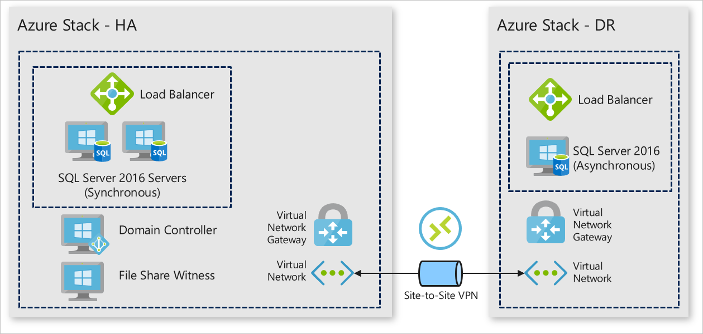

# Deploy a SQL 2016 availability group to Azure and Azure Stack

This article will step you through an automated deployment of a basic highly available (HA) SQL Server 2016 Enterprise cluster with an
asynchronous disaster recovery (DR) site across two Azure Stack environments. To learn more about SQL Server 2016 and high availability,
see [Always On availability groups: a high-availability and disaster-recovery solution](https://docs.microsoft.com/sql/database-engine/availability-groups/windows/always-on-availability-groups-sql-server?view=sql-server-2016).

This pattern and architecture was created through customer research by one of our summer interns, Suren Jamiyanaa.

You'll learn how to:

  - Orchestrate a deployment across two Azure Stacks
  - Use Docker to minimize dependency issues with Azure API Profiles
  - Deploy a basic highly available SQL Server 2016 Enterprise cluster with a disaster recovery site

## Architecture 



## Prerequisites

  - Two (2) connected Azure Stack Integrated Systems (Azure Stack), this deployment does not work on Azure Stack Development Kits (ASDKs). To learn more about Azure Stack, see [What is Azure Stack?](https://azure.microsoft.com/overview/azure-stack/).
  - A tenant subscription on each Azure Stack.    
      - **Make a note of each subscription ID and the Azure Resource Manager endpoint for each Azure Stack.**
  - An Azure Active Directory (AAD) service principal that has permissions to the tenant subscription on each Azure Stack. You may need to create two service principals if the Azure Stacks are deployed against different AAD tenants. To learn how to create a service principal for Azure Stack, see [Create service principals to give applications access to Azure Stack resources](https://docs.microsoft.com/azure-stack/user/azure-stack-create-service-principals).
      - **Make a note of each service principal's application ID, client secret, and tenant name (xxxxx.onmicrosoft.com).**
  - SQL Server 2016 Enterprise syndicated to each Azure Stack's Marketplace. To learn more about marketplace syndication, see [Download marketplace items from Azure to Azure Stack](https://docs.microsoft.com/azure-stack/operator/azure-stack-download-azure-marketplace-item).
    **Make sure that your organization has the appropriate SQL licenses.**
  - [Docker for Windows](https://docs.docker.com/docker-for-windows/) installed on your local machine.

## Get the Docker image

Docker images for each deployment eliminate dependency issues between
different versions of Azure PowerShell.

1.  Make sure that Docker for Windows is using Windows containers.
2.  Run the following in an elevated command prompt to get the Docker container with the deployment scripts.

```
 docker pull intelligentedge/sqlserver2016-hadr:1.0.0
```

## Deploy the availability group

1.  Once the container image has been successfully pulled, start the image.

```
 docker run -it intelligentedge/sqlserver2016-hadr:1.0.0 powershell
```

2.  Once the container has started, you will be given an elevated PowerShell terminal in the container. Change directories to get to the deployment script.

  ```
  cd .\SQLHADRDemo\
  ```

3.  Run the deployment. Provide credentials and resource names where needed. HA refers to the Azure Stack where the HA cluster will be deployed, and DR to the Azure Stack where the DR cluster will be deployed.

  ```powershell
  > .\Deploy-AzureResourceGroup.ps1 `
  -AzureStackApplicationId_HA "applicationIDforHAServicePrincipal" `
  -AzureStackApplicationSercet_HA "clientSecretforHAServicePrincipal" `
  -AADTenantName_HA "hatenantname.onmicrosoft.com" `
  -AzureStackResourceGroup_HA "haresourcegroupname" `
  -AzureStackArmEndpoint_HA "https://management.haazurestack.com" `
  -AzureStackSubscriptionId_HA "haSubscriptionId" `
  -AzureStackApplicationId_DR "applicationIDforDRServicePrincipal" `
  -AzureStackApplicationSercet_DR "ClientSecretforDRServicePrincipal" `
  -AADTenantName_DR "drtenantname.onmicrosoft.com" `
  -AzureStackResourceGroup_DR "drresourcegroupname" `
  -AzureStackArmEndpoint_DR "https://management.drazurestack.com" `
  -AzureStackSubscriptionId_DR "drSubscriptionId"
  ```

4.  Type "Y" to allow the NuGet provider to be installed, which will kick off the API Profile "2018-03-01-hybrid" modules to be installed.

5.  Wait for resource deployment to complete.

6.  Once DR resource deployment has completed, exit the container.

```
exit
```

7.  Inspect the deployment by viewing the resources in each Azure Stack's portal. Connect to one of the SQL instances on the HA environment and inspecting the Availability Group through SQL Server Management Studio (SSMS).


# Next steps

  - Use SQL Server Management Studio to manually fail over the cluster, see [Perform a Forced Manual Failover of an Always On Availability Group (SQL Server)](https://docs.microsoft.com/sql/database-engine/availability-groups/windows/perform-a-forced-manual-failover-of-an-availability-group-sql-server?view=sql-server-2017)
  - Learn more about hybrid cloud applications, see [Hybrid Cloud Solutions.](https://aka.ms/azsdevtutorials)
  - Use your own data or modify the code to this sample on [GitHub](https://github.com/Azure-Samples/azure-intelligent-edge-patterns).
