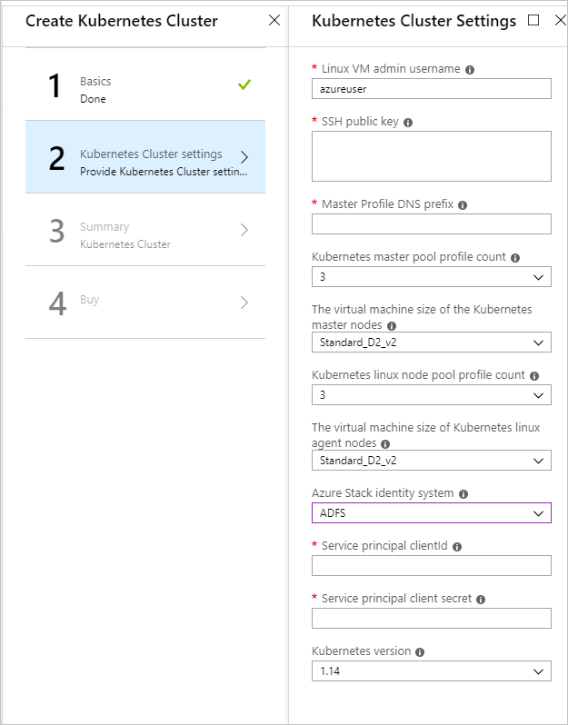

# Deploy Kubernetes to Azure Stack using Active Directory Federated Services

*Applies to: Azure Stack integrated systems and Azure Stack Development Kit*

> [!Note]  
> Only use the Kubernetes Azure Stack Marketplace item to deploy clusters as a proof-of-concept. For supported Kubernetes clusters on Azure Stack, use [the AKS engine](azure-stack-kubernetes-aks-engine-overview.md).

You can follow the steps in this article to deploy and set up the resources for Kubernetes. Use these steps when Active Directory Federated Services (AD FS) is your identity management service.

## Prerequisites 

To get started, make sure you have the right permissions and that your Azure Stack is ready.

1. Generate an SSH public and private key pair to sign in to the Linux VM on Azure Stack. You need the public key when creating the cluster.

    For instructions on generating a key, see [SSH Key Generation](azure-stack-dev-start-howto-ssh-public-key.md).

1. Check that you have a valid subscription in your Azure Stack tenant portal, and that you have enough public IP addresses available to add new applications.

    The cluster cannot be deployed to an Azure Stack **Administrator** subscription. You must use a **User** subscription. 

1. If you do not have Kubernetes Cluster in your marketplace, talk to your Azure Stack administrator.

## Create a service principal

You need to work with your Azure Stack administrator to set up your service principal when using AD FS as your identity solution. The service principal gives your application access to Azure Stack resources.

1. Your Azure Stack administrator provides you with the information for the service principal. The service principal information should look like:

     ```Text  
       ApplicationIdentifier : S-1-5-21-1512385356-3796245103-1243299919-1356
       ClientId              : 3c87e710-9f91-420b-b009-31fa9e430145
       ClientSecret          : <your client secret>
       Thumbprint            : <often this value is empty>
       ApplicationName       : Azurestack-MyApp-c30febe7-1311-4fd8-9077-3d869db28342
       PSComputerName        : 192.168.200.224
       RunspaceId            : a78c76bb-8cae-4db4-a45a-c1420613e01b
     ```

2. Assign your new service principal a role as a contributor to your subscription. For instructions, see [Assign a role](../operator/azure-stack-add-users-adfs.md).

## Deploy Kubernetes

1. Open the [Azure Stack portal](https://portal.local.azurestack.external).

1. Select **+ Create a resource** > **Compute** > **Kubernetes Cluster**. Select **Create**.

    

### 1. Basics

1. Select **Basics** in Create Kubernetes Cluster.

    

1. Select your **Subscription** ID.

1. Enter the name of a new resource group or select an existing resource group. The resource name needs to be alphanumeric and lowercase.

1. Select the **Location** of the resource group. This is the region you choose for your Azure Stack installation.

### 2. Kubernetes Cluster Settings

1. Select **Kubernetes Cluster Settings** in Create Kubernetes Cluster.

    

1. Enter the **Linux VM admin username**. User name for the Linux Virtual Machines that are part of the Kubernetes cluster and DVM.

1. Enter the **SSH Public Key** used for authorization to all Linux machines created as part of the Kubernetes cluster and DVM.

1. Enter the **Master Profile DNS Prefix** that is unique to the region. This must be a region-unique name, such as `k8s-12345`. Try to chose it same as the resource group name as best practice.

    > [!Note]  
    > For each cluster, use a new and unique master profile DNS prefix.

1. Select the **Kubernetes master pool profile count**. The count contains the number of nodes in the master pool. There can be from 1 to 7. This value should be an odd number.

1. Select **The VMSize of the Kubernetes master VMs**.

1. Select the **Kubernetes node pool profile count**. The count contains the number of agents in the cluster. 

1. Select the **VMSize of the Kubernetes node VMs**. This specifies the VM Size of Kubernetes node VMs. 

1. Select **ADFS** for the **Azure Stack identity system** for your Azure Stack installation.

1. Enter the **Service principal clientId** This is used by the Kubernetes Azure cloud provider. The Client ID identified as the Application ID when your Azure Stack administrator created the service principal.

1. Enter the **Service principal client secret**. This is the client secret provided to you for your AD FS service principle from your Azure Stack administrator.

1. Enter the **Kubernetes version**. This is the version for the Kubernetes Azure provider. Azure Stack releases a custom Kubernetes build for each Azure Stack version.

### 3. Summary

1. Select Summary. The blade displays a validation message for your Kubernetes Cluster configurations settings.

    

2. Review your settings.

3. Select **OK** to deploy your cluster.

> [!TIP]  
>  If you have questions about your deployment, you can post your question or see if someone has already answered the question in the [Azure Stack Forum](https://social.msdn.microsoft.com/Forums/azure/home?forum=azurestack). 

## Next steps

[Connect to your cluster](azure-stack-solution-template-kubernetes-deploy.md#connect-to-your-cluster)

[Enable the Kubernetes Dashboard](azure-stack-solution-template-kubernetes-dashboard.md)