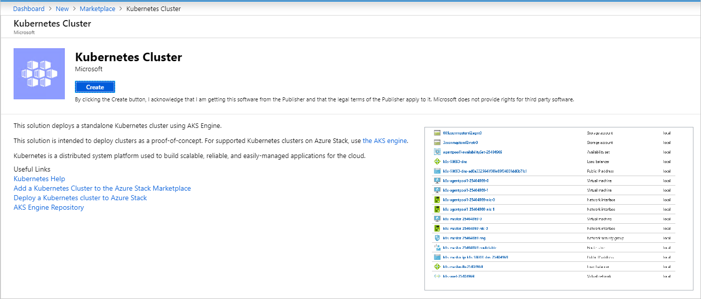
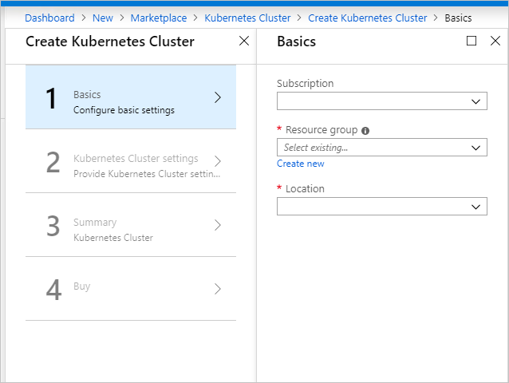
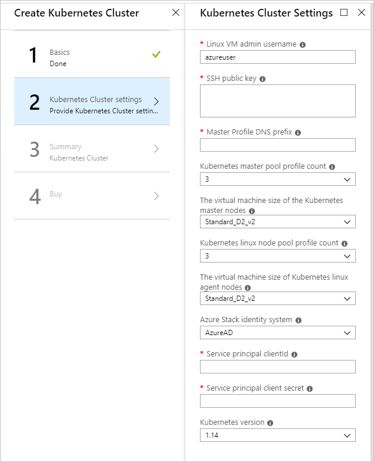
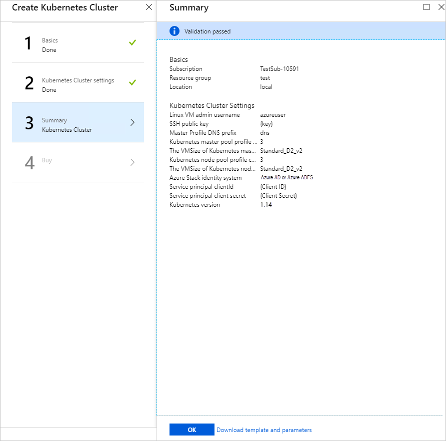

# Deploy Kubernetes to Azure Stack Hub using Azure Active Directory

> [!Note]  
> Only use the Kubernetes Azure Stack Marketplace item to deploy clusters as a proof-of-concept. For supported Kubernetes clusters on Azure Stack, use [the AKS engine](azure-stack-kubernetes-aks-engine-overview.md).

You can follow the steps in this article to deploy and set up the resources for Kubernetes, when using Azure Active Directory (Azure AD) as your identity management service, in a single, coordinated operation.

## Prerequisites

To get started, make sure you have the right permissions and that your Azure Stack Hub is ready.

1. Verify that you can create applications in your Azure Active Directory (Azure AD) tenant. You need these permissions for the Kubernetes deployment.

    For instructions on checking your permissions, see [Check Azure Active Directory permissions](https://docs.microsoft.com/azure/azure-resource-manager/resource-group-create-service-principal-portal).

1. Generate an SSH public and private key pair to sign in to the Linux VM on Azure Stack Hub. You will need the public key when creating the cluster.

    For instructions on generating a key, see [SSH Key Generation](azure-stack-dev-start-howto-ssh-public-key.md).

1. Check that you have a valid subscription in your Azure Stack Hub tenant portal, and that you have enough public IP addresses available to add new applications.

    The cluster cannot be deployed to an Azure Stack Hub **Administrator** subscription. You must use a **User** subscription. 

1. If you do not have Kubernetes Cluster in your marketplace, talk to your Azure Stack Hub administrator.

## Create a service principal

Set up a service principal in Azure. The service principal gives your application access to Azure Stack Hub resources.

1. Sign in to the global [Azure portal](https://portal.azure.com).

1. Check that you signed in using the Azure AD tenant associated with the Azure Stack Hub instance. You can switch your sign-in by clicking the filter icon in the Azure toolbar.

    

1. Create an Azure AD application.

    a. Sign in to your Azure Account through the [Azure portal](https://portal.azure.com).  
    b. Select **Azure Active Directory** > **App registrations** > **New registration**.  
    c. Provide a name and URL for the application.  
    d. Select the **Supported account types**.  
    e.  Add `http://localhost` for the URI for the application. Select **Web**  for the type of application you want to create. After setting the values, select **Register**.

1. Make note of the **Application ID**. You will need the ID when creating the cluster. The ID is referenced as **Service Principal Client ID**.

1. In the blade for the service principle, select **New client secret**. **Settings** > **Keys**. You need to generate an authentication key for the service principle.

    a. Enter the **Description**.

    b. Select **Never expires** for **Expires**.

    c. Select **Add**. Make note the key string. You will need the key string when creating the cluster. The key is referenced as the **Service Principal Client Secret**.

## Give the service principal access

Give the service principal access to your subscription so that the principal can create resources.

1.  Sign in to the [Azure Stack Hub portal](https://portal.local.azurestack.external/).

1. Select **All services** > **Subscriptions**.

1. Select the subscription created by your operator for using the Kubernetes Cluster.

1. Select **Access control (IAM)** > Select **Add role assignment**.

1. Select the **Contributor** role.

1. Select the application name created for your service principal. You may have to type the name in the search box.

1. Click **Save**.

## Deploy Kubernetes

1. Open the [Azure Stack Hub portal](https://portal.local.azurestack.external).

1. Select **+ Create a resource** > **Compute** > **Kubernetes Cluster**. Click **Create**.

    

### 1. Basics

1. Select **Basics** in Create Kubernetes Cluster.

    

1. Select your **Subscription** ID.

1. Enter the name of a new resource group or select an existing resource group. The resource name needs to be alphanumeric and lowercase.

1. Select the **Location** of the resource group. This is the region you choose for your Azure Stack Hub installation.

### 2. Kubernetes Cluster Settings

1. Select **Kubernetes Cluster Settings** in Create Kubernetes Cluster.

    

1. Enter the **Linux VM admin username**. User name for the Linux Virtual Machines that are part of the Kubernetes cluster and DVM.

1. Enter the **SSH Public Key** used for authorization to all Linux machines created as part of the Kubernetes cluster and DVM.

1. Enter the **Master Profile DNS Prefix** that is unique to the region. This must be a region-unique name, such as `k8s-12345`. Try to chose it same as the resource group name as best practice.

    > [!Note]  
    > For each cluster, use a new and unique master profile DNS prefix.

1. Select the **Kubernetes master pool profile count**. The count contains the number of nodes in the master pool. There can be from 1 to 7. This value should be an odd number.

1. Select **The VMSize of the Kubernetes master VMs**. This specifies the VM Size of Kubernetes master VMs. 

1. Select the **Kubernetes node pool profile count**. The count contains the number of agents in the cluster. 

1. Select the **VMSize of the Kubernetes node VMs**. This specifies the VM Size of Kubernetes node VMs. 

1. Select **Azure AD** for the **Azure Stack Hub identity system** for your Azure Stack Hub installation.

1. Enter the **Service principal clientId** This is used by the Kubernetes Azure cloud provider. The Client ID identified as the Application ID when your Azure Stack Hub administrator created the service principal.

1. Enter the **Service principal client secret**. This is the client secret you set up when creating your service.

1. Enter the **Kubernetes version**. This is the version for the Kubernetes Azure provider. Azure Stack Hub releases a custom Kubernetes build for each Azure Stack Hub version.

### 3. Summary

1. Select Summary. The blade displays a validation message for your Kubernetes Cluster configurations settings.

    

2. Review your settings.

3. Select **OK** to deploy your cluster.

> [!TIP]  
>  If you have questions about your deployment, you can post your question or see if someone has already answered the question in the [Azure Stack Hub Forum](https://social.msdn.microsoft.com/Forums/azure/home?forum=azurestack).

## Next steps

[Connect to your cluster](azure-stack-solution-template-kubernetes-deploy.md#connect-to-your-cluster)

[Enable the Kubernetes Dashboard](azure-stack-solution-template-kubernetes-dashboard.md)
