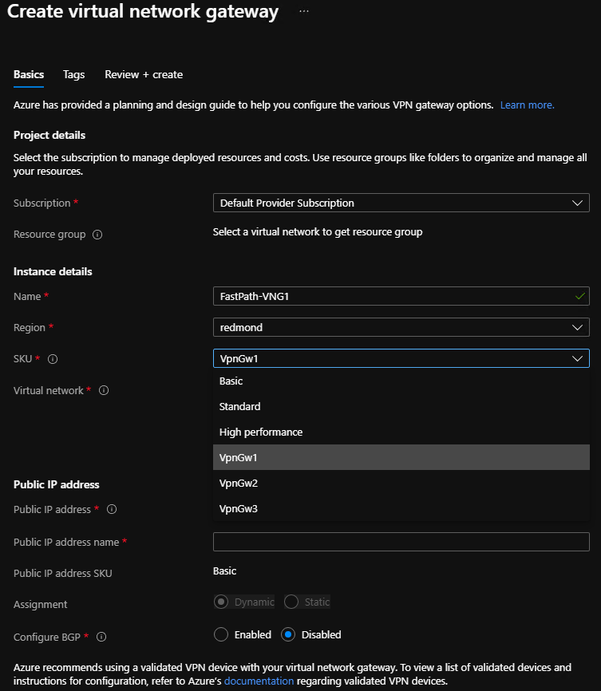
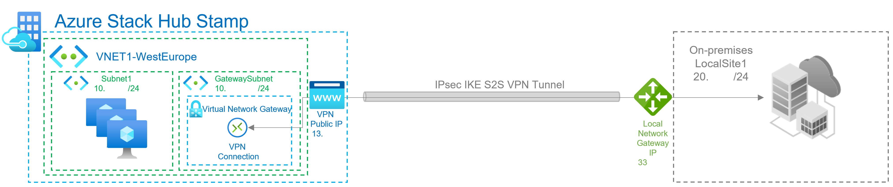
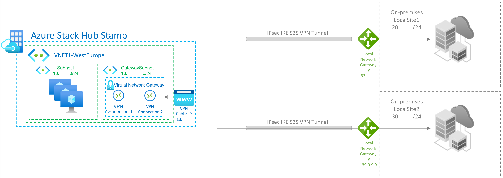
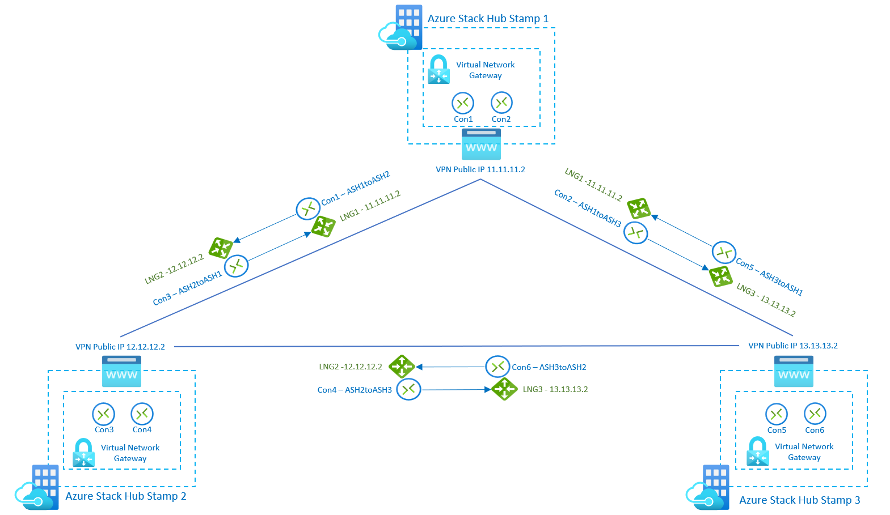

# Azure Stack Hub VPN Fast Path Public Preview for tenant users

## What is the Azure Stack Hub VPN Fast Path feature?

Azure Stack Hub is introducing three new SKUs listed below as part of the VPN Fast Path public preview. Previously, S2S tunnels were limited to a maximum bandwidth of 200 Mbps using the HighPerformance SKU. The new SKUs will enable many customer scenarios where higher network throughput is necessary. The throughput values for each SKU are unidirectional values, meaning it supports the given throughput on either send or receive traffic.

When the Azure Stack operator enables the VPN Fast Path feature on the Azure Stack Hub stamp, the tenant users will be able to create virtual network gateways using the new SKUs.

Existing setups can be adjusted by re-creating the virtual network gateway and its connections with one of the new SKUs.

## New virtual network gateways SKUs available when VPN Fast is enabled

In addition to the 3 new SKUs, the overall gateway pool capacity for S2S VPN tunnels will increase from 2 Gbps to 5 Gbps per Gateway VM which allows a greater number of tunnels using the existing SKUs (Basic, Standard and High Performance).

The following table shows the new throughput for each SKU when VPN Fast Path is enabled:

| SKU | Max VPN Connection throughput |
|-------|-------|
|**Basic** | 100 Mbps Tx/Rx |
|**Standard** | 100 Mbps Tx/Rx |
|**High Performance** | 200 Mbps Tx/Rx |
|**VPNGw1**| 650 Mbps Tx/Rx |
|**VPNGw2**|  1000 Mbps Tx/Rx |
|**VPNGw3**|  1250 Mbps Tx/Rx |

## Create virtual network gateways to use the new SKUs

With the VPN Fast Path public preview release, tenant users are able to create virtual network gateways with the new SKUs using either the Azure Stack Hub portal or PowerShell.

### Create virtual network gateways with new SKUs using the Azure Stack Hub portal

If you use the Azure Stack Hub portal to create a virtual network gateway, the SKU can be selected using the dropdown list. The new VPN Fast Path SKUs (**VpnGw1**, **VpnGw2**, **VpnGw3**) are only visible after adding the query parameter **"?azurestacknewvpnskus=true"** to the URL and refreshing.

The following URL example makes the new virtual network gateway SKUs visible in the Azure Stack Hub user portal:

```http
https://portal.local.azurestack.local/?azurestacknewvpnskus=true
```

Before creating these resources, the operator must have enabled VPN Fast Path on the Azure Stack Hub stamp.



### Create virtual network gateways with new SKUs using PowerShell

The following example uses the AzureRM modules:

```powershell
# Create PIP

$gwip = New-AzureRmPublicIpAddress -name 'VNet1GWPIP' -ResourceGroupName $rgName -Location $location -AllocationMethod Dynamic

# Gateway configuration. VNET is assumed to exist

$vnet = Get-AzureRmVirtualNetwork -Name 'VNet1' -ResourceGroupName $rgNAme
$subnet = Get-AzureRmVirtualNetworkSubnetConfig -Name 'GatewaySubnet' -VirtualNetwork $vnet
$gwipconfig = New-AzureRmVirtualNetworkGatewayIpConfig -Name 'gwipconfig1' -SubnetId $subnet.Id -PublicIpAddress $gwpip.Id

# Create virtual network gateway VPNGw3 SKU 

$vng = New-AzureRmVirtualNetworkGateway -Name 'VNet1GW' -ResourceGroupName $rgName -Location $location IpConfigurations $gwipconfig -GatewayType Vpn -VpnType RouteBased -GatewaySku VpnGw3 #change vng SKU here

# Create local network gateway - remote VPN device endpoint configuration

$lng = New-AzureRmLocalNetworkGateway -Name 'Site1' -ResourceGroupName $rgName -Location $location -GatewayIpAddress $peerGWIP -AddressPrefix $addressprefix

# Create VPN Connection on the virtual network gateway

$vpnconnection = New-AzureRmVirtualNetworkGatewayConnection -Name 'Connection-01' -ResourceGroupName $rgName -Location $location -VirtualNetworkGateway1 $vng -LocalNetworkGateway2 $lng -ConnectionType IPSec -SharedKey $key
```

## Upgrading legacy virtual network gateways

It is not possible to update the SKU without recreating the virtual network gateway, which requires deleting all connections associated with the virtual network gateway. You can re-use the local network gateway resources after creating a virtual network gateway with the new SKU. The local network gateway resource defines the address space and IP address of your on-premises device and retains that configuration.

These are the steps to upgrade virtual network gateway SKUs:

1. Delete all connections on the existing virtual network gateway: make note of the pre-shared key and whether the BGP flag is set to enabled.
2. Delete the existing virtual network gateway using the legacy SKU: it is not possible to create two virtual network gateways in the same virtual network, so you must delete the existing one.
3. Create a new virtual network gateway resource with the new SKU: you can select one of the new SKUs enabled with VPN Fast Path.
4. Create a new connection between the new virtual network gateway and the existing local network gateway: if you are using a custom IP sec policy, the connection will need to be created via PowerShell. Use the pre-shared key and BGP flag noted in step 1.
5. Repeat step 4 for any other connections you want to move to the new SKU: this is relevant for multi-site scenarios.

## VPN connection topologies

There are different configurations available for VPN gateways. Determine which configuration best fits your needs. In the following sections, you can view information and topology diagrams about the following VPN gateway scenarios:

- Site-to-site connections
- Site-to-multi-site connections
- Site-to-site or Site-to-Multi-site connections between Azure Stack Hub Stamps

The diagrams and descriptions in the following sections can help you select a connection topology to match your requirements. The diagrams show the main baseline topologies, but it's possible to build more complex configurations using the diagrams as a guide.

### Site-to-site connections

A *site-to-site* (S2S) VPN gateway connection is a connection over IPsec/IKE (IKEv2) VPN tunnel. This type of connection requires a VPN device that is located on-premises and is assigned a public IP address.



### Site-to-multi-site connections

A *Site-to-multi-site* topology is a variation of the site-to-site topology. You create more than one VPN Connection from your virtual network gateway, typically connecting to multiple on-premises sites.



### Site-to-site or Site-to-multi-site connections between Azure Stack Hub stamps

Only one site-to-site VPN connection can be created between two Azure Stack Hub deployments. This is due to a limitation in the platform that only allows a single VPN connection to the same IP address. Because Azure Stack Hub leverages the multi-tenant gateway, which uses a single public IP for all VPN gateways in the Azure Stack Hub system, there can be only one VPN connection between two Azure Stack Hub systems. This limitation also applies to connecting more than one site-to-site VPN connection to any VPN gateway that uses a single IP address. Azure Stack Hub does not allow more than one local network gateway resource to be created using the same IP address.

The following diagram shows how you can inter-connect multiple Azure Stack Hub stamps if you need to create a mesh topology between stamps.

In this scenario, there are 3 Azure Stack Hub stamps, and each of them has 1 virtual network gateway with 2 connections and 2 local network gateways. With the new SKUs, the users can connect networks and workloads between stamps with VPN connections throughput up to 1250 Mbps Tx/Rx, allocating 50% of the Gateway Pool capacity of each stamp. Remaining capacity on each stamp can be used for additional VPN connections required for other use cases:



## Next steps

- [VPN gateway configuration settings for Azure Stack Hub](../user/azure-stack-vpn-gateway-settings.md)
