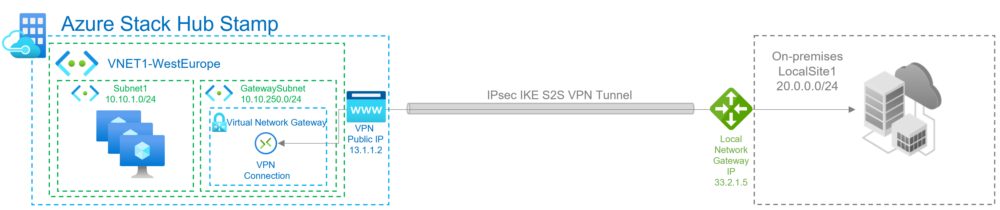
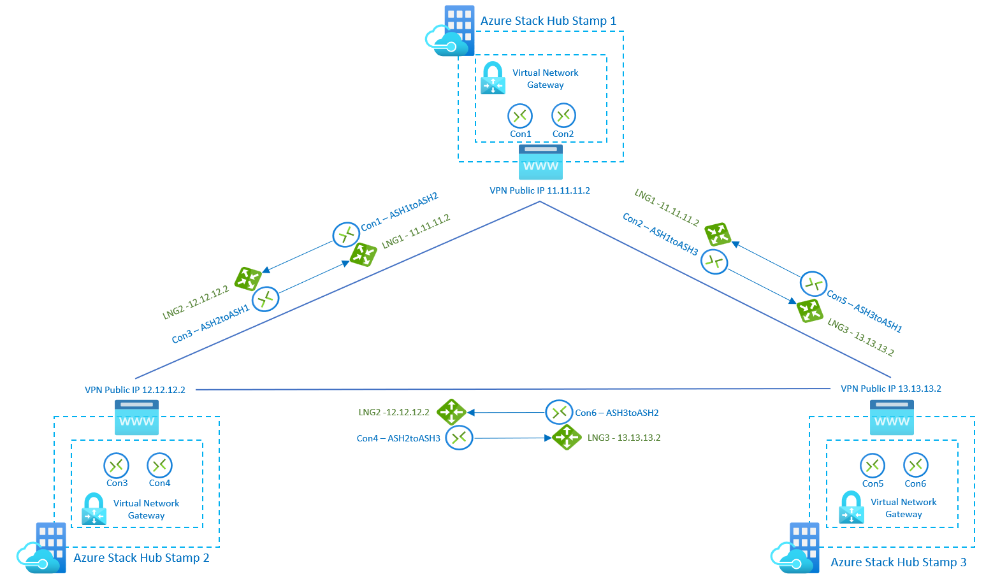

# Create VPN gateways for Azure Stack Hub

A virtual network gateway is the software VPN device (VPN gateway) for your Azure Stack Hub virtual network. Use this with a connection or connections to set up a site-to-site or site-to-multi-site VPN connection between an Azure Stack Hub virtual network and your local network, or a VNet-to-VNet VPN connection between two virtual networks created on different Azure Stack Hub stamps.

When you create a virtual network gateway, you specify the gateway type that you want to create. Azure Stack Hub only supports the **Vpn** type.

Each virtual network can have only one virtual network gateway. Depending on the settings that you choose, you can create multiple connections in a single virtual network gateway. An example of this type of setup is a site-to-multi-site topology configuration.

Before you create and configure virtual network gateway resources for Azure Stack Hub, review the [considerations for Azure Stack Hub networking](azure-stack-network-differences.md) to learn how configurations for Azure Stack Hub differ from Azure.

> [!NOTE]
> In Azure, the bandwidth throughput for the virtual network gateway SKU you choose must be divided across all connections that are connected to the gateway. In Azure Stack Hub however, the bandwidth value for the virtual network gateway SKU is applied to each connection resource that is connected to the gateway.
>
> For example:
>
> * In Azure, the basic virtual network gateway SKU can accommodate approximately 100 Mbps of aggregate throughput. If you create two connections to that virtual network gateway, and one connection is using 50 Mbps of bandwidth, then 50 Mbps is available to the other connection.
> * In Azure Stack Hub, each connection to the basic virtual network gateway SKU is allocated 100 Mbps of throughput.

## Configuring VPN gateways

A VPN gateway relies on several resources that are configured with specific settings. Most of these resources can be configured separately, but in some cases they must be configured in a specific order.

### Settings

The settings that you choose for each resource are critical for creating a successful connection.

For information about individual resources and settings for a VPN gateway, see [About VPN gateway settings for Azure Stack Hub](azure-stack-vpn-gateway-settings.md).

### Deployment tools

You can create and configure resources using one configuration tool, such as the Azure Stack Hub portal. Later, you might switch to another tool such as PowerShell to configure additional resources or modify existing resources when applicable. 

Currently, you cannot configure every resource and resource setting in the Azure Stack Hub portal. The instructions in the articles for each connection topology specify when a specific configuration tool is needed.

## Connection topology diagrams

There are different configurations available for VPN gateways. Determine which configuration best fits your needs. In the following sections, you can view information and topology diagrams about the following VPN gateway scenarios:

* Site-to-site connections
* Site-to-multi-site connections
* Site-to-site or site-to-multi-site connections between Azure Stack Hub stamps

The diagrams and descriptions in the following sections can help you select a connection topology to match your requirements. The diagrams show the main baseline topologies, but it's possible to build more complex configurations using the diagrams as a guide.

### Site-to-site connections

A *site-to-site* (S2S) VPN gateway connection is a connection over IPsec/IKE (IKEv2) VPN tunnel. This type of connection requires a VPN device that is located on-premises and is assigned a public IP address. S2S connections can be used for cross-premises and hybrid configurations.

### Site-to-Multi-site connections

A *Site-to-multi-site* topology is a variation of the site-to-site topology. You create more than one VPN Connection from your virtual network gateway, typically connecting to multiple on-premises sites.

## Site-to-site or site-to-multi-site connections between Azure Stack Hub stamps

You can only create one site-to-site VPN connection between two Azure Stack Hub deployments. This is due to a limitation in the platform that only allows a single VPN connection to the same IP address. Because Azure Stack Hub leverages the multi-tenant gateway, which uses a single public IP for all VPN gateways in the Azure Stack Hub system, there can be only one VPN connection between two Azure Stack Hub systems. This limitation also applies to connecting more than one site-to-site VPN connection to any VPN gateway that uses a single IP address. Azure Stack Hub does not allow more than one local network gateway resource to be created using the same IP address.

The following diagram shows how you can inter-connect multiple Azure Stack Hub stamps if you need to create a mesh topology between stamps.

In this scenario, there are 3 Azure Stack Hub stamps, and each of them has 1 virtual network gateway with 2 connections and 2 local network gateways. With the new SKUs, users can connect networks and workloads between stamps with VPN connection throughput up to 1250 Mbps Tx/Rx, allocating 50% of the gateway pool capacity of each stamp. You can use the remaining capacity on each stamp for additional VPN connections required for other use cases:

## Gateway SKUs

When you create a virtual network gateway for Azure Stack Hub, you specify the gateway SKU that you want to use. The following Virtual Network gateway SKUs are supported:

* Basic
* Standard
* High Performance
  
## New Virtual Network gateway SKUs in public preview

In Azure Stack Hub 2203 release, Microsoft is announcing the Public Preview of the new VPN Fast Path feature, which increases the total Azure Stack Hub stamp maximum throughput from 2 Gbps to 5 Gbps, and also introduces 3 new SKUs

* VPN Gw1
* VPN GW2
* VPN Gw3

Azure Stack Hub does not support the Ultra Performance gateway SKU, which is used exclusively with Express Route.

Consider the following when you select the SKU:

* Azure Stack Hub does not support policy-based gateways.
* Border Gateway Protocol (BGP) is not supported on the Basic SKU.
* ExpressRoute-VPN gateway coexisting configurations are not supported in Azure Stack Hub.

## Gateway availability

High availability scenarios can only be configured on the **High Performance Gateway** connection SKU. Unlike Azure, which provides availability through both active/active and active/passive configurations, Azure Stack Hub only supports the active/passive configuration.

## Next steps

* [VPN gateway configuration settings for Azure Stack Hub](azure-stack-vpn-gateway-settings.md)