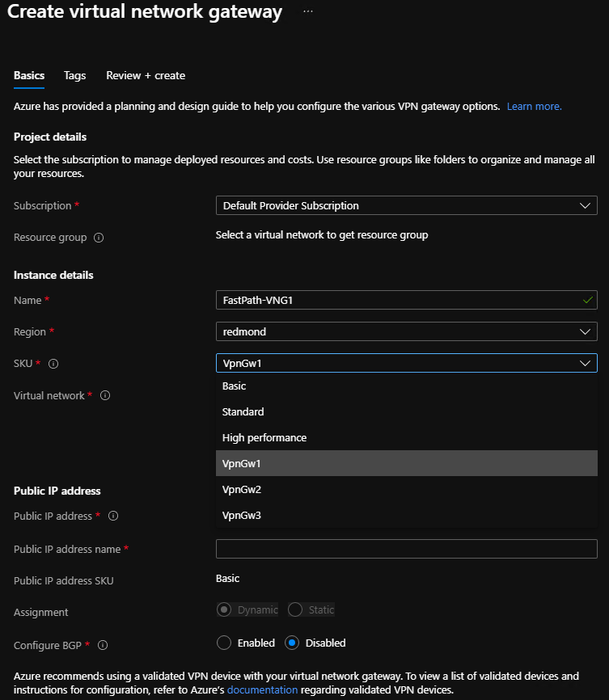

# Configure VPN gateway settings for Azure Stack Hub

A VPN gateway is a type of virtual network gateway that sends encrypted traffic between your virtual network in Azure Stack Hub and a remote VPN gateway. The remote VPN gateway can be in Azure, a device in your datacenter, or a device on another site. If there is network connectivity between the two endpoints, you can establish a secure Site-to-Site (S2S) VPN connection between the two networks.

A VPN gateway relies on the configuration of multiple resources, each of which contains configurable settings. This article describes the resources and settings that relate to a VPN gateway for a virtual network that you create in the Resource Manager deployment model. You can find descriptions and topology diagrams for each connection solution in [Create VPN gateways for Azure Stack Hub](azure-stack-vpn-gateway-about-vpn-gateways.md).

## VPN gateway settings

### Gateway types

Each Azure Stack Hub virtual network supports a single virtual network gateway, which must be of the type **Vpn**. This support is different from Azure, which supports additional types.

When you create a virtual network gateway, you must make sure that the gateway type is correct for your configuration. A VPN gateway requires the `-GatewayType Vpn` flag; for example:

```powershell
New-AzVirtualNetworkGateway -Name vnetgw1 -ResourceGroupName testrg `
   -Location 'West US' -IpConfigurations $gwipconfig -GatewayType Vpn `
   -VpnType RouteBased
```

### Gateway SKUs without VPN Fast Path Enabled

When you create a virtual network gateway, you must specify the SKU that you want to use. Select the SKUs that satisfy your requirements based on the types of workloads, throughput, features, and SLAs.

You can have 10 high performance gateways or 20 basic and standard before your reach the maximum capacity. The maximum can also be reached for a total aggregate throughput of 4 Gbps.

Azure Stack Hub offers the VPN gateway SKUs shown in the following table:

| SKU | Max VPN Connection throughput | Max # of connections per active GW VM | Max # of VPN Connections per stamp |
|-------|-------|-------|-------|
|**Basic**| 100 Mbps Tx/Rx | 10 | 20 |
|**Standard** | 100 Mbps Tx/Rx | 10 | 20 |
|**High Performance** | 200 Mbps Tx/Rx | 5 | 10 |

### Gateway SKUs with VPN Fast Path Enabled

With the release of VPN Fast Path Public Preview, Azure Stack Hub supports three new SKUs with higher throughput. It also increases the overall stamp capacity from 4 Gbps to 10 Gbps.

New limits and throughput will be enabled once VPN Fast Path is enabled on your Azure Stack stamp. 

Azure Stack Hub offers the VPN gateway SKUs shown in the following table:

| SKU | Max VPN Connection throughput |Max # of connections per active GW VM | Max # of VPN Connections per stamp |
|-------|-------|-------|-------|
|**Basic** | 100 Mbps Tx/Rx | 25 | 50 |
|**Standard** | 100 Mbps Tx/Rx | 25 | 50 |
|**High Performance** | 200 Mbps Tx/Rx | 12 | 24 |
|**VPNGw1**| 650 Mbps Tx/Rx | 3 | 6 |
|**VPNGw2**| 1000 Mbps Tx/Rx | 2 | 4 |
|**VPNGw3**| 1250 Mbps Tx/Rx | 2 | 4 |

### Resizing virtual network gateways SKUs

Azure Stack Hub does not support a resize from a supported legacy SKU (**Basic**, **Standard**, and **HighPerformance**) to a newer SKU supported by Azure (**VpnGw1**, **VpnGw2**, and **VpnGw3**).

New virtual network gateways and connections must be created in order to use the new SKUs enabled by VPN Fast Path.

### Configure the virtual network gateway SKU

#### Azure Stack Hub portal

If you use the Azure Stack Hub portal to create a virtual network gateway, the SKU can be selected using the dropdown list. The new VPN Fast Path SKUs (**VpnGw1**, **VpnGw2**, **VpnGw3**) will only be visible after adding the query parameter **"?azurestacknewvpnskus=true"** to the URL and refreshing.

The following URL example makes the new virtual network gateway SKUs visible in the Azure Stack Hub user portal:

```http
https://portal.local.azurestack.local/?azurestacknewvpnskus=true
```

Before creating these resources, the operator must have enabled VPN Fast Path on the Azure Stack Hub stamp. For more information, see [VPN Fast Path for operators](/azure-stack/operator/azure-stack-vpn-fast-path-operators.md).



#### PowerShell

The following PowerShell example specifies the `-GatewaySku` parameter as **Standard**:

```powershell
New-AzVirtualNetworkGateway -Name vnetgw1 -ResourceGroupName testrg `
   -Location 'West US' -IpConfigurations $gwipconfig -GatewaySku Standard `
   -GatewayType Vpn -VpnType RouteBased
```

### Connection types

In the Resource Manager deployment model, each configuration requires a specific virtual network gateway connection type. The available Resource Manager PowerShell values for `-ConnectionType` are **IPsec**.

In the following PowerShell example, a S2S connection is created that requires the IPsec connection type:

```powershell
New-AzVirtualNetworkGatewayConnection -Name localtovon -ResourceGroupName testrg `
   -Location 'West US' -VirtualNetworkGateway1 $gateway1 -LocalNetworkGateway2 $local `
   -ConnectionType IPsec -RoutingWeight 10 -SharedKey 'abc123'
```

### VPN types

When you create the virtual network gateway for a VPN gateway configuration, you must specify a VPN type. The VPN type that you choose depends on the connection topology that you want to create. A VPN type can also depend on the hardware that you're using. S2S configurations require a VPN device. Some VPN devices only support a certain VPN type.

> [!IMPORTANT]  
> Currently, Azure Stack Hub only supports the route-based VPN type. If your device only supports policy-based VPNs, then connections to those devices from Azure Stack Hub are not supported.  
>
> In addition, Azure Stack Hub does not support using policy-based traffic selectors for route-based gateways at this time, because Azure Stack Hub does not support policy-based traffic selectors, although they are supported in Azure.

* **PolicyBased**: Policy-based VPNs encrypt and direct packets through IPsec tunnels based on the IPsec policies that are configured with the combinations of address prefixes between your on-premises network and the Azure Stack Hub VNet. The policy, or traffic selector, is usually an access list in the VPN device configuration.

  >[!NOTE]
  >**PolicyBased** is supported in Azure, but not in Azure Stack Hub.

* **RouteBased**: Route-based VPNs use routes that are configured in the IP forwarding or routing table to direct packets to their corresponding tunnel interfaces. The tunnel interfaces then encrypt or decrypt the packets in and out of the tunnels. The policy, or traffic selector, for **RouteBased** VPNs are configured as any-to-any (or use wild cards). By default, they cannot be changed. The value for a **RouteBased** VPN type is **RouteBased**.

The following PowerShell example specifies the `-VpnType` as **RouteBased**. When you create a gateway, you must make sure that the `-VpnType` is correct for your configuration.

```powershell
New-AzVirtualNetworkGateway -Name vnetgw1 -ResourceGroupName testrg `
   -Location 'West US' -IpConfigurations $gwipconfig `
   -GatewayType Vpn -VpnType RouteBased
```

### Virtual network gateways supported configurations when VPN Fast Path is not enabled

|| **VPN Type** | **Connection type**| **Active Routing support (BGP)** | **Remote endpoint NAT-T Enabled** |
|--|--|--|--|--|
|Basic VNG SKU| Route-based VPN | IPSec Pre-shared key | Not Supported | Not required |
|Standard VNG SKU | Route-based VPN | IPSec Pre-shared key | Supported, up to 150 routes | Not required |
|High-Performance VNG SKU| Route-based VPN | IPSec Pre-shared key | Supported, up to 150 routes | Not required |

### Virtual network gateways supported configurations when VPN Fast Path is enabled

|| **VPN Type** | **Connection type**| **Active routing support (BGP)** | **Remote endpoint NAT-T Enabled** |
|--|--|--|--|--|
|Basic VNG SKU| Route-based VPN | IPSec Pre-shared key | Not Supported | Required  |
|Standard VNG SKU | Route-based VPN | IPSec Pre-shared key | Supported, up to 150 routes | Required  |
|High-Performance VNG SKU| Route-based VPN | IPSec Pre-shared key | Supported, up to 150 routes | Required  |
|VPNGw1 VNG SKU| Route-based VPN | IPSec Pre-shared key | Supported, up to 150 routes | Required |
|VPNGw2 VNG SKU| Route-based VPN | IPSec Pre-shared key | Supported, up to 150 routes | Required  |
|VPNGw2 VNG SKU| Route-based VPN  | IPSec Pre-shared key | Supported, up to 150 routes | Required  |


### Gateway subnet

Before you create a VPN gateway, you must create a gateway subnet. The gateway subnet has the IP addresses that the virtual network gateway VMs and services use. When you create your virtual network gateway and the connection, the Gateway VM owning the connection will be linked to the gateway subnet and will be configured with the required VPN gateway settings. Don't deploy anything else (for example, additional VMs) to the gateway subnet.

>[!IMPORTANT]
>The gateway subnet must be named **GatewaySubnet** to work properly. Azure Stack Hub uses this name to identify the subnet to which to deploy the virtual network gateway VMs and services.

When you create the gateway subnet, you specify the number of IP addresses that the subnet contains. The IP addresses in the gateway subnet are allocated to the gateway VMs and gateway services. Some configurations require more IP addresses than others. Look at the instructions for the configuration that you want to create and verify that the gateway subnet you want to create meets those requirements.

Additionally, you should make sure your gateway subnet has enough IP addresses to handle additional future configurations. Although you can create a gateway subnet as small as /29, we recommend you create a gateway subnet of /28 or larger (/28, /27, /26, and so on.) That way, if you add functionality in the future, you do not have to tear down your gateway, then delete and recreate the gateway subnet to allow for more IP addresses.

The following Resource Manager PowerShell example shows a gateway subnet named **GatewaySubnet**. You can see the CIDR notation specifies a /27, which allows for enough IP addresses for most configurations that currently exist.

```powershell
Add-AzVirtualNetworkSubnetConfig -Name 'GatewaySubnet' -AddressPrefix 10.0.3.0/27
```

> [!IMPORTANT]
> When working with gateway subnets, avoid associating a network security group (NSG) to the gateway subnet. Associating a network security group to this subnet can cause your VPN gateway to stop functioning as expected. For more information about network security groups, see [What is a network security group?](/azure/virtual-network/virtual-networks-nsg).

### Local network gateways

When creating a VPN gateway configuration in Azure, the local network gateway often represents your on-premises location. In Azure Stack Hub, it represents any remote VPN device that sits outside Azure Stack Hub. This device could be a VPN device in your datacenter (or a remote datacenter), or a VPN gateway in Azure.

You give the local network gateway a name, the public IP address of the remote VPN device, and specify the address prefixes that are on the on-premises location. Azure Stack Hub looks at the destination address prefixes for network traffic, consults the configuration that you've specified for your local network gateway, and routes packets accordingly.

This PowerShell example creates a new local network gateway:

```powershell
New-AzLocalNetworkGateway -Name LocalSite -ResourceGroupName testrg `
   -Location 'West US' -GatewayIpAddress '23.99.221.164' -AddressPrefix '10.5.51.0/24'
```

Sometimes you need to modify the local network gateway settings; for example, when you add or modify the address range, or if the IP address of the VPN device changes. For more info, see [Modify local network gateway settings using PowerShell](/azure/vpn-gateway/vpn-gateway-modify-local-network-gateway).

## IPsec/IKE parameters

When you set up a VPN connection in Azure Stack Hub, you must configure the connection at both ends. If you're configuring a VPN connection between Azure Stack Hub and a hardware device such as a switch or router that is acting as a VPN gateway, that device might ask you for additional settings.

Unlike Azure, which supports multiple offers as both an initiator and a responder, Azure Stack Hub supports only one offer by default. If you need to use different IPSec/IKE settings to work with your VPN device, there are more settings available to you to configure your connection manually. For more information, see [Configure IPsec/IKE policy for site-to-site VPN connections](azure-stack-vpn-s2s.md).

> [!IMPORTANT] 
> When using the S2S tunnel, packets are further encapsulated with additional headers which increases the overall size of the packet. In these scenarios, you must clamp TCP **MSS** at **1350**. Or, if your VPN devices do not support MSS clamping, you can alternatively set the **MTU** on the tunnel interface to **1400** bytes instead. For more information, see [Virutal Network TCPIP performance tuning](/azure/virtual-network/virtual-network-tcpip-performance-tuning).
>

### IKE Phase 1 (Main Mode) parameters

| Property              | Value|
|-|-|
| IKE Version           | IKEv2 |
|Diffie-Hellman Group*   | ECP384 |
| Authentication Method | Pre-Shared Key |
|Encryption & Hashing Algorithms* | AES256, SHA384 |
|SA Lifetime (Time)     | 28,800 seconds|

### IKE Phase 2 (Quick Mode) parameters

| Property| Value|
|-|-|
|IKE Version |IKEv2 |
|Encryption & Hashing Algorithms (Encryption)     | GCMAES256|
|Encryption & Hashing Algorithms (Authentication) | GCMAES256|
|SA Lifetime (Time)  | 27,000 seconds  |
|SA Lifetime (Kilobytes) | 33,553,408     |
|Perfect Forward Secrecy (PFS)* | ECP384 |
|Dead Peer Detection | Supported| 

\* New or changed parameter.

## Next steps

* [Connect using ExpressRoute](../operator/azure-stack-connect-expressroute.md)
