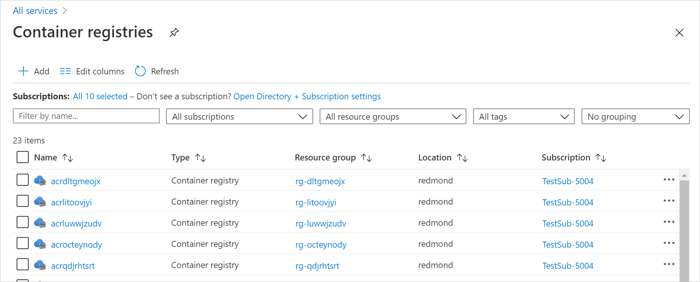
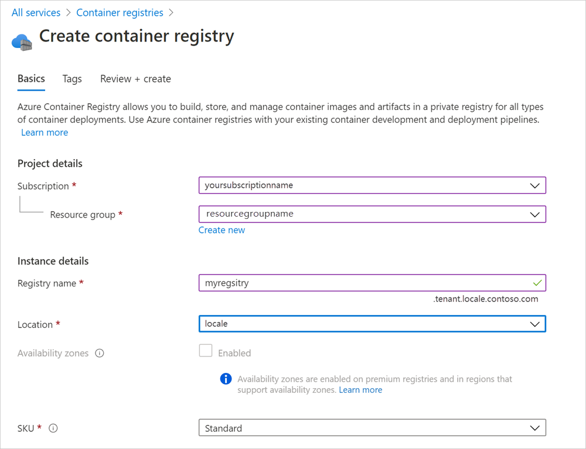
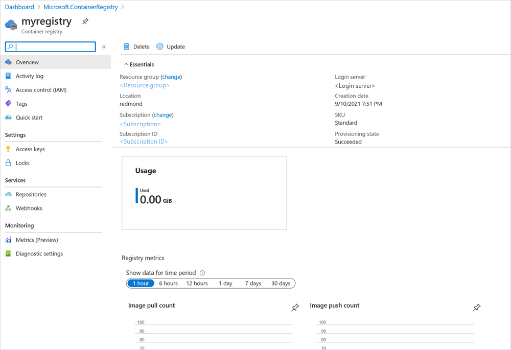

# Create and manage Azure Container Registries on Azure Stack Hub

You can use the Azure Stack Hub portal to create and manage Azure Container Registries (ACR) on Azure Stack Hub. This document provides basic information on how to create a container registry using the portal.

## Create a registry

You can create a registry using the Azure Stack Hub user portal by following these steps.

1.  Open the Azure Stack Hub user portal, and then navigate to **All services**. Find **Container registries** in the **Containers** section.
2.  Select **+Add** in Container registries.  
    
3.  Complete the required details and select **Review** and **Create**. Review the details and select **Create**. Both the location and SKU will get filled in and can't be modified.  
    

## View a registry

One a container registry has been created you can view details about the registry and repositories, as well as view and manage access, webhooks, metrics, and diagnostic settings. The portal doesn't display features and options not available for ACR on Azure Stack Hub.

## Next steps

Learn more about the [Azure Container Registry on Azure Stack Hub](container-registry-overview.md).