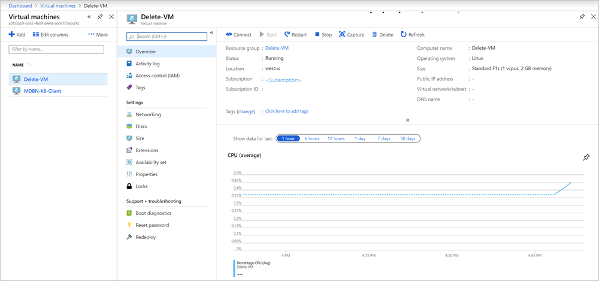

# How to delete a VM (virtual machine) with dependencies on Azure Stack Hub

In this article you can find the steps to remove a VM and its dependencies in Azure Stack Hub.

If you remove a VM from Azure Stack Hub, the component dependencies, that is data disks, virtual network interfaces, and diagnostic containers, will remain in the resource group. These items won't be automatically deleted along with your OS disc.

## Delete a VM overview

When you create a new VM you typically create a new resource group and put all the dependencies in that resource group. When you want to delete the VM and all its dependencies you can delete the resource group. The Azure Resource Manager will handle the dependencies to successfully delete them. There are times when you cannot delete the resource group to remove the VM. For example, the VM may contain resources that are not dependencies of the VM that you would like to keep.

## Delete a VM with dependencies

### [With the portal](#tab/portal)

In the case where you cannot delete the resource group, either the dependencies are not in the same resource group, or there are other resources, follow the steps below:

1. Open the Azure Stack user portal.

2. Select **Virtual machines**. Find your virtual machine, and then select your machine to open the Virtual machine blade.  
  

3. Make a note of the resource group that contains the VM and VM dependencies.

4. Select **Networking** and make note of the networking interface.

5. Select **Disks** and make note of the OS disk and data disks.

6. Return to the **Virtual machine** blade, and select **Delete**.

7. Type `yes` to confirm the delete and select **Delete**.

7. Select **Resource groups** and then select the resource group.

8. Delete the dependencies by manually selecting them and then select **Delete**.
    1. Type `yes` to confirm the delete and select **Delete**.
    2. Wait for the resource to be completely deleted.
    3. You can then delete the next dependency.

### [With PowerShell](#tab/ps-az)

In the case where you cannot delete the resource group, either the dependencies are not in the same resource group, or there are other resources, follow these steps.

Connect to the your Azure Stack Hub environment, and then update the following variables with your VM name and resource group. For instructions on connecting to your PowerShell session to Azure Stack Hub, see [Connect to Azure Stack Hub with PowerShell as a user](azure-stack-powershell-configure-user.md).

```powershell
$machineName = 'VM_TO_DELETE'
$resGroupName = 'RESOURCE_GROUP'
$machine = Get-AzVM -Name $machineName -ResourceGroupName $resGroupName
```

Retrieve the VM information and name of dependencies. In the same session, run the following cmdlets:

```powershell
 $azResParams = @{
 'ResourceName' = $machineName
 'ResourceType' = 'Microsoft.Compute/virtualMachines'
     'ResourceGroupName' = $resGroupName
 }
 $vmRes = Get-AzResource @azResParams
 $vmId = $vmRes.Properties.VmId
```

Delete the boot diagnostic storage container. If your machine name is shorter than 9 characters, you will need to change the index to your string length in the substring when creating the `$diagContainer` variable. 

In the same session, run the following cmdlets:

```powershell
$container = [regex]::match($machine.DiagnosticsProfile.bootDiagnostics.storageUri, '^http[s]?://(.+?)\.').groups[1].value
$diagContainer = ('bootdiagnostics-{0}-{1}' -f $machine.Name.ToLower().Substring(0, 9), $vmId)
$containerRg = (Get-AzStorageAccount | where { $_.StorageAccountName -eq $container }).ResourceGroupName
$storeParams = @{
    'ResourceGroupName' = $containerRg
    'Name' = $container }
Get-AzStorageAccount @storeParams | Get-AzureStorageContainer | where { $_.Name-eq $diagContainer } | Remove-AzureStorageContainer -Force
```

Remove the the virtual network interface.

```powershell
$machine | Remove-AzNetworkInterface -Force
```

Delete the operating system disk.

```powershell
$osVhdUri = $machine.StorageProfile.OSDisk.Vhd.Uri
$osDiskConName = $osVhdUri.Split('/')[-2]
$osDiskStorageAcct = Get-AzStorageAccount | where { $_.StorageAccountName -eq $osVhdUri.Split('/')[2].Split('.')[0] }
$osDiskStorageAcct | Remove-AzureStorageBlob -Container $osDiskConName -Blob $osVhdUri.Split('/')[-1]
```

Remove the data disks attached to your VM.

```powershell
if ($machine.DataDiskNames.Count -gt 0)
 {
    Write-Verbose -Message 'Deleting disks...'
        foreach ($uri in $machine.StorageProfile.DataDisks.Vhd.Uri )
        {
            $dataDiskStorageAcct = Get-AzStorageAccount -Name $uri.Split('/')[2].Split('.')[0]
             $dataDiskStorageAcct | Remove-AzureStorageBlob -Container $uri.Split('/')[-2] -Blob $uri.Split('/')[-1] -ea Ignore
        }
 }
```

Finally, delete the VM. The cmdlet takes some time to run. You can audit the components attached to the VM by reviewing the VM object in PowerShell. To review the object, just refer to the variable that contains the VM object. Type `$machine`.

To delete the VM, in the same session, run the following cmdlets:

```powershell
$machine | Remove-AzVM -Force
```
### [With PowerShell](#tab/ps-azureRM)

In the case where you cannot delete the resource group, either the dependencies are not in the same resource group, or there are other resources, follow these steps.

Connect to the your Azure Stack Hub environment, and then update the following variables with your VM name and resource group. For instructions on connecting to your PowerShell session to Azure Stack Hub, see [Connect to Azure Stack Hub with PowerShell as a user](azure-stack-powershell-configure-user.md).

```powershell
$machineName = 'VM_TO_DELETE'
$resGroupName = 'RESOURCE_GROUP'
$machine = Get-AzureRmVM -Name $machineName -ResourceGroupName $resGroupName
```

Retrieve the VM information and name of dependencies. In the same session, run the following cmdlets:

```powershell
 $azResParams = @{
 'ResourceName' = $machineName
 'ResourceType' = 'Microsoft.Compute/virtualMachines'
     'ResourceGroupName' = $resGroupName
 }
 $vmRes = Get-AzureRmResource @azResParams
 $vmId = $vmRes.Properties.VmId
```

Delete the boot diagnostic storage container. If your machine name is shorter than 9 characters, you will need to change the index to your string length in the substring when creating the `$diagContainer` variable. 

In the same session, run the following cmdlets:

```powershell
$container = [regex]::match($machine.DiagnosticsProfile.bootDiagnostics.storageUri, '^http[s]?://(.+?)\.').groups[1].value
$diagContainer = ('bootdiagnostics-{0}-{1}' -f $machine.Name.ToLower().Substring(0, 9), $vmId)
$containerRg = (Get-AzureRmStorageAccount | where { $_.StorageAccountName -eq $container }).ResourceGroupName
$storeParams = @{
    'ResourceGroupName' = $containerRg
    'Name' = $container }
Get-AzureRmStorageAccount @storeParams | Get-AzureStorageContainer | where { $_.Name-eq $diagContainer } | Remove-AzureStorageContainer -Force
```

Remove the the virtual network interface.

```powershell
$machine | Remove-AzureRmNetworkInterface -Force
```

Delete the operating system disk.

```powershell
$osVhdUri = $machine.StorageProfile.OSDisk.Vhd.Uri
$osDiskConName = $osVhdUri.Split('/')[-2]
$osDiskStorageAcct = Get-AzureRmStorageAccount | where { $_.StorageAccountName -eq $osVhdUri.Split('/')[2].Split('.')[0] }
$osDiskStorageAcct | Remove-AzureStorageBlob -Container $osDiskConName -Blob $osVhdUri.Split('/')[-1]
```

Remove the data disks attached to your VM.

```powershell
if ($machine.DataDiskNames.Count -gt 0)
 {
    Write-Verbose -Message 'Deleting disks...'
        foreach ($uri in $machine.StorageProfile.DataDisks.Vhd.Uri )
        {
            $dataDiskStorageAcct = Get-AzureRmStorageAccount -Name $uri.Split('/')[2].Split('.')[0]
             $dataDiskStorageAcct | Remove-AzureStorageBlob -Container $uri.Split('/')[-2] -Blob $uri.Split('/')[-1] -ea Ignore
        }
 }
```

Finally, delete the VM. The cmdlet takes some time to run. You can audit the components attached to the VM by reviewing the VM object in PowerShell. To review the object, just refer to the variable that contains the VM object. Type `$machine`.

To delete the VM, in the same session, run the following cmdlets:

```powershell
$machine | Remove-AzureRmVM -Force
```
---
## Next steps

[Azure Stack Hub VM features](azure-stack-vm-considerations.md)