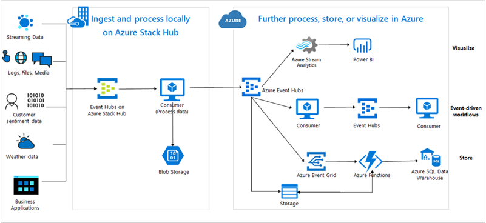

# Overview of Event Hubs on Azure Stack Hub

[!INCLUDE [preview-banner](../includes/event-hubs-preview.md)]

Event Hubs on Azure Stack Hub allows you to realize hybrid cloud scenarios. Streaming and event-based solutions are supported, for both on-premises and Azure cloud processing. Whether your scenario is hybrid (connected), or disconnected, your solution can support processing of events/streams at large scale. Your scenario is only bound by the Event Hubs Cluster size, which you can provision according to your needs. 

## Run event processing tasks and build event-driven applications on site

Using Event Hubs on Azure Stack Hub, you can implement business scenarios such as:

- AI and machine learning workloads where Event Hubs is the event streaming engine.
- Implement event-driven architectures in your own sites outside the Azure data centers.
- Clickstream analytics for your web application(s) deployed on-premises.
- Device telemetry analysis.
- Stream processing with open-source frameworks that use Apache Kafka such as Apache Spark, Flink, Storm, and Samza.
- [Consume Compute guest OS metrics and events](azure-stack-metrics-monitor.md).

## Build Hybrid solutions

Build hybrid solutions that ingest and process edge data locally on your Azure Stack Hub. Send aggregated data to Azure for further processing, visualization, and storage. If appropriate, leverage serverless computing on Azure.

## Features 

The Event Hubs editions (on Azure Stack Hub and on Azure) offer a high degree of feature parity. This parity means SDKs, samples, PowerShell, CLI, and portals offer a similar experience, with few differences. The following table summarizes the high-level differences in feature availability that exists between editions.  

| Feature | Event Hubs on Azure Stack Hub | Azure Event Hubs |
|-|-|-|-|
| Operator administrator experience | ✔ | ✘ |
| Kafka support | ✔ | ✔ |
| Same set of SDKs | ✔ | ✔ |
| Authorize access to Event Hubs using Azure Active Directory | ✘ | ✔ |
| Capture feature | ✘ | ✔ |
| Geo-disaster recovery | ✘ | ✔ |
| Azure Monitor | ✔ | ✔ |
| Auto-inflate feature | ✘ | ✔ |

Azure Resource Management operations can also be accomplished using Azure Resource Manager templates, [PowerShell](/powershell/module/azurerm.eventhub/), and [Azure CLI](/cli/azure/eventhubs/eventhub/). Currently, there's no support for Operator Administration operations in PowerShell and Azure CLI.

## Feature documentation

The [Azure Event Hubs documentation](/azure/event-hubs/) applies to both editions of Event Hubs: Event Hubs on Azure Stack Hub, and Azure Event Hubs. This documentation covers topics on using Event Hubs and activities such as:

- Details on [Event Hubs concepts](/azure/event-hubs/event-hubs-features)
- How to [create an Event Hubs cluster and namespace](event-hubs-quickstart-cluster-portal.md)
- How to create an [event hub](/azure/event-hubs/event-hubs-create#create-an-event-hub)
- How to stream [using the Kafka protocol](/azure/event-hubs/event-hubs-quickstart-kafka-enabled-event-hubs)

### Operator documentation 
 
To learn more about the Event Hubs on Azure Stack Hub operator experience, refer to the [Event Hubs operator documentation](../operator/event-hubs-rp-overview.md). This documentation provides information on activities such as:

- Installing Event Hubs.
- Making Event Hubs available to users.
- Getting information on the health of the service.
- Collecting logs.

## Next steps

If Event Hubs isn't available in your subscription, work with your administrator to [install the Event Hubs on Azure Stack Hub resource provider](../operator/event-hubs-rp-overview.md).

If you have Event Hubs installed and you're ready to use it, consult the [Event Hubs documentation](/azure/event-hubs/event-hubs-about) for more details on the service.
