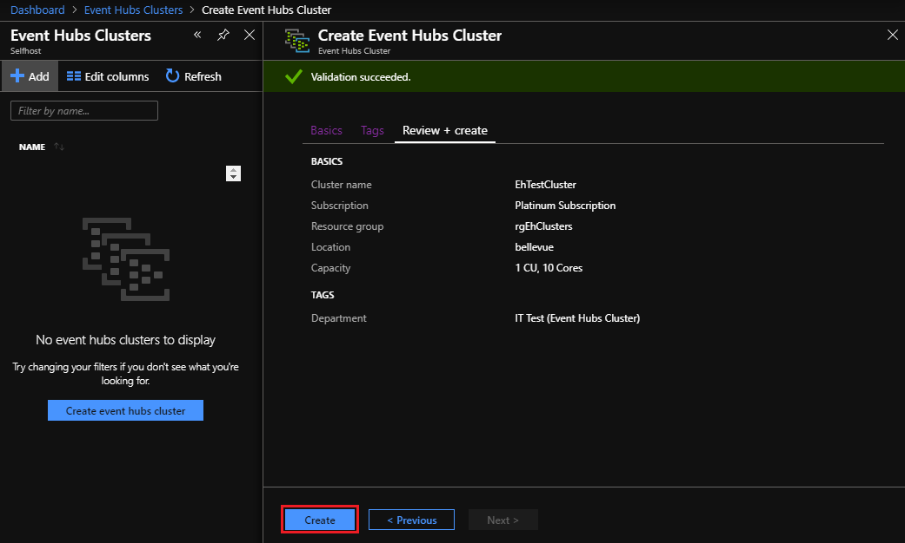
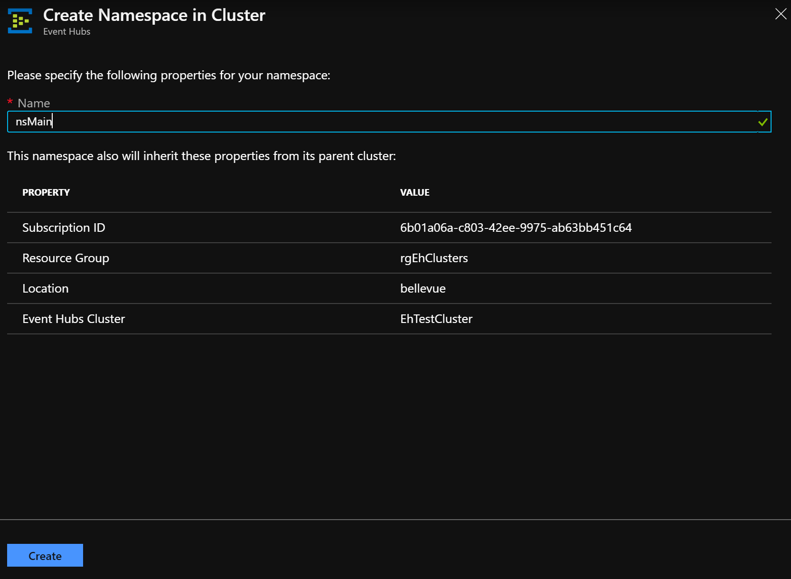
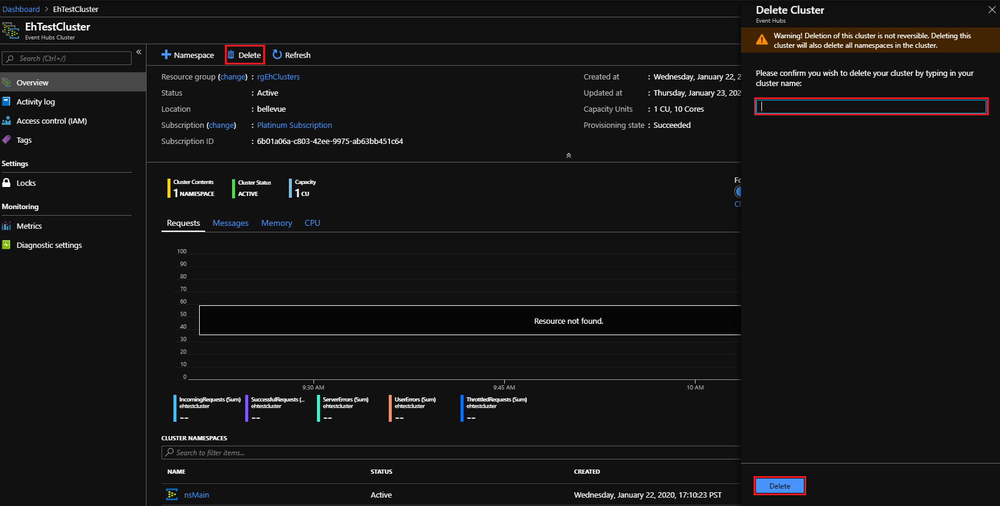

# Quickstart: Create an Event Hubs cluster using the Azure Stack Hub portal

In this quickstart, you learn how to create an Event Hubs cluster, using the Azure Stack Hub user portal. 

Event Hubs clusters offer single-tenant deployments for the most demanding streaming needs. An Event Hubs cluster can ingress millions of events per second with guaranteed capacity and subsecond latency. Event Hubs cluster includes all popular features, with a close parity with those offered by the Azure Event Hubs edition.

## Prerequisites

Before you can complete this quickstart you must ensure the Event Hubs service is available in your subscription. If it's not available, work with your administrator to [install the Event Hubs on Azure Stack Hub resource provider](../operator/event-hubs-rp-overview.md). The installation steps also cover the creation of an offer that includes the Event Hubs service. 

Once an offer is available, your administrator can create or update your subscription to include Event Hubs. Alternatively, you can [subscribe to the new offer and create your own subscription](azure-stack-subscribe-services.md).

## Overview

Event Hubs clusters are created by specifying Capacity Units (CUs). A CU is a pre-allocated amount of CPU, storage, and memory resources. Event Hubs clusters are billed by CPU/hr. The number of cores (CPUs) used by a cluster is displayed when selecting the number of CUs (cluster size) during the cluster creation experience. See [How to do capacity planning for Event Hubs on Azure Stack Hub](../operator/event-hubs-rp-capacity-planning.md) for more detailed information on cluster resource usage. 

In this quickstart, we will walk you through the creation of a 1 CU Event Hubs cluster through the Azure Stack Hub user portal. 

## Create an Event Hubs cluster

An Event Hubs cluster provides a unique scoping container in which you can create one or more namespaces. To create a cluster in your resource group using the User portal, please complete the following steps: 

1. Sign in to the Azure Stack Hub user portal.
2. Select **All services** from the left navigation pane, enter "Event Hubs Clusters" in the search bar, and select the **Event Hubs Clusters** item from results list.
3. Select **+ Add** from the top of the page.  
4. On the **Create Event Hubs Cluster** page, **Basics** tab:  
   - **Cluster name**: Enter a name. The system immediately checks to see if the name is available. If available, a checkmark will show at the right end of the field. 
   - **Subscription**: Select the subscription in which you want to create the cluster. 
   - **Resource group**: Create/Select the resource group in which you want to create the cluster. 
   - Select the **Next: Tags >** button at the bottom of the page. You may have to wait for the system to fully provision resources. 

   

5. On the **Tags** tab: 
   - Enter the name/value pairs for the optional resource tag(s).  
   - Select the **Next: Review + Create >** button. 

   

6. On the **Review + Create** tab, review the details. You should also see a "Validation succeeded banner" at the top of the page. Select **Create** when ready to create the cluster. 

   

   >[!NOTE]
   > An Event Hubs cluster deployment can take several minutes to complete, normally at least 45 minutes.

7. When complete, the **Your deployment is underway** status page changes to **Your deployment is complete**. Before continuing to the next section, select the **Go to resource** button to view the new cluster:

   

## Create a namespace and event hub

Now you create a namespace within your new cluster:

1. On the Event Hubs Cluster **Overview** page for your cluster, select **+ Namespace** from the top menu. 

   

2. On the **Create namespace in cluster** panel:

   - **Name**: Enter a name for the namespace. The system immediately checks to see if the name is available. If available, a checkmark will show at the right end of the field. 
   - **Property/Value list**: The namespace inherits the following properties: 
     - Subscription ID 
     - Resource group 
     - Location 
     - Cluster name 

   - Select **Create** to create the namespace:

   

3. Note your new namespace under **Cluster Namespaces**. You can now  [create an event hub](/azure/event-hubs/event-hubs-create#create-an-event-hub), within your namespace. 

   

## Delete an Event Hubs cluster

To delete the cluster:

1. Select **Delete** from the top menu.  
2. A message will appear confirming your wish to delete the cluster. 
3. Enter the name of the cluster and select **Delete** to delete the cluster. 

   

## Next steps

In this quickstart, you learned how to create an Event Hubs cluster using the portal. Now continue with the "Send and receive events" quickstarts, starting with the first:  

> [!div class="nextstepaction"]
> [Send events to or receive events from Azure Event Hubs using .NET Core](/azure/event-hubs/event-hubs-dotnet-standard-getstarted-send)
