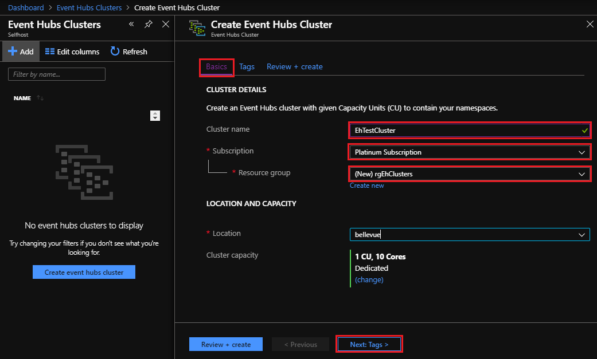
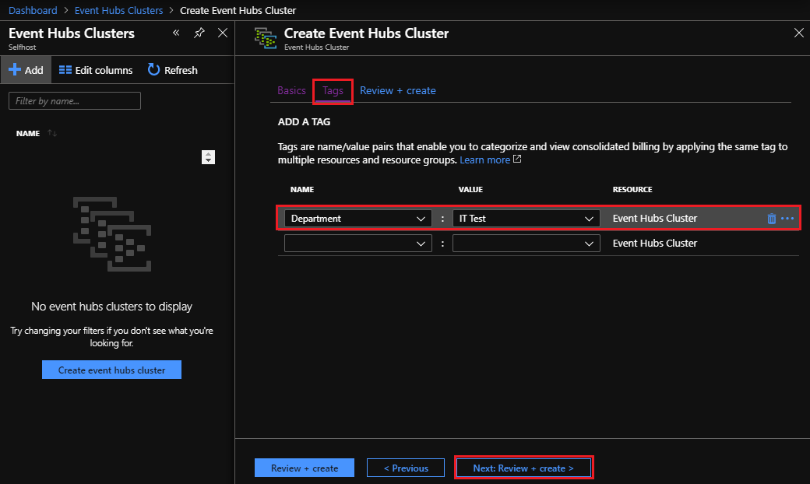
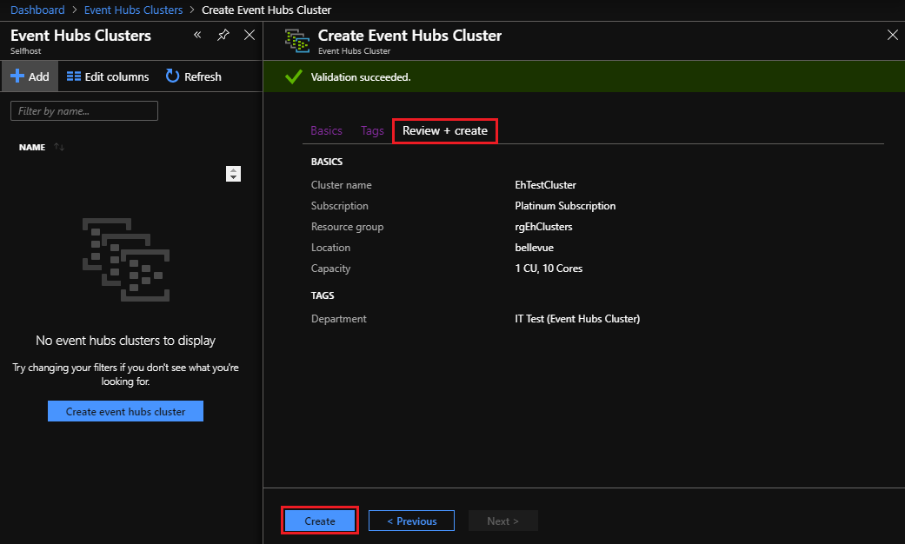
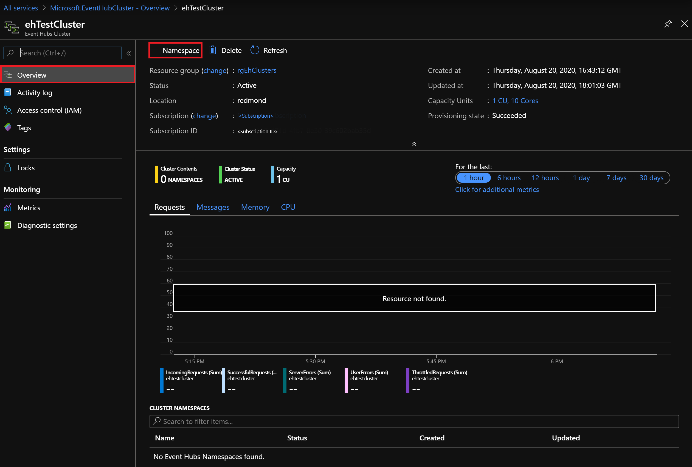
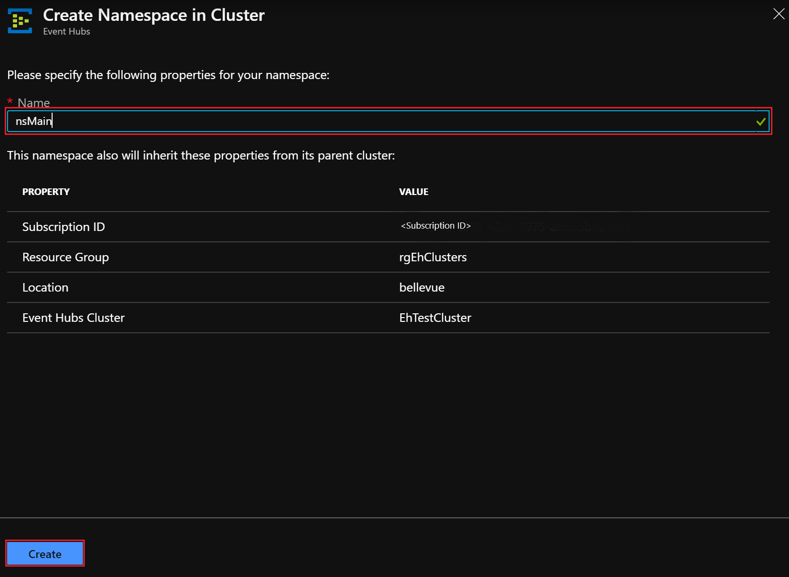
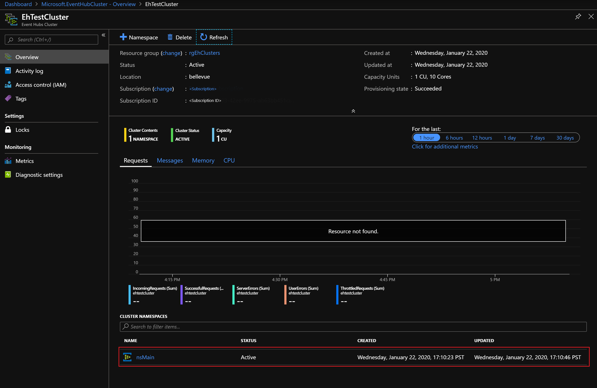
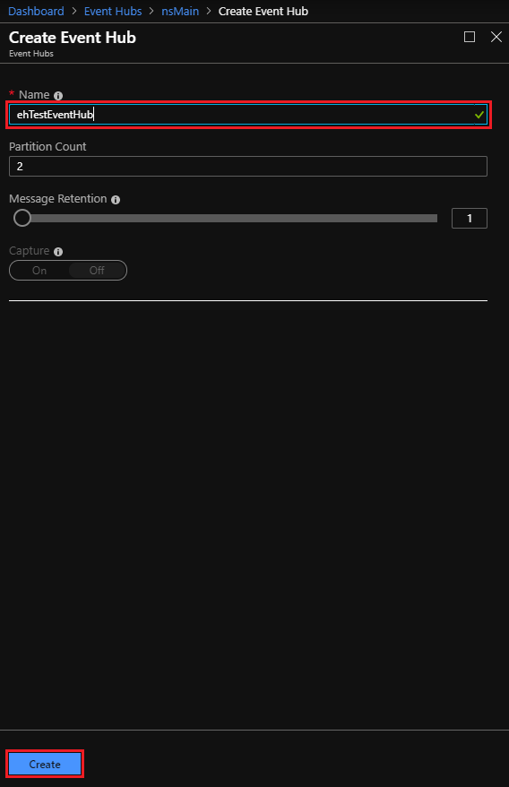
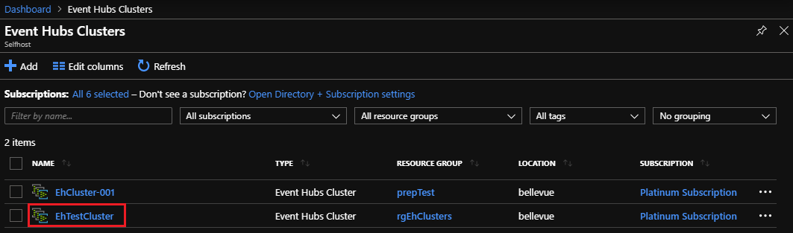

# Quickstart: Create an Event Hubs cluster using the Azure Stack Hub portal

In this quickstart, you learn how to create an Event Hubs cluster, using the Azure Stack Hub user portal. 

Event Hubs clusters offer single-tenant deployments for the most demanding streaming needs. An Event Hubs cluster can ingress millions of events per second with guaranteed capacity and subsecond latency. Event Hubs clusters includes all popular features, and close parity with features offered by the Azure Event Hubs edition.

## Prerequisites

Before you can complete this quickstart, you must ensure the Event Hubs service is available in your subscription. If not, work with your administrator to [install the Event Hubs on Azure Stack Hub resource provider](../operator/event-hubs-rp-overview.md). The installation steps also cover the creation of an offer that includes the Event Hubs service. 

Once an offer is available, your administrator can create or update your subscription to include Event Hubs. Alternatively, you can [subscribe to the new offer and create your own subscription](azure-stack-subscribe-services.md).

## Overview

Event Hubs clusters are created by specifying Capacity Units (CUs). A CU is a pre-allocated amount of CPU, storage, and memory resources. Event Hubs clusters are billed by CPU/hr. The number of cores (CPUs) used by a cluster is displayed when selecting the number of CUs (cluster size) during the cluster creation experience. For more detailed information on cluster resource usage, see [How to do capacity planning for Event Hubs on Azure Stack Hub](../operator/event-hubs-rp-capacity-planning.md). 

In this quickstart, you learn how to use the Azure Stack Hub user portal to:
- Create a 1 CU Event Hubs cluster.
- Create a namespace in the cluster.
- Create an event hub in the namespace.
- Delete an Event Hubs cluster

## Create an Event Hubs cluster

An Event Hubs cluster provides a unique scoping container in which you can create one or more namespaces. Complete the following steps to create an Event Hubs cluster: 

1. Sign in to the Azure Stack Hub user portal.
2. Select **All services** from the left navigation pane, enter "Event Hubs Clusters" in the search bar, and select the **Event Hubs Clusters** item from results list.
3. Once on the **Event Hubs Clusters** page, select **+ Add** from the top menu. The **Create Event Hubs Cluster** panel opens on the right.
4. On the **Basics** tab of the **Create Event Hubs Cluster** page:  
   - **Cluster name**: Enter a name. The system immediately checks to see if the name is available. If available, a checkmark will show at the right end of the field. 
   - **Subscription**: Select the subscription in which you want to create the cluster. 
   - **Resource group**: Create/Select the resource group in which you want to create the cluster. 
   - Select the **Next: Tags >** button at the bottom of the page to continue. You may have to wait for the system to fully provision resources. 

   

5. On the **Tags** tab: 
   - Optionally, enter the name/value pairs for the resource tag(s).  
   - Select the **Next: Review + Create >** button to continue. 

   

6. On the **Review + Create** tab, you should also see a "Validation succeeded" banner at the top of the page. After reviewing the details, select **Create** when ready to create the cluster. 

   

   >[!NOTE]
   > An Event Hubs cluster deployment can take several minutes to complete, normally at least 45 minutes.

7. During deployment, you see a **Your deployment is underway** status page. When deployment finishes, the page changes to **Your deployment is complete**. Before continuing to the next section, select the **Go to resource** button to view the new cluster:

   

## Create a namespace

Now you create a namespace within your new cluster:

1. On the Event Hubs Cluster **Overview** page for your cluster, select **+ Namespace** from the top menu. 

   

2. On the **Create namespace in cluster** panel:

   - **Name**: Enter a name for the namespace. The system immediately checks to see if the name is available. If available, a checkmark will show at the right end of the field. 
   - **Property/Value list**: The namespace inherits the following properties: 
     - Subscription ID 
     - Resource group 
     - Location 
     - Cluster name 

   - Select **Create** to create the namespace:

   

3. Note your new namespace under **Cluster Namespaces**. Before continuing to the next section, select the link for your new namespace: 

   

## Create an event hub

1. On the Event Hubs Namespace **Overview** page, select **+ Event Hub** from the top menu:  

   

2. On the **Create Event Hub** panel:
   - **Name**: Enter a name for the event hub. The name can contain only letters, numbers, periods, hyphens, and underscores. The name must start and end with a letter or number. The system immediately checks to see if the name is available. If available, a checkmark will show at the right end of the field.
   - Select **Create** to create the event hub.

   

## Delete an Event Hubs cluster

To delete the cluster:

1. Select **All services** from the left navigation pane again. Enter "Event Hubs Clusters" in the search bar, and select the **Event Hubs Clusters** item from results list.
2. On the **Event Hub Clusters** page, find and select the cluster you created previously.

   

3. On the Event Hubs Cluster **Overview** page, select **Delete** from the top menu.  
4. The **Delete Cluster** panel opens on the right, with a deletion confirmation message. 
5. Enter the name of the cluster and select **Delete** to delete the cluster. 

   

## Next steps

In this quickstart, you learned how to create an Event Hubs cluster using the portal. Now continue with the "Send and receive events" quickstarts, starting with the first one:  

> [!div class="nextstepaction"]
> [Send events to or receive events from Azure Event Hubs using .NET Core](/azure/event-hubs/event-hubs-dotnet-standard-getstarted-send)
