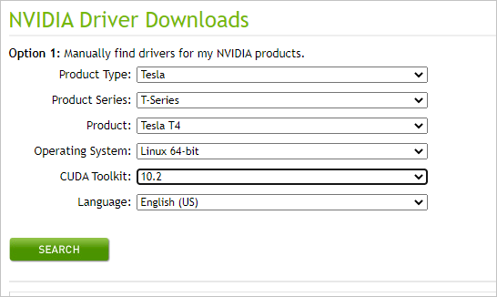
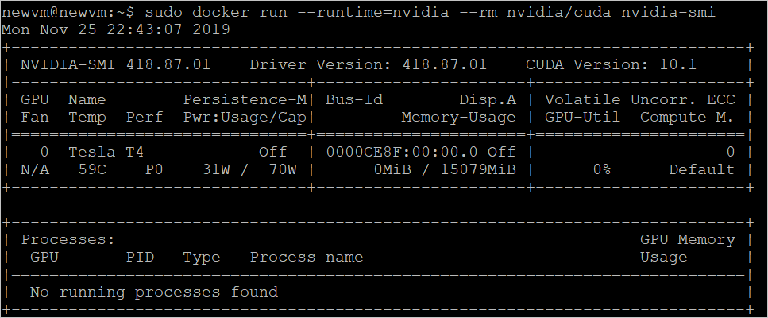

# Deploy a GPU enabled IoT module on Azure Stack Hub

In this article, you will install GPU drivers for your Azure Stack virtual machines (VM)
and begin developing modules to Linux devices running IoT Edge. IoT Edge allows
you to remotely manage code on your devices so that you can send more of your
workloads to the edge.

This article takes advantage of GPU optimized VMs to run compute-intensive,
graphics-intensive, and visualization workloads. GPU optimized VM sizes are
specialized virtual machines available with single or multiple NVIDIA GPUs.

In this article you'll learn how to:
  - Deploy a GPU module to an IoT Edge VM on Azure Stack Hub.
  - Benchmark processing times for GPUs and CPUs.
  - Included models:  This sample includes PyTorch and TensorFlow benchmarking sample code for CPU against GPU.

## Prerequisites

Azure Stack Hub and Azure

  - A subscription as a user using Azure Active Directory (Azure AD) in an Azure Stack Hub Integrated System with an NVIDA GPU.
  - A global Azure subscription.
      - If you don't have a global Azure subscription, create a [free account](https://azure.microsoft.com/free/?WT.mc_id=A261C142F) before you begin.
      - An Azure Container Registry (ACR). Make a note of the ACR sign-in server, username, and password.
-   A free or standard-tier [IoT
    hub](https://docs.microsoft.com/azure/iot-hub/iot-hub-create-through-portal)
    in Azure.

A development machine:

-   You can use your own computer or a virtual machine, depending on your
    development preferences. Your development machine will need to support nested virtualization. This capability is necessary for running Docker, the container engine used in this article.

  - Your development machine will need the following resources:
      - [Python 3.x](https://www.python.org/downloads/)
      - [Pip](https://pypi.org/project/pip/) for installing Python packages. This is usually been installed with your Python installation. If you have Pip installed, you may want to upgrade to the latest version. You can upgrade using pip, itself. Type: `pip install --upgrade pip`.
      - [Azure CLI 2.0](/cli/azure/install-azure-cli?view=azure-cli-latest)
      - [Git](https://git-scm.com/downloads)
      - [Docker](https://docs.docker.com/get-docker/)
      - [Visual Studio Code](https://code.visualstudio.com/)
      - [Azure IoT Tools](https://marketplace.visualstudio.com/items?itemName=vsciot-vscode.azure-iot-tools) for Visual Studio Code
      - [Python Extension Pack](https://marketplace.visualstudio.com/items?itemName=donjayamanne.python-extension-pack) for Visual Studio Code

## Register an IoT Edge device

Use a separate device. Using a separate device will provide a separation between your development machine and IoT Edge device more accurately mirrors a deployment scenario. 

Create an IoT Edge device in Azure with a Linux virtual machine:

1.  [Create an N-series Linux Server
    VM](https://docs.microsoft.com/azure-stack/user/azure-stack-quick-linux-portal?view=azs-1910)
    on Azure Stack

2.  [Create and register an IoT Edge
    Device](https://docs.microsoft.com/azure/iot-edge/how-to-register-device)

3.  Install the latest IoT Edge runtime on a Linux VM in Azure Stack Hub. For instructions, see [Install the Azure IoT Edge runtime on Debian-based Linux systems](/azure/iot-edge/how-to-install-iot-edge-linux#install-the-latest-runtime-version)

## Prepare a GPU enabled VM

1. Deploy a GPU enabled VM in the Azure Stack Hub user portal.

2. Install the NVIDA GPU Drivers using [these instructions](https://docs.microsoft.com/azure/virtual-machines/linux/n-series-driver-setup).

3. Install the NVIDIA GPU drivers. For instructions, see [Graphics processing unit (GPU) virtual machine (VM) on Azure Stack Hub](gpu-vms-about.md).

3. Install the latest IoT Edge Runtime on your Linux VM

## Install Docker and the Nvidia driver

Summary.

### Install Docker

1.  Update the apt index and lists.

    ```bash  
    $ sudo apt-get update
    ```

1.  Fetch the new versions of existing packages on the machine

    ```bash  
    $ sudo apt-get upgrade
    ```

2.  Install dependencies required to add Docker's apt repo

    ```bash  
    $ sudo apt-get install apt-transport-https ca-certificates curl
    software-properties-common
    ```

3.  Add Docker's GPG key.

    ```bash  
    $ curl -fsSL <https://download.docker.com/linux/ubuntu/gpg> \| sudo apt-key
    add -
    ```

4.  Add Docker's apt repo.

    ```bash  
    $ sudo add-apt-repository "deb [arch=amd64]
    https://download.docker.com/linux/ubuntu \$(lsb_release -cs) stable"
    ```

5.  Update apt index and lists, and install Docker Community Edition.

    ```bash  
    $ sudo apt-get update  
    $ sudo apt-get install docker-ce
    ```

6.  Verify install by checking the Docker version.

    ```bash  
    $ docker -v
    ```

### Install Nvidia-Docker

1.  Set the GPG key and the remote repository for the nvidia-docker package.

    ```bash  
    $ curl -s -L <https://nvidia.github.io/nvidia-docker/gpgkey> \| \\ sudo
    apt-key add -distribution=\$(. /etc/os-release;echo \$ID\$VERSION_ID)  
    curl -s -L
    <https://nvidia.github.io/nvidia-docker/$distribution/nvidia-docker.list> \|
    \\ sudo tee /etc/apt/sources.list.d/nvidia-docker.list
    ```

3.  Update the apt index and lists, and install nvidia-docker2 and the Docker
    daemon configurations.

    ```bash  
    sudo apt-get update
    sudo apt-get install -y
    ```

1.  [Install NVIDIA GPU
    Drivers](https://docs.microsoft.com/azure/virtual-machines/linux/n-series-driver-setup)

### Install Nvidia driver

1. Install gcc

    ```bash  
    sudo apt update
    sudo apt install build-essential
    ```

2. Download and install driver from the following URL: [https://www.nvidia.com/Download/index.aspx?lang=en-us](https://www.nvidia.com/Download/index.aspx?lang=en-us)

    

    ```bash  
    sudo sh NVIDIA-Linux-x86_64-440.64.00.run
    ```

3. Install cuda from the following URL: [https://developer.nvidia.com/cuda-downloads](https://developer.nvidia.com/cuda-downloads)

4.    Verify install by running the following command:

```bash  
\$ sudo docker run --runtime=nvidia --rm nvidia/cuda nvidia-smi
```



## Enable monitoring

1. Download [Azure IoT explorer](/azure/iot-pnp/howto-use-iot-explorer), and connect the application to your IoT Hub.

2. Select your IoT Device and navigate to Telemetry from the navigation menu.

3. Select **Start** to begin monitoring output from the IoT Edge Device.

## Deploy to Azure Stack Hub

You can also deploy modules using the Azure IoT Hub Toolkit extension, which used to be called the Azure IoT Toolkit extension, for Visual Studio Code. You have created a deployment manifest your scenario, the **deployment.json** file. Select a device to receive the deployment.

1.  In the VS Code command palette, run Azure IoT Hub: **Select IoT Hub**.

2.  Choose the subscription and IoT hub that contain the IoT Edge device that you want to configure.

3.  In the VS Code explorer, expand the Azure IoT Hub Devices section.

4.  Right-click the name of your IoT Edge device, then select **Create Deployment for Single Device**.

5.  Select the **deployment.amd64.json** file in the config folder and then select **Select Edge Deployment Manifest**. Do not use the `deployment.template.json` file.

6.  Select **Refresh**. You should see the GPU module running.

## Next Steps

  - Learn more about Azure Stack, Data Box Edge and the Intelligent Edge, [The future of computing: intelligent cloud and intelligent edge](https://azure.microsoft.com/overview/future-of-cloud)

  - Learn more about hybrid cloud applications, see [Hybrid Cloud Solutions](https://docs.microsoft.com/hybrid/app-solutions/)

  - Modify the code to this sample on [GitHub](https://github.com/Azure-Samples/azure-intelligent-edge-patterns).