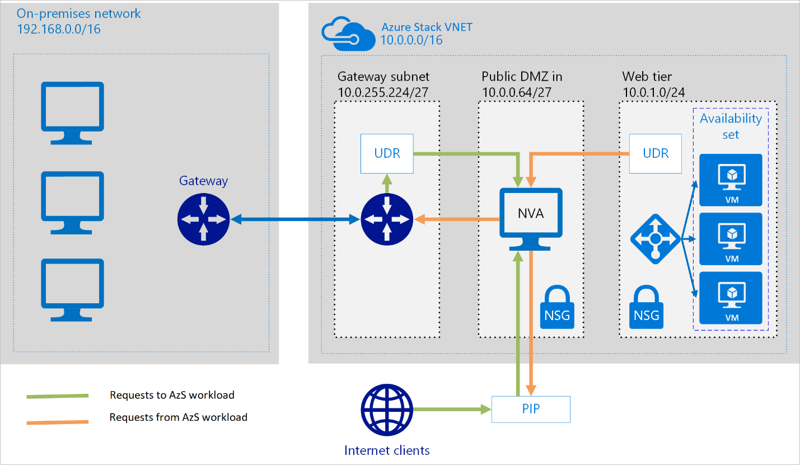
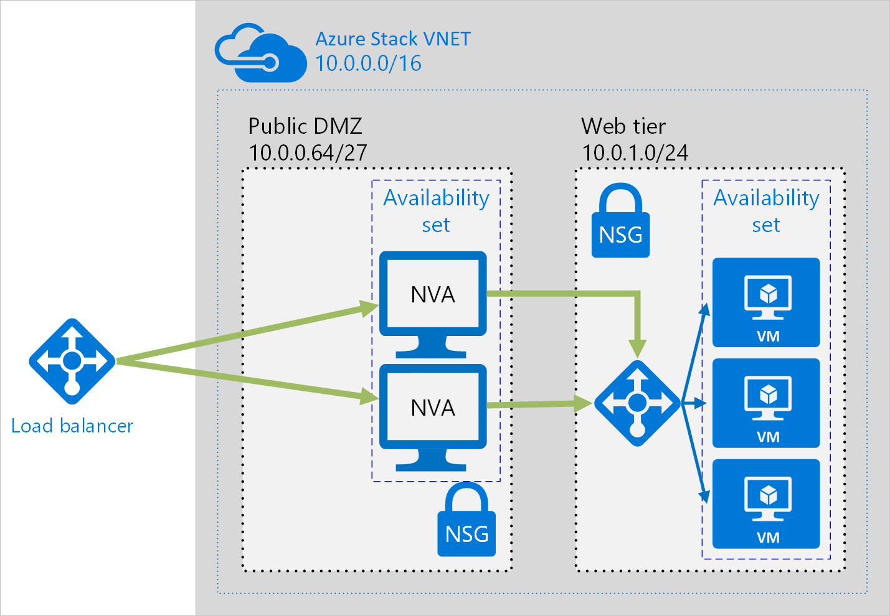
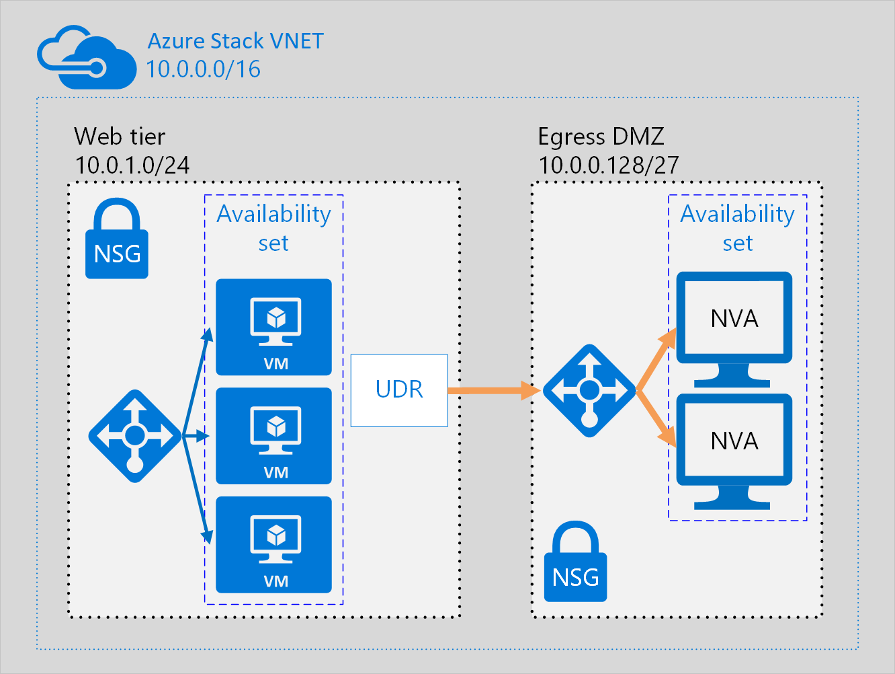
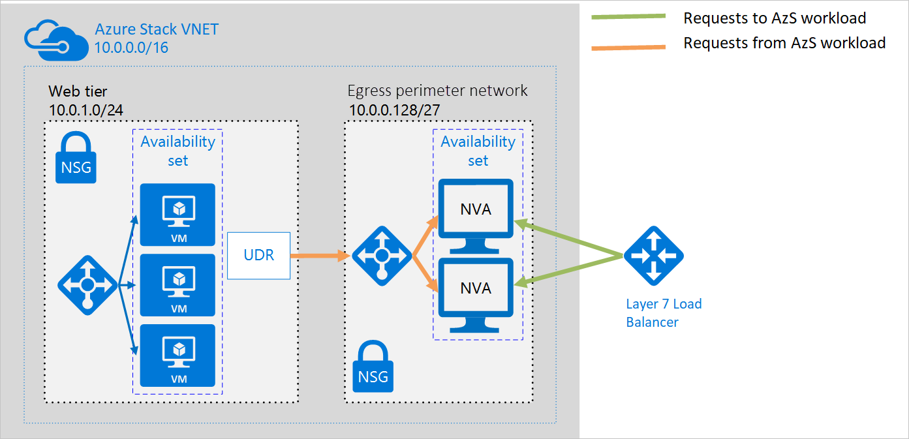

# Deploy highly available network virtual appliances on Azure Stack Hub

This article shows you how to deploy a set of network virtual appliances (NVAs) for high availability in Azure Stack Hub. An NVA is typically used to control the flow of network traffic from a perimeter network, also known as a DMZ, to other networks or subnets. The article includes example architectures for ingress only, egress only, and both ingress and egress.

There are NVAs from different vendors available on [Azure Stack Hub Marketplace](https://docs.microsoft.com/azure-stack/operator/azure-stack-marketplace-azure-items), use one of them for optimal performance.

The architecture has the following components.

## Networking and load balancing

-   **Virtual network and subnets**. Every Azure VM is deployed into a virtual network that can be segmented into subnets. Create a separate subnet for each tier.

-   **Layer 7 Load Balancer.** As Application Gateway is not yet available on Azure Stack Hub, there are alternatives available on [Azure Stack Hub Market place](https://docs.microsoft.com/azure-stack/operator/azure-stack-marketplace-azure-items) such as: [KEMP LoadMaster Load Balancer ADC Content Switch](https://azuremarketplace.microsoft.com/marketplace/apps/kemptech.vlm-azure)/ [f5 Big-IP Virtual Edition](https://azuremarketplace.microsoft.com/marketplace/apps/f5-networks.f5-big-ip-best) or [A10 vThunder ADC](https://azuremarketplace.microsoft.com/marketplace/apps/a10networks.vthunder-414-gr1)

-   **Load balancers**. Use [Azure Load Balancer](https://docs.microsoft.com/azure/load-balancer/load-balancer-overview)to distribute network traffic from the web tier to the business tier, and from the business tier to SQL Server.

-   **Network security groups** (NSGs). Use NSGs to restrict network traffic within the virtual network. For example, in the three-tier architecture shown here, the database tier doesn't accept traffic from the web front end, only from the business tier and the management subnet.

-   **UDRs.** Use [*user-defined routes*](https://docs.microsoft.com/azure/virtual-network/virtual-networks-udr-overview/) (UDRs) to route traffic to the specific load balancer.

This article assumes a basic understanding of Azure Stack Hub networking.

## Architecture diagrams

An NVA can be deployed to a perimeter network in many different architectures. For example, the following figure illustrates the use of a single NVA for ingress.

In this architecture, the NVA provides a secure network boundary by checking all inbound and outbound network traffic and passing only the traffic that meets network security rules. The fact that all network traffic must pass through the NVA means that the NVA is a single point of failure in the network. If the NVA fails, there is no other path for network traffic and all the back-end subnets are unavailable.

To make an NVA highly available, deploy more than one NVA into an availability set.

The following architectures describe the resources and configuration necessary for highly available NVAs:

| Solution | Benefits | Considerations |
| --- | --- | --- |
| Ingress with layer 7 NVAs | All NVA nodes are active. | Requires an NVA that can terminate connections and use SNAT. Requires a separate set of NVAs for traffic coming from the Enterprise Network/Internet and from Azure Stack Hub. Can only be used for traffic originating outside Azure Stack Hub.  |
| Egress with layer 7 NVAs | All NVA nodes are active. | Requires an NVA that can terminate connections and implements source network address translation (SNAT). |
| Ingress-Egress with layer 7 NVAs | All nodes are active. Able to handle traffic originated in Azure Stack Hub. | Requires an NVA that can terminate connections and use SNAT. Requires a separate set of NVAs for traffic coming from the Enterprise Network/Internet and from Azure Stack Hub. |

## Ingress with layer 7 NVAs

The following figure shows a high availability architecture that implements an ingress perimeter network behind an internet-facing load balancer. This architecture is designed to provide connectivity to Azure Stack Hub workloads for layer 7 traffic, such as HTTP or HTTPS:

The benefit of this architecture is that all NVAs are active, and if one fails the load balancer directs network traffic to the other NVA. Both NVAs route traffic to the internal load balancer so as long as one NVA is active, traffic continues to flow. The NVAs are required to terminate SSL traffic intended for the web tier VMs. These NVAs cannot be extended to handle Enterprise Network traffic because Enterprise Network traffic requires another dedicated set of NVAs with their own network routes.

## Egress with layer 7 NVAs

The Ingress with layer 7 NVAs architecture can be expanded to provide an egress perimeter network for requests originating in the Azure Stack Hub workload. The following architecture is designed to provide high availability of the NVAs in the perimeter network for layer 7 traffic, such as HTTP or HTTPS:

In this architecture, all traffic originating in Azure Stack Hub is routed to an internal load balancer. The load balancer distributes outgoing requests between a set of NVAs. These NVAs direct traffic to the Internet using their individual public IP addresses.

## Ingress-egress with layer 7  NVAs

In the two ingress and egress architectures, there was a separate perimeter network for ingress and egress. The following architecture demonstrates how to create a perimeter network that can be used for both ingress and egress for layer 7 traffic, such as HTTP or HTTPS:

In the Ingress-egress with layer 7 NVAs architecture, the NVAs process incoming requests from a Layer 7 Load Balancer. The NVAs also process outgoing requests from the workload VMs in the back-end pool of the load balancer. Because incoming traffic is routed with a layer 7 load balancer, and outgoing traffic is routed with an SLB (Azure Stack Hub Basic Load Balancer), the NVAs are responsible for maintaining session affinity. That is, the layer 7 load balancer maintains a mapping of inbound and outbound requests so it can forward the correct response to the original requestor. However, the internal load balancer doesn't have access to the layer 7 load balancer mappings, and uses its own logic to send responses to the NVAs. It's possible the load balancer could send a response to an NVA that did not initially receive the request from the layer 7 load balancer. In this case, the NVAs must communicate and transfer the response between them so the correct NVA can forward the response to the layer 7 load balancer.

> [!Note]  
> You can also solve the asymmetric routing issue by ensuring the NVAs perform inbound source network address translation (SNAT). This would replace the original source IP of the requestor to one of the IP addresses of the NVA used on the inbound flow. This ensures that you can use multiple NVAs at a time, while preserving the route symmetry.

## Next steps

- To learn more about Azure Stack Hub VMs, see [Azure Stack Hub VM features](azure-stack-vm-considerations.md).  
- To learn more about Azure Cloud Patterns, see [Cloud Design Patterns](https://docs.microsoft.com/azure/architecture/patterns).
