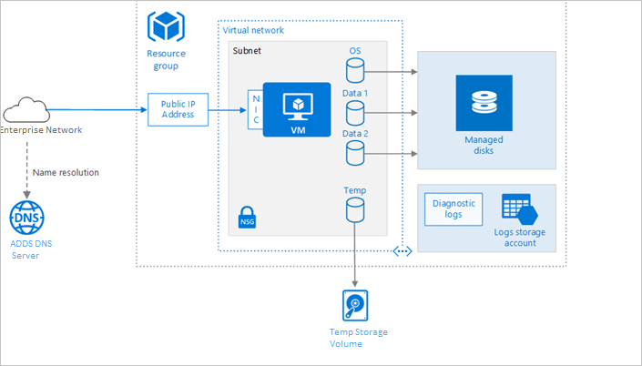

# Run a Linux virtual machine on Azure Stack Hub

Provisioning a virtual machine (VM) in Azure Stack Hub, like Azure, requires some additional components besides the VM itself, including networking and storage resources. This article shows best practices for running a Linux VM on Azure Stack Hub.



## Resource group

A [resource group](/azure/azure-resource-manager/resource-group-overview) is a logical container that holds related Azure Stack Hub resources. In general, group resources based on their lifetime and who will manage them.

Put closely associated resources that share the same lifecycle into the same [resource group](/azure/azure-resource-manager/resource-group-overview). Resource groups allow you to deploy and monitor resources as a group and track billing costs by resource group. You can also delete resources as a set, which is useful for test deployments. Assign meaningful resource names to simplify locating a specific resource and understanding its role. For more information, see [Recommended Naming Conventions for Azure Resources](/azure/architecture/best-practices/naming-conventions).

## Virtual machine

You can provision a VM from a list of published images, or from a custom-managed image or virtual hard disk (VHD) file uploaded to Azure Stack Hub Blob storage. Azure Stack Hub supports running various popular Linux distributions, including CentOS, Debian, Red Hat Enterprise, Ubuntu, and SUSE. For more information, see [Linux on Azure Stack Hub](../operator/azure-stack-linux.md). You may also choose to syndicate one of the published Linux Images that are available on the Azure Stack Hub Marketplace.

Azure Stack Hub offers different virtual machine sizes from Azure. For more information, see [Sizes for virtual machines in Azure Stack Hub](./azure-stack-vm-sizes.md). If you are moving an existing workload to Azure Stack Hub, start with the VM size that's the closest match to your on-premises servers/Azure. Then measure the performance of your actual workload in terms of CPU, memory, and disk input/output operations per second (IOPS), and adjust the size as needed.

## Disks

Cost is based on the capacity of the provisioned disk. IOPS and throughput (that is, data transfer rate) depend on VM size, so when you provision a disk, consider all three factors (capacity, IOPS, and throughput).

Disk IOPS (Input/Output Operations Per Second) on Azure Stack Hub is a function of [VM size](./azure-stack-vm-sizes.md) instead of the disk type. This means that for a Standard_Fs series VM, regardless of whether you choose SSD or HDD for the disk type, the IOPS limit for a single additional data disk is 2300 IOPS. The IOPS limit imposed is a cap (maximum possible) to prevent noisy neighbors. It isn't an assurance of IOPS that you'll get on a specific VM size.

We also recommend using [Managed Disks](./azure-stack-managed-disk-considerations.md). Managed disks simplify disk management by handling the storage for you. Managed disks do not require a storage account. You simply specify the size and type of disk and it is deployed as a highly available resource.

The OS disk is a VHD stored in [Azure Stack Hub Storage](./azure-stack-storage-overview.md), so it persists even when the host machine is down. For Linux VMs, the OS disk is /dev/sda1. We also recommend creating one or more [data disks](./azure-stack-manage-vm-disks.md), which are persistent VHDs used for application data.

When you create a VHD, it is unformatted. Log into the VM to format the disk. In the Linux shell, data disks are displayed as /dev/sdc, /dev/sdd, and so on. You can run lsblk to list the block devices, including the disks. To use a data disk, create a partition and file system, and mount the disk. For example:

```bash
# Create a partition.
sudo fdisk /dev/sdc \# Enter 'n' to partition, 'w' to write the change.

# Create a file system.
sudo mkfs -t ext3 /dev/sdc1

# Mount the drive.
sudo mkdir /data1
sudo mount /dev/sdc1 /data1
```

When you add a data disk, a logical unit number (LUN) ID is assigned to the disk. Optionally, you can specify the LUN ID — for example, if you're replacing a disk and want to retain the same LUN ID, or you have an application that looks for a specific LUN ID. However, remember that LUN IDs must be unique for each disk.

The VM is created with a temporary disk. This disk is stored on a temporary volume on the Azure Stack Hub storage infrastructure. It may be deleted during reboots and other VM lifecycle events. Use this disk only for temporary data, such as page or swap files. For Linux VMs, the temporary disk is /dev/sdb1 and is mounted at /mnt/resource or /mnt.

## Network

The networking components include the following resources:

-   **Virtual network**. Every VM is deployed into a virtual network that can be segmented into multiple subnets.

-   **Network interface (NIC)**. The NIC enables the VM to communicate with the virtual network. If you need multiple NICs for your VM, be aware that a maximum number of NICs is defined for each [VM size](./azure-stack-vm-sizes.md).

-   **Public IP address/ VIP**. A public IP address is needed to communicate with the VM — for example, via remote desktop (RDP). The public IP address can be dynamic or static. The default is dynamic. If you need multiple NICs for your VM, be aware that a maximum number of NICs is defined for each [VM size](./azure-stack-vm-sizes.md).

-   You can also create a fully qualified domain name (FQDN) for the IP address. You can then register a [CNAME record](https://en.wikipedia.org/wiki/CNAME_record) in DNS that points to the FQDN. For more information, see [Create a fully qualified domain name in the Azure portal](/azure/virtual-machines/windows/portal-create-fqdn).

-   **Network security group (NSG).** Network Security Groups are used to allow or deny network traffic to VMs. NSGs can be associated either with subnets or with individual VM instances.

All NSGs contain a set of [default rules](/azure/virtual-network/security-overview#default-security-rules), including a rule that blocks all inbound Internet traffic. The default rules cannot be deleted, but other rules can override them. To enable Internet traffic, create rules that allow inbound traffic to specific ports — for example, port 80 for HTTP. To enable SSH, add an NSG rule that allows inbound traffic to TCP port 22.

## Operations

**SSH**. Before you create a Linux VM, generate a 2048-bit RSA public-private key pair. Use the public key file when you create the VM. For more information, see [How to Use SSH with Linux on Azure](/azure/virtual-machines/linux/mac-create-ssh-keys).

**Diagnostics**. Enable monitoring and diagnostics, including basic health metrics, diagnostics infrastructure logs, and [boot diagnostics](https://azure.microsoft.com/blog/boot-diagnostics-for-virtual-machines-v2/). Boot diagnostics can help you diagnose boot failure if your VM gets into a non-bootable state. Create an Azure Storage account to store the logs. A standard locally redundant storage (LRS) account is sufficient for diagnostic logs. For more information, see [Enable monitoring and diagnostics](./azure-stack-metrics-azure-data.md).

**Availability**. Your VM may be subject to a reboot due to planned maintenance as scheduled by the Azure Stack Hub operator. For higher availability, deploy multiple VMs in an [availability set](../operator/azure-stack-app-service-deploy.md?view=azs-2002).

**Backups** For recommendations on protecting your Azure Stack Hub IaaS VMs, reference [this](./azure-stack-manage-vm-protect.md) article.

**Stopping a VM**. Azure makes a distinction between "stopped" and "deallocated" states. You are charged when the VM status is stopped, but not when the VM is deallocated. In the Azure Stack Hub portal, the **Stop** button deallocates the VM. If you shut down through the OS while logged in, the VM is stopped but **not** deallocated, so you will still be charged.

**Deleting a VM**. If you delete a VM, the VM disks are not deleted. That means you can safely delete the VM without losing data. However, you will still be charged for storage. To delete the VM disk, delete the managed disk object. To prevent accidental deletion, use a [resource lock](/azure/resource-group-lock-resources) to lock the entire resource group or lock individual resources, such as a VM.

## Security considerations

Onboard your VMs to [Azure Security Center](/azure/security-center/quick-onboard-azure-stack) to get a central view of the security state of your Azure resources. Security Center monitors potential security issues and provides a comprehensive picture of the security health of your deployment. Security Center is configured per Azure subscription. Enable security data collection as described in [Onboard your Azure subscription to Security Center Standard](/azure/security-center/security-center-get-started). When data collection is enabled, Security Center automatically scans any VMs created under that subscription.

**Patch management**. To configure Patch management on your VM, refer to [this](./vm-update-management.md) article. If enabled, Security Center checks whether any security and critical updates are missing. Use [Group Policy settings](/windows-server/administration/windows-server-update-services/deploy/4-configure-group-policy-settings-for-automatic-updates) on the VM to enable automatic system updates.

**Antimalware**. If enabled, Security Center checks whether antimalware software is installed. You can also use Security Center to install antimalware software from inside the Azure portal.

**Access control**. Use [role-based access control (RBAC)](/azure/active-directory/role-based-access-control-what-is) to control access to Azure resources. RBAC lets you assign authorization roles to members of your DevOps team. For example, the Reader role can view Azure resources but not create, manage, or delete them. Some permissions are specific to an Azure resource type. For example, the Virtual Machine Contributor role can restart or deallocate a VM, reset the administrator password, create a new VM, and so on. Other [built-in RBAC roles](/azure/active-directory/role-based-access-built-in-roles) that may be useful for this architecture include [DevTest Labs User](/azure/active-directory/role-based-access-built-in-roles#devtest-labs-user) and [Network Contributor](/azure/active-directory/role-based-access-built-in-roles#network-contributor).

> [!Note]  
> RBAC does not limit the actions that a user logged into a VM can perform. Those permissions are determined by the account type on the guest OS.

**Audit logs**. Use [activity logs](./azure-stack-metrics-azure-data.md?#activity-log) to see provisioning actions and other VM events.

**Data encryption**. Azure Stack Hub protects user and infrastructure data at the storage subsystem level using encryption at rest. Azure Stack Hub's storage subsystem is encrypted using BitLocker with 128-bit AES encryption. Refer to [this](../operator/azure-stack-security-bitlocker.md) article for more details.

## Next steps

- To learn more about Azure Stack Hub VMs, see [Azure Stack Hub VM features](azure-stack-vm-considerations.md).  
- To learn more about Azure Cloud Patterns, see [Cloud Design Patterns](/azure/architecture/patterns).

title: Azure Stack Hub VM features 
description: Learn about different features and considerations when working with VMs in Azure Stack Hub.
author: mattbriggs

ms.topic: article
ms.date: 5/27/2020
ms.author: mabrigg
ms.reviewer: kivenkat
ms.lastreviewed: 10/09/2019

# Intent: As an Azure Stack user, I want to know what I need to do to move them to Azure Stack or work with them in Azure Stack.
# Keyword: Azure Stack VM

---


# Azure Stack Hub VM features

Azure Stack Hub virtual machines (VMs) provide on-demand, scalable computing resources. Before you deploy VMs, you should learn the differences between the VM features available in Azure Stack Hub and Microsoft Azure. This article describes these differences and identifies key considerations for planning VM deployments. To learn about high-level differences between Azure Stack Hub and Azure, see the [Key considerations](azure-stack-considerations.md) article.

## VM differences

| Feature | Azure (global) | Azure Stack Hub |
| --- | --- | --- |
| Virtual machine images | The Azure Marketplace has images that you can use to create a VM. See the [Azure Marketplace](https://azuremarketplace.microsoft.com/en-us/marketplace/apps/category/compute?subcategories=virtual-machine-images&page=1) page to view the list of images that are available in the Azure Marketplace. | By default, there aren't any images available in the Azure Stack Hub Marketplace. The Azure Stack Hub cloud admin must publish or download images to the Azure Stack Hub Marketplace before users can use them. |
| VHD generation | Generation two VMs support key features that aren't supported in generation one VMs. These features include increased memory, Intel Software Guard Extensions (Intel SGX), and virtualized persistent memory (vPMEM). Generation two VMs running on-premises, have some features that aren't supported in Azure yet. For more information see [Support for generation 2 VMs on Azure](/azure/virtual-machines/windows/generation-2)  | Azure Stack Hub supports only generation one VMs. You can convert a generation one VM from VHDX to the VHD file format and from dynamically expanding to a fixed-size disk. You can't change a VM's generation. For more information, see [Support for generation 2 VMs on Azure](/azure/virtual-machines/windows/generation-2). |
| Virtual machine sizes | Azure supports a wide variety of sizes for VMs. To learn about the available sizes and options, refer to the [Azure VMs sizes](/azure/virtual-machines/sizes). | Azure Stack Hub supports a subset of VM sizes that are available in Azure. To view the list of supported sizes, refer to the [VM sizes](#vm-sizes) section of this article. |
| Virtual machine quotas | [Quota limits](/azure/azure-resource-manager/management/azure-subscription-service-limits#managing-limits) are set by Microsoft. | The Azure Stack Hub cloud admin must assign quotas before they offer VM to their users. |
| Virtual machine extensions |Azure supports a wide variety of VM extensions. To learn about the available extensions, refer to the [VM extensions and features](/azure/virtual-machines/windows/extensions-features) article.| Azure Stack Hub supports a subset of extensions that are available in Azure and each of the extensions have specific versions. The Azure Stack Hub cloud admin can choose which extensions to be made available to for their users. To view the list of supported extensions, refer to the [VM extensions](#vm-extensions) section of this article. |
| Virtual machine network | Public IP addresses assigned to a tenant VM are accessible over the Internet.<br><br><br>Azure VMs have a fixed DNS name. | Public IP addresses assigned to a tenant VM are accessible within the Azure Stack Development Kit environment only. A user must have access to the Azure Stack Development Kit via [RDP](../asdk/asdk-connect.md#connect-to-azure-stack-using-rdp) or [VPN](../asdk/asdk-connect.md#connect-to-azure-stack-using-vpn) to connect to a VM that is created in Azure Stack Hub.<br><br>VMs created within a specific Azure Stack Hub instance have a DNS name based on the value that is configured by the cloud admin. |
| Virtual machine storage | Supports [managed disks.](/azure/virtual-machines/windows/managed-disks-overview) | Managed disks are supported in Azure Stack Hub with version 1808 and later. |
| Virtual machine disk performance | Depends on disk type and size. | Depends on VM size of the VM, which the disks are attached to. For more info, refer to the [VM sizes supported in Azure Stack Hub](azure-stack-vm-sizes.md) article.
| API versions | Azure always has the latest API versions for all the VM features. | Azure Stack Hub supports specific Azure services and specific API versions for these services. To view the list of supported API versions, refer to the [API versions](#api-versions) section of this article. |
| Azure Instance Metadata Service | The Azure Instance Metadata Service provides info about running VM instances that can be used to manage and set up your VM.  | The Azure Instance Metadata Service isn't supported on Azure Stack Hub. |
| Virtual machine availability sets|Multiple fault domains (2 or 3 per region).<br>Multiple update domains.|Multiple fault domains (2 or 3 per region).<br>Single update domain, with live migration to protect workloads during update. 20 update domains supported for template compatibility.<br>VM and availability set should be in the same location and resource group.|
| Virtual machine scale sets|Autoscale is supported.|Autoscale isn't supported.<br><br>Add more instances to a scale set using the portal, Resource Manager templates, or PowerShell. |
| Cloud Witness | Select the endpoints from the storage account properties available in Azure Stack Hub. | [Cloud Witness](/windows-server/failover-clustering/deploy-cloud-witness) is a type of Failover Cluster quorum witness that uses Microsoft Azure to provide a vote on cluster quorum.<br>The endpoints in global Azure compared to Azure Stack Hub may look like:<br>For global Azure:<br>`https://mywitness.blob.core.windows.net/`<br>For Azure Stack Hub:<br>`https://mywitness.blob.<region>.<FQDN>/`|
| Virtual machine diagnostics | Linux VM diagnostics are supported. | Linux VM diagnostics aren't supported in Azure Stack Hub. When you deploy a Linux VM with VM diagnostics enabled, the deployment fails. The deployment also fails if you enable the Linux VM basic metrics through diagnostic settings. |
| Nested virtualization VM sizes | Supported | Not supported |

## VM sizes

Azure Stack Hub imposes resource limits to avoid over consumption of resources (server local and service-level.) These limits improve the tenant experience by reducing the affect resource consumption by other tenants.

- For networking egress from the VM, there are bandwidth caps in place. Caps in Azure Stack Hub are the same as the caps in Azure.
- For storage resources, Azure Stack Hub implements storage IOPS (Input/Output Operations Per Second) limits to avoid basic overconsumption of resources by tenants for storage use.
- For VM disks, disk IOPS on Azure Stack Hub is a function of VM size instead of the disk type. This means that for a Standard_Fs series VM, regardless of whether you choose SSD or HDD for the disk type, the IOPS limit for an second data disk is 2300 IOPS.

The following table lists the VMs that are supported on Azure Stack Hub along with their configuration:

| Type            | Size          | Range of supported sizes |
| ----------------| ------------- | ------------------------ |
|General purpose  |Basic A        |[A0 - A4](azure-stack-vm-sizes.md#basic-a)                   |
|General purpose  |Standard A     |[A0 - A7](azure-stack-vm-sizes.md#standard-a)              |
|General purpose  |Av2-series     |[A1_v2 - A8m_v2](azure-stack-vm-sizes.md#av2-series)     |
|General purpose  |D-series       |[D1 - D4](azure-stack-vm-sizes.md#d-series)              |
|General purpose  |Dv2-series     |[D1_v2 - D5_v2](azure-stack-vm-sizes.md#ds-series)        |
|General purpose  |DS-series      |[DS1 - DS4](azure-stack-vm-sizes.md#dv2-series)            |
|General purpose  |DSv2-series    |[DS1_v2 - DS5_v2](azure-stack-vm-sizes.md#dsv2-series)      |
|Memory optimized |D-series       |[D11 - D14](azure-stack-vm-sizes.md#mo-d)            |
|Memory optimized |DS-series      |[DS11 - DS14](azure-stack-vm-sizes.md#mo-ds)|
|Memory optimized |Dv2-series     |[D11_v2 - DS14_v2](azure-stack-vm-sizes.md#mo-dv2)     |
|Memory optimized |DSv2-series    |[DS11_v2 - DS14_v2](azure-stack-vm-sizes.md#mo-dsv2)    |
|Compute optimized|F-series       |[F1 - F16](azure-stack-vm-sizes.md#f-series)    |
|Compute optimized|Fs-series      |[F1s - F16s](azure-stack-vm-sizes.md#fs-series)    |
|Compute optimized|Fsv2-series    |[F2s_v2 - F64s_v2](azure-stack-vm-sizes.md#fsv2-series)    |

VM sizes and their associated resource quantities are consistent between Azure Stack Hub and Azure. This consistency includes the amount of memory, the number of cores, and the number/size of data disks that can be created. However, performance of VMs with the same size depends on the underlying characteristics of a particular Azure Stack Hub environment.

## VM extensions

Azure Stack Hub includes a small set of extensions. Updates and additional extensions are available through Marketplace syndication.

Use the following PowerShell script to get the list of VM extensions that are available in your Azure Stack Hub environment:

```powershell
Get-AzureRmVmImagePublisher -Location local | `
  Get-AzureRmVMExtensionImageType | `
  Get-AzureRmVMExtensionImage | `
  Select Type, Version | `
  Format-Table -Property * -AutoSize
```

If provisioning an extension on a VM deployment takes too long, let the provisioning timeout instead of trying to stop the process to deallocate or delete the VM.

## API versions

VM features in Azure Stack Hub support the following API versions:

"2017-12-01",
"2017-03-30",
"2016-03-30",
"2015-06-15"

You can use the following PowerShell script to get the API versions for the VM features that are available in your Azure Stack Hub environment:

```powershell
Get-AzureRmResourceProvider | `
  Select ProviderNamespace -Expand ResourceTypes | `
  Select * -Expand ApiVersions | `
  Select ProviderNamespace, ResourceTypeName, @{Name="ApiVersion"; Expression={$_}} | `
  where-Object {$_.ProviderNamespace -like "Microsoft.compute"}
```

The list of supported resource types and API versions may vary if the cloud operator updates your Azure Stack Hub environment to a newer version.

## Windows activation

Windows products must be used in accordance with Product Use Rights and Microsoft license terms. Azure Stack Hub uses [Automatic VM Activation](/previous-versions/windows/it-pro/windows-server-2012-r2-and-2012/dn303421(v%3dws.11)) (AVMA) to activate Windows Server VMs.

- Azure Stack Hub host activates Windows with AVMA keys for Windows Server 2016. All VMs that run Windows Server 2012 R2 or later are automatically activated.
- VMs that run Windows Server 2012 or earlier aren't automatically activated and must be activated by using [MAK activation](/previous-versions/tn-archive/ff793438(v=technet.10)). To use MAK activation, you must provide your own product key.

Microsoft Azure uses KMS activation to activate Windows VMs. If you move a VM from Azure Stack Hub to Azure and encounter activation problems, see [Troubleshoot Azure Windows VM activation problems](/azure/virtual-machines/windows/troubleshoot-activation-problems). Additional info can be found at the [Troubleshooting Windows activation failures on Azure VMs](/archive/blogs/mast/troubleshooting-windows-activation-failures-on-azure-vms) Azure Support Team Blog post.

## High Availability

Your VM may be subject to a reboot due to planned maintenance as scheduled by the Azure Stack Hub operator. For high availability of a multi-VM production system in Azure, VMs are placed in an [availability set](/azure/virtual-machines/windows/manage-availability#configure-multiple-virtual-machines-in-an-availability-set-for-redundancy) that spreads them across multiple fault domains and update domains. In the smaller scale of Azure Stack Hub, a fault domain in an availability set is defined as a single node in the scale unit.  

While the infrastructure of Azure Stack Hub is already resilient to failures, the underlying technology (failover clustering) still incurs some downtime for VMs on an impacted physical server if there's a hardware failure. Azure Stack Hub supports having an availability set with a maximum of three fault domains to be consistent with Azure.

|                   |             |
|-------------------|-------------|
| **Fault domains** | VMs placed in an availability set will be physically isolated from each other by spreading them as evenly as possible over multiple fault domains (Azure Stack Hub nodes). If there's a hardware failure, VMs from the failed fault domain will be restarted in other fault domains. They'll be kept in separate fault domains from the other VMs but in the same availability set if possible. When the hardware comes back online, VMs will be rebalanced to maintain high availability. |
| **Update domains**| Update domains are another way that Azure provides high availability in availability sets. An update domain is a logical group of underlying hardware that can undergo maintenance at the same time. VMs located in the same update domain will be restarted together during planned maintenance. As tenants create VMs within an availability set, the Azure platform automatically distributes VMs across these update domains. <br>In Azure Stack Hub, VMs are live migrated across the other online hosts in the cluster before their underlying host is updated. Since there's no tenant downtime during a host update, the update domain feature on Azure Stack Hub only exists for template compatibility with Azure. VMs in an availability set will show 0 as their update domain number on the portal. |

## Next steps

[Create a Windows VM with PowerShell in Azure Stack Hub](azure-stack-quick-create-vm-windows-powershell.md)
