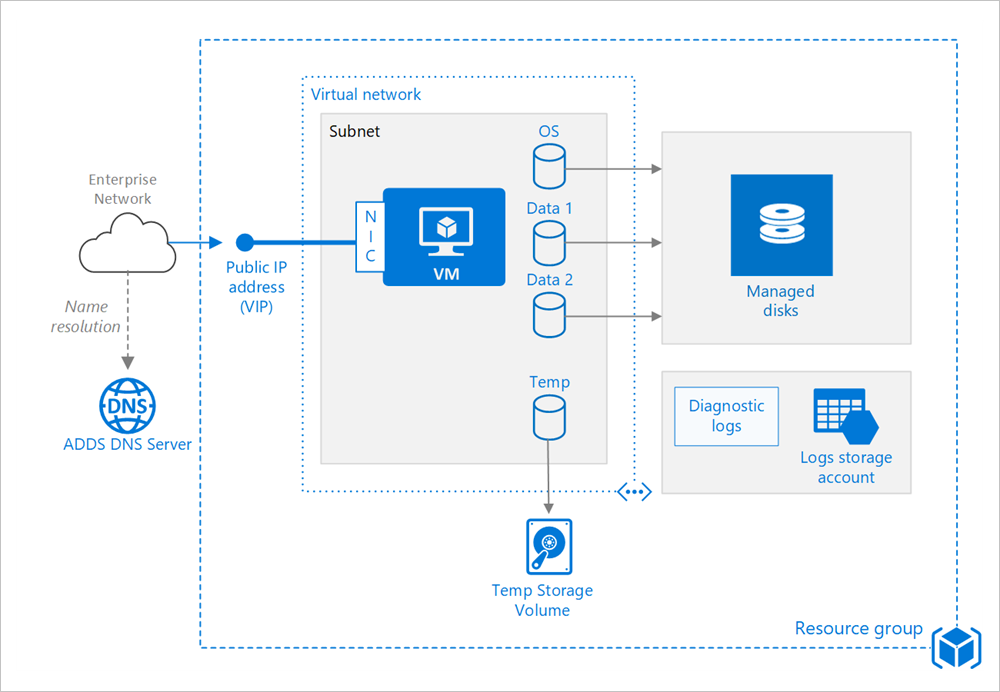

# Run a Windows virtual machine on Azure Stack

Provisioning a virtual machine (VM) in Azure Stack requires some additional components besides the VM itself, including networking and storage resources. This article shows best practices for running a Windows VM on Azure.

## Resource group

A [resource group](https://docs.microsoft.com/azure/azure-resource-manager/resource-group-overview) is a logical container that holds related Azure Stack resources. In general, group resources based on their lifetime and who will manage them.

Put closely associated resources that share the same lifecycle into the same [resource group](https://docs.microsoft.com/azure/azure-resource-manager/resource-group-overview). Resource groups allow you to deploy and monitor resources as a group and track billing costs by resource group. You can also delete resources as a set, which is useful for test deployments. Assign meaningful resource names to simplify locating a specific resource and understanding its role. For more information, see [Recommended Naming Conventions for Azure Resources](https://docs.microsoft.com/azure/architecture/best-practices/naming-conventions).

## Virtual machine

You can provision a VM from a list of published images, or from a custom-managed image or virtual hard disk (VHD) file uploaded to Azure Stack Blob storage.

Azure Stack offers different virtual machine sizes from Azure. For more information, see [Sizes for virtual machines in Azure Stack](https://docs.microsoft.com/azure-stack/user/azure-stack-vm-sizes). If you are moving an existing workload to Azure Stack, start with the VM size that's the closest match to your on-premises servers/Azure. Then measure the performance of your actual workload in terms of CPU, memory, and disk input/output operations per second (IOPS), and adjust the size as needed.

## Disks

Cost is based on the capacity of the provisioned disk. IOPS and throughput (that is, data transfer rate) depend on VM size, so when you provision a disk, consider all three factors (capacity, IOPS, and throughput).

Disk IOPS (Input/Output Operations Per Second) on Azure Stack is a function of [VM size](https://docs.microsoft.com/azure-stack/user/azure-stack-vm-sizes) instead of the disk type. This means that for a Standard_Fs series VM, regardless of whether you choose SSD or HDD for the disk type, the IOPS limit for a single additional data disk is 2300 IOPS. The IOPS limit imposed is a cap (maximum possible) to prevent noisy neighbors. It isn't an assurance of IOPS that you'll get on a specific VM size.

We also recommend using [Managed Disks](https://docs.microsoft.com/azure-stack/user/azure-stack-managed-disk-considerations). Managed disks simplify disk management by handling the storage for you. Managed disks do not require a storage account. You simply specify the size and type of disk and it is deployed as a highly available resource.

The OS disk is a VHD stored in Azure Stack blob storage, so it persists even when the host machine is down. We also recommend creating one or more [data disks](https://docs.microsoft.com/azure-stack/user/azure-stack-manage-vm-disks), which are persistent VHDs used for application data. When possible, install applications on a data disk, not the OS disk. Some legacy applications might need to install components on the C: drive; in that case, you can [resize the OS disk](https://docs.microsoft.com/azure/virtual-machines/virtual-machines-windows-expand-os-disk) using PowerShell.

The VM is also created with a temporary disk (the D: drive on Windows). This disk is stored on a temporary volume in the Azure Stack storage infrastructure. It may be deleted during reboots and other VM lifecycle events. Use this disk only for temporary data, such as page or swap files.

## Network

The networking components include the following resources:

-   **Virtual network**. Every VM is deployed into a virtual network that can be segmented into multiple subnets.

-   **Network interface (NIC)**. The NIC enables the VM to communicate with the virtual network. If you need multiple NICs for your VM, be aware that a maximum number of NICs is defined for each  [VM size](https://docs.microsoft.com/azure-stack/user/azure-stack-vm-sizes).

-   **Public IP address/ VIP**. A public IP address is needed to communicate with the VM — for example, via remote desktop (RDP). The public IP address can be dynamic or static. The default is dynamic.

-   Reserve a [static IP address](https://docs.microsoft.com/azure/virtual-network/virtual-networks-reserved-public-ip) if you need a fixed IP address that won't change — for example, if you need to create a DNS 'A' record or add the IP address to a safe list.

-   You can also create a fully qualified domain name (FQDN) for the IP address. You can then register a [CNAME record](https://en.wikipedia.org/wiki/CNAME_record) in DNS that points to the FQDN. For more information, see [Create a fully qualified domain name in the Azure portal](https://docs.microsoft.com/azure/virtual-machines/virtual-machines-windows-portal-create-fqdn).

-   **Network security group (NSG)**. NSGs are used to allow or deny network traffic to VMs. NSGs can be associated either with subnets or with individual VM instances.

All NSGs contain a set of [default rules](https://docs.microsoft.com/azure/virtual-network/security-overview#default-security-rules), including a rule that blocks all inbound Internet traffic. The default rules cannot be deleted, but other rules can override them. To enable Internet traffic, create rules that allow inbound traffic to specific ports — for example, port 80 for HTTP. To enable RDP, add an NSG rule that allows inbound traffic to TCP port 3389.

## Operations

**Diagnostics**. Enable monitoring and diagnostics, including basic health metrics, diagnostics infrastructure logs, and  [boot diagnostics](https://azure.microsoft.com/blog/boot-diagnostics-for-virtual-machines-v2/). Boot diagnostics can help you diagnose boot failure if your VM gets into a non-bootable state. Create an Azure Storage account to store the logs. A standard locally redundant storage (LRS) account is sufficient for diagnostic logs. For more information, see [Enable monitoring and diagnostics](https://docs.microsoft.com/azure-stack/user/azure-stack-metrics-azure-data).

**Availability**. Your VM may be subject to a reboot due to planned maintenance as scheduled by the Azure Stack operator. For higher availability, deploy multiple VMs in an [availability set](https://docs.microsoft.com/azure-stack/operator/azure-stack-overview#providing-high-availability).

**Backups** For recommendations on protecting your Azure Stack IaaS VMs, reference this article.

**Stopping a VM**. Azure makes a distinction between "stopped" and "deallocated" states. You are charged when the VM status is stopped, but not when the VM is deallocated. In the Azure Stack portal, the **Stop** button deallocates the VM. If you shut down through the OS while logged in, the VM is stopped but **not** deallocated, so you will still be charged.

**Deleting a VM**. If you delete a VM, the VM disks are not deleted. That means you can safely delete the VM without losing data. However, you will still be charged for storage. To delete the VM disk, delete the managed disk object. To prevent accidental deletion, use a *resource lock* to lock the entire resource group or lock individual resources, such as a VM.

## Security considerations

Onboard your VMs to [Azure Security Center](https://docs.microsoft.com/azure/security-center/quick-onboard-azure-stack) to get a central view of the security state of your Azure resources. Security Center monitors potential security issues and provides a comprehensive picture of the security health of your deployment. Security Center is configured per Azure subscription. Enable security data collection as described in [Onboard your Azure subscription to Security Center Standard](https://docs.microsoft.com/azure/security-center/security-center-get-started). When data collection is enabled, Security Center automatically scans any VMs created under that subscription.

**Patch management**. To configure Patch management on your VM, refer to [this](https://docs.microsoft.com/azure-stack/user/vm-update-management) article. If enabled, Security Center checks whether any security and critical updates are missing. Use [Group Policy settings](https://docs.microsoft.com/windows-server/administration/windows-server-update-services/deploy/4-configure-group-policy-settings-for-automatic-updates) on the VM to enable automatic system updates.

**Antimalware**. If enabled, Security Center checks whether antimalware software is installed. You can also use Security Center to install antimalware software from inside the Azure portal.

**Access control**. Use [role-based access control (RBAC)](https://docs.microsoft.com/azure/active-directory/role-based-access-control-what-is) to control access to Azure resources. RBAC lets you assign authorization roles to members of your DevOps team. For example, the Reader role can view Azure resources but not create, manage, or delete them. Some permissions are specific to an Azure resource type. For example, the Virtual Machine Contributor role can restart or deallocate a VM, reset the administrator password, create a new VM, and so on. Other [built-in RBAC roles](https://docs.microsoft.com/azure/active-directory/role-based-access-built-in-roles) that may be useful for this architecture include [DevTest Labs User](https://docs.microsoft.com/azure/active-directory/role-based-access-built-in-roles#devtest-labs-user) and [Network Contributor](https://docs.microsoft.com/azure/active-directory/role-based-access-built-in-roles#network-contributor).

> [!Note]  
> RBAC does not limit the actions that a user logged into a VM can perform. Those permissions are determined by the account type on the guest OS.

**Audit logs**. Use [activity logs](https://docs.microsoft.com/azure-stack/user/azure-stack-metrics-azure-data?#activity-log) to see provisioning actions and other VM events.

**Data encryption**. Azure Stack protects user and infrastructure data at the storage subsystem level using encryption at rest. Azure Stack's storage subsystem is encrypted using BitLocker with 128-bit AES encryption. Refer to [this](https://docs.microsoft.com/azure-stack/operator/azure-stack-security-bitlocker) article for more details.

## Next steps

- To learn more about Azure STack VMs, see [Azure Stack VM features](azure-stack-vm-considerations.md).  
- To learn more about Azure Cloud Patterns, see [Cloud Design Patterns](https://docs.microsoft.com/azure/architecture/patterns).
