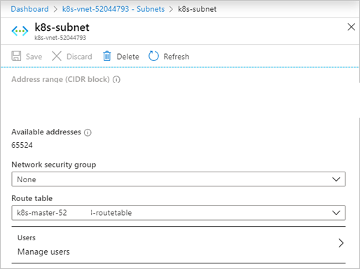

# Deploy a Kubernetes cluster to a custom virtual network on Azure Stack Hub 

You can deploy a Kubernetes cluster using the Azure Kubernetes Service (AKS) engine on a custom virtual network. This article looks at finding the information you need in your virtual network. You can find steps for calculating the IP addresses used by your cluster, setting the vales in the API Model, and setting the route table and network security group.

The Kubernetes cluster in Azure Stack Hub using AKS engine uses the kubenet network plugin. AKS engine on Azure Stack Hub also supports the Azure CNI network plugin.  
  - For a discussion of the kubenet networking plugin in Azure, see [Use kubenet networking with your own IP address ranges in Azure Kubernetes Service (AKS)](/azure/aks/configure-kubenet).
  - For a discussion of the Azure CNI networking plugin in Azure, see [Configure Azure CNI networking in Azure Kubernetes Service (AKS)](/azure/aks/configure-azure-cni).

## Constraints when creating a custom virtual network

-  The custom VNET must be in the same subscription as all of the other components of the Kubernetes cluster.
-  The control plane nodes pool and the agent nodes pool must be in the same virtual network. You can deploy your nodes into different subnets within the same virtual network.
-  The Kubernetes cluster subnet must use an IP range within the space of the custom virtual network IP range, see [Get the IP address block](#get-the-ip-address-blocks).
-  Consider that the recommended size of the node subnet(s) depends on the type of network plugin being used. As a general guideline, Azure CNI requires a larger number of IP addresses for the subnet supporting the agent node pools than kubenet. See the [kubenet](#kubenet-address-blocks-example) and [Azure CNI](#azure-cni-address-blocks-example) examples below.
-  The `169.254.0.0/16` address space may not be used for custom VNETs for Kubernetes clusters.

## Create custom virtual network

You must have a custom virtual network in your Azure Stack Hub instance. For more information, see [Quickstart: Create a virtual network using the Azure portal](/azure/virtual-network/quick-create-portal).

Create a new subnet in your virtual network. You will need to the get the subnet Resource ID and IP address range. You will use the Resource ID and range in your API model when you deploy your cluster.

1. Open the Azure Stack Hub user portal in your Azure Stack Hub instance.
2. Select **All resources**.
3. Enter the name of your virtual network in the search box.
4. Select **Subnets** > **+ Subnets** to add a subnet.
5. Add a **Name** and an **Address range** using CIDR notation. Select **OK**.
6. Select **Properties** in the **Virtual networks** blade. Copy the **Resource ID**, and then add `/subnets/<nameofyoursubnect>`. You will use this value as your value for the `vnetSubnetId` key in the API model for your cluster. The Resource ID for the subnet uses the following format:<br>`/subscriptions/SUB_ID/resourceGroups/RG_NAME/providers/Microsoft.Network/virtualNetworks/VNET_NAME/subnets/SUBNET_NAME`

    

7. Select **Subnets** in the **Virtual networks** blade. Select the subnet name, for example `control-plane-sn`.

    **Do not** associate the subnet to a network security group (NSG). 
    
    


    
8. In the subnet blade, make a note of the address range (CIDR Block) of each subnet.

## Considerations for selecting an address space

When you create a custom virtual network, you specify the IP address space of your network and an IP address range for every subnet. Consider the following factors when you choose the address spaces and ranges to use in your Kubernetes cluster:
-  Overlapping address spaces might result in IP address clashes or communication errors. To reduce the risk of overlapping IP addresses, choose a unique address space for your new virtual network.
-  Address spaces in the `10/8`, `172.16/12`, and `192.168/16` ranges often are used for private networks, and they might be used by your existing datacenter infrastructure. If your Kubernetes applications use resources in your datacenter, reduce the risk of clashes by choosing an address space for your custom virtual network that's different from your datacenter's address space.
-  We recommend that you use a dedicated subnet for your Kubernetes cluster.
-  If using multiple existing virtual networks consider using different address spaces on each network if you intend to use virtual network peering. Overlapping address spaces may impair your ability to enable peering.

## Get the IP address blocks

AKS engine supports deployment on an existing virtual network. When deployed on an existing virtual network, your cluster uses blocks of consecutive addresses for agent nodes, control plane nodes, cluster services, and containers (pods). Each address block can be translated into a subnet within the virtual network. All address blocks in the cluster deployment must be a part of the overall virtual network address space. Choosing address blocks outside of the virtual network address space may result in connectivity problems.

A minimum of three address blocks are required when setting up a Kubernetes cluster:

- Nodes address block: This is the address block used for assigning addresses to the cluster nodes. This can be a single address block for all cluster nodes or can be separate blocks (subnets) for control plane and agent pools. Take into consideration the node count in your cluster when selecting the address range for this block. For Azure CNI nodes and containers get their addresses from the same address block thus take into account the number of containers you want to deploy to your cluster when choosing the address range when using Azure CNI.
- Services address block: This is the address block from which services deployed to the Kubernetes cluster will get their cluster address from. Take into consideration the maximum number of services you intend to run in your cluster when selecting the address range for this block.
- Cluster address block: This is the address block from which pods will get their cluster address. Take into consideration the maximum number of pods you intend to run in your cluster when selecting the address range for this block. As mention earlier, for Azure CNI the cluster and nodes address blocks are the same.

In addition to the address blocks, for control plane nodes you will need to set two more values. You will need to know the number of IP addresses you will need to reserve for your cluster, and the first consecutive static IP within the subnet IP space.
AKS engine requires a range of up to 16 unused IP addresses when you use multiple control plane nodes. The cluster will use one IP address for each control plane up to five control plane nodes. AKS engine will also require the next 10 IP address after the last control plane node for headroom IP address reservation. Finally, another IP address will be used by the load balancer after the control plane nodes and headroom reservation, for a total of 16.
When placing your block of IP addresses, the subnet requires the following allocations of the existing IP addresses:
- The first four IP addresses and the last IP address are reserved and can't be used in any Azure subnet.
- A buffer of 16 IP addresses should be left open.
- The value of your cluster's first IP address should be toward the end of the address space to avoid IP conflicts. If possible, assign the `firstConsecutiveStaticIP` property to an IP address near the *end* of the available IP address space in the subnet.

For example, for a cluster with three control plane nodes. If you are using a subnet with 256 addresses, for example 10.100.0.0/24, you will need to set your first consecutive static IP address before 239. The following table shows the addresses and considerations:

| Range for /24 subnet | Number | Note |
| --- | --- | --- |
| 172.100.0.0  - 172.100.0.3 | 4 | Reserved in Azure subnet. |
| **172.100.0.224**-172.100.0.238 | 14 | IP address count for an AKS engine defined cluster.<br><br> 3 IP addresses for 3 control plane nodes<br>10 IP addresses for headroom<br>1 IP address for the load balancer |
| 172.100.0.238 - 172.100.0.254 | 16 | 16 IP address buffer. |
| 172.100.0.255 | 1 | Reserved in Azure subnet. |
  
In this example, then `firstConsecutiveStaticIP` property would be `172.100.0.224`.

For larger subnets, for example /16 with more than 60 thousand addresses, you may not find it to be practical to set your static IP assignments to the end of the network space. Set your cluster static IP address range away from the first 24 addresses in your IP space so that the cluster can be resilient when claiming addresses.

## Kubenet address blocks example
In the following example, you can see how these various considerations fill out the address space in the virtual network for a cluster using the kubenet network plugin with dedicated subnets for the control plane node and agent node pools with three nodes per pool.  

VNET address space: 10.100.0.0/16.  

| Address block (subnet) | CIDR | IP range | IP Count (available) |
| --- | --- | --- | --- |
| Control plane nodes block | 10.100.0.0/24 | 10.100.0.0 - 10.100.0.255 | 255 - 4 reserved = 251 |
| Agent nodes block | 10.100.1.0/24 | 10.100.1.0 - 10.100.1.255 | 255 - 4 reserved = 251 |
| Services block | 10.100.16.0/20 | 10.100.16.0 - 10.100.31.255 | 4,096 - 5 reserved = 4,091 |
| Cluster block | 10.100.128.0/17 | 10.100.128.0 - 10.100.255.255 | 32,768 - 5 reserved = 32,763 |
  
In this example, the `firstConsecutiveStaticIP` property would be `10.100.0.239`.

## Azure CNI address blocks example
In the following example, you can see how these various considerations fill out the address space in the virtual network for a cluster using the Azure CNI network plugin with dedicated subnets for the control plane and agent node pools with three nodes per pool.

VNET address space: 172.24.0.0/16.  

> [!NOTE]
> In your environment, if the public IP range is within CIDR10.0.0.0/8, use kubenet as the network plugin.

| Address block (subnet) | CIDR | IP range | IP Count (available) |
| --- | --- | --- | --- |
| Control plane nodes block | 172.24.0.0/24 | 172.24.0.0 - 172.24.0.255 | 255 - 4 reserved = 251 |
| Agent nodes & cluster block | 172.24.128.0/17 | 172.24.128.0 - 172.24.255.255 | 32,768 - 5 reserved = 32,763 |
| Services block | 172.24.16.0/20 | 172.24.16.0 - 172.24.31.255 | 4,096 - 5 reserved = 4,091 |
  
In this example, the `firstConsecutiveStaticIP` property would be `172.24.0.239`.

## Update the API model

Update the API model used to deploy the cluster from AKS engine to your custom virtual network. 

In **masterProfile** set the following values:

| Field | Example | Description |
| --- | --- | --- |
| vnetSubnetId | `/subscriptions/77e28b6a-582f-42b0-94d2-93b9eca60845/resourceGroups/MDBN-K8S/providers/Microsoft.Network/virtualNetworks/MDBN-K8S/subnets/control-plane-sn` | Specify the Azure Resource Manager path ID the subnet. This value maps to the control plane nodes address block above.  |
| firstConsecutiveStaticIP | 10.100.0.239 | Assign to the `firstConsecutiveStaticIP` configuration property an IP address that is near the *end* of the available IP address space in the desired subnet. `firstConsecutiveStaticIP` only applies to the control plane node pool. |

In **agentPoolProfiles** set the following values:

| Field | Example | Description |
| --- | --- | --- |
| vnetSubnetId | `/subscriptions/77e28b6a-582f-42b0-94d2-93b9eca60845/resourceGroups/MDBN-K8S/providers/Microsoft.Network/virtualNetworks/MDBN-K8S/subnets/agents-sn` | Specify the Azure Resource Manager path ID the subnet. This value maps to the agent nodes address block above. |

In **orchestratorProfile**, find **kubernetesConfig** and set the following value:

| Field | Example | Description |
| --- | --- | --- |
| clusterSubnet | `10.100.128.0/17` | The IP subnet used for allocating IP addresses for pod network interfaces. This value maps to the cluster address block above. The subnet must be in the VNET address space. With Azure CNI enabled, the default value is 10.240.0.0/12. Without Azure CNI, the default value is 10.244.0.0/16. Use /16 instead /24 subnet. If you use /24, this subnet will be assigned to one node only. Other node will not get POD network assigned, as you will have run out of the IP space, so they will be not ready in the cluster. |
| serviceCidr | `10.100.16.0/20` |The IP subnet used for allocating IP addresses for services deployed in the cluster. This value maps to the cluster services block above. |
| dnsServiceIP | `10.100.16.10` | The IP address to be assigned to the cluster DNS service. The address must come from the serviceCidr subnet. This value must be set when specifying the serviceCidr. The default value is the .10 address of the serviceCidr subnet. |  

For example, if using kubenet:  
With a network address space of `10.100.0.0/16` where the subnet for `control-plane-sn` is `10.100.0.0/24` and `agents-sn` is `10.100.1.0/24`

```json
"masterProfile": {
  ...
  "vnetSubnetId": "/subscriptions/77e28b6a-582f-42b0-94d2-93b9eca60845/resourceGroups/MDBN-K8S/providers/Microsoft.Network/virtualNetworks/MDBN-K8S/subnets/control-plane-sn",
  "firstConsecutiveStaticIP": "10.100.0.239",
  ...
},
...
"agentPoolProfiles": [
  {
    ...
    "vnetSubnetId": "/subscriptions/77e28b6a-582f-42b0-94d2-93b9eca60845/resourceGroups/MDBN-K8S/providers/Microsoft.Network/virtualNetworks/MDBN-K8S/subnets/agents-sn",
    ...
  },
    ...
"kubernetesConfig": [
  {
    ...
    "clusterSubnet": "10.100.128.0/17",
    "serviceCidr": "10.100.16.0/20",
    "dnsServiceIP" : "10.100.16.10",

    ...
  },

```

For example, if using Azure CNI:  
With a network address space of `172.24.0.0/16` where the subnet for `control-plane-sn` is `172.24.0.0/24` and `k8s-sn` is `172.24.128.0/17`

```json
"masterProfile": {
  ...
  "vnetSubnetId": "/subscriptions/77e28b6a-582f-42b0-94d2-93b9eca60845/resourceGroups/MDBN-K8S/providers/Microsoft.Network/virtualNetworks/MDBN-K8S/subnets/control-plane-sn",
  "firstConsecutiveStaticIP": "172.24.0.239",
  ...
},
...
"agentPoolProfiles": [
  {
    ...
    "vnetSubnetId": "/subscriptions/77e28b6a-582f-42b0-94d2-93b9eca60845/resourceGroups/MDBN-K8S/providers/Microsoft.Network/virtualNetworks/MDBN-K8S/subnets/k8s-sn",
    ...
  },
    ...
"kubernetesConfig": [
  {
    ...
    "clusterSubnet": "172.24.128.0/17",
    "serviceCidr": "172.24.16.0/20",
    "dnsServiceIP" : "172.24.16.10",
    ...
  },

```

## Deploy your cluster

After adding the values to your API model, you can deploy your cluster from your client machine using the `deploy` command in AKS engine. For instructions, see [Deploy a Kubernetes cluster](azure-stack-kubernetes-aks-engine-deploy-cluster.md#deploy-a-kubernetes-cluster).

## Set the route table

If you are using kubenet, for example, `networkPlugin`: `kubenet` in the `kubernetesConfig` API model configuration object. After you deploy your cluster, return to your virtual network in the Azure Stack user portal. Set both the route table and the network security group (NSG) in the subnet blade. After you have successfully deployed a cluster to your custom virtual network, get the ID of the Route Table resource from **Network** blade in your cluster's resource group.

1. Open the Azure Stack Hub user portal in your Azure Stack Hub instance.
2. Select **All resources**.
3. Enter the name of your virtual network in the search box.
4. Select **Subnets** and then select the name of the subnet that contains your cluster.
    
    
    
5. Select **Route table** and then select the route table for your cluster.
6. Ensure that this is done for every subnet specified in the API model, including the `masterProfile` subnet.

> [!NOTE]  
> Custom virtual network for Kubernetes Windows cluster has a [known issue](https://github.com/Azure/aks-engine/issues/371).

## Next steps

- Read about the [AKS engine on Azure Stack Hub](azure-stack-kubernetes-aks-engine-overview.md)  
- Read about [Azure Monitor for containers overview](/azure/azure-monitor/insights/container-insights-overview)
