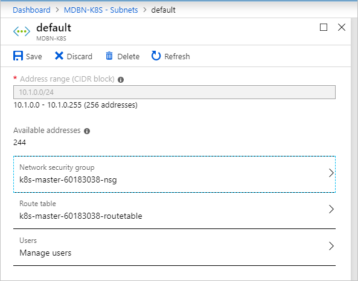

# Deploy a Kubernetes cluster to a custom virtual network on Azure Stack Hub 

You can deploy a Kubernetes cluster using the Azure Kubernetes Service (AKS) engine on a custom virtual network. This article looks at finding the information you need in your virtual network. You can find steps for calculating the IP addresses used by your cluster, setting the vales in the API Model, and setting the route table and network security group.

The AKS cluster in Azure Stack Hub using the AKS engine uses kubenet. For a discussion of kubenet networking in Azure, see [Use kubenet networking with your own IP address ranges in Azure Kubernetes Service (AKS)](https://docs.microsoft.com/azure/aks/configure-kubenet).

## Create custom virtual network

You must have a custom virtual network in your Azure Stack instance. For more information, see [Quickstart: Create a virtual network using the Azure portal](https://docs.microsoft.com/azure/virtual-network/quick-create-portal).

Create a new subnet in your virtual network. You will need to the get the subnet Resource ID and IP address range. You will use the Resource ID and range in your API model when you deploy your cluster.

1. Open the Azure Stack Hub user portal in your Azure Stack Hub instance.
2. Select **All resources**.
3. Enter the name of your virtual network in the search box.
4. Select **Subnets** > **+ Subnets** to add a subnet.
5. Add a **Name** and an **Address range** using CIDR notation. Select **OK**.
4. Select **Properties** in the **Virtual networks** blade. Copy the **Resource ID**, and then add `/subnets/<nameofyoursubnect>`. You will use this value as your value for the `vnetSubnetId` key in the API model for your cluster. The Resource ID for the subnet uses the following format:<br>`/subscriptions/SUB_ID/resourceGroups/RG_NAME/providers/Microsoft.Network/virtualNetworks/VNET_NAME/subnets/SUBNET_NAME`

    

5. Select **Subnets** in the **Virtual networks** blade. Select the subnet name, for example default.
    
    
    
6. In the subnet blade, make a note of the address range and the virtual network CIDR Block, for example: `10.1.0.0 - 10.1.0.255 (256 addresses)` and `10.1.0.0/24`.


## Get the IP address block

The AKS engine supports deploying into an existing virtual network. When deploying into an existing subnet, your cluster will use  a block of IP addresses. You will need to set your cluster to avoid assignment collision with other resources using IP addresses and the resources needed by your cluster.

You will need to set two values. You will need to know the number of IP addresses you will need to reserve for your cluster, and the first consecutive static IP within the subnet IP space.

The AKS engine requires a range of up to 16 unused IP addresses when you use multiple master nodes. The cluster will use one IP address for reach master up to five masters. The AKS engine will also require the next 10 IP address after the last master for headroom IP address reservation. Finally an additional IP address will be used by the load balancer after the masters and headroom reservation for a total of 16.

When placing your block of IP addresses, the subnet requires the following allocations of the existing IP addresses:
 - The first four IP addresses and the last IP address are reserved and can't be used in any Azure subnet
 - A buffer of 16 IP addresses should be left open.
 - The value of your cluster's first IP should be toward the end of the address space to avoid IP conflicts. If possible, assign to the `firstConsecutiveStaticIP` property to an IP address near the *end* of the available IP address space in the subnet.

In the following example, you can see how these various considerations fill out the IP range in a subnet. This is for three masters. If you are using a subnet with 256 addresses, for example 10.1.0.0/24, you will need to set your first consecutive static IP address at 207. The following table shows the addresses and considerations:

| Range for /24 subnet | Number | Note |
| --- | --- | --- |
| 10.1.0.0  - 10.1.03 | 4 | Reserved in Azure subnet. |
| **10.1.0.224**-10.1.0.238 | 14 | IP address count for an AKS engine defined cluster.<br><br> 3 IP addresses for 3 masters<br>10 IP addresses for headroom<br>1 IP address for the load balancer |
| 10.1.0.239 - 10.1.0.255 | 16 | 16 IP address buffer. |
| 10.1.0.256 | 1 | Reserved in Azure subnet. |

In this example, then `firstConsecutiveStaticIP` property would be `10.1.0.224`.

For larger subnets, for example /16 with more than 60 thousand addresses, you may not find it to be practical to set your static IP assignments to the end of the network space. Set your cluster static IP address range away from the first 24 addresses in your IP space so that the cluster can be resilient when claiming addresses.


## Update the API model

Update the API model used to deploy the cluster from your AKS Client machine to your custom virtual network.

In the array **masterProfile** set the following values:

| Field | Example | Description |
| --- | --- | --- |
| vnetSubnetId | `/subscriptions/77e28b6a-582f-42b0-94d2-93b9eca60845/resourceGroups/MDBN-K8S/providers/Microsoft.Network/virtualNetworks/MDBN-K8S/subnets/default` | Specify the Azure Resource Manager path ID the subnet.  |
| firstConsecutiveStaticIP | 10.1.0.224 | Assign to the `firstConsecutiveStaticIP` configuration property an IP address that is near the *end* of the available IP address space in the desired subnet. `firstConsecutiveStaticIP` only applies to the master pool. |

In the array **agentPoolProfiles** set the following values:

| Field | Example | Description |
| --- | --- | --- |
| vnetSubnetId | `/subscriptions/77e28b6a-582f-42b0-94d2-93b9eca60845/resourceGroups/MDBN-K8S/providers/Microsoft.Network/virtualNetworks/MDBN-K8S/subnets/default` | Specify the Azure Resource Manager path ID the subnet.  |

For example:

```json
"masterProfile": {
  ...
  "vnetSubnetId": "/subscriptions/77e28b6a-582f-42b0-94d2-93b9eca60845/resourceGroups/MDBN-K8S/providers/Microsoft.Network/virtualNetworks/MDBN-K8S/subnets/default",
  "firstConsecutiveStaticIP": "10.1.0.224",
  ...
},
...
"agentPoolProfiles": [
  {
    ...
    "vnetSubnetId": "/subscriptions/77e28b6a-582f-42b0-94d2-93b9eca60845/resourceGroups/MDBN-K8S/providers/Microsoft.Network/virtualNetworks/MDBN-K8S/subnets/default",
    ...
  },

```

## Deploy your cluster

After adding the values to your API model, you can deploy your cluster from your client machine using the deploy command with aks-engine. For instructions, see [Deploy a Kubernetes cluster](azure-stack-kubernetes-aks-engine-deploy-cluster.md#deploy-a-kubernetes-cluster).

## Set the route table and network security group

Set both the route table and the network security group (NSG) in the subnet blade in the Azure Stack user portal. If you're not using Azure CNI (for example, `networkPlugin`: `kubenet` in the kubernetesConfig API model configuration object. After you have successfully deployed a cluster to your custom virtual network, get the ID of the Route Table resource from **Network** blade in your cluster's resource group.

1. Open the Azure Stack Hub user portal in your Azure Stack Hub instance.
2. Select **All resources**.
3. Enter the name of your virtual network in the search box.
4. Select **Subnets** and then select the name of the subnet that contains your cluster.
    
    
    
5. Select **Route table** and then select the route table for your cluster.
6. Select **Network security group** and then select the NSG for your cluster.

> [!Note]  
> Custom virtual network for Kubernetes Windows cluster has a [known issue](https://github.com/Azure/aks-engine/issues/371).

## Next steps

- Read about the [The AKS engine on Azure Stack Hub](azure-stack-kubernetes-aks-engine-overview.md)  
- Read about [Azure Monitor for containers overview](https://docs.microsoft.com/azure/azure-monitor/insights/container-insights-overview)