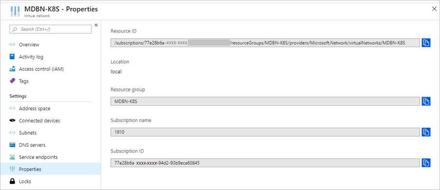
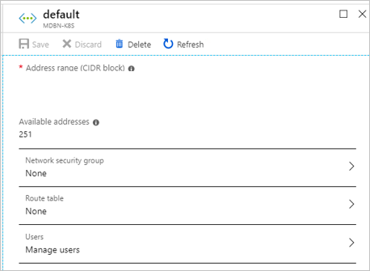

# Deploy a Kubernetes cluster to a custom virtual network on Azure Stack Hub 

You can deploy a Kubernetes cluster using the AKS engine on a custom virtual network so that I can deliver your service in an environment that extends your data center or in a hybrid cloud solution extending Azure Stack to Azure.

## Create or check your custom virtual network

You must have a custom virtual network in your Azure Stack instance. For more information see X.

Get the Azure Resource Manager path/id of Subnets  as we as the first IP address. Yu will use when specifying the first consecutive IP address when using static IP allocation in your API model.

1. Open the Azure Stack Hub user portal In your Azure Stack Hub instance.
2. Select All resources.
3. Enter the name of your virtual network in search.
4. Select Properties in the Virtual networks blade. Copy the Resource ID, and then add :/subnets/<nameofyoursubnect>. You will use this value as your value for the vnetSubnetId in the API Model for the cluster. The subnet ID should have the following format: /subscriptions/SUB_ID/resourceGroups/RG_NAME/providers/Microsoft.Network/virtualNetworks/VNET_NAME/subnets/SUBNET_NAME

    

5. Select Subnets in the Virtual networks blade. Select the subnet name, for example default.
6. In the subnet blade, make a note of the address range and the virtual network CIDR Block, for example: 10.1.0.0 - 10.1.0.255 (256 addresses) and 10.1.0.0/24.



## Determine the available IP address block

Assess your available IP address space in your custom virtual network to determine your first available IP address.

The AKS engine supports deploying into an existing virtual network. You must specify the ARM path/id of Subnets for the masterProfile and any agentPoolProfiles, as well as the first IP address to use for static IP allocation in firstConsecutiveStaticIP. In any Azure subnet, the first four and the last IP address is reserved and can't be used. Additionally, each pod now gets the IP address from the subnet. The value of firstConsecutiveStaticIP should be toward the end of the address space to avoid IP conflicts. You should also leave a buffer of 16 IP addresses. As a result, enough IP addresses (equal to ipAddressCount for each node) should be available beyond firstConsecutiveStaticIP. firstConsecutiveStaticIP only applies to the master pool.

By default, the ipAddressCount has a value of 31, 1 for the node and 30 for pods, (note that the number of pods can be changed via KubeletConfig["--max-pods"]). ipAddressCount can be changed if desired. Furthermore, to prevent source address NAT'ing within the virtual network, we assign to the vnetCidr property in masterProfile the CIDR block that represents the usable address space in the existing virtual network. Therefore, it is recommended to use a large subnet size such as /16.

Depending upon the size of the virtual network address space, during deployment, it is possible to experience IP address assignment collision between the required Kubernetes static IPs (one each per master and one for the API server load balancer, if more than one masters) and Azure CNI-assigned dynamic IPs (one for each NIC on the agent nodes). In practice, the larger the virtual network the less likely this is to happen; some detail, and then a guideline.

Azure CNI assigns dynamic IP addresses from the "beginning" of the subnet IP address space (specifically, it looks for available addresses starting at ".4" ["10.0.0.4" in a "10.0.0.0/24" network]).

aks-engine will require a range of up to 16 unused IP addresses in multi-master scenarios (1 per master for up to 5 masters, and then the next 10 IP addresses immediately following the "last" master for headroom reservation, and finally 1 more for the load balancer immediately adjacent to the afore-described n masters+10 sequence) to successfully scaffold the network stack for your cluster.

A guideline that will remove the danger of IP address allocation collision during deployment: If possible, assign to the firstConsecutiveStaticIP configuration property an IP address that is near the "end" of the available IP address space in the desired subnet. For example, if the desired subnet is a /24, choose the "239" address in that network space.

In larger subnets (for example, /16) it's not as practically useful to push static IP assignment to the very "end" of large subnet, but as long as it's not in the "first" /24 (for example) your deployment will be resilient to this edge case behavior.

## Update the API Model for your cluster

Update the API Model used to deploy the cluster from your AKS Client machine to your custom virtual network.

In the array **masterProfile** set the following values:

| Field | Example | Description |
| --- | --- | --- |
| vnetSubnetId | `/subscriptions/77e28b6a-582f-42b0-94d2-93b9eca60845/resourceGroups/MDBN-K8S/providers/Microsoft.Network/virtualNetworks/MDBN-K8S/subnets/default` | Specify the ARM path/id of Subnets  as we as the first IP address to use for static IP allocation in firstConsecutiveStaticIP.  |
| firstConsecutiveStaticIP | 10.1.0.239 | Assign to the firstConsecutiveStaticIP configuration property an IP address that is near the "end" of the available IP address space in the desired subnet.  |
| vnetCidr | 10.1.0.0/24 | The subnet's address range in CIDR notation (e.g. 192.168.1.0/24). It must be contained by the address space of the virtual network. The address range of a subnet which is in use can't be edited. |

In the array **agentPoolProfiles** set the following values:

| Field | Example | Description |
| --- | --- | --- |
| vnetSubnetId | `/subscriptions/77e28b6a-582f-42b0-94d2-93b9eca60845/resourceGroups/MDBN-K8S/providers/Microsoft.Network/virtualNetworks/MDBN-K8S/subnets/default` | Specify the ARM path/id of Subnets  as we as the first IP address to use for static IP allocation in firstConsecutiveStaticIP.  |

For example:

```json
"masterProfile": {
  ...
  "vnetSubnetId": "/subscriptions/77e28b6a-582f-42b0-94d2-93b9eca60845/resourceGroups/MDBN-K8S/providers/Microsoft.Network/virtualNetworks/MDBN-K8S",
  "firstConsecutiveStaticIP": "10.1.0.239",  
  "vnetCidr": "10.1.0.0/24",
  ...
},
...
"agentPoolProfiles": [
  {
    ...
    "vnetSubnetId": "/subscriptions/77e28b6a-582f-42b0-94d2-93b9eca60845/resourceGroups/MDBN-K8S/providers/Microsoft.Network/virtualNetworks/MDBN-K8S",
    ...
  },

```

## Deploy your cluster

See deploy your cluster in X.

## Set the RouteTable and NSG

Set both the RoutTable and the NSG in the subnet blade in the Azure Stack user portal.

If you're not using Azure CNI (for example, "networkPlugin": "kubenet" in the kubernetesConfig api model configuration object): After a custom virtual network-configured cluster finishes provisioning, fetch the id of the Route Table resource from Microsoft.Network provider in your new cluster's Resource Group.

The route table resource id is of the format: /subscriptions/SUBSCRIPTIONID/resourceGroups/RESOURCEGROUPNAME/providers/Microsoft.Network/routeTables/ROUTETABLENAME

Existing subnets will need to use the Kubernetes-based Route Table so that machines can route to Kubernetes-based workloads.

Update properties of all subnets in the existing virtual network route table resource by appending the following to subnet properties:

```json
"routeTable": {
        "id": "/subscriptions/<SubscriptionId>/resourceGroups/<ResourceGroupName>/providers/Microsoft.Network/routeTables/k8s-master-<SOMEID>-routetable>"
}
```
For example update the API Model:

```json
"subnets": [
    {
      "name": "subnetname",
      "id": "/subscriptions/<SubscriptionId>/resourceGroups/<ResourceGroupName>/providers/Microsoft.Network/virtualNetworks/<VirtualNetworkName>/subnets/<SubnetName>",
      "properties": {
        "provisioningState": "Succeeded",
        "addressPrefix": "10.240.0.0/16",
        "routeTable": {
          "id": "/subscriptions/<SubscriptionId>/resourceGroups/<ResourceGroupName>/providers/Microsoft.Network/routeTables/k8s-master-<SOMEID>-routetable"
        }
      ...
      }
      ...
    }
]

```
After you have deployed the virtual network using kubenet, go to the subnet blade and set both the RouteTable and NSG.

For example:

```text  
SETUP
Master Count: 3
Worker Count: 9
firstConsecutiveStaticIP: 10.238.64.200

RESULT
k8s-linuxpool-16359400-nic-8             10.238.64.4
k8s-linuxpool-16359400-nic-1             10.238.64.5
k8s-linuxpool-16359400-nic-2             10.238.64.6
k8s-linuxpool-16359400-nic-5             10.238.64.7
k8s-linuxpool-16359400-nic-4             10.238.64.8
k8s-linuxpool-16359400-nic-6             10.238.64.9
k8s-linuxpool-16359400-nic-3             10.238.64.10
k8s-linuxpool-16359400-nic-0             10.238.64.11
k8s-linuxpool-16359400-nic-7             10.238.64.12
 
k8s-master-16359400-nic-0                10.238.64.200
k8s-master-16359400-nic-1                10.238.64.201
k8s-master-16359400-nic-2                10.238.64.202
```

> [!Note]  
> Custom virtual network for Kubernetes Windows cluster has a [known issue](https://github.com/Azure/aks-engine/issues/371).

## Next steps

- Read about the [The AKS engine on Azure Stack Hub](azure-stack-kubernetes-aks-engine-overview.md)  
- Read about [Azure Monitor for containers overview](https://docs.microsoft.com/azure/azure-monitor/insights/container-insights-overview)