# How to deploy F5 across two Azure Stack Hub instances

This article walks you through setting up an external load balancer on two Azure Stack Hub environments. You can use this configuration to manage different workloads. In this article, you'll deploy F5 as a global load-balancing solution across two independent Azure Stack Hub instances. You'll also deploy a load balanced web app running in an NGINX server across your two instances. They'll run behind a high-availability, failover pair of F5 virtual appliances.

You can find the Azure Resource Manager templates in the [f5-azurestack-gslb](https://github.com/Mikej81/f5-azurestack-gslb) GitHub repository.

## Overview of load balancing with F5

The F5 hardware, the load-balancer, may be outside of Azure Stack Hub and within the datacenter that hosts Azure Stack Hub. Azure Stack Hub doesn't have a native capability to load balance workloads across two separate Azure Stack Hub deployments. The F5's BIG-IP virtual edition (VE) run on both platforms. This set up supports parity between Azure and Azure Stack Hub architectures through replication of the supporting application services. You can develop an app in one environment and move it to another. You can also mirror the entire production-ready Azure Stack Hub, including the same BIG-IP configurations, policies, and application services. The approach eliminates the need for countless hours of application refactoring and testing, and allows you to get on with writing code.

Securing applications and their data is often a concern for developers moving apps to the public cloud. This doesn't need to be the case. You can build an app in your Azure Stack Hub environment, while a security architect configures the necessary settings on F5's web application firewall (WAF). The entire stack can be replicated in Azure Stack Hub with the knowledge that the application will be protected by the same industry-leading WAF. With identical policies and rulesets, there won't be any security loopholes or vulnerabilities that might otherwise be generated by employing different WAFs.

Azure Stack Hub has a separate marketplace from Azure. Only certain items are added. In this case, if you want to create a new resource group on each of the Azure Stack Hubs and deploy the F5 virtual appliance that are already available. From there, you'll see that a **Public IP** address will be required to allow network connectivity between both Azure Stack Hub instances. Essentially, they are both islands and the **Public IP** will allow them to talk across both locations.

## Prerequisites for BIG-IP VE

-  Download **F5 BIG-IP VE - ALL (BYOL, 2 Boot Locations)** into each Azure Stack Hub Marketplace. If you don't have them available to you in your portal, contact your cloud operator.

-  You can find the Azure Resource Manager template in the following GitHub repository: https://github.com/Mikej81/f5-azurestack-gslb.

## Deploy F5 BIG-IP VE on each instance

Deploy to Azure Stack Hub instance A and instance B.

1. Sign into the Azure Stack Hub user portal.

2. Select **+ Create a Resource**.

3. Search the marketplace by typing `F5`.

4. Select **F5 BIG-IP VE – ALL (BYOL, 2 Boot Locations)**.

    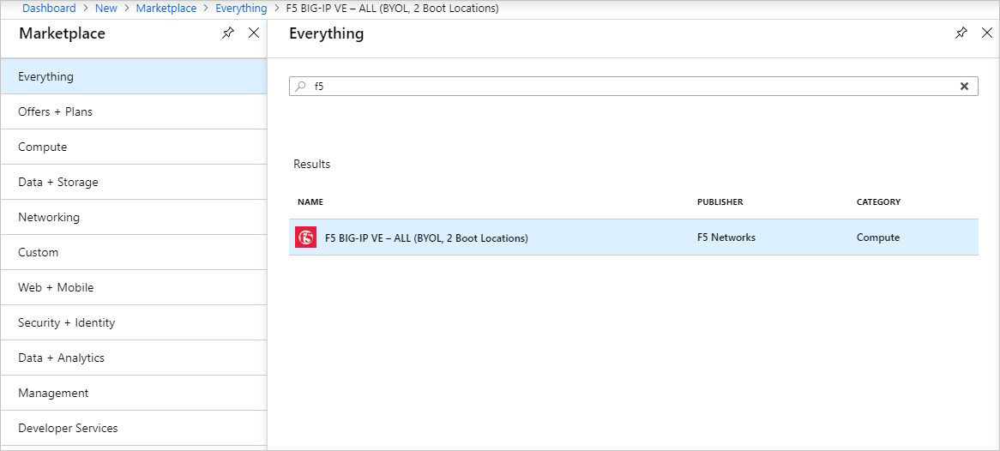

5. At the bottom of the next page, selected **Create**.

    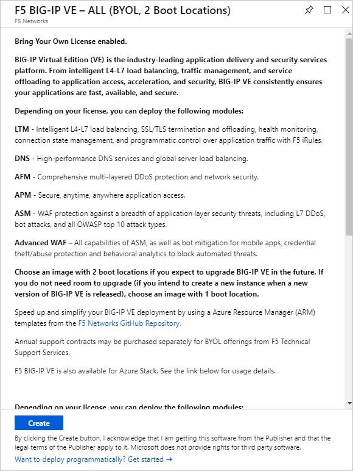

6. Create a New Resource Group called **F5-GSLB**.

7. Use the following values as an example to complete the deployment:

    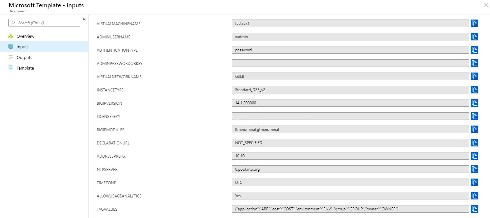

8. Validate that your deployment completes successfully.

    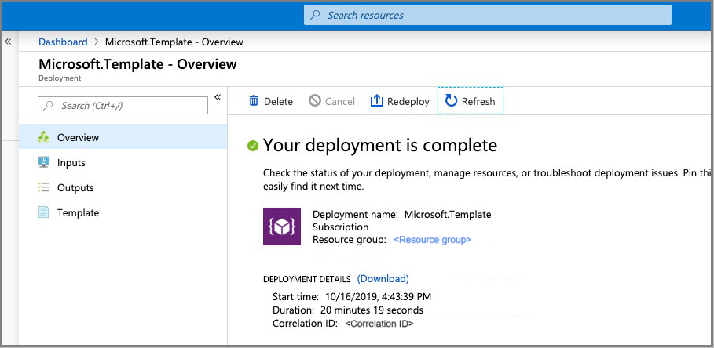

    > [!Note]  
    > Each BIG-IP Deployment should take around 20 minutes.

## Configure BIG-IP appliances

Follow these steps needs for both Azure Stack Hub A and B.

1. Sign into the Azure Stack Hub user portal on Azure Stack Hub instance A to review the resources created from the BIG-IP template deployment.

    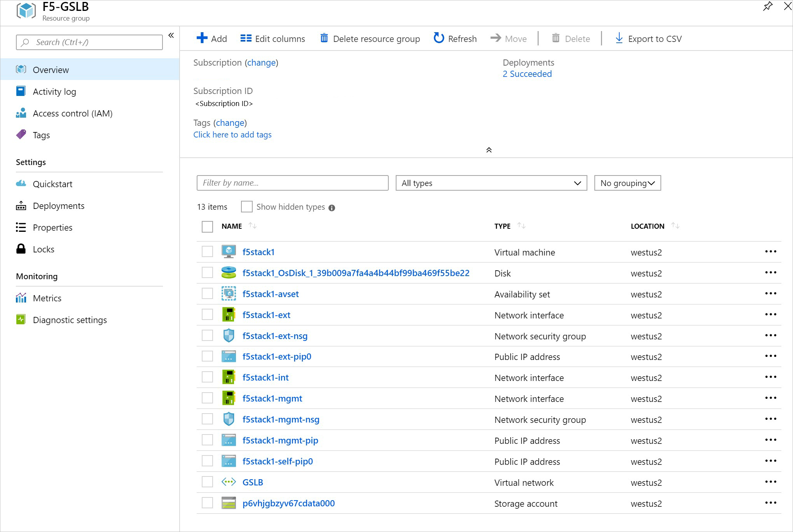

2. Follow the instructions at F5 for [BIG-IP Configuration items](https://clouddocs.f5.com/training/community/dns/html/class1/class1.html). 

3. Configure BIG-IP Wide IP List to listen across both appliances deployed to Azure Stack Hub instance A and B. For instructions, see [BIG-IP GTM Configuration](https://techdocs.f5.com/kb/en-us/products/big-ip_gtm/manuals/product/gtm-concepts-11-5-0/4.html).

4. Validate Failover of BIG-IP Appliances. On a test system, configure your DNS servers to use the following:
    - Azure Stack Hub instance A = `f5stack1-ext` public IP Address
    - Azure Stack Hub instance B = `f5stack1-ext` public IP Address

5. Browse to `www.contoso.com` and your browser loads the NGINX default page.

## Create a DNS sync group

1. Enable the root account to establish trust. Follow the instruction at [Changing system maintenance account passwords (11.x - 15.x)](https://support.f5.com/csp/article/K13121). After you set the trust (certificate exchange), disable the root account.

1. Sign in to the BIG-IP and create a DNS Sync Group. For instructions, see [Creating BIG-IP DNS Sync Group](https://f5-dns-automation-demo-12-1-x.readthedocs.io/en/latest/lab2/sync-group.html).

    > [!Note]  
    > You can find the local IP of the BIP-IP Appliance in your **F5-GSLB** Resource Group. The Network Interface is "f5stack1-ext" and you want to connect to the Public or Private IP (depending on access).

    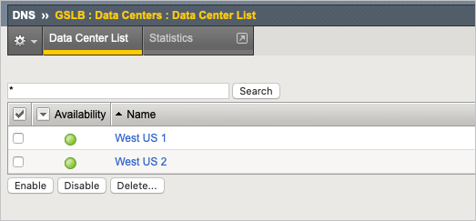
          
    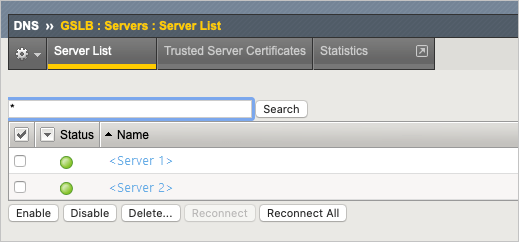

1. Select the new resource group **F5-GSLB** and select the **f5stack1** virtual machine, under **Settings** select **Networking**.

## Post install configurations

After you have installed, you'll need configure your Azure Stack Hub NSGs and lock down the source IP addresses.

1. Disable the port 22 after the trust has been established.

2. When your system is online, block the source NSGs. Management NSG should be locked to management source, External (4353/TCP) NSG should be locked to the other instance for sync. 443 should also be locked until applications with Virtual Servers are deployed.

3. GTM_DNS Rule is set to allow port 53 (DNS) traffic in, and BIG-IP resolver will start working once. Listeners are created.

    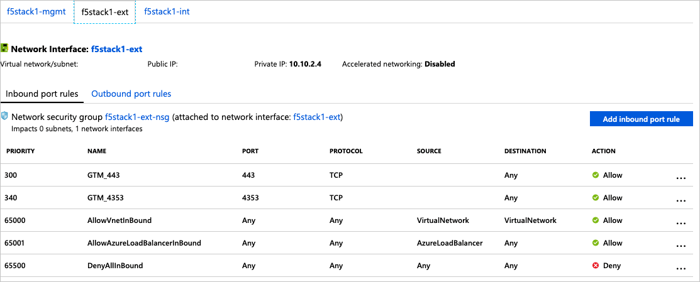

4. Deploy a basic web application workload within your Azure Stack Hub environment to Load Balance behind the BIG-IP. You can find an example for using the NGNIX server at [Deploying NGINX and NGINX Plus on Docker](https://docs.nginx.com/nginx/admin-guide/installing-nginx/installing-nginx-docker/).

    > [!Note]  
    > Deploy an instance of NGNIX on both Azure Stack Hub A and Azure Stack Hub B.

5. After NGINX is deployed in a docker container on an Ubuntu VM within each of the Azure Stack Hub instances, validate that you can reach the default webpage on the servers.

    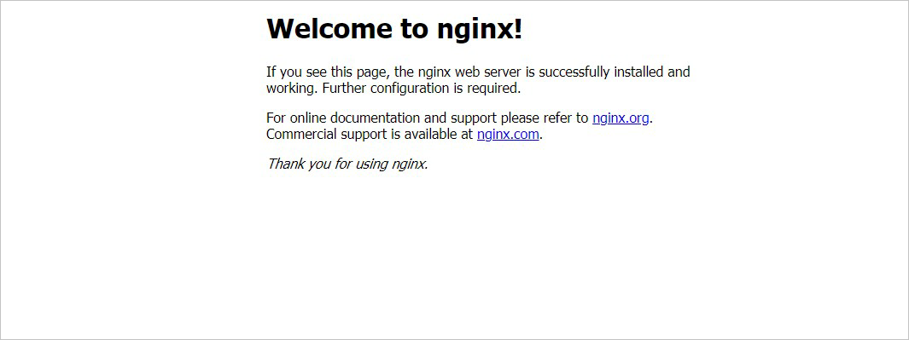

6. Sign in to the management interface of the BIG-IP appliance. In this example,  use the **f5-stack1-ext** Public IP address.

    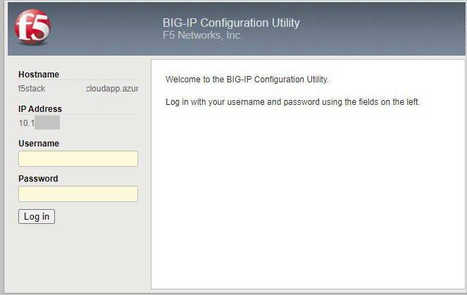

7. Publish access to NGINX through the BIG-IP.
    
    -  In this task, you'll configure the BIG-IP with a Virtual Server and Pool to allow inbound Internet access to the WordPress application. First you need to identify the private IP address for the NGINX instance.

8. Sign in to the Azure Stack Hub user portal. 

9. Select your NGINX Network Interface.

    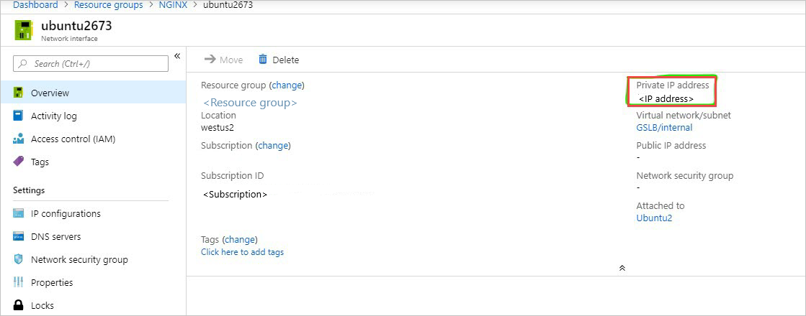

10. From the BIG-IP console, go to **Local traffic > Pools > Pool List** and Select **+**. Configure the pool using the values in the table. Leave all other fields to their defaults.

    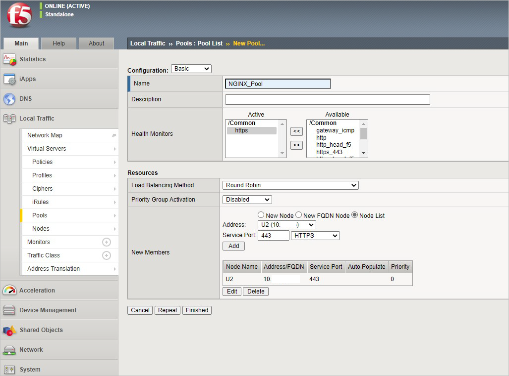
    
    | Key | Value |
    | --- | --- |
    | Name | NGINX_Pool |
    | Health Monitor | HTTPS |
    | Node Name | NGINX |
    | Address | \<your NGINX private IP address> |
    | Service Port | 443 |

11. Select **Finished**. When configured correctly, the pool status is green.

    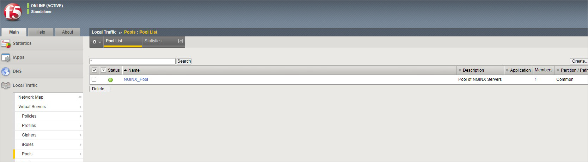

    You now need to configure the virtual server. To do this, you first need to find the private IP of your F5 BIG-IP.

12. From the BIG-IP console, go to **Network > Self IPs** and note the IP address.

    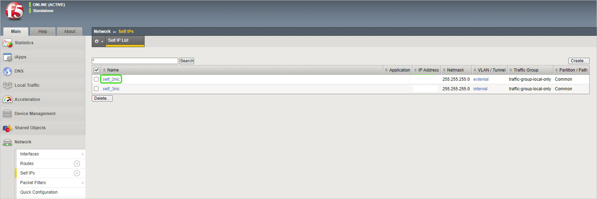

13. Create a virtual server by going to **Local Traffic** > **Virtual Servers** > **Virtual Server List** and Select **+**. Configure the pool using the values in the table. Leave all other fields to their defaults.

    | Key | Value |
    | --- | --- |
    |Name | NGINX |
    |Destination Address | \<Self IP address of the BIG-IP> |
    |Service Port | 443 |
    |SSL Profile (Client) | clientssl |
    |Source Address Translation | Auto Map |
        
    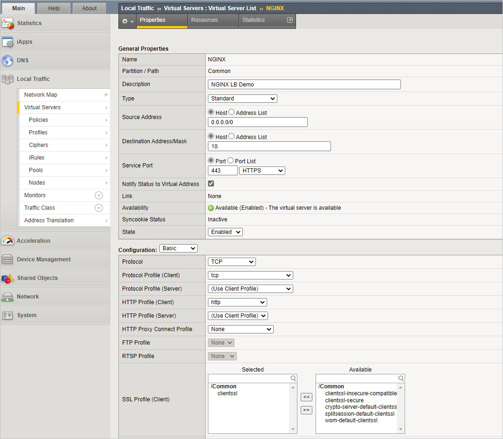

    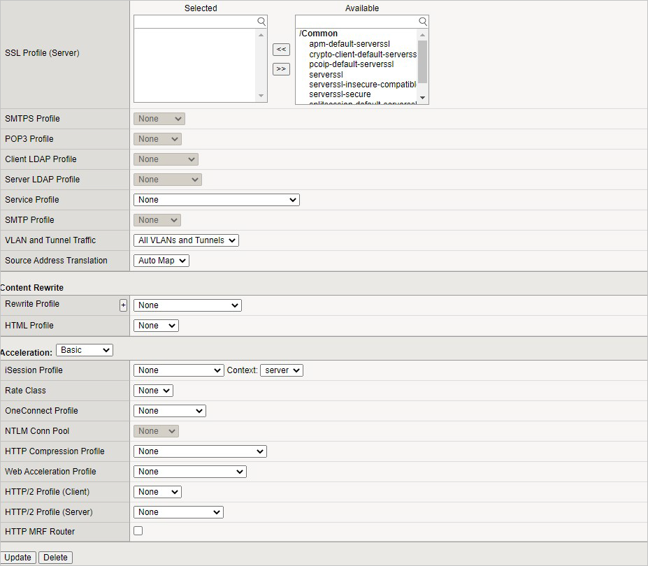

14. You have now completed the BIG-IP configuration for the NGINX application. To verify proper functionality, browse the site and verify F5 statistics.

15. Open a browser to `https://<F5-public-VIP-IP>` and ensure it displays your NGINX default page.

    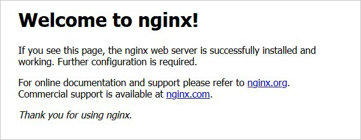

16. Now check the statistics of your virtual server to verify traffic flow, by navigating to **Statistics > Module Statistics > Local Traffic**.

17. Under **Statistics Type**, select **Virtual Servers**.

    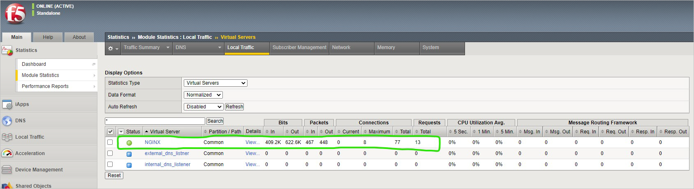

## For more information

You can find some reference articles about using F5:

- [Datacenter Availability Services Using BIG-IP DNS](https://clouddocs.f5.com/training/community/dns/html/class3/class3.html)
- [Deploying the BIG-IP System with HTTP Applications](https://www.f5.com/content/dam/f5/corp/global/pdf/deployment-guides/iapp-http-dg.pdf)
- [Creating a wide IP for GSLB](https://clouddocs.f5.com/training/community/big-iq-cloud-edition/html/class10/module2/lab1.html)

## Next steps

[Differences and considerations for Azure Stack Hub networking](azure-stack-network-differences.md) 
