# How to set up a multiple site-to-site VPN tunnel in Azure Stack Hub

This article shows you how to use an Azure Stack Hub Resource Manager template to deploy the solution. The solution creates multiple resource groups with associated virtual networks and how to connect these systems.

You can find the templates in the [Azure Intelligent Edge Patterns](https://github.com/Azure-Samples/azure-intelligent-edge-patterns) GitHub repository. The template is in the **rras-gre-vnet-vnet** folder. 

## Scenarios

## Create multiple VPN tunnels

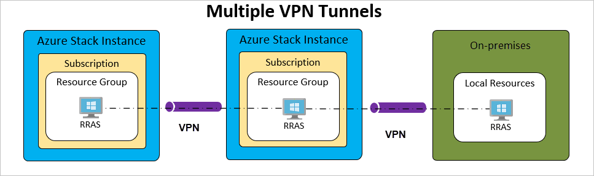

-  Deploy a three tier application, Web, App, and DB.

-  Deploy the first two templates on separate Azure Stack Hub instances.

-  **WebTier** will be deployed on PPE1 and **AppTier** will be deployed on PPE2.

-  Connect the **WebTier** and **AppTier** with an IKE tunnel.

-  Connect the **AppTier** to an on-premises system that you will call the **DBTier**.

## Steps to deploy multiple VPNs

This is a multiple step process. For this solution, you're going to be using the Azure Stack Hub portal. However, you can use PowerShell, Azure CLI, or other infrastructure-as-code tool chains to capture the outputs and use then as inputs.

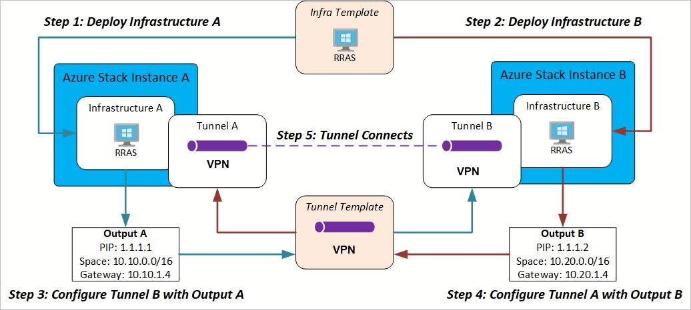

## Walkthrough

### Deploy web tier to Azure Stack Hub instances PPE1

1. Open the Azure Stack Hub user portal and select **Create a resource**.

2. Select **Template Deployment**.

    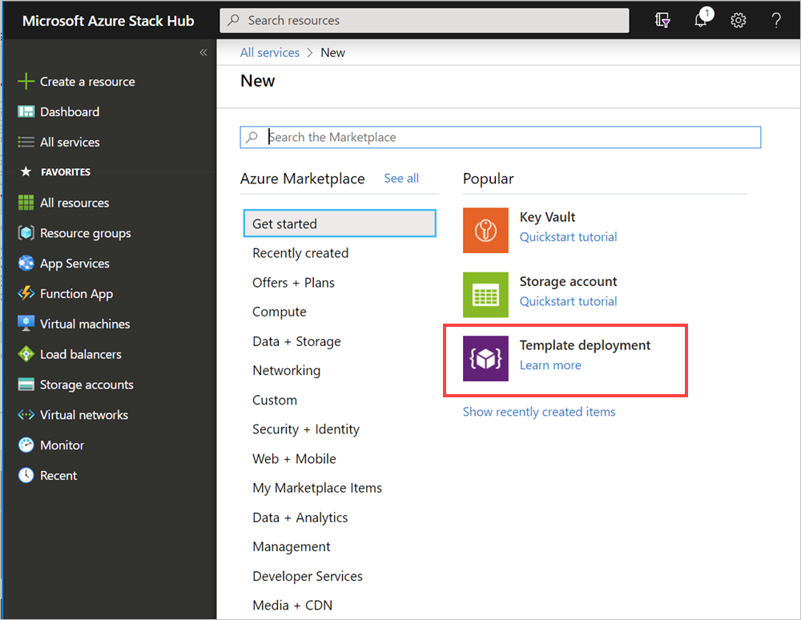

3. Copy and paste the content of the azuredeploy.json from the **azure-intelligent-edge-patterns/rras-vnet-vpntunnel** repository into the template window. You will see the resources contained within the template, select **save**.

    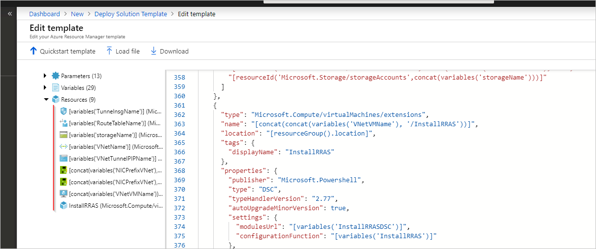

4. Enter a **Resource Group** name and check the parameters.

    > [!Note]  
    > The WebTier address space will be **10.10.0.0/16** and you can see resource group location is **PPE1**

    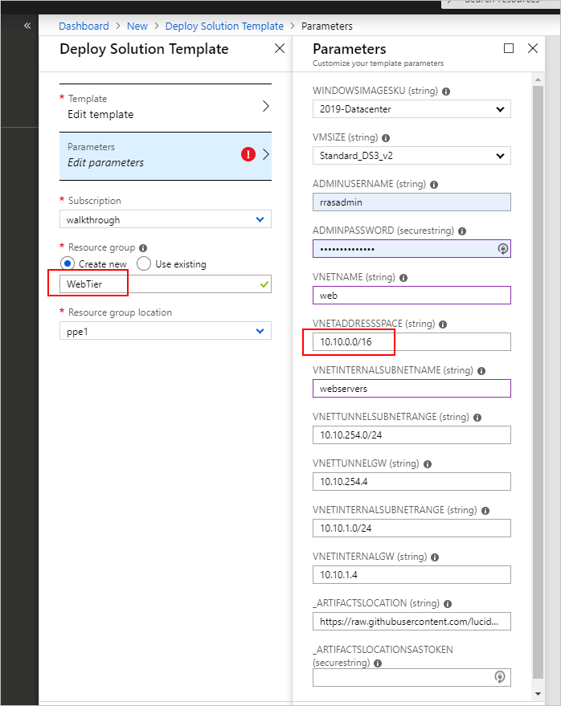

### Deploy app tier to the second Azure Stack Hub instances

You can use same process as the **WebTier** but different parameters as shown here:

> [!NOTE]  
> The AppTier address space will be **10.20.0.0/16** and you can see resource group location is **WestUS2**.

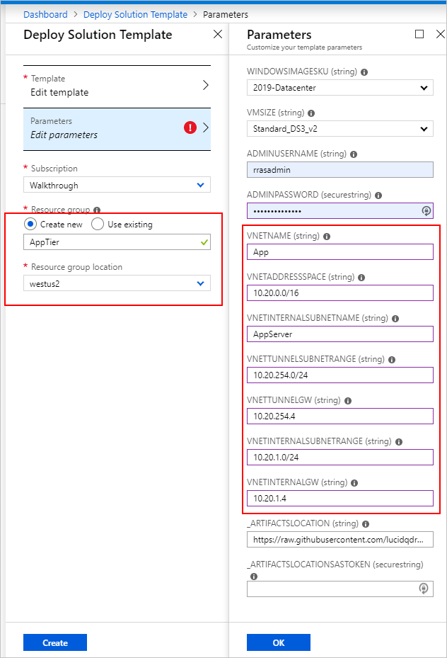

### Review the deployments for web tier and app tier and capture outputs

1. Review that the deployment completed successfully. Select **Outputs**.

    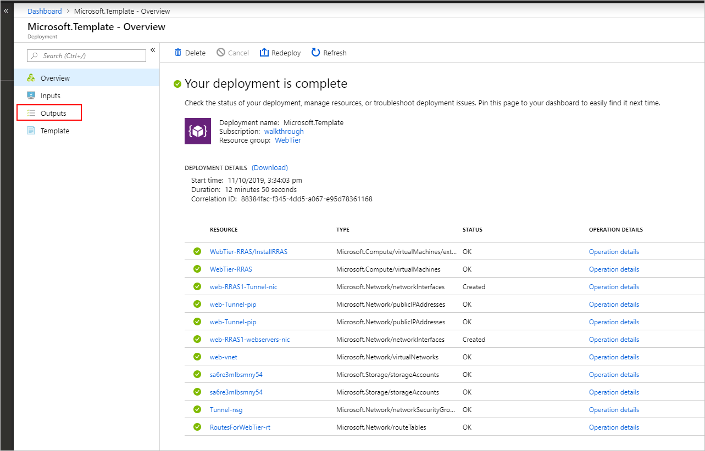

1. Copy the first four values into your Notepad app.

    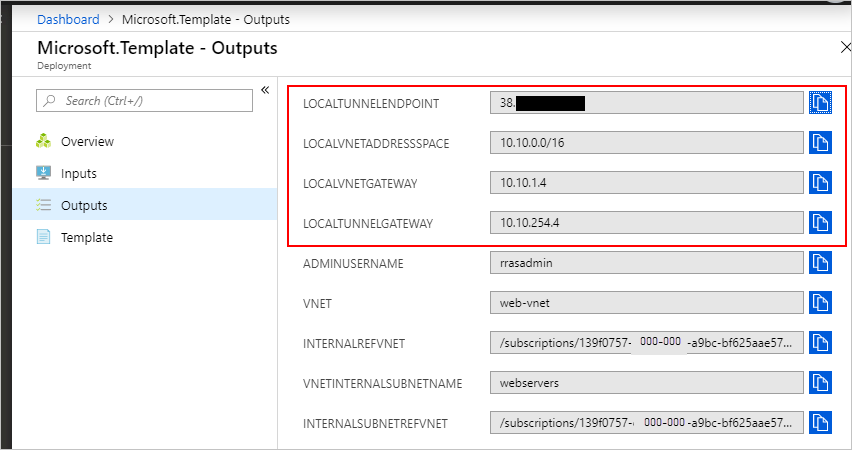

1. Repeat for **AppTier** deployment.

    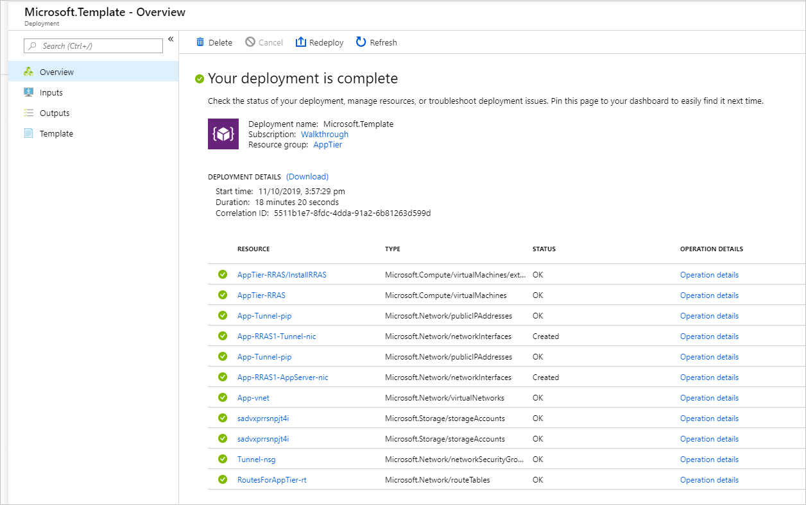

    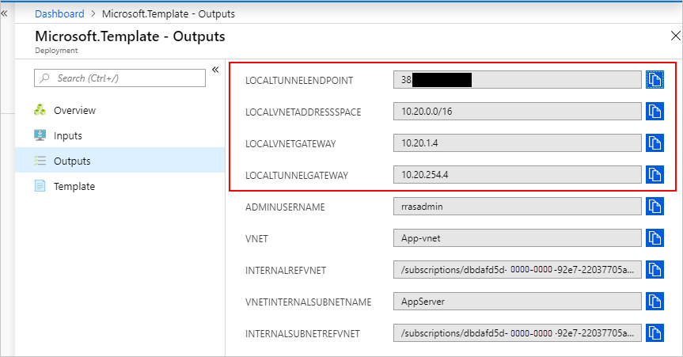

### Create tunnel from web tier to app tier

1. Open the Azure Stack Hub user portal and select **Create a resource**.

2. Select **template deployment**.

3. Paste the contents from **azuredeploy.tunnel.ike.json**.

4. Select **Edit parameters**.

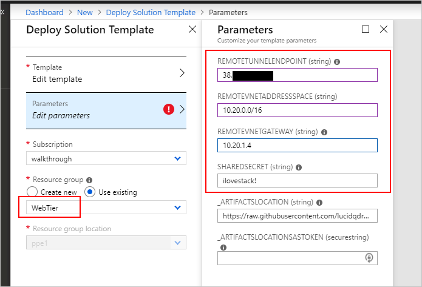

### Create tunnel from app tier to web tier

1. Open the Azure Stack Hub user portal and select **Create a resource**.

2. Select **Template deployment**.

3. Paste the contents from **azuredeploy.tunnel.ike.json**.

4. Select **Edit parameters**.

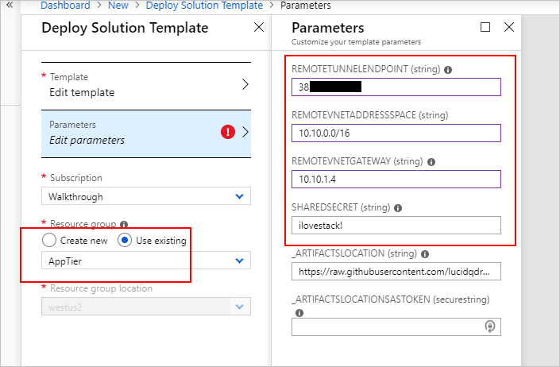

### Viewing tunnel deployment

If you view the output from the custom script extension, you can see the tunnel being created and it should show the status. You will see one showing **connecting** waiting for the other side to be ready and the other side will show **connected** once deployed.

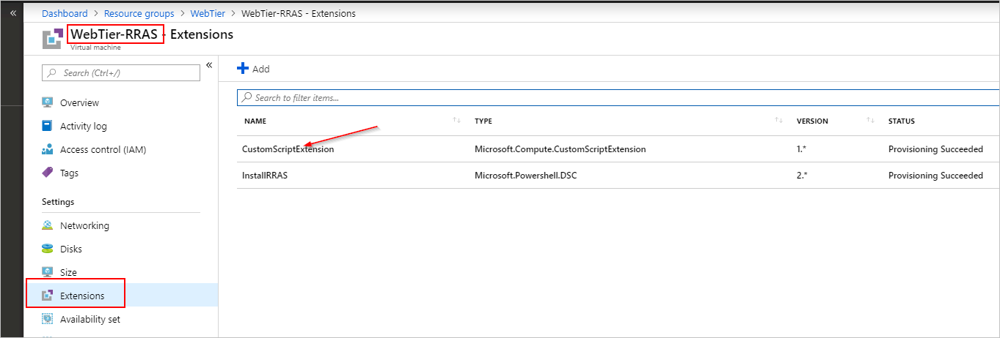

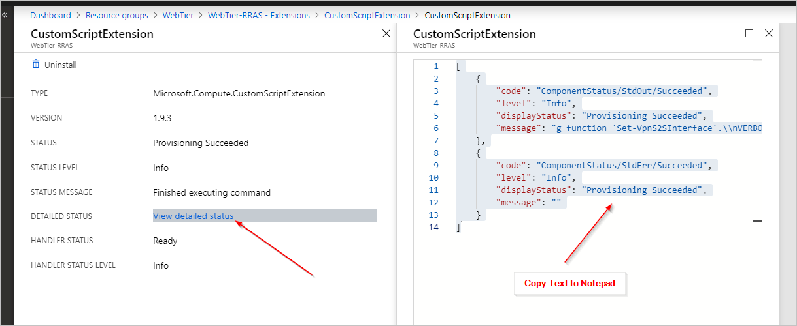

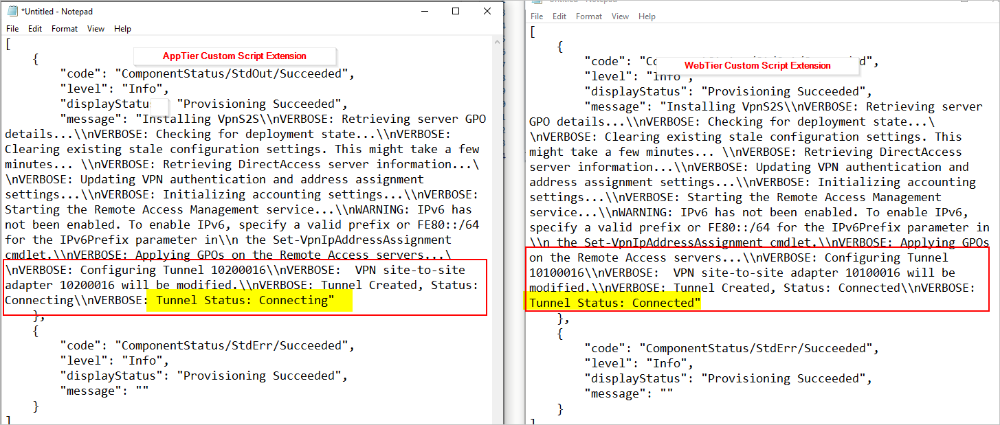

### Troubleshooting on the RRAS VM

1. Change the remote desktop (RDP) rule from **Deny** to **Allow**.

1. Connect to the system with an RDP client using the credentials you set during deployment.

1. Open PowerShell with an elevated prompt, and run `get-VpnS2SInterface`.

    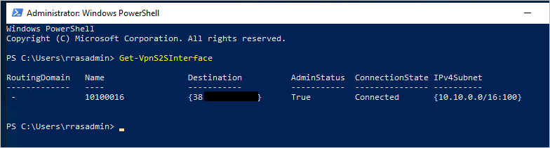

1. Use the **RemoteAccess** cmdlets to manage the system.

    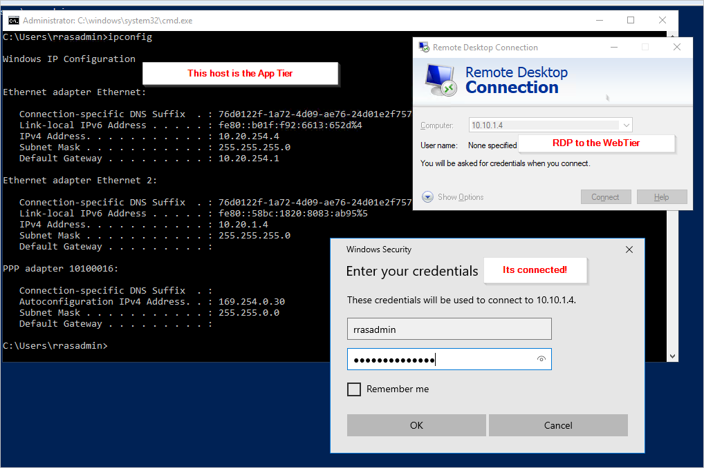

### Install RRAS on an on-premises VM DB tier

1. The target is a Windows 2016 image.

1. If you copy the `Add-Site2SiteIKE.ps1` script from the repository and run it locally, the script installs the **WindowsFeature** and **RemoteAccess**.

    > [!NOTE]
    > Depending on your environment you may need to reboot your system.

    For reference refer to the on-premises machine network configuration.

    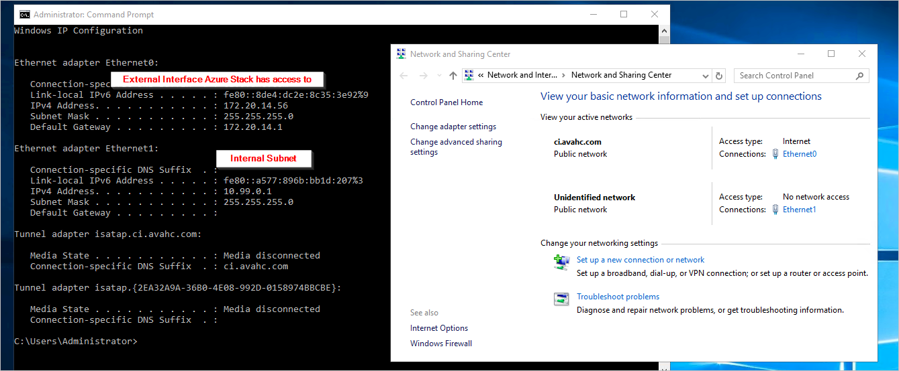

1. Run the script adding the **Output** parameters recorded from the AppTier template deployment.

    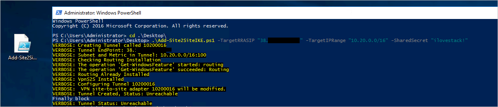

1. The tunnel is now configured and waiting for the AppTier connection.

### Configure app tier to DB tier

1. Open the Azure Stack Hub user portal and select **Create a resource**.

2. Select **Template deployment**.

3. Paste the contents from **azuredeploy.tunnel.ike.json**.

4. Select **Edit parameters**.

    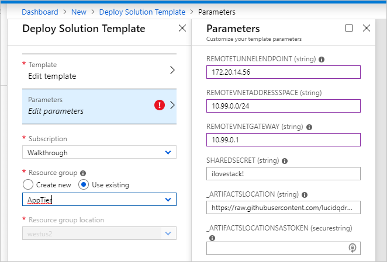

5. Check that you have the AppTier Selected and the remote internal network set at 10.99.0.1.

### Confirm tunnel between app tier and DB tier

1. To check the tunnel without logging into the VM, run a custom script extension.

2. Go to the RRAS VM (the AppTier).

3. Select **Extensions** and R**un custom script extension**.

4. Browse to the scripts directory in the **azure-intelligent-edge-patterns/rras-vnet-vpntunnel** repository. Select **Get-VPNS2SInterfaceStatus.ps1**.

    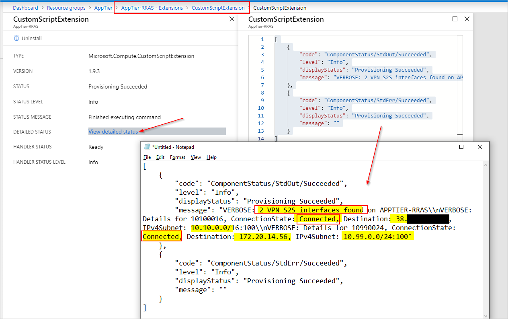

5. If you enable RDP and sign in, open PowerShell with and run `get-vpns2sinterface`, you can see the tunnel is connected.

    **DBTier**

    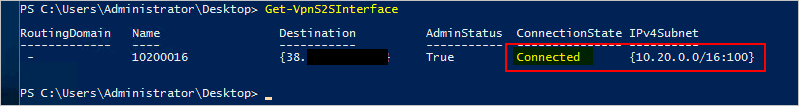

    **AppTier**

    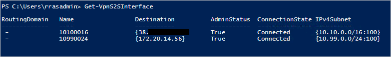

    > [!NOTE]  
    > You can test RDP both from one machine to the second, and from the second to the first.

    > [!NOTE]  
    > To implement this solution on-premises you will need to deploy routes to the Azure Stack Hub remote network into you switching infrastructure or at a minimum on specific VMs

### Deploying a GRE tunnel

For this template, this walkthrough has used the [IKE template](network-howto-vpn-tunnel-ipsec.md). However, you can also deploy a [GRE tunnel](network-howto-vpn-tunnel-gre.md). This tunnel offers greater throughput.

The process is the almost identical. However when you deploy the tunnel template onto the existing infrastructure, you need to use the outputs from the other system for the first three inputs. You will need to know the **LOCALTUNNELGATEWAY** for the resource group you are deploying into rather than the resource group you are trying to connect to.

## Next steps

[Differences and considerations for Azure Stack Hub networking](azure-stack-network-differences.md)  
[How to create a VPN Tunnel using GRE](network-howto-vpn-tunnel-gre.md)  
[How to create a VPN Tunnel using IPSEC](network-howto-vpn-tunnel-ipsec.md)