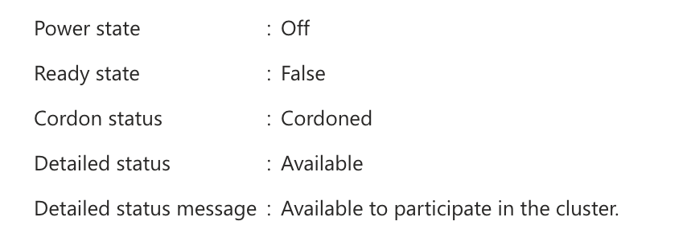

# Ensuring control plane resiliency with Operator Nexus Service

The Nexus service is engineered to uphold control plane resiliency across various compute rack configurations.

## Instances with three or more compute racks

Operator Nexus ensures the availability of three active Kubernetes control plane (KCP) nodes in instances with three or more compute racks. For configurations exceeding two compute racks, an extra spare node is also maintained. These nodes are strategically distributed across different racks to guarantee control plane resiliency, when possible.

> [!TIP]
> The Kubernetes control plane is a set of components that manage the state of a Kubernetes cluster, schedule workloads, and respond to cluster events. It includes the API server, etcd storage, scheduler, and controller managers.
>
> The remaining management nodes contain various operators that run the platform software and other components performing support capabilities for monitoring, storage, and networking.
>
> Auto-remediation actions on control plane servers are designed to maintain the health and availability of the Kubernetes management layer. These actions on the control plane are strictly isolated to the platform’s management infrastructure and do not interact with compute nodes or customer workloads. Applications and services running on compute nodes continue to operate normally during control plane remediation events, ensuring runtime stability and uninterrupted service.

During runtime upgrades, Operator Nexus implements a sequential upgrade of the control plane nodes. The sequential node approach preserves resiliency throughout the upgrade.

Three compute racks:

KCP = Kubernetes Control Plane Node
MGMT = Management Node Pool Node

| Rack 1    | Rack 2 | Rack 3 |
| --------- | ------ | ------ |
| KCP       | KCP    | KCP    |
| KCP-spare | MGMT   | MGMT   |

Four or more compute racks:

| Rack 1 | Rack 2 | Rack 3 | Rack 4    |
| ------ | ------ | ------ | --------- |
| KCP    | KCP    | KCP    | KCP-spare |
| MGMT   | MGMT   | MGMT   | MGMT      |

## Instances with less than three compute racks

Operator Nexus maintains an active control plane node and, if available, a spare control plane instance. For instance, a two-rack configuration has one active Kubernetes Control Plane (KCP) node and one spare node.

Two compute racks:

| Rack 1 | Rack 2    |
| ------ | --------- |
| KCP    | KCP-spare |
| MGMT   | MGMT      |

## Spare control plane node

The spare control plane node is a critical component of Operator Nexus resiliency architecture. This node serves as a standby control plane instance that maintains cluster quorum and provides seamless failover capabilities during upgrades and failure scenarios.

In disaster situations when the control plane loses quorum, there are impacts to the Kubernetes API across the instance. This scenario can affect a workload's ability to read and write Custom Resources (CRs) and talk across racks.

### Spare node characteristics

A spare control plane node has the following characteristics:

- **Power state**: Off (powered down when not in use)
- **BMM status**: Available (ready to participate in the cluster)  
- **Ready state**: False (not currently active in the cluster)
- **Cordoned status**: Cordoned (prevented from scheduling workloads)
- **Labels**: `platform.afo-nc.microsoft.com/control-plane=true`
- **OAM IP**: Not assigned until the node is provisioned and becomes active

### How the spare node works

The spare control plane node acts as a standby that can be activated to maintain cluster quorum in several scenarios:

- **Runtime upgrades**: During cluster runtime upgrades, the spare node is the first to be upgraded and provisioned, ensuring continuous control plane availability throughout the upgrade process
- **Control plane failures**: If an active control plane node becomes unhealthy, the spare node can be automatically provisioned to replace it and maintain quorum
- **Maintenance operations**: When performing maintenance on active control plane nodes, the spare provides redundancy

### Identifying spare nodes

You can identify spare control plane nodes using the Azure portal or Azure CLI:

#### Azure portal

In the Azure portal, navigate to your Nexus cluster's bare metal machines, from the Cluster resource under Workloads > Compute Servers. The spare control plane node appears with:

- Power state: Off
- Detailed status: Available
- Machine roles: control-plane



#### Azure CLI

Use the following command to list control plane nodes and identify the spare:

```azurecli
az networkcloud baremetalmachine list \
  -g <resource-group> \
  --subscription <subscription> \
  --output table
```

You can identify the spare node by looking for these attributes: `powerState: Off`, `detailedStatus: Available`, and `machineRoles: control-plane`.

### Spare node provisioning and lifecycle

#### Initial setup

- **BIOS configuration**: Matches the server configuration at the time of initial deployment
- **Operating system**: Not loaded initially; the node remains unprovisioned until needed  
- **RAID configuration**: Matches the state of the server at the version it was running at deployment
- **Firmware**: Initially matches the deployment version (typically N-1 version following an upgrade)

#### Activation process

When a spare node needs to become active:

1. The node is powered on automatically
2. The operating system is provisioned with the current cluster runtime version
3. Kubernetes control plane components are deployed and configured
4. The node joins the active control plane cluster
5. An OAM IP address is assigned

The spare control plane node's firmware is updated when the node becomes active, such as during runtime upgrades. This process ensures firmware compatibility while minimizing unnecessary updates to inactive nodes.

### Transition to active control plane

A spare control plane node can become an active control plane node through several mechanisms:

- **Automated upgrade process**: During runtime upgrades, orchestrated by the upgrade workflow
- **Machine Health Check (MHC)**: Automatic replacement of failed active control plane nodes
- **Manual intervention**: Replace or reimage operations on active control plane nodes may trigger spare activation

For detailed information about these processes, see the [Automated remediation](#automated-remediation) section in this document.

## Automated remediation

To maintain Kubernetes control plane (KCP) quorum, Operator Nexus provides automated remediation when specific server issues are detected. Additionally, this automated remediation extends to Management Plane & Compute nodes.

Here are the triggers for automated remediation:

- For all servers (Compute, Management and KCP): if a server fails to provision successfully after six hours, automated remediation occurs. This check includes provisioning a new machine at initial deployment time or provisioning during a Replace action.
- For all servers (Compute, Management and KCP): if a running node is stuck in a read only root file system mode for 10 minutes, automated remediation occurs, deprecated in 2510.
- For KCP and Management Plane servers only, if a Kubernetes node is in an Unknown state for 30 minutes, automated remediation occurs.

### Remediation process

- Remediation of a Compute node is now one reprovisioning attempt. If the reprovisioning fails, the node is marked Unhealthy. Reprovisioning no longer continues to retry infinitely, and the Bare Metal Machine is powered off.
- Remediation of a Management Plane node is to attempt one reboot and then one reprovisioning attempt. If those steps fail, the node is marked Unhealthy.
- Remediation of a KCP node is to attempt one reboot. If the reboot fails, the node is marked Unhealthy and Nexus triggers the immediate provisioning of the spare KCP node. This process is outlined in the [KCP remediation details](#kcp-remediation-details) section.
- In all instances, when the Bare Metal Machine is marked unhealthy, the BMM's `detailedStatusMessage` is updated to read `Warning: BMM Node is unhealthy and may require hardware replacement.` The Bare Metal Machine's node is removed from the Kubernetes Cluster, which triggers a node drain. Users need to run a BMM Replace action to return the BMM into service and have it rejoin the Kubernetes Cluster.

### KCP remediation details

Ongoing control plane resiliency requires a spare KCP node. When KCP node fails remediation and is marked Unhealthy, a deprovisioning of the node occurs. For NC 4.7.x runtimes, the unhealthy KCP node is exchanged with a suitable healthy Management Plane server. This Management Plane server becomes the new spare KCP node. The failed KCP node is updated and labeled as a Management Plane node. Once the label changes, an attempt to provision the newly labeled management plane node occurs. If it fails to provision, the management plane remediation process takes over. If it fails provisioning or doesn't run successfully, the machine's status remains unhealthy, and the user must fix. The unhealthy condition surfaces to the Bare Metal Machine's (BMM) `detailedStatus` and `detailedStatusMessage` fields in Azure and clears through a BMM Replace action.

> [!NOTE]
>The provisioning retry process doesn't execute on compute and management node pool nodes for systems running the 4.1 NetworkCloud runtime. This capability is available when the Nexus Cluster is updated to the 4.4 runtime.

## Related links

[Determining Control Plane Role](./reference-near-edge-baremetal-machine-roles.md)

[Troubleshooting failed Control Plane Quorum](./troubleshoot-control-plane-quorum.md)
