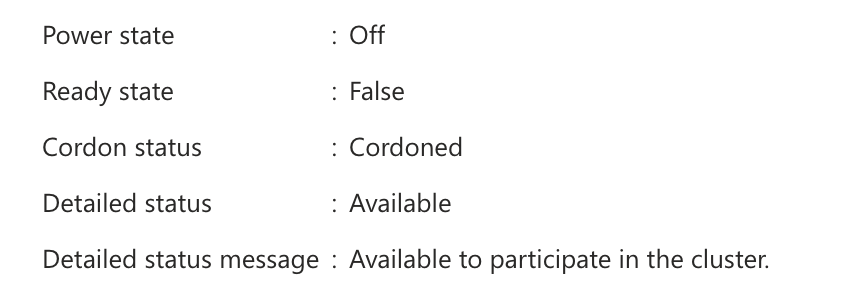

# Ensuring control plane resiliency with Operator Nexus Service

The Nexus service is engineered to uphold control plane resiliency across various compute rack configurations.

## Instances with three or more compute racks

Operator Nexus ensures the availability of three active Kubernetes control plane (KCP) nodes in instances with three or more compute racks. These nodes are strategically distributed across different racks to guarantee control plane resiliency, when possible.

> [!TIP]
> The Kubernetes control plane is a set of components that manage the state of a Kubernetes cluster, schedule workloads, and respond to cluster events. It includes the API server, etcd storage, scheduler, and controller managers.
>
> The remaining management nodes contain various operators that run the platform software and other components performing support capabilities for monitoring, storage, and networking.
>
> Auto-remediation actions on control plane servers are designed to maintain the health and availability of the Kubernetes management layer. These actions on the control plane are strictly isolated to the platform’s management infrastructure and do not interact with compute nodes or customer workloads. Applications and services running on compute nodes continue to operate normally during control plane remediation events, ensuring runtime stability and uninterrupted service.

During runtime upgrades, Operator Nexus implements a sequential upgrade of the control plane nodes. The sequential node approach preserves resiliency throughout the upgrade.

Three compute racks:

KCP = Kubernetes Control Plane Node
MGMT = Management Node Pool Node

| Rack 1    | Rack 2 | Rack 3 |
|-----------|--------|--------|
| KCP       | KCP    | KCP    |
| KCP-spare | MGMT   | MGMT   |

Four or more compute racks:

| Rack 1 | Rack 2 | Rack 3 | Rack 4    |
|--------|--------|--------|-----------|
| KCP    | KCP    | KCP    | KCP-spare |
| MGMT   | MGMT   | MGMT   | MGMT      |


## Spare control plane node

The spare control plane node is a critical component of Operator Nexus resiliency architecture. This node serves as a standby control plane instance that maintains cluster quorum and provides seamless failover capabilities during upgrades and failure scenarios.

In disaster situations when the control plane loses quorum, there are impacts to the Kubernetes API across the instance. This scenario can affect a workload's ability to read and write Custom Resources (CRs) and talk across racks.

### Spare node characteristics

A spare control plane node has the following characteristics:

- **Power state**: Off (powered down when not in use)
- **BMM status**: Available (ready to participate in the cluster)  
- **Ready state**: False (not currently active in the cluster)
- **Cordoned status**: Cordoned (prevented from scheduling workloads)
- **Labels**: `platform.afo-nc.microsoft.com/control-plane=true`
- **OAM IP**: Not assigned until the node is provisioned and becomes active

### How the spare node works

The spare control plane node acts as a standby that can be activated to maintain cluster quorum in several scenarios:

- **Runtime upgrades**: During cluster runtime upgrades, the spare node is the first to be upgraded and provisioned, ensuring continuous control plane availability throughout the upgrade process
- **Control plane failures**: If an active control plane node becomes unhealthy, the spare node can be automatically provisioned to replace it and maintain quorum
- **Maintenance operations**: When performing maintenance on active control plane nodes, the spare provides redundancy

### Identifying spare nodes

You can identify spare control plane nodes using the Azure portal or Azure CLI:

#### Azure portal

In the Azure portal, navigate to your Nexus cluster's bare metal machines, from the Cluster resource under Workloads > Compute Servers. The spare control plane node appears with:

- Power state: Off
- Detailed status: Available
- Machine roles: control-plane



#### Azure CLI

Use the following command to list control plane nodes and identify the spare:

```azurecli
az networkcloud baremetalmachine list \
  -g <resource-group> \
  --subscription <subscription> \
  --output table
```

You can identify the spare node by looking for these attributes: `powerState: Off`, `detailedStatus: Available`, and `machineRoles: control-plane`.

### Spare node provisioning and lifecycle

#### Initial setup

- **BIOS configuration**: Matches the server configuration at the time of initial deployment
- **Operating system**: Not loaded initially; the node remains unprovisioned until needed  
- **RAID configuration**: Matches the state of the server at the version it was running at deployment
- **Firmware**: Initially matches the deployment version (typically N-1 version following an upgrade)

#### Activation process

When a spare node needs to become active:

1. The node is powered on automatically
2. The operating system is provisioned with the current cluster runtime version
3. Kubernetes control plane components are deployed and configured
4. The node joins the active control plane cluster
5. An OAM IP address is assigned

The spare control plane node's firmware is updated when the node becomes active, such as during runtime upgrades. This process ensures firmware compatibility while minimizing unnecessary updates to inactive nodes.

### Transition to active control plane

A spare control plane node can become an active control plane node through several mechanisms:

- **Automated upgrade process**: During runtime upgrades, orchestrated by the upgrade workflow
- **Machine Health Check (MHC)**: Automatic replacement of failed active control plane nodes
- **Manual intervention**: Replace or reimage operations on active control plane nodes may trigger spare activation

For detailed information about these processes, see the [Automated remediation](#automated-remediation) section in this document.

## Automated remediation

Operator Nexus continuously monitors the health of all servers (Compute, Management Plane, and Kubernetes Control Plane) and automatically remediates issues when specific conditions are detected. The goal is to maintain cluster stability and control plane quorum without operator intervention.

### Triggers for automated remediation

The conditions that trigger automated remediation differ by node type:

| Trigger                                                   | Compute | Management Plane | Control Plane (KCP) |
|-----------------------------------------------------------|:-------:|:----------------:|:-------------------:|
| Server fails to provision within the expected timeframe   |   Yes   |       Yes        |         Yes         |
| Kubernetes node Ready condition is Unknown for 30 minutes |   No    |       Yes        |         Yes         |

> [!NOTE]
> Provisioning failures are detected through dynamic per-phase monitoring rather than a single fixed timeout. The system tracks each stage of the provisioning process and detects stalls at any phase.

### Remediation process

Remediation actions are performed sequentially. If an action doesn't resolve the issue, the system escalates to the next step. The actions available differ by node type:

| Node type           | Step 1      | Step 2      | Final step     |
|---------------------|-------------|-------------|----------------|
| Compute             | Reprovision | —           | Mark Unhealthy |
| Management Plane    | Reboot      | Reprovision | Mark Unhealthy |
| Control Plane (KCP) | Reboot      | —           | Mark Unhealthy |

**Key behaviors:**

- **Compute nodes** skip the reboot step because remediation only triggers on provisioning failures, where a reboot wouldn't help.
- **Control Plane nodes** skip reprovisioning because potential loss of quorum is too critical to wait for a reprovision attempt. Instead, the system escalates directly to marking the node unhealthy and triggering a role swap with a healthy Management Plane server.
- **Reprovision** is a single attempt. If it fails, the system doesn't retry indefinitely — it escalates to mark the node unhealthy.
- **Disabling compute reprovision**: Operators can optionally disable the reprovision step for compute nodes. When disabled, the system escalates directly from a provisioning failure to marking the node unhealthy.

### Safeguards

To prevent cascading failures, the system enforces limits on how many nodes can be simultaneously remediated:

- **Compute**: No more than 50% of compute nodes can be under remediation at once.
- **Management Plane**: No more than 25% of management nodes can be under remediation at once.
- **Control Plane**: No more than 50% of control plane nodes can be under remediation at once.

If an individual node was recently reprovisioned and fails again shortly after, the system skips another reprovision attempt and escalates directly to marking the node unhealthy. This prevents infinite remediation loops.

### Mark Unhealthy outcome

When a Bare Metal Machine is marked unhealthy:

- The BMM's `detailedStatusMessage` is updated to: `Warning: BMM Node is unhealthy and may require hardware replacement.`
- The node is removed from the Kubernetes cluster, which triggers a node drain.
- The Bare Metal Machine is powered off.
- **User action required**: Run a BMM Replace action to return the machine into service and have it rejoin the cluster.

> [!TIP]
> The `detailedStatusMessage` value is an alertable signal. You can configure Azure Monitor alerts on this property to be notified when a machine requires manual intervention. For troubleshooting guidance, see [Troubleshoot BMM Warning messages](./troubleshoot-bare-metal-machine-warning.md#warning-bmm-node-is-unhealthy-and-may-require-hardware-replacement).

### Monitoring remediation activity

Automated remediation emits customer-visible logs in the **Platform Operation Logs** category each time a remediation strategy starts, completes, or fails. These logs are prefixed with `Machine Health Check Remediation:` and include the name of the affected server.

Example log messages:

| Event              | Example message                                                                                                                         |
|--------------------|-----------------------------------------------------------------------------------------------------------------------------------------|
| Strategy starts    | `Machine Health Check Remediation: starting reboot strategy for BareMetalHost rack1compute01`                                           |
| Strategy completes | `Machine Health Check Remediation: reprovision-in-place strategy completed for BareMetalHost rack1compute01`                            |
| Strategy fails     | `Machine Health Check Remediation: Reboot strategy failed for BareMetalHost rack1compute01: timeout waiting for host to become healthy` |

To receive and configure these logs, see [List of logs available for streaming](./list-logs-available.md).

### KCP remediation details

When a KCP node fails remediation and is marked Unhealthy, the node is deprovisioned. The unhealthy KCP node is exchanged with a suitable healthy Management Plane server. This Management Plane server becomes the new KCP node. The failed KCP node is updated and labeled as a Management Plane node. Once the label changes, an attempt to provision the newly labeled Management Plane node occurs. If it fails to provision, the Management Plane remediation process takes over. If it fails provisioning or doesn't run successfully, the machine's status remains unhealthy, and the user must fix the server. The unhealthy condition surfaces to the Bare Metal Machine's (BMM) `detailedStatus` and `detailedStatusMessage` fields in Azure and clears through a BMM Replace action.

Only one KCP role swap can be in progress at a time. If a swap is already underway, additional remediation requests wait until the active swap completes before proceeding.

## Related links

[Determining Control Plane Role](./reference-near-edge-baremetal-machine-roles.md)

[Troubleshooting failed Control Plane Quorum](./troubleshoot-control-plane-quorum.md)
